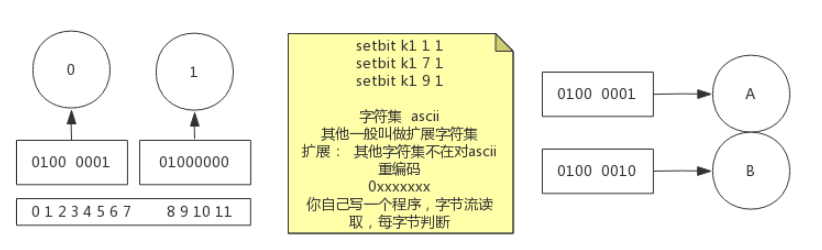

# 高并发、负载均衡

## 网络协议原理

资产-->营销--->高的并发量

假设现在实现了高并发（黑盒）。每次访问有一个日志，通过日志得到用户的ip、uri、用户从何而来。有**用户从何而来**的信息我们可以知道各个渠道带来的流量。进而在有了消费记录之后我们可以知道从哪里来的流量购买的多，也就是可以得到每个渠道的转化率、购买力。

转服务行业 --- service

最终还是落到讲技术

网络。4层(TCP/IP 协议)？7层（OSI参考模型）？

分层的好处，方便去维护，每一层只需要保证对外的接口不变即可。


TCP/IP 可以认为是OSI理论的具体实现。会话和表示被缩到了应用层。


- 第一步建立连接
- 第二步才是传送数据(http协议：规范标准。写错了不行)

```
[root@iZuf60yyfby12gcwrfeb09Z ~]# cd /proc/$$/fd  进入系统进程目录 $$为解释程序的进程id  fd为文件描述符
[root@iZuf60yyfby12gcwrfeb09Z fd]# ll
total 0
lrwx------ 1 root root 64 Nov  6 15:55 0 -> /dev/pts/0		输入
lrwx------ 1 root root 64 Nov  6 15:55 1 -> /dev/pts/0		输出
lrwx------ 1 root root 64 Nov  6 15:55 2 -> /dev/pts/0		报错
lrwx------ 1 root root 64 Nov  6 15:56 255 -> /dev/pts/0
[root@iZuf60yyfby12gcwrfeb09Z fd]# exec 8<> /dev/tcp/www.baidu.com/80		创建一个文件8，有输入输出两个方向   
[root@iZuf60yyfby12gcwrfeb09Z fd]# ll
total 0
lrwx------ 1 root root 64 Nov  6 15:55 0 -> /dev/pts/0
lrwx------ 1 root root 64 Nov  6 15:55 1 -> /dev/pts/0
lrwx------ 1 root root 64 Nov  6 15:55 2 -> /dev/pts/0
lrwx------ 1 root root 64 Nov  6 15:56 255 -> /dev/pts/0
lrwx------ 1 root root 64 Nov  6 15:58 8 -> socket:[122723]		得到一个socket，和百度建立起了通信

-e选项：把\n变成换行符	echo：打印		>& 8：把东西重定向到8	&代表这个不是文件	'...'：请求头最小写法
[root@iZuf60yyfby12gcwrfeb09Z fd]# echo -e 'GET / HTTP/1.0\n'  >& 8
标准输入0来自文件描述8
[root@iZuf60yyfby12gcwrfeb09Z fd]# cat 0<& 8
	。。。连接时间太长，这里没反应
^C
[root@iZuf60yyfby12gcwrfeb09Z fd]# ll
total 0
lrwx------ 1 root root 64 Nov  6 15:55 0 -> /dev/pts/0
lrwx------ 1 root root 64 Nov  6 15:55 1 -> /dev/pts/0
lrwx------ 1 root root 64 Nov  6 15:55 2 -> /dev/pts/0
lrwx------ 1 root root 64 Nov  6 15:56 255 -> /dev/pts/0
lrwx------ 1 root root 64 Nov  6 15:58 8 -> socket:[122723]

关闭socket
[root@iZuf60yyfby12gcwrfeb09Z fd]# exec 8<& -
[root@iZuf60yyfby12gcwrfeb09Z fd]# ll
total 0
lrwx------ 1 root root 64 Nov  6 15:55 0 -> /dev/pts/0
lrwx------ 1 root root 64 Nov  6 15:55 1 -> /dev/pts/0
lrwx------ 1 root root 64 Nov  6 15:55 2 -> /dev/pts/0
lrwx------ 1 root root 64 Nov  6 15:56 255 -> /dev/pts/0
重新开启，重新来一遍
[root@iZuf60yyfby12gcwrfeb09Z fd]# exec 8<> /dev/tcp/www.baidu.com/80
[root@iZuf60yyfby12gcwrfeb09Z fd]# echo -e 'GET / HTTP/1.0\n'  >& 8
[root@iZuf60yyfby12gcwrfeb09Z fd]# cat 0<& 8
成功拿到
HTTP/1.0 200 OK
Accept-Ranges: bytes
Cache-Control: no-cache
Content-Length: 9508
Content-Type: text/html
Date: Sun, 06 Nov 2022 08:02:40 GMT
P3p: CP=" OTI DSP COR IVA OUR IND COM "
P3p: CP=" OTI DSP COR IVA OUR IND COM "
Pragma: no-cache
Server: BWS/1.1
Set-Cookie: BAIDUID=FBC60CA0C9F3A24AC98DC6C3291EA8DF:FG=1; expires=Thu, 31-Dec-37 23:55:55 GMT; max-age=2147483647; path=/; dom
Set-Cookie: BIDUPSID=FBC60CA0C9F3A24AC98DC6C3291EA8DF; expires=Thu, 31-Dec-37 23:55:55 GMT; max-age=2147483647; path=/; domain=
Set-Cookie: PSTM=1667721760; expires=Thu, 31-Dec-37 23:55:55 GMT; max-age=2147483647; path=/; domain=.baidu.com
Set-Cookie: BAIDUID=FBC60CA0C9F3A24AA5255C6FA852DA13:FG=1; max-age=31536000; expires=Mon, 06-Nov-23 08:02:40 GMT; domain=.baiduversion=1; comment=bd
Traceid: 166772176006356864106433202826370069803
Vary: Accept-Encoding
X-Frame-Options: sameorigin
X-Ua-Compatible: IE=Edge,chrome=1

```

三次握手>数据传输>四次分手，称为一个最小粒度，不可被分割。

TCP/IP基于下一跳的传输方式。目标IP先和Genmask按位与运算要和Destination匹配，走匹配的Geteway。可以发现无论你要到哪里，目标ip和下面的第三行Genmask按位与运算一定可以得到Destination是0.0.0.0。所以192.168.8.2就是默认网关。但是我们如何把数据给到下一条呢？就需要链路层了--mac地址。mac地址对应的是具体的一个网卡设备。数据包最外层是mac地址，再往里是IP地址，是目标主机的地址，再往里就是端口号。在源主机和目标主机之间的结点传输过程中，只有mac地址会改变。

结论：tcp/ip协议是基于下一跳的机制：ip是端点间、mac地址是结点间的。


## LVS的DR,TUN,NAT模型推导

计算机1和计算机2要通信，简单组网直接靠交换机就连起来了。要想上网的话需要买一个路由器，路由器自带交换功能，可以认为路由器集成了交换机的功能。再来另一个网络，计算机3和计算机4也通过交换机连起来。计算机1~2看成一间教室，计算机3~4看成另外一间教室。

路由器有两个网卡，一个网卡归属于一个网络。如果计算机1要和计算机4通信。一开始计算机1的apr-a这个表是空的，那么里面的条目是如何出现的？这时候需要用到arp协议。此时计算机1把数据包的事情停掉，因为现在它还没有mac地址。这个时候计算机1会先去单独发一个数据包，这个数据包基于arp协议。那么这个时候我们还是需要ip地址和mac地址，mac地址是什么呢？目标mac地址是特殊的mac地址--全F。目标ip是192.168.1.1。现在把这个包发出去，交换机看到全F，这个包会被广播。只有目标地址和包的目标地址匹配的时候结点才会响应这个包。这个时候路由器发现来的包的协议是apc，此时它需要做一件事：把自己的mac地址包发回去。发回去的数据包的mac地址就是计算机1的mac地址，目标ip地址也是计算机1的ip地址。然后路由器也把这个数据包发给了交换机。交换机有一个学习能力，要学习交换机端口到mac地址的映射。计算机1发数据包来的时候，进了交换机的某一个端口，此时交换机收集到了计算机1的mac地址。之后路由器发回数据包的时候目标的mac地址也是计算机1的mac地址。计算机1的mac地址在之前就已经被交换机学习过了。这个时候交换机就知道要从之前的那个端口转发出去。数据包到了计算机1之后，这个时候计算机1就学习到了一条ip到mac地址的映射记录。这样一来计算机1既知道下一条是192.168.1.1又知道它的mac地址。


说了这么多的网络，最后要回到我们的主题---负载均衡。如果你有一台tomcat，现在有很多的请求都来请求你这个tomcat。一台主机hold不住的话我们有一种解决思路就是多来几个tomcat服务器。这是粗粒度的负载均衡。但是这个时候你对外的ip地址分给这几个tomcat服务器中的谁都不合适。

所以我们中间加一层来接收所有的流量，并且均衡的转发到我们几台tomat主机上。

tomcat也好、nginx也好，都是应用层的。所以决定了他们的速度不会很快。那么如果我们中间的那一层东西如果层次可以降低一下，只做数据包级别的转发，这样少走了几层网络通信协议，会比tomcat和nginx快。这和反向代理不一样，反向代理需要建立握手，但是这里没有握手。

如果要解决高并发、实现负载均衡的话，就通信这个层次，我们找到了一种解决方案。中间的负载均衡不要和客户端握手。只是可以偷偷的看一眼端口号。


所以这种负载均衡器很快。 是数据包转发级别的，不会和客户端握手。由于是数据包级别的，所以后端的服务器必须长得一模一样，因为这个负载均衡器不会去管你的数据包的内容，他不知道客户端发了什么uri，要去哪里访问。所以服务器不能不一样--必须是镜像的。但是nginx是这样做到后面的服务器不一样的，因为nginx是应用层的，它可以知道客户端发的uri。这是这两种负载均衡吃策略的不同。可以知道nginx的并发是有上限的，然而四层的负载均衡的并发量会比nginx大很多。

所以一般来说最前端都是LVS来hold住流量，然后再准备一层nginx来hold住握手，收到所有的请求之后nginx再转到后面的tomcat。

如果把server想成百度，百度对外不可能有两个地址，所以要通过之间的一个虚拟IP来访问百度。进入到我们四层的负载均衡服务器之后，要从后面的分发（Dispatcher）IP---出去，发到真实的IP。

无论你有没有加服务交互服务器对于客户端来说都是透明的。


客户端只知道百度外面给的一个虚拟ip，然后去访问了我们的负载均衡服务器，接着负载均衡服务器如果原封不动的把数据包发给tomcat的话，数据包是会被丢弃的，因为客户端发送的数据包的目标地址是VIP而不是RIP。有一种解决方案是用NAT。

接下来要补充NAT的知识点，NAT一般出现在路由器上。假设家中有两台设备，ip地址分别为192.168.1.8以及192.168.1.6。路由器里面还包含了交换机，上面有几个网口就可以接几个设备。运营商发的那个6.6.6.6的ip地址是公网地址，192.168.1.1是内网地址。

如果这个时候内网的两个设备的同一个端口都要对百度发起请求，把源ip换成公网ip，源端口保持不变，那么这个时候会出现转发出去的请求是一样的，这样百度发回来响应的时候响应也是一样的，没有办法区分要发给1.8还是1.6。所以这里路由器就需要有一张表把请求的原地址的端口也换一下，然后记录下来，具体是那个内网ip的哪个客户端对应着。

S-NAT：源NAT,修改的是源地址


那么看下图，由于tomcat那里需要的请求是RIP，所以负载均衡服务器在转发的时候可以修改目标地址，将VIP换成RIP，这个转化目标的IP叫做DNAT-目标地址转换协议。这样包就发到了tomcat服务器上。最后tomcat服务器需要给客户端返回。也就是RIP需要返回给CIP，但是如果RIP直接给CIP，CIP是不会认的，因为CIP只记得发了一个CIP->VIP，不知道还有CIP->RIP。那么这个时候就还需要一次源地址的变换。源地址就只有我们的负载均衡服务器知道，所以tomcat服务器就需要再把这个返回的数据包丢给负载均衡服务器，然后负载均衡服务器修改了源地址之后在发回给CIP，CIP就会认了。

DNAT有一个弊端，一来一回的数据载量是不一样的。一般来说请求的数据包大小和响应的数据包大小都是不一样的，上行和下行的速度不一样。因为我们来回都需要经过负载均衡服务器，所以负载均衡服务器的带宽成为了系统的瓶颈。进行地址的转化需要消耗算力。


那么我们如果解决掉这个下行的瓶颈？有这个瓶颈的原因是我们的响应需要经过负载均衡服务器导致的。我们有没有办法让响应直接发回给客户端？这个时候我们就不能使用NAT模式了，因为使用了NAT就意味我们需要回溯。无论你后面做了什么变化，客户端都不知道，它仍然发送的是CIP->VIP。所以回去的包也只能是VIP->CIP。因为现在不靠负载均衡服务器来转化成VIP了，此时服务器要想返回源地址正确的包，服务器本身就要有VIP这个本地的ip地址。

这在实际生产中是合理的，企业对外暴露一个VIP，然后企业内部的服务器当然也可以知道这个VIP，那么服务器就可以把这个VIP藏在自己的内部但是并不对外暴露这个VIP。所以，如果有一种技术可以做到隐藏VIP，只有服务器自己知道这个VIP，全网除了自己没有人知道自己有一个VIP地址，这样客户端CIP->VIP就还是只会到我们的负载均衡服务器而不会来到tomcat服务器。由于现在tomcat中有了VIP，所以现在即使负载均衡服务器没有进行目标地址的转换，我们的tomcat也可以接受数据包了。

但是现在注意一个问题，我们现在只解决了从tomcat服务器到客户端的问题，但是没有解决负载均衡服务器到tomcat服务器的问题。tomcat服务器依然只接受目标地址是RIP的。数据包是CIP->VIP，由于tomcat服务器是内部有VIP地址，所以首要的任务就是进入到tomcat服务器中。我们可以在负载均衡服务器对数据链路层做手脚，直接把目标的MAC地址改成RIP的目标地址即可。但是由于mac地址不能跨网络，所以我们的tomcat服务器和负载均衡服务器一定要同一个局域网。

这种模式叫做直接路由模式。Direct Route

VIP如何隐藏？其实就是对ARP协议做手术，别人发ARP请求过来，我就是不说，也不通告，这样周围的设备都不知道我有VIP。但是我自己是知道自己有一个VIP的。


DR模型的优点是速度快，缺点是物理位置被约束了

DNAT模型的优点是物理位置不会被约束，但是它速度慢

所以下面我们引出第三种模型：隧道模型。它取了上面两种模型的优点做了折中

看下图，我们终于用上了之前没有用的DIP，我们使用DIP->RIP背着CIP->VIP的包。这样可以看成一个隧道，把CIP->VIP的包送到了目标RIP。隧道可以解决物理位置限制问题。


了解了上面的三种模型，回到最开始，负载均衡到底有什么用？

```
LVS 是 Linux Virtual Server 的简写，即 Linux 虚拟服务器，是一个虚拟的服务器集群系统
```

负载均衡是把前面的并发给分治了，前面一堆的请求先走我的LVS，LVS均衡的转发给后面的几个服务器。

在我们的机器中有一个物理网卡和虚拟网卡。物理网卡是暴露给外面的，虚拟网卡只有内部知道，外部是不可见的。所以我们要配DR的时候，需要在real server 那里配置虚拟网卡，虚拟网卡里面配置VIP，这样内核就知道了有这个VIP，但是外界是不知道有这个VIP的。这样就做到了对内可见，对外隐藏。

要做到对外隐藏当然别人来访问你这里的VIP的时候，物理网卡不能告诉它。所以需要配置arp_ignore；当然还不能将自己告诉给别人，所以需要修改通告的级别 arp_annouce。

arp_ignore

​	0：你打电话给我，问我家人的电话，我不告诉你

​	1：你打电话给我，问我的电话，我可以告诉你

arp_annouce

​	0：这台主机上面的任何网卡的任何地址我都说出去。网卡--人、IP--电话。家里人的所有电话都说出去

​	1：只把我自己这块网卡的所有地址说出去。把我自己的电话都说出去

​	2：假设我的网卡配了两个IP地址，连了两个网咯。我只会向1网咯通报我只有1的地址，向2网络通报我只有2的地址。这样一来网络1不知道网络2，网络2也不知道网络1。只把我自己的某一个电话说出去。


所以我们需要修改内核的响应级别以及通告级别。以及需要把VIP配置在内部的虚拟网卡LOOP上。

调度算法就是LVS要把数据具体发给哪个服务器。直接看动态调度算法。lc： 谁的用的最少就用谁。那么负载均衡服务器怎么知道和谁连接了几次呢？把负载均衡服务器想象成具有偷窥的能力，什么是偷窥？就是只看不动手。看完客户端发来数据包之后它不动手，就只拿小本本记录一下。负载均衡服务器知道三次握手的第一次的包，但是由于第二次握手的包不一定会走负载均衡服务器（根据模型的不同会有差异）。但是无所谓，负载均衡服务器如果发现了三次握手的第三个包，那么就会给这个服务器的连接次数+1。同理，四次分手负载均衡服务器也是可以知道的。


LVS在LINUX内核模块的名称叫做ipvs，一般来说LINUX的发行版都自带，不需要自己去装，除非发行版故意剔除这个模块。但是我们有这个模块还不够，我们还需要一个和内核交互的接口ipvsadm，有了这个小程序之后对它下发指令，它会把你的指令翻译成底层调用内核，我们需要的参数就是传给这个小程序的。


-A的命令是入的命令，也就是外面的请求到什么ip什么端口才会被匹配


-a的命令出的命令，也就是前面被匹配的请求应该到哪个服务器去。


虚拟机给我们提供了一个虚拟网络，192.168.150.2。然后提供了虚拟主机，上面的虚拟网卡连接到了我们的虚拟网络上。

计算机上还有一块网卡，vmnet-8：192.168.150.1。然后还有一个windows的一个后台服务VMware-NAT,这个服务是192.168.150.2这个ip地址。上面的所有的虚拟主机的数据包都是发给这个后台程序的。然后再把数据包发到以太网本地连接，也就是windows自己的物理网卡。vmnet-8也是vmware虚拟出来的，为了windows也有一个网卡可以进入和虚拟机通信。


配置noded01暴露的接口。


node02和node03在配置接口之前要先去调整arp协议。


我们现在只改了一个接口，为了以后所有的接口都生效，现在我们去到all接口


继续修改


协议改完了之后才去动隐藏VIP的配置。注意这里不要加上/24。这是为了避免发生死循环，发不出去。


总结如下步骤：

```
LVS：

node01:
	ifconfig  eth0:8 192.168.150.100/24
node02~node03:
	1)修改内核：
		echo 1  >  /proc/sys/net/ipv4/conf/eth0/arp_ignore 
		echo 1  >  /proc/sys/net/ipv4/conf/all/arp_ignore 
		echo 2 > /proc/sys/net/ipv4/conf/eth0/arp_announce 
		echo 2 > /proc/sys/net/ipv4/conf/all/arp_announce 
	2）设置隐藏的vip：
		ifconfig  lo:3  192.168.150.100  netmask 255.255.255.255
		
RS中的服务：
node02~node03:
	yum install httpd -y
	service httpd start
	vi   /var/www/html/index.html
		from 192.168.150.1x

LVS服务配置
node01:
		yum install ipvsadm 
	ipvsadm -A  -t  192.168.150.100:80  -s rr
	ipvsadm -a  -t 192.168.150.100:80  -r  192.168.150.12 -g -w 1
	ipvsadm -a  -t 192.168.150.100:80  -r  192.168.150.13 -g -w 1
	ipvsadm -ln

验证：
	浏览器访问  192.168.150.100   看到负载  疯狂F5
	node01：
		netstat -natp   结论看不到socket连接
	node02~node03:
		netstat -natp   结论看到很多的socket连接
	node01:
		ipvsadm -lnc    查看偷窥记录本
		TCP 00:57  FIN_WAIT    192.168.150.1:51587 192.168.150.100:80 192.168.150.12:80
		FIN_WAIT： 连接过，偷窥了所有的包
		SYN_RECV： 基本上lvs都记录了，证明lvs没事，一定是后边网络层出问题
```


## 基于keepalived的LVS高可用搭建

回顾：基于nginx的反向代理是7层的，但是LVS是四层的。nginx有负载均衡的能力，但是它是七层的。


 

再来聊高可用。来看下图。我们可以发现整个公司的流量的入口是负载均衡服务器，由于是单点的，如果挂掉了，那么也代表着整个公司的业务下线了。除了负载均衡服务器会挂，后面的real server也可能会挂，但是负载均衡服务器还是会响挂掉的服务器进行负载，这样会导致有一部分的请求就连不通了。所以会造成一部分人的业务不正常。下面的主要任务就是解决这两个问题。


单点故障的一个解决方法就是一变多，但是这里我们对外只能提供一个vip，所以我们就准备一台主要的机器，以及一台备用的机器---主备。那么如果是主主的话，由于对外只能提供一个vip，所以我们只能再次往前面追加一层，例如DNS。用的比较多的是主备。

其它的皇子怎么知道皇帝挂了？有两个方向：第一种，皇子们每隔一会就去皇帝身边看一眼皇帝挂了没，也就是备机去轮训的问主机挂了没。如果有三五台备机每隔一段时间就去问主机挂没挂，主机响应这些备机。那么主机既要接收客户端发来的请求包也要接收备机发来的心跳包。这样对主机或多或少会有些压力。第二种，皇帝每天上朝，只要皇子看到皇帝今天上朝了，就说明皇帝还活着。所以在网络中是由主机周期性的向外发送一个广播包，发给了所有的的备机，如果收到了就认为主还活着。但是由于网络是有不确定性的，只有发现皇帝三天没有上朝了，皇子才会揭竿而起，也就是说会有重试机制。

效率性：如果主挂了，那么多的备机选谁上呢？我们可以给定一个权重值，这样备机中选谁上这件事就变成了一个推让制，而不是一个争抢制，这样会更有效率。

主备是只有主在干活，只有主挂了的时候备机才会顶上。主从是有主有从，主和从都会有事情做，所以在主从中的这个主也会出现单点问题，所以对这个主也进行一下主备。

截止目前我们解决了LVS会挂的问题。还要解决RS挂了的问题。RS挂了怎么确定？举一个具体的例子，百度挂了你怎么知道？ping肯定是不行的，因为ping只是到了网络层。所以要贯穿到应用层我们才能知道百度挂没挂，所以我们需要用http协议实际访问一下。

按照上面说的，我们要主机告诉自己还活着，这是一个新功能，所以我们可以直接修改ipvs内核模块的源码。修改内核代码是一个方法。另一种方法是使用第三方实现。第三方就是用人去监视，但是人不靠谱，企业追求的是自动化，把人解耦出去---用程序。如果有一个程序可以代替人，可以监控服务的状态，可以向外发送它还活着。如果服务器可以在外偷听主机是否还活着，而这个程序还可以向后去检查RS的健康，发现RS有问题的时候就把条目剔除，如果好了就再加回来。这个程序就叫做keepalived，解决单点故障，实现高可用。

主的服务器上装keepalived，备机上也要装。keepalived在监控自己各自服务的状态，主向外说自己还活着，备机监听主还活着。

人还需要配置vip，添加ipvs，这些操作是我们手工去做的。我们可以把这些操作写到一个配置文件中，keepalived一启动就替你把这件事做了，这样就连你操作失误的概率都被规避了。所以keepalived是有配置文件的。除了这些事情，keepalived还需要对后端服务做健康检查。

keepalived是一个应用程序，是第三方的！

keepalived不止可以用于LVS,如果nginx作为负载均衡服务器来用的话，为了解决单点故障问题，同理可以使用keepalived。只要是1变多，有多台的时候都可以做这些事情。


上次留了node4没有用。由于我们要解决单点故障，所以我们使用node4来作为backup。看到node4下面配的ip是虚线，只有主机挂了的时候才换成实线。由应用层的keepalived来做健康的监测。


步骤如下：node2和node3还是和之前一样配置，但是node1要还原变成裸机，由keepalived帮我们配置即可。

进入到配置文件之后：

​	global_defs是全局配置

​	vrrp_instance VI_l是虚拟路由冗余协议的一个实例。里面有state MASTER，意思是说这台机器就是主机，如果MASTER变成了BACKUP那么就变成了备机了。interface eth0，在企业中可能有多快网卡，组了多个网络，每个不同的网络流动的数据类型是不一样的。将网络划分为不同的物理网络之后，数据不会影响到信号传输的时效，其中的一个网络坏了，另外一个还是可用的。这里interface eth0指定了后面走的都是eth0这块网卡。virtual_router_id是虚拟路由id，有两台keepalived的话需要在这里做区分。priority，权重值。下面还有权限认证。virtual_ipaddress也就是我们说的VIP，书写格式，例子`192.168.150.100/24 dev eth0 label  eth0:3`。主机写完之后从机基本不用变，只需把MASTE变成BACKUP。把权重变小即可。

​	virtual_server是虚拟服务，对应lvs中的vs。在real_server外面的相当于就是A，在real_server里面的就是-a。peisitance_timeout是为了防止用户在短时间内请求，已经有服务器对它有记录了，这个时候LVS就按照记忆，直接发回给之前的那个服务器，而不是直接去负载均衡。这里的HTTP GET 就是我们用来检查挂没挂的方式。

```
keepalived实验：
主机： node01~node04

node01:
	ipvsadm -C
	ifconfig eth0:8 down

----------------------------
node01,node04:
	yum install keepalived ipvsadm -y
	配置：
		cd  /etc/keepalived/
		cp keepalived.conf keepalived.conf.bak
		vi keepalived.conf
			node01:
			vrrp：虚拟路由冗余协议！
				vrrp_instance VI_1 {
					state MASTER         //  node04  BACKUP
					interface eth0
					virtual_router_id 51
					priority 100		 //	 node04	 50
					advert_int 1
					authentication {
						auth_type PASS
						auth_pass 1111
					}
					virtual_ipaddress {
						192.168.150.100/24 dev eth0 label  eth0:3
					}
				}
			virtual_server 192.168.150.100 80 {
				delay_loop 6
				lb_algo rr
				lb_kind DR
				nat_mask 255.255.255.0
				persistence_timeout 0
				protocol TCP

				real_server 192.168.150.12 80 {
					weight 1
					HTTP_GET {
						url {
						  path /
						  status_code 200
						}
						connect_timeout 3
						nb_get_retry 3
						delay_before_retry 3
					}   
				}       
				real_server 192.168.150.13 80 {
					weight 1
					HTTP_GET {
						url {
						  path /
						  status_code 200
						}
						connect_timeout 3
						nb_get_retry 3
						delay_before_retry 3
					}
				}
			scp  ./keepalived.conf  root@node04:`pwd`
```

两台机器都配置完成之后，把服务跑起来。


备机的vip没有配置，但是后面的内核以及对应的-a-A的配置都已经配置好了，因为它只是对外不提供服务，但是还需要对后端进行健康的检查，来做到在第一时间可以顶上主机提供服务。如果主挂了，备机会顶上。如果主好了，那么主会抢回去。只是这里的主会抢回去，会不会抢回去取决于不同的技术。


如果keepalived异常退出来，例如kill -9 ，那么会导致它配置的网卡以及RS都没收回。此时由于keepalived已经死了，那么就不会向备机说它还活着，那么就会导致备机就顶上了。那么此时互联网上两台主机都配置了vip。那么此时客户端发送的数据包会出现混乱，也就是它发出去的数据包会负载给不同的服务器。那么我们之前为了解决单点问题引入了keepalived，但是keepalived可以看到，它自己本身也不是可靠的。我们不能陷入无限循环的陷阱，不能再来引入一个守护进程的守护进程。我们可以把keepalived做成一个高可用的集群，这样就可靠了。

# Redis

## 介绍

常识：

1. 磁盘比内存在寻址上，慢了十万倍。
2. IO buffer：一个扇区装512字节，如果磁盘的容量越大，那么所需要的索引就越多。一般来说操作系统一次都读出4k

如果数据存在文件里,如果在linux里面，有grep以及awk这样的命令。也可以使用java写一个基于io流读取查找的程序。随着文件的变大，速度肯定会慢下来，因为硬盘的IO成为了瓶颈。但是如果你把这个数据文件分成1个1个的4k，那么我们就可以对这些4k进行编号。这些4k刚好符合磁盘的一次IO。进行了编号之后就可以建立索引，B+树，就可以进行提速。

数据库建表的时候要给出模式，这样一来一行中有几列，每一列占几个字节都定死了。也就是你往数据库里面填入一条记录，就算这个记录只有一个字段，也会占用一整行。其它没有用到的列就先空着。这样就是行级存储。行级存储的好处就是以后在增删改的时候就不需要移动，直接在对应的位置填入即可。

磁盘的速度慢，那么我们要速度快就要减少磁盘的IO。当数据库的表很大的时候，性能肯定会下降。但是当只有一个或者少量查询的时候，查询速度变化不大。但是当并发量大的时候，受到硬盘带宽的限制，速度就会变慢。

前面是基于磁盘的数据库，下面SAP有一个HANA数据库，这是一个内存关系型数据库。要知道数据在磁盘和内存的体积是不一样的。但是内存级别的数据库太贵了，买不起。我们能不能折中？搞一个缓存数据库。redis就是一个内存级的缓存数据库。

`https://db-engines.com/en/` 所有数据库引擎的信息都可以在这里获取

`redis.io` redis的官网


下面说的很多数据类型指的是value的类型。为什么memcache同样也是一个k-v类型的数据库，为什么被redis取代了，因为它的value没有类型的概念。但是即使它没有数据类型的概念，只要我能存String类型，我就可以用Json来存放对应的数据类型。所以redis到底优在哪里？如果客户端想通过一个缓存系统（k-v）取回value中的某一个元素。此时从json中取回一个元素，和**从list中取回一个元素**的成本就不一样了。如果是json，那么客户端就需要得到这一整个json，并且对这个json进行解码。这样一来浪费了很多的带宽。


其实redis的类型不是最重要的，重要的是它为每种类型提供了方法，这样就可以对value使用方法，从而取到这个value中的某一个元素。这样就节约了很多的带宽，客户端也不需要解析了。

计算向数据移动：使用memcache的时候我们的计算是发生在client端的；使用redis的时候计算发生在服务端，也就是redis。可以发现计算向数据移动了。


## 安装

1. 上`redis.io`官网。下滑，找到`Download Stack`。找到`download x.x.x`，右键复制获取下载链接，点击复制链接

   

   


```
#没安装过wget就先安装一下
yum install wget
#进入到安装目录，使用wget获取刚刚得到的链接资源
wget https://github.com/redis/redis/archive/7.0.7.tar.gz
#是源码安装，所以很小。进入到安装目录
cd redis-7.0.7/
#源码安装，第一件事看readme.md。告诉你要先make。如果中途失败了，要先make disclean。如果没有安装gcc要装一下
yum install gcc
make
#执行成功之后去到src目录下就有一些可执行程序了。我们可以手动执行redis server。但是这样人工干预太low了。我们在#readme中看到了在utils目录下有一个脚本，install_server.sh。但是我们还是按照readme的流程来走
make install PREFIX=/opt/wcx/redis7
cd/opt/wcx/redis7/bin/
#完成上个步骤之后，几个可执行的文件就跑出莱了，不再和以前的源码混在一起。我们还是可以直接./redis-server。但是我们#希望可以直接把reids弄成一个系统的服务。在这之前我们需要先将/opt/wcx/redis7/bin添加到PATH中，然后就可以执行#install_server.sh这个脚本了
进入到刚刚的utils目录
./install_server.sh

```

在一个机器上可以配置多个实例。每个实例用端口号区分。配置文件、日志文件、数据文件夹都是用端口号进行区分。


步骤如下


---

## 什么是epoll

小插曲：

下面这图看不清，拆成两个图来看


计算机有内核，内核接住很多的连接，所有的连接先到达内核。一个连接有一个文件描述符，进程可以用read来读文件描述符。socket在这个时期是阻塞的，socket产生的文件描述符，如果数据包没到，read命令就不能返回，也就阻塞着。抛出一个线程，读网卡的连接，有数据就处理，没数据就阻塞。抛出多个线程的话，由于只有一个cpu在一个时间片只能处理一个线程，cpu并不能及时处理到达的数据，所以有很多的资源浪费，这是早期的BIO时期，因为socket是阻塞的，所以叫做BIO。

B：blocking

上面那种方式，计算机硬件很难被利用起来。所以接下来内核发生了变化。

先安装所有的帮助页，man可以看命令的帮助文档，例如可以看ls的，ls的文档是1类文档。2类的文档是系统调用，例如read。read方法要传一个文件描述符fd (即file descriptor)。java是用obget来代表一个输入输出流对象，在linux系统里面不是面向对象的，它是一切皆文件，所以都是用文件来代表输入输出流。fd其实就是一个数值01234。,0是标准输入，1是标准输出，2是错误输出。

- BIO时期的socket调用是阻塞的


任何进程在操作系统里面都会有它自己的io对应的文件描述符。可以看到下面的01234文件描述符，可能还会有更多。


再去socket的说明文档里面看看。学java的时候我们可以用socket来开启连接。domain：域名。protocol：协议。type是什么？调用socket的时候会返回一个文件描述符。往下找到SOCK_NONBLOCK---这是非阻塞的意思。也就是fd描述符可以是nonblock，那么这样我们就可以只用一个进程，循环的去调socket看看有没有数据，由于非阻塞了，那么就可以去看下一个socket有没有数据。这样就是非阻塞的IO。同步是遍历和取出数据都是它自己来完成。这个时期是同步非阻塞时期NIO（nonblock IO）。但是此时如果有1000个fd，代表用户进程轮询调用1000次系统调用，成本很大。那么能不能减少系统调用的次数？由于此时我们的轮询发生在用户空间，要解决这个问题我们要求轮询发生在内核，也就要求内核自己去向前发展。

- NIO时期socket调用就可以不用阻塞了


把在用户空间轮询的事情扔给内核来做。内核里增加了一个系统调用select，这个时候用户空间，也就是进程就调用select。再去看看select的说明文档。ndfs：有多少个文件描述符。readfds：一个指针指向文件描述符的一个结构，这个是读得到方向的。还有写的方向的：writefds。还有一个报错：exceptfds。还有一个轮询时间timeout。


可以看到，select会帮助我们去查看一堆的fd，看看有哪个已经ready了。这样一来，进程拿着这些ready的fd就可以直接去read，就不会浪费时间在查看哪个fd已经准备好了，内核已经帮我们做了。内核发展使得用户空间的复杂度变低了。这样减少了内核态和用户态之间的切换。但是我们依然是同步的。现在这个技术是多路复用的NIO。

- 从用户进程一个一个循环的的去调用socket检查fd有没有数据了，变成有了一个新的系统调用select帮你一次性去检查有哪些fd有新数据了。省去了大量循环的系统调用的时间
- java内存中，堆是共享的，但是线程栈是独立的，线程的大小假如是1M。线程多了cpu需要调度，浪费资源；并且占用了很多内存。所以一个连接抛出一个线程的BIO方式肯定不好。所以才会有NIO，我最低只有一个线程或者几个线程就能做这件事情。所以这时候每一个线程可以hold住1000个连接，但是每一个连接要调用一次系统调用read，这个成本还是比较高。所以我们要把系统调用数减下去，使用一个系统调用select就可以帮我们检查这1000个连接，然后给你返回几个，你再去调用read、write去读写数据，这样系统调用的次数就减下来了。这个时候还是需要你自己解决数据的读入和写出的事情，read、write还是用户空间去调用的，这个时候叫做同步非阻塞。但是这样存在一个问题，每次调用到传1000个fd，然后你给我遍历一下，然后返回可以用的，我再去遍历可以用的，这样在传递数据的时候成本高。然后就引出了epoll的概念，epoll其实有3个调用。用户空间中可以create，在调用create可以返回一个epfd（epoll的文件描述符fd），未来用户空间有一个连接进来了就把连接写给epfd，epoll会准备一个共享空间，里面维护一个红黑树。1000个连接以前是全部传给select，现在就是通过epoll先注册进红黑树，红黑树的增删改的操作是内核来完成的，查询两边都可以查。当你把连接注册写进了红黑树，用户空间有一个系统调用wait和ctl调到epoll上。ctl是可以往里面增或者删socket的文件描述符。调用wait等待一个事件，谁的数据到了，就把它放到那个链表中去。然后调用wait，就可以从阻塞变成不阻塞取那个链表，把实际到达的文件描述符给你，然后由于用户空间是共享的，你自己单独去调用read去读数据。所以epoll也叫作nio，不叫aio。

```
select()  and  pselect()  allow  a program to monitor multiple file descriptors, waiting until one or more of the file descriptors become "ready" for some class of I/O operation (e.g., input possible).
```

但是现在我们还是得自己去调用read，还是有点麻烦。这时候我们引出了epoll。我们的进程是在用户空间的，里面放着的1000个fd的那些二进制数据。调用内核的时候需要传参，传过去就得有拷贝，传输的时候拷贝越少速度就越快。mmap可以解决这个问题，mmap可以做一个映射，进程依然把数据放在某一个地方，但是它可以把这个地方通过mmap做一个映射，让内核也可以到这个地方去读取数据，这样就可以减少拷贝，做到一个共享空间，这个空间里面放了一些数据结构来存放fd。进程通过epoll，多了一个fd就往红黑树里面放，然后进行系统调用就不需要拷贝，内核把ready的放到链表里，进程从链表中取出直接读取即可。

0拷贝是什么意思？还是在内核上做改进，多了一个系统调用sendfile。我们要把一个在系统里的file.txt从网卡发出去，一般的做法就是先read出来到进程里面，然后在write出去，需要有一个拷贝的过程。如果直接调用sendfile的话就可以不需要这个拷贝的过程，直接读出来到缓冲区里面然后直接发出去。

可以看到sendfile和mmap是不一样的。sendfile如果加上mmap可以组件一个高效的技术kafka。网卡的数据来，来的数据走kafaka，kafka是基于jvm的一个进程，然后走mmap，然后挂在到你的文件，由于是共享空间，kafka往里面写了东西，内核也是看得到了，这样就可以减少拷贝。从用户空间到内核空间减少了拷贝的过程。现在消费者要来拿数据，就是走的零拷贝了，sendfile的输入来自于文件，输出来自于消费者。


---

## redis为什么快

假设有一个机器是linux操作系统，上面有多个redis。由于redis是单进程单实例的，当并发到来的时候，如何变得很快？操作系统linux是有内核的概念的。客户端的所有连接是先到达内核的，会有很多的socket，redis和linux内核之间走的是epoll这样一种非阻塞的多路复用的技术，epoll是系统提供的系统调用。

redis为什么快，redis是单进程，所以用了epoll，客户端来的数据用epoll放到了共享区。所有的数据到来是有顺序的，因为redis是单进程，这里顺序的意思是到来的数据会挨个挨个的处理。所以要处理事务的话就要再往前面的业务端去控制。要保证事务的话，对于同一个key的增删改查要让一个线程一个连接去发出来，而不是负载到多个。和kafka类似。

nginx要满足多少颗cpu启动多少个worker进程。一个worker就可以把数据压到cpu的1,2,3级缓存，有多少个cpu就有多少个nginx进程，每个woker进程使用的是多路复用epoll。只有windows才有aio，linux没有aio。


redis会有很多客户端的连接进来，对于对于系统来说就是socket连接很多。redis是一个进程，可以调用epoll来遍历寻找这里面的socket中有哪个数据发来了。处理用户对数据的操作是redis里面的一个线程完成的。但是它可能有别的线程在做别的事情，这个事情可能和你的数据没有关系。所以一般来说就说redis是单进程单线程来处理用户的请求。这样的单进程单线程来处理用户的请求有一种好处就是会有顺序性，这里是顺序是指每连接内的命令顺序，也就说如果是两个连接都对同一个key进行了操作，那么谁先谁后就不确定了。但是如果一个连接自己是单线程控制好了命令的顺序，那么redis就可以保证命令是正常执行完毕的。你在做负载的时候，或者在做业务流的时候，要尽量把相同的东西打到一个结点上去，和kafka一样，为了保证一个资源的顺序，虽然顺序可能有时间差，在一个分区里放对于一个key的所有操作，他们到达的先后顺序是可以保证的。 

- select和epoll的区别：用户空间调用select，你要给它1000个文件描述符。如果是epool的话你需要调用一次wait，等就行了。

  select在每次循环的时候都要压进1000个文件描述符，然后你再告诉我这1000个有多少个能读的，我再去读。

  epool就是来一个连接就压一个，也就是1000个文件描述符只需要压1000次即可，然后调用wait，当有数据来的时候，能读的就进入到队列中，wait就不阻塞了，开始read这些可以读的。select如果1000个文件描述符会重复压入。

  netty用的就是epool的方式

- 这么多客户端往redis发东西的时候，这里只有一个线程，在处理的时候就可能会有排队等待的问题。但是因为内存寻址的时间是纳秒，socket对应的是网卡，寻址时间是毫秒，中间相差了10万倍。除非有10w个连接在同一个时刻到达，这时候可能会造成秒级的响应。因为内存的寻址时间是纳秒级别的，就在内存中移动，也没有磁盘io发生，redis就单一个线程，epool还是用户空间和内核共享内存的，等于某个文件描述符有了之后我就调用epool，直接去读进文件描述符。手里还知道你下一个文件描述符是谁，因为共享内存，直接去把下一个文件描述符读进来。这样一看所有通信的距离是很少的，

- 如果是走的linux中的redis客户端，那么可以达到15万级别。如果走的是网卡，那么就只有六七万的级别。

- linux操作系统中可以有多个redis实例，一个redis实例中会有0~n多个相互隔离的库，一个库下存的是键值对。key其实是一个对象，除了key自身的名字之外，还有type类型，以及encoding。type类型可以提前规避某些错误的操作，例如对string类型做list类型的操作，快速返回你这个命令执行错了，不需要真的去执行操作。encoding也是类似，只不过是对于同类型做某些操作可以免去异常的检查，实现加速。例如string类型的encoding有int和embstr，如果这个key之前的encoding就是int类型，那么你拿它做加法，redis就不会去检查能不能加，速度就会很快。如果你拿的key的encoding是embstr的话，你拿它做加法，redis就会去做一次检查。


## 类型

下面来看redis的使用。

1. 在redis中默认是16个库（0~15），这个类似于MySQL中可以自己建立数据库，每个数据库的表是独立的。-n这个选项就是用来选数据库的。通过-n 加上库的序号就可以直接连接进去相应的库。如果已经进去了，要切换库，那么就使用`select 8`来切换到8号库，默认不加-n就是走的0号库。
2. -h和-p可以用来选择主机和端口号。

```
[root@aliyun 18:38:33 bin]# redis-cli -h
redis-cli 3.2.12

Usage: redis-cli [OPTIONS] [cmd [arg [arg ...]]]
  -h <hostname>      Server hostname (default: 127.0.0.1).
  -p <port>          Server port (default: 6379).
  ......
```

进入到客户端之后，利用help来看看怎么使用。告诉你help后面加上`@group`或者是`command`。也可以直接help然后按下tab键，他就会给你提示。并且tab键也有补全的功能。

```
[root@aliyun 18:38:36 bin]# redis-cli 
127.0.0.1:6379> help
redis-cli 3.2.12
To get help about Redis commands type:
      "help @<group>" to get a list of commands in <group>
      "help <command>" for help on <command>
      "help <tab>" to get a list of possible help topics
      "quit" to exit

To set redis-cli perferences:
      ":set hints" enable online hints
      ":set nohints" disable online hints
Set your preferences in ~/.redisclirc
```

generic代表通用组。全局的配置

```
127.0.0.1:6379> help @generic
```

见名知意，看解释。

1. DEL key [key ...]

   删除一个key

2. EXISTS key [key ...]

   判断key是否存在

3. EXPIRE key seconds

   给出key的存活时间。和内存优化有关

4. KEYS pattern

   pattern是一个描述，看看符合这个描述的key有哪些。

5. MOVE key db

   将一个key移动到另一个数据库

6. OBJECT subcommand [arguments [arguments ...]]

   查询自身的obj定义

7. PERSIST key

   将你定义为要过期的key设置为持久的

8. TYPE key

   输出某个key的类型

```
127.0.0.1:6379> help @generic 

  DEL key [key ...]
  summary: Delete a key
  since: 1.0.0
 
 ......
```

FLUSHDB：清空当前的数据库

```
127.0.0.1:6379> keys *
1) "backup4"
2) "backup3"
3) "backup2"
4) "backup1"
127.0.0.1:6379> FLUSHDB
OK
127.0.0.1:6379> keys *
(empty list or set)
```

上面是通用组。我们知道redis还有五种基本的类型`string/list/hash/set/sorted set`。

### String

```
[root@aliyun 15:38:24 ~]# redis-cli
127.0.0.1:6379> help @string

  APPEND key value
  summary: Append a value to a key
  since: 2.0.0
  ......
```

库分好了之后，下面是key，key有一个指针指向value，value有五种类型。

string就是其中一种类型，string你要把它想成是byte，string类型还有关于字符串的操作，还有基于数值和位图的操作。

- linux操作系统中可以有多个redis实例，一个redis实例会有多个库（0,1,2,3...），一个库下面存的都是键值对。key其实是一个对象，除了key自身的名字之外还有它的type类型以及encoding，type用来快速判断一个key是否具备某种操作，从而可以快速的判断一个命令是不是错了，不需要拿数计算报异常。


value类型丰富，string类型就至少可以面对三种场景。下图分开看


#### 字符串


- key没有类型的区分，只有value才有

有哪些操作：

```
127.0.0.1:6379> set k1 hello
OK
127.0.0.1:6379> get k1
"hello"
```

NX:只能新建，不存在的时候才设置。使用场景：分布式锁，一堆人拿着一个redis来做一个参考，他们都想删一个文件。一堆人拿着多个连接对一个单线程的redis发起`set k1 ooxx nx`谁成功了谁就拿到锁，剩下的人都返回失败。

XX:只能更新，也就是只有当那个key存在的时候才能操作成功。

```
127.0.0.1:6379> help set

  SET key value [EX seconds] [PX milliseconds] [NX|XX]
  summary: Set the string value of a key
  since: 1.0.0
  group: string
```

```
127.0.0.1:6379> set k1 wcx NX
(nil)
127.0.0.1:6379> set k2 wcx XX
(nil)
```

上面是单条的get、set，还有多笔的`mset`,`mget`

```
127.0.0.1:6379> mset k3 a k4 b
OK
127.0.0.1:6379> get k3
"a"
127.0.0.1:6379> get k4
"b"
127.0.0.1:6379> mget k3 k4
1) "a"
2) "b"
```

还有很多，自己可以去`help @String`。下面演示几个

APPEND

```
127.0.0.1:6379> get k1
"hello"
127.0.0.1:6379> append k1 " world"
(integer) 11
127.0.0.1:6379> get k1
"hello world"
```

GETRANGE

```
127.0.0.1:6379> get k1
"hello world"
127.0.0.1:6379> getrange k1 1 4
"ello"
```

- 正反向索引

  如果你有几个字符'h' 'e' 'l' ，正向和反向就想象成首尾相连的一个圆环即可。

  

  ```
  127.0.0.1:6379> GETRANGE k1 6 -1
  "world"
  127.0.0.1:6379> GETRANGE k1 0 -1
  "hello world"
  
  ```


SETRANGE

长了就全部覆盖，短了就覆盖部分

```
127.0.0.1:6379>  SETRANGE k1 6 WCX
(integer) 11
127.0.0.1:6379> GET k1
"hello WCXld"
127.0.0.1:6379>  SETRANGE k1 6 WCXyyy
(integer) 12
127.0.0.1:6379> GET k1
"hello WCXyyy"
```

STRLEN

```
127.0.0.1:6379> STRLEN k1
(integer) 12
```

对redis的基本使用有一个认知了。我们可以用用type来看某个key对应的value的类型是什么。每种value类型都会有相应的自己的方法，方法是和类型绑定的，如果你的客户端发出了一个非string类型的方法操作k1的话，redis不会真的发生发过来的那个方法，它只需要找到你那个类型，进行检查，不匹配就不能发生操作。


```
127.0.0.1:6379> type k1
string
```

所以key里面会有一个属性type，type描述的是value的类型。


我们知道set命令是string类型的，所以通过set设置的key对应的value都是string类型的，即使你通过set设置了数值。

```
127.0.0.1:6379> FLUSHDB
OK
127.0.0.1:6379> HELP SET

  SET key value [EX seconds] [PX milliseconds] [NX|XX]
  summary: Set the string value of a key
  since: 1.0.0
  group: string

127.0.0.1:6379> set k1 99
OK
127.0.0.1:6379> type k1
string
127.0.0.1:6379> set k2 wcx
OK
127.0.0.1:6379> type k2
string
```

KEY是一个obj，里面有表示它对应的value类型的字段type，以及encoding。

```
127.0.0.1:6379> help OBJECT

  OBJECT subcommand [arguments [arguments ...]]
  summary: Inspect the internals of Redis objects
  since: 2.2.3
  group: generic
```

发现，即使value类型都是string，但是string类型中encoding还分了str以及int。所以string类型还有数值的类型

```
127.0.0.1:6379> OBJECT encoding k1
"int"
127.0.0.1:6379> OBJECT encoding k2
"embstr"
```

K1的类型是string，但是encoding是数值类型，所以可以对它进行增加。

```
127.0.0.1:6379> INCR k1
(integer) 100
127.0.0.1:6379> get k1
"100"
```

所以面向字符串类型，除了一系列字符串的操作指令，还有一系列数值的操作指令。当然前面的针对字符串的操作还是可以用的。

```
127.0.0.1:6379> GETRANGE k1 0 1
"10"
```


#### 数值类型

- 计算向数据移动。凡是那些看似不是特别重要的数据、不需要特别精准的数据都可以用。不同的场景要进行不同的技术选型。`www.db-engines.com`
- 面向数值计算的场景：避免高并发下对关系型数据库的事务操作。哪些不需要特别精准的数据，可以交给redis来做。一个值在关系型数据库的表里面在并发的情况下肯定会触发事务。但是这个值如果挪到redis里面，因为redis本身就是单进程单线程，所有的请求，增删改查，计算发生在内存地址空间上面，它会比关系型数据库快很多。


加法

```
127.0.0.1:6379> INCR k1 
(integer) 101
127.0.0.1:6379> INCRBY k1 100
(integer) 201
```

减法

```
127.0.0.1:6379> DECR k1
(integer) 200
127.0.0.1:6379> DECRBY k1 100
(integer) 100
```

加浮点数

```
127.0.0.1:6379> INCRBYFLOAT k1 0.5
"100.5"
127.0.0.1:6379> INCRBYFLOAT k1 -0.5
"100"
```

可以发现不同的操作会让value类型是string的KEY的encoding发生变化。

```
127.0.0.1:6379> set k2 99
OK
127.0.0.1:6379> OBJECT encoding k2
"int"
127.0.0.1:6379> APPEND k2 9
(integer) 3
127.0.0.1:6379> OBJECT encoding k2
"raw"
127.0.0.1:6379> INCR k2
(integer) 1000
127.0.0.1:6379> OBJECT encoding k2
"int"
127.0.0.1:6379> INCRBYFLOAT k2 0.5
"1000.5"
127.0.0.1:6379> OBJECT encoding k2
"embstr"
```

下面引出**二进制安全**问题。

在redis进程与外界交互的时候，让别人通过socket访问它的时候，redis只拿出了字节流，并没有拿字符流。因为如果redis只存字节，没有按照按照某个编码进行转换的时候，也就是只要未来双方客户端有统一的编码解码数据就不会被破坏。

如果reidis自身除了value的类型type之外，要动encoding，因为不同客户端对类型的理解是不一样的。就像在多语言开发的时候我们更倾向于使用json、xml这种文本表示数据的方式来交互，而不是使用序列化，序列化需要增加编码器和解码器。如果编码器和解码器不一样，就可能发生类似溢出的错误。

redis作为一个中间件，为了安全，它只取字节流。所以就算redis知道“999”的encoding类型是int，它也不会按照int固定几个字节来编码。redis就是严格的把999分成三个字符三个字节，一个字节一个字节的编码。

increase和decrease的计算redis就把这些字节流从内存中取出，先转化成数值，转化成数值之后会先更新KEY中的encoding编码为int，代表这个key以后都是int类型了，下次如果要计算就可以直接拿出来往上加，就不需要担心报错的问题，也就是省去了判错的过程。

- redis中的encoding编码并没有影响数据的存储，数据是按照字节流存储的。

为什么下面的“中”字占了三个字节呢？原因是我们现在的xshell也就是客户端和redis的连接，字符编码是UTF-8，在UTF-8中，“中”字就是用三个字节来编码的。又因为redis是按照字节流来接收的，所以会出现这种情况。

可以尝试去把xshell的编码换成GBK，这样的话“中”字的编码就只占了2个字节。

```
127.0.0.1:6379> set k3 a
OK
127.0.0.1:6379> STRLEN k3
(integer) 1
127.0.0.1:6379> APPEND k3 中
(integer) 4
127.0.0.1:6379> STRLEN k3
(integer) 4
127.0.0.1:6379> get k3
"a\xe4\xb8\xad"
```

redis启动如果不带`-- raw` ，那么了它只显示ASCII码，之外的全部都按照十六进制来表示。

如果带了这个选项，那么redis会触发编码集格式化。但是即便你在`--raw`下，k3的长度还是不会变的。

```
127.0.0.1:6379> exit
[root@aliyun 15:52:07 ~]# redis-cli --raw
127.0.0.1:6379> get k3
a中
```

所以在使用redis的时候，一定要在用户端先沟通好数据的编码和解码。


GETSET命令返回的是旧值。这命令节约了成本，因为如果先get再set相当于在网络上发了两个包，两次的io请求。

```
127.0.0.1:6379> help GETSET

  GETSET key value
  summary: Set the string value of a key and return its old value
  since: 1.0.0
  group: string

127.0.0.1:6379> getset k1 wcxyyy
"hello"
```

MSETNX：设置多个值，只有设置的key不存在的时候才能设置成功。设置的多个key只要有一个失败了，其它全部失败。例如下面的k3其实是没有的，但是还是失败了。

- MSETNX是原子性的操作

```
127.0.0.1:6379> FLUSHALL
OK
127.0.0.1:6379> MSETNX k1 a k2 b
(integer) 1
127.0.0.1:6379> MGET k1 k2
1) "a"
2) "b"
127.0.0.1:6379> MSETNX k3 c k2 d
(integer) 0
127.0.0.1:6379> MGET k1 k2 k3
1) "a"
2) "b"
3) (nil)
```


#### 位图


还有很多关于bit的操作

字节offset和二进制位的offset看下图


这里的offset指的就是二进制位的offset。二进制中的value就是0或者1

```
127.0.0.1:6379> help SETBIT

  SETBIT key offset value
  summary: Sets or clears the bit at offset in the string value stored at key
  since: 2.2.0
  group: string
```

这里相当于把0000 0000 设置成了0100 0000。后者在ascii码中就是@。并且长度就是一个字节

```
127.0.0.1:6379> SETBIT k1 1 1
(integer) 0
127.0.0.1:6379> get k1
"@"
127.0.0.1:6379> STRLEN k1
(integer) 1
```

`man ascii `  查看

```
       Oct   Dec   Hex   Char                        Oct   Dec   Hex   Char
       ────────────────────────────────────────────────────────────────────────
       000   0     00    NUL '\0'                    100   64    40    @
       001   1     01    SOH (start of heading)      101   65    41    A
       002   2     02    STX (start of text)         102   66    42    B
       003   3     03    ETX (end of text)           103   67    43    C
       004   4     04    EOT (end of transmission)   104   68    44    D
       005   5     05    ENQ (enquiry)               105   69    45    E
       ......
```

下面例子充分说明了redis是基于字节流的。字符集是ASCII。

```
127.0.0.1:6379> SETBIT k1 1 1
(integer) 0
127.0.0.1:6379> SETBIT k1 7 1 
(integer) 0
127.0.0.1:6379> SETBIT k1 9 1
(integer) 0
127.0.0.1:6379> GET k1
"A@"
```

ASCII码第一个字符是0，后面可以变化。一旦发现不是0开头，而是1开头，那么就有可能会出现乱码，因为它会按照客户端的编码集尝试着去把不是0开头的按照当前客户端的编码集进行编码。



这里的start和end是字节的索引。

```
127.0.0.1:6379> help BITPOS

  BITPOS key bit [start] [end]
  summary: Find first bit set or clear in a string
  since: 2.8.7
  group: string
```

0~0字节上没有1,0~1字节上有。要注意，它返回是查出来的在二进制位中的位置，0,1,2....,8,...16中的位置，而不是在一个字节中排第几个。

```
127.0.0.1:6379> SETBIT k3 9 1
(integer) 0
127.0.0.1:6379> BITPOS k3 1 0 0
(integer) -1
127.0.0.1:6379> BITPOS k3 1 0 1
(integer) 9
127.0.0.1:6379> BITPOS k3 1 1 1
(integer) 9
```

BITCOUNT中的start 和end说的也是字节的起始和结束。做的是在给定的字节范围内给出位1的统计。

```
127.0.0.1:6379> HELP BITCOUNT

  BITCOUNT key [start end]
  summary: Count set bits in a string
  since: 2.6.0
  group: string
```

```
	//K4: 0001 0010  0100 0100
127.0.0.1:6379> BITCOUNT k4 0 0
(integer) 2
127.0.0.1:6379> BITCOUNT k4 0 1
(integer) 4
```

operation：位操作，与或非

destkey:存放操作的结果

```
127.0.0.1:6379> HELP BITOP

  BITOP operation destkey key [key ...]
  summary: Perform bitwise operations between strings
  since: 2.6.0
  group: string
```

A和B的与得到的是@，或得到的是C


```
127.0.0.1:6379> FLUSHALL
OK
127.0.0.1:6379> SETBIT k1 1 1
(integer) 0
127.0.0.1:6379> SETBIT k1 7 1
(integer) 0
127.0.0.1:6379> SETBIT k2 1 1
(integer) 0
127.0.0.1:6379> SETBIT k2 6 1
(integer) 0
127.0.0.1:6379> mget k1 k2
1) "A"
2) "B"
127.0.0.1:6379> BITOP and k3 k1 k2
(integer) 1
127.0.0.1:6379> BITOP or k4 k1 k2
(integer) 1
127.0.0.1:6379> mget k3 k4
1) "@"
2) "C"
```

位图的场景：如果公司有用户系统，需求是统计用户的登录天数。且窗口随机。例如在电商的网站中，在9.1~9.14的时间中a用户登录了几次。我们可以在MySQL中创建一张用户登录表，用户的每一次登录都产生一行记录，然后这个记录里面就有记录用户是在哪天登录的。这样存储的时候需要存储用户的id，因为MySQL是关系型数据库。表与表直接有一个关联关系，有主键与外键。单单是id就可能占了几个字节了。也就是一行记录，id占4个字节，日期占4个字节，一个用户的一次登录需要8个字节。当用户量很大的时候，查询的成本太高。如果一个用户一年登录200天，就需要8*200=1600个字节。

我们用redis的位图来优化，我们用一个字节来表示一周。要统计一个用户在某一个范围登录的天数，我们只需要用bitcount操作即可。不仅节省了空间，而且节省了时间。因为二进制位的计算在CPU中的计算是很快的。如果我们用关系型数据库，我们需要读磁盘，产生磁盘io，还需要做读回来的数据的编码解码，然后还需要参与一些计算，这些计算也不是二进制位的计算。

第二个场景：618送礼物，登录就送。我们需要准备多少礼物？目标就是统计出活跃用户，减少成本。需求依然是随意给出一个时间窗口，我们都能算出活跃用户有多少。利用redis，我们以日期为key，每个人占一位，登录了就占1。要统计人数就只需要把这几天的key按位or一下，然后统计一下结果的1有多少个即可。


### List

