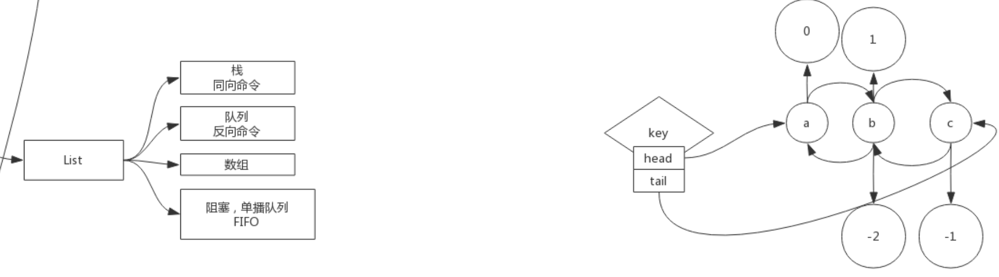
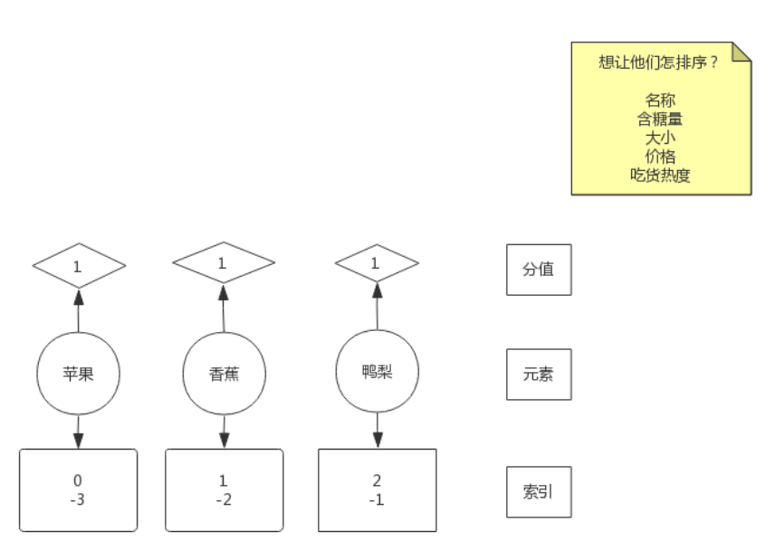

# 高并发、负载均衡

## 网络协议原理

资产-->营销--->高的并发量

假设现在实现了高并发（黑盒）。每次访问有一个日志，通过日志得到用户的ip、uri、用户从何而来。有**用户从何而来**的信息我们可以知道各个渠道带来的流量。进而在有了消费记录之后我们可以知道从哪里来的流量购买的多，也就是可以得到每个渠道的转化率、购买力。

转服务行业 --- service

最终还是落到讲技术

网络。4层(TCP/IP 协议)？7层（OSI参考模型）？

分层的好处，方便去维护，每一层只需要保证对外的接口不变即可。


TCP/IP 可以认为是OSI理论的具体实现。会话和表示被缩到了应用层。


- 第一步建立连接
- 第二步才是传送数据(http协议：规范标准。写错了不行)

```
[root@iZuf60yyfby12gcwrfeb09Z ~]# cd /proc/$$/fd  进入系统进程目录 $$为解释程序的进程id  fd为文件描述符
[root@iZuf60yyfby12gcwrfeb09Z fd]# ll
total 0
lrwx------ 1 root root 64 Nov  6 15:55 0 -> /dev/pts/0		输入
lrwx------ 1 root root 64 Nov  6 15:55 1 -> /dev/pts/0		输出
lrwx------ 1 root root 64 Nov  6 15:55 2 -> /dev/pts/0		报错
lrwx------ 1 root root 64 Nov  6 15:56 255 -> /dev/pts/0
[root@iZuf60yyfby12gcwrfeb09Z fd]# exec 8<> /dev/tcp/www.baidu.com/80		创建一个文件8，有输入输出两个方向   
[root@iZuf60yyfby12gcwrfeb09Z fd]# ll
total 0
lrwx------ 1 root root 64 Nov  6 15:55 0 -> /dev/pts/0
lrwx------ 1 root root 64 Nov  6 15:55 1 -> /dev/pts/0
lrwx------ 1 root root 64 Nov  6 15:55 2 -> /dev/pts/0
lrwx------ 1 root root 64 Nov  6 15:56 255 -> /dev/pts/0
lrwx------ 1 root root 64 Nov  6 15:58 8 -> socket:[122723]		得到一个socket，和百度建立起了通信

-e选项：把\n变成换行符	echo：打印		>& 8：把东西重定向到8	&代表这个不是文件	'...'：请求头最小写法
[root@iZuf60yyfby12gcwrfeb09Z fd]# echo -e 'GET / HTTP/1.0\n'  >& 8
标准输入0来自文件描述8
[root@iZuf60yyfby12gcwrfeb09Z fd]# cat 0<& 8
	。。。连接时间太长，这里没反应
^C
[root@iZuf60yyfby12gcwrfeb09Z fd]# ll
total 0
lrwx------ 1 root root 64 Nov  6 15:55 0 -> /dev/pts/0
lrwx------ 1 root root 64 Nov  6 15:55 1 -> /dev/pts/0
lrwx------ 1 root root 64 Nov  6 15:55 2 -> /dev/pts/0
lrwx------ 1 root root 64 Nov  6 15:56 255 -> /dev/pts/0
lrwx------ 1 root root 64 Nov  6 15:58 8 -> socket:[122723]

关闭socket
[root@iZuf60yyfby12gcwrfeb09Z fd]# exec 8<& -
[root@iZuf60yyfby12gcwrfeb09Z fd]# ll
total 0
lrwx------ 1 root root 64 Nov  6 15:55 0 -> /dev/pts/0
lrwx------ 1 root root 64 Nov  6 15:55 1 -> /dev/pts/0
lrwx------ 1 root root 64 Nov  6 15:55 2 -> /dev/pts/0
lrwx------ 1 root root 64 Nov  6 15:56 255 -> /dev/pts/0
重新开启，重新来一遍
[root@iZuf60yyfby12gcwrfeb09Z fd]# exec 8<> /dev/tcp/www.baidu.com/80
[root@iZuf60yyfby12gcwrfeb09Z fd]# echo -e 'GET / HTTP/1.0\n'  >& 8
[root@iZuf60yyfby12gcwrfeb09Z fd]# cat 0<& 8
成功拿到
HTTP/1.0 200 OK
Accept-Ranges: bytes
Cache-Control: no-cache
Content-Length: 9508
Content-Type: text/html
Date: Sun, 06 Nov 2022 08:02:40 GMT
P3p: CP=" OTI DSP COR IVA OUR IND COM "
P3p: CP=" OTI DSP COR IVA OUR IND COM "
Pragma: no-cache
Server: BWS/1.1
Set-Cookie: BAIDUID=FBC60CA0C9F3A24AC98DC6C3291EA8DF:FG=1; expires=Thu, 31-Dec-37 23:55:55 GMT; max-age=2147483647; path=/; dom
Set-Cookie: BIDUPSID=FBC60CA0C9F3A24AC98DC6C3291EA8DF; expires=Thu, 31-Dec-37 23:55:55 GMT; max-age=2147483647; path=/; domain=
Set-Cookie: PSTM=1667721760; expires=Thu, 31-Dec-37 23:55:55 GMT; max-age=2147483647; path=/; domain=.baidu.com
Set-Cookie: BAIDUID=FBC60CA0C9F3A24AA5255C6FA852DA13:FG=1; max-age=31536000; expires=Mon, 06-Nov-23 08:02:40 GMT; domain=.baiduversion=1; comment=bd
Traceid: 166772176006356864106433202826370069803
Vary: Accept-Encoding
X-Frame-Options: sameorigin
X-Ua-Compatible: IE=Edge,chrome=1

```

三次握手>数据传输>四次分手，称为一个最小粒度，不可被分割。

TCP/IP基于下一跳的传输方式。目标IP先和Genmask按位与运算要和Destination匹配，走匹配的Geteway。可以发现无论你要到哪里，目标ip和下面的第三行Genmask按位与运算一定可以得到Destination是0.0.0.0。所以192.168.8.2就是默认网关。但是我们如何把数据给到下一条呢？就需要链路层了--mac地址。mac地址对应的是具体的一个网卡设备。数据包最外层是mac地址，再往里是IP地址，是目标主机的地址，再往里就是端口号。在源主机和目标主机之间的结点传输过程中，只有mac地址会改变。

结论：tcp/ip协议是基于下一跳的机制：ip是端点间、mac地址是结点间的。


## LVS的DR,TUN,NAT模型推导

计算机1和计算机2要通信，简单组网直接靠交换机就连起来了。要想上网的话需要买一个路由器，路由器自带交换功能，可以认为路由器集成了交换机的功能。再来另一个网络，计算机3和计算机4也通过交换机连起来。计算机1~2看成一间教室，计算机3~4看成另外一间教室。

路由器有两个网卡，一个网卡归属于一个网络。如果计算机1要和计算机4通信。一开始计算机1的apr-a这个表是空的，那么里面的条目是如何出现的？这时候需要用到arp协议。此时计算机1把数据包的事情停掉，因为现在它还没有mac地址。这个时候计算机1会先去单独发一个数据包，这个数据包基于arp协议。那么这个时候我们还是需要ip地址和mac地址，mac地址是什么呢？目标mac地址是特殊的mac地址--全F。目标ip是192.168.1.1。现在把这个包发出去，交换机看到全F，这个包会被广播。只有目标地址和包的目标地址匹配的时候结点才会响应这个包。这个时候路由器发现来的包的协议是apc，此时它需要做一件事：把自己的mac地址包发回去。发回去的数据包的mac地址就是计算机1的mac地址，目标ip地址也是计算机1的ip地址。然后路由器也把这个数据包发给了交换机。交换机有一个学习能力，要学习交换机端口到mac地址的映射。计算机1发数据包来的时候，进了交换机的某一个端口，此时交换机收集到了计算机1的mac地址。之后路由器发回数据包的时候目标的mac地址也是计算机1的mac地址。计算机1的mac地址在之前就已经被交换机学习过了。这个时候交换机就知道要从之前的那个端口转发出去。数据包到了计算机1之后，这个时候计算机1就学习到了一条ip到mac地址的映射记录。这样一来计算机1既知道下一条是192.168.1.1又知道它的mac地址。


说了这么多的网络，最后要回到我们的主题---负载均衡。如果你有一台tomcat，现在有很多的请求都来请求你这个tomcat。一台主机hold不住的话我们有一种解决思路就是多来几个tomcat服务器。这是粗粒度的负载均衡。但是这个时候你对外的ip地址分给这几个tomcat服务器中的谁都不合适。

所以我们中间加一层来接收所有的流量，并且均衡的转发到我们几台tomat主机上。

tomcat也好、nginx也好，都是应用层的。所以决定了他们的速度不会很快。那么如果我们中间的那一层东西如果层次可以降低一下，只做数据包级别的转发，这样少走了几层网络通信协议，会比tomcat和nginx快。这和反向代理不一样，反向代理需要建立握手，但是这里没有握手。

如果要解决高并发、实现负载均衡的话，就通信这个层次，我们找到了一种解决方案。中间的负载均衡不要和客户端握手。只是可以偷偷的看一眼端口号。


所以这种负载均衡器很快。 是数据包转发级别的，不会和客户端握手。由于是数据包级别的，所以后端的服务器必须长得一模一样，因为这个负载均衡器不会去管你的数据包的内容，他不知道客户端发了什么uri，要去哪里访问。所以服务器不能不一样--必须是镜像的。但是nginx是这样做到后面的服务器不一样的，因为nginx是应用层的，它可以知道客户端发的uri。这是这两种负载均衡吃策略的不同。可以知道nginx的并发是有上限的，然而四层的负载均衡的并发量会比nginx大很多。

所以一般来说最前端都是LVS来hold住流量，然后再准备一层nginx来hold住握手，收到所有的请求之后nginx再转到后面的tomcat。

如果把server想成百度，百度对外不可能有两个地址，所以要通过之间的一个虚拟IP来访问百度。进入到我们四层的负载均衡服务器之后，要从后面的分发（Dispatcher）IP---出去，发到真实的IP。

无论你有没有加服务交互服务器对于客户端来说都是透明的。


客户端只知道百度外面给的一个虚拟ip，然后去访问了我们的负载均衡服务器，接着负载均衡服务器如果原封不动的把数据包发给tomcat的话，数据包是会被丢弃的，因为客户端发送的数据包的目标地址是VIP而不是RIP。有一种解决方案是用NAT。

接下来要补充NAT的知识点，NAT一般出现在路由器上。假设家中有两台设备，ip地址分别为192.168.1.8以及192.168.1.6。路由器里面还包含了交换机，上面有几个网口就可以接几个设备。运营商发的那个6.6.6.6的ip地址是公网地址，192.168.1.1是内网地址。

如果这个时候内网的两个设备的同一个端口都要对百度发起请求，把源ip换成公网ip，源端口保持不变，那么这个时候会出现转发出去的请求是一样的，这样百度发回来响应的时候响应也是一样的，没有办法区分要发给1.8还是1.6。所以这里路由器就需要有一张表把请求的原地址的端口也换一下，然后记录下来，具体是那个内网ip的哪个客户端对应着。

S-NAT：源NAT,修改的是源地址


那么看下图，由于tomcat那里需要的请求是RIP，所以负载均衡服务器在转发的时候可以修改目标地址，将VIP换成RIP，这个转化目标的IP叫做DNAT-目标地址转换协议。这样包就发到了tomcat服务器上。最后tomcat服务器需要给客户端返回。也就是RIP需要返回给CIP，但是如果RIP直接给CIP，CIP是不会认的，因为CIP只记得发了一个CIP->VIP，不知道还有CIP->RIP。那么这个时候就还需要一次源地址的变换。源地址就只有我们的负载均衡服务器知道，所以tomcat服务器就需要再把这个返回的数据包丢给负载均衡服务器，然后负载均衡服务器修改了源地址之后在发回给CIP，CIP就会认了。

DNAT有一个弊端，一来一回的数据载量是不一样的。一般来说请求的数据包大小和响应的数据包大小都是不一样的，上行和下行的速度不一样。因为我们来回都需要经过负载均衡服务器，所以负载均衡服务器的带宽成为了系统的瓶颈。进行地址的转化需要消耗算力。


那么我们如果解决掉这个下行的瓶颈？有这个瓶颈的原因是我们的响应需要经过负载均衡服务器导致的。我们有没有办法让响应直接发回给客户端？这个时候我们就不能使用NAT模式了，因为使用了NAT就意味我们需要回溯。无论你后面做了什么变化，客户端都不知道，它仍然发送的是CIP->VIP。所以回去的包也只能是VIP->CIP。因为现在不靠负载均衡服务器来转化成VIP了，此时服务器要想返回源地址正确的包，服务器本身就要有VIP这个本地的ip地址。

这在实际生产中是合理的，企业对外暴露一个VIP，然后企业内部的服务器当然也可以知道这个VIP，那么服务器就可以把这个VIP藏在自己的内部但是并不对外暴露这个VIP。所以，如果有一种技术可以做到隐藏VIP，只有服务器自己知道这个VIP，全网除了自己没有人知道自己有一个VIP地址，这样客户端CIP->VIP就还是只会到我们的负载均衡服务器而不会来到tomcat服务器。由于现在tomcat中有了VIP，所以现在即使负载均衡服务器没有进行目标地址的转换，我们的tomcat也可以接受数据包了。

但是现在注意一个问题，我们现在只解决了从tomcat服务器到客户端的问题，但是没有解决负载均衡服务器到tomcat服务器的问题。tomcat服务器依然只接受目标地址是RIP的。数据包是CIP->VIP，由于tomcat服务器是内部有VIP地址，所以首要的任务就是进入到tomcat服务器中。我们可以在负载均衡服务器对数据链路层做手脚，直接把目标的MAC地址改成RIP的目标地址即可。但是由于mac地址不能跨网络，所以我们的tomcat服务器和负载均衡服务器一定要同一个局域网。

这种模式叫做直接路由模式。Direct Route

VIP如何隐藏？其实就是对ARP协议做手术，别人发ARP请求过来，我就是不说，也不通告，这样周围的设备都不知道我有VIP。但是我自己是知道自己有一个VIP的。


DR模型的优点是速度快，缺点是物理位置被约束了

DNAT模型的优点是物理位置不会被约束，但是它速度慢

所以下面我们引出第三种模型：隧道模型。它取了上面两种模型的优点做了折中

看下图，我们终于用上了之前没有用的DIP，我们使用DIP->RIP背着CIP->VIP的包。这样可以看成一个隧道，把CIP->VIP的包送到了目标RIP。隧道可以解决物理位置限制问题。


了解了上面的三种模型，回到最开始，负载均衡到底有什么用？

```
LVS 是 Linux Virtual Server 的简写，即 Linux 虚拟服务器，是一个虚拟的服务器集群系统
```

负载均衡是把前面的并发给分治了，前面一堆的请求先走我的LVS，LVS均衡的转发给后面的几个服务器。

在我们的机器中有一个物理网卡和虚拟网卡。物理网卡是暴露给外面的，虚拟网卡只有内部知道，外部是不可见的。所以我们要配DR的时候，需要在real server 那里配置虚拟网卡，虚拟网卡里面配置VIP，这样内核就知道了有这个VIP，但是外界是不知道有这个VIP的。这样就做到了对内可见，对外隐藏。

要做到对外隐藏当然别人来访问你这里的VIP的时候，物理网卡不能告诉它。所以需要配置arp_ignore；当然还不能将自己告诉给别人，所以需要修改通告的级别 arp_annouce。

arp_ignore

​	0：你打电话给我，问我家人的电话，我不告诉你

​	1：你打电话给我，问我的电话，我可以告诉你

arp_annouce

​	0：这台主机上面的任何网卡的任何地址我都说出去。网卡--人、IP--电话。家里人的所有电话都说出去

​	1：只把我自己这块网卡的所有地址说出去。把我自己的电话都说出去

​	2：假设我的网卡配了两个IP地址，连了两个网咯。我只会向1网咯通报我只有1的地址，向2网络通报我只有2的地址。这样一来网络1不知道网络2，网络2也不知道网络1。只把我自己的某一个电话说出去。


所以我们需要修改内核的响应级别以及通告级别。以及需要把VIP配置在内部的虚拟网卡LOOP上。

调度算法就是LVS要把数据具体发给哪个服务器。直接看动态调度算法。lc： 谁的用的最少就用谁。那么负载均衡服务器怎么知道和谁连接了几次呢？把负载均衡服务器想象成具有偷窥的能力，什么是偷窥？就是只看不动手。看完客户端发来数据包之后它不动手，就只拿小本本记录一下。负载均衡服务器知道三次握手的第一次的包，但是由于第二次握手的包不一定会走负载均衡服务器（根据模型的不同会有差异）。但是无所谓，负载均衡服务器如果发现了三次握手的第三个包，那么就会给这个服务器的连接次数+1。同理，四次分手负载均衡服务器也是可以知道的。


LVS在LINUX内核模块的名称叫做ipvs，一般来说LINUX的发行版都自带，不需要自己去装，除非发行版故意剔除这个模块。但是我们有这个模块还不够，我们还需要一个和内核交互的接口ipvsadm，有了这个小程序之后对它下发指令，它会把你的指令翻译成底层调用内核，我们需要的参数就是传给这个小程序的。


-A的命令是入的命令，也就是外面的请求到什么ip什么端口才会被匹配


-a的命令出的命令，也就是前面被匹配的请求应该到哪个服务器去。


虚拟机给我们提供了一个虚拟网络，192.168.150.2。然后提供了虚拟主机，上面的虚拟网卡连接到了我们的虚拟网络上。

计算机上还有一块网卡，vmnet-8：192.168.150.1。然后还有一个windows的一个后台服务VMware-NAT,这个服务是192.168.150.2这个ip地址。上面的所有的虚拟主机的数据包都是发给这个后台程序的。然后再把数据包发到以太网本地连接，也就是windows自己的物理网卡。vmnet-8也是vmware虚拟出来的，为了windows也有一个网卡可以进入和虚拟机通信。


配置noded01暴露的接口。


node02和node03在配置接口之前要先去调整arp协议。


我们现在只改了一个接口，为了以后所有的接口都生效，现在我们去到all接口


继续修改


协议改完了之后才去动隐藏VIP的配置。注意这里不要加上/24。这是为了避免发生死循环，发不出去。


总结如下步骤：

```
LVS：

node01:
	ifconfig  eth0:8 192.168.150.100/24
node02~node03:
	1)修改内核：
		echo 1  >  /proc/sys/net/ipv4/conf/eth0/arp_ignore 
		echo 1  >  /proc/sys/net/ipv4/conf/all/arp_ignore 
		echo 2 > /proc/sys/net/ipv4/conf/eth0/arp_announce 
		echo 2 > /proc/sys/net/ipv4/conf/all/arp_announce 
	2）设置隐藏的vip：
		ifconfig  lo:3  192.168.150.100  netmask 255.255.255.255
		
RS中的服务：
node02~node03:
	yum install httpd -y
	service httpd start
	vi   /var/www/html/index.html
		from 192.168.150.1x

LVS服务配置
node01:
		yum install ipvsadm 
	ipvsadm -A  -t  192.168.150.100:80  -s rr
	ipvsadm -a  -t 192.168.150.100:80  -r  192.168.150.12 -g -w 1
	ipvsadm -a  -t 192.168.150.100:80  -r  192.168.150.13 -g -w 1
	ipvsadm -ln

验证：
	浏览器访问  192.168.150.100   看到负载  疯狂F5
	node01：
		netstat -natp   结论看不到socket连接
	node02~node03:
		netstat -natp   结论看到很多的socket连接
	node01:
		ipvsadm -lnc    查看偷窥记录本
		TCP 00:57  FIN_WAIT    192.168.150.1:51587 192.168.150.100:80 192.168.150.12:80
		FIN_WAIT： 连接过，偷窥了所有的包
		SYN_RECV： 基本上lvs都记录了，证明lvs没事，一定是后边网络层出问题
```


## 基于keepalived的LVS高可用搭建

回顾：基于nginx的反向代理是7层的，但是LVS是四层的。nginx有负载均衡的能力，但是它是七层的。


 

再来聊高可用。来看下图。我们可以发现整个公司的流量的入口是负载均衡服务器，由于是单点的，如果挂掉了，那么也代表着整个公司的业务下线了。除了负载均衡服务器会挂，后面的real server也可能会挂，但是负载均衡服务器还是会响挂掉的服务器进行负载，这样会导致有一部分的请求就连不通了。所以会造成一部分人的业务不正常。下面的主要任务就是解决这两个问题。


单点故障的一个解决方法就是一变多，但是这里我们对外只能提供一个vip，所以我们就准备一台主要的机器，以及一台备用的机器---主备。那么如果是主主的话，由于对外只能提供一个vip，所以我们只能再次往前面追加一层，例如DNS。用的比较多的是主备。

其它的皇子怎么知道皇帝挂了？有两个方向：第一种，皇子们每隔一会就去皇帝身边看一眼皇帝挂了没，也就是备机去轮训的问主机挂了没。如果有三五台备机每隔一段时间就去问主机挂没挂，主机响应这些备机。那么主机既要接收客户端发来的请求包也要接收备机发来的心跳包。这样对主机或多或少会有些压力。第二种，皇帝每天上朝，只要皇子看到皇帝今天上朝了，就说明皇帝还活着。所以在网络中是由主机周期性的向外发送一个广播包，发给了所有的的备机，如果收到了就认为主还活着。但是由于网络是有不确定性的，只有发现皇帝三天没有上朝了，皇子才会揭竿而起，也就是说会有重试机制。

效率性：如果主挂了，那么多的备机选谁上呢？我们可以给定一个权重值，这样备机中选谁上这件事就变成了一个推让制，而不是一个争抢制，这样会更有效率。

主备是只有主在干活，只有主挂了的时候备机才会顶上。主从是有主有从，主和从都会有事情做，所以在主从中的这个主也会出现单点问题，所以对这个主也进行一下主备。

截止目前我们解决了LVS会挂的问题。还要解决RS挂了的问题。RS挂了怎么确定？举一个具体的例子，百度挂了你怎么知道？ping肯定是不行的，因为ping只是到了网络层。所以要贯穿到应用层我们才能知道百度挂没挂，所以我们需要用http协议实际访问一下。

按照上面说的，我们要主机告诉自己还活着，这是一个新功能，所以我们可以直接修改ipvs内核模块的源码。修改内核代码是一个方法。另一种方法是使用第三方实现。第三方就是用人去监视，但是人不靠谱，企业追求的是自动化，把人解耦出去---用程序。如果有一个程序可以代替人，可以监控服务的状态，可以向外发送它还活着。如果服务器可以在外偷听主机是否还活着，而这个程序还可以向后去检查RS的健康，发现RS有问题的时候就把条目剔除，如果好了就再加回来。这个程序就叫做keepalived，解决单点故障，实现高可用。

主的服务器上装keepalived，备机上也要装。keepalived在监控自己各自服务的状态，主向外说自己还活着，备机监听主还活着。

人还需要配置vip，添加ipvs，这些操作是我们手工去做的。我们可以把这些操作写到一个配置文件中，keepalived一启动就替你把这件事做了，这样就连你操作失误的概率都被规避了。所以keepalived是有配置文件的。除了这些事情，keepalived还需要对后端服务做健康检查。

keepalived是一个应用程序，是第三方的！

keepalived不止可以用于LVS,如果nginx作为负载均衡服务器来用的话，为了解决单点故障问题，同理可以使用keepalived。只要是1变多，有多台的时候都可以做这些事情。


上次留了node4没有用。由于我们要解决单点故障，所以我们使用node4来作为backup。看到node4下面配的ip是虚线，只有主机挂了的时候才换成实线。由应用层的keepalived来做健康的监测。


步骤如下：node2和node3还是和之前一样配置，但是node1要还原变成裸机，由keepalived帮我们配置即可。

进入到配置文件之后：

​	global_defs是全局配置

​	vrrp_instance VI_l是虚拟路由冗余协议的一个实例。里面有state MASTER，意思是说这台机器就是主机，如果MASTER变成了BACKUP那么就变成了备机了。interface eth0，在企业中可能有多快网卡，组了多个网络，每个不同的网络流动的数据类型是不一样的。将网络划分为不同的物理网络之后，数据不会影响到信号传输的时效，其中的一个网络坏了，另外一个还是可用的。这里interface eth0指定了后面走的都是eth0这块网卡。virtual_router_id是虚拟路由id，有两台keepalived的话需要在这里做区分。priority，权重值。下面还有权限认证。virtual_ipaddress也就是我们说的VIP，书写格式，例子`192.168.150.100/24 dev eth0 label  eth0:3`。主机写完之后从机基本不用变，只需把MASTE变成BACKUP。把权重变小即可。

​	virtual_server是虚拟服务，对应lvs中的vs。在real_server外面的相当于就是A，在real_server里面的就是-a。peisitance_timeout是为了防止用户在短时间内请求，已经有服务器对它有记录了，这个时候LVS就按照记忆，直接发回给之前的那个服务器，而不是直接去负载均衡。这里的HTTP GET 就是我们用来检查挂没挂的方式。

```
keepalived实验：
主机： node01~node04

node01:
	ipvsadm -C
	ifconfig eth0:8 down

----------------------------
node01,node04:
	yum install keepalived ipvsadm -y
	配置：
		cd  /etc/keepalived/
		cp keepalived.conf keepalived.conf.bak
		vi keepalived.conf
			node01:
			vrrp：虚拟路由冗余协议！
				vrrp_instance VI_1 {
					state MASTER         //  node04  BACKUP
					interface eth0
					virtual_router_id 51
					priority 100		 //	 node04	 50
					advert_int 1
					authentication {
						auth_type PASS
						auth_pass 1111
					}
					virtual_ipaddress {
						192.168.150.100/24 dev eth0 label  eth0:3
					}
				}
			virtual_server 192.168.150.100 80 {
				delay_loop 6
				lb_algo rr
				lb_kind DR
				nat_mask 255.255.255.0
				persistence_timeout 0
				protocol TCP

				real_server 192.168.150.12 80 {
					weight 1
					HTTP_GET {
						url {
						  path /
						  status_code 200
						}
						connect_timeout 3
						nb_get_retry 3
						delay_before_retry 3
					}   
				}       
				real_server 192.168.150.13 80 {
					weight 1
					HTTP_GET {
						url {
						  path /
						  status_code 200
						}
						connect_timeout 3
						nb_get_retry 3
						delay_before_retry 3
					}
				}
			scp  ./keepalived.conf  root@node04:`pwd`
```

两台机器都配置完成之后，把服务跑起来。


备机的vip没有配置，但是后面的内核以及对应的-a-A的配置都已经配置好了，因为它只是对外不提供服务，但是还需要对后端进行健康的检查，来做到在第一时间可以顶上主机提供服务。如果主挂了，备机会顶上。如果主好了，那么主会抢回去。只是这里的主会抢回去，会不会抢回去取决于不同的技术。


如果keepalived异常退出来，例如kill -9 ，那么会导致它配置的网卡以及RS都没收回。此时由于keepalived已经死了，那么就不会向备机说它还活着，那么就会导致备机就顶上了。那么此时互联网上两台主机都配置了vip。那么此时客户端发送的数据包会出现混乱，也就是它发出去的数据包会负载给不同的服务器。那么我们之前为了解决单点问题引入了keepalived，但是keepalived可以看到，它自己本身也不是可靠的。我们不能陷入无限循环的陷阱，不能再来引入一个守护进程的守护进程。我们可以把keepalived做成一个高可用的集群，这样就可靠了。

# Redis

## 介绍

常识：

1. 磁盘比内存在寻址上，慢了十万倍。
2. IO buffer：一个扇区装512字节，如果磁盘的容量越大，那么所需要的索引就越多。一般来说操作系统一次都读出4k

如果数据存在文件里,如果在linux里面，有grep以及awk这样的命令。也可以使用java写一个基于io流读取查找的程序。随着文件的变大，速度肯定会慢下来，因为硬盘的IO成为了瓶颈。但是如果你把这个数据文件分成1个1个的4k，那么我们就可以对这些4k进行编号。这些4k刚好符合磁盘的一次IO。进行了编号之后就可以建立索引，B+树，就可以进行提速。

数据库建表的时候要给出模式，这样一来一行中有几列，每一列占几个字节都定死了。也就是你往数据库里面填入一条记录，就算这个记录只有一个字段，也会占用一整行。其它没有用到的列就先空着。这样就是行级存储。行级存储的好处就是以后在增删改的时候就不需要移动，直接在对应的位置填入即可。

磁盘的速度慢，那么我们要速度快就要减少磁盘的IO。当数据库的表很大的时候，性能肯定会下降。但是当只有一个或者少量查询的时候，查询速度变化不大。但是当并发量大的时候，受到硬盘带宽的限制，速度就会变慢。

前面是基于磁盘的数据库，下面SAP有一个HANA数据库，这是一个内存关系型数据库。要知道数据在磁盘和内存的体积是不一样的。但是内存级别的数据库太贵了，买不起。我们能不能折中？搞一个缓存数据库。redis就是一个内存级的缓存数据库。

`https://db-engines.com/en/` 所有数据库引擎的信息都可以在这里获取

`redis.io` redis的官网


下面说的很多数据类型指的是value的类型。为什么memcache同样也是一个k-v类型的数据库，为什么被redis取代了，因为它的value没有类型的概念。但是即使它没有数据类型的概念，只要我能存String类型，我就可以用Json来存放对应的数据类型。所以redis到底优在哪里？如果客户端想通过一个缓存系统（k-v）取回value中的某一个元素。此时从json中取回一个元素，和**从list中取回一个元素**的成本就不一样了。如果是json，那么客户端就需要得到这一整个json，并且对这个json进行解码。这样一来浪费了很多的带宽。


其实redis的类型不是最重要的，重要的是它为每种类型提供了方法，这样就可以对value使用方法，从而取到这个value中的某一个元素。这样就节约了很多的带宽，客户端也不需要解析了。

计算向数据移动：使用memcache的时候我们的计算是发生在client端的；使用redis的时候计算发生在服务端，也就是redis。可以发现计算向数据移动了。


## 安装

1. 上`redis.io`官网。下滑，找到`Download Stack`。找到`download x.x.x`，右键复制获取下载链接，点击复制链接

   

   


```
#没安装过wget就先安装一下
yum install wget
#进入到安装目录，使用wget获取刚刚得到的链接资源
wget https://github.com/redis/redis/archive/7.0.7.tar.gz
#是源码安装，所以很小。进入到安装目录
cd redis-7.0.7/
#源码安装，第一件事看readme.md。告诉你要先make。如果中途失败了，要先make disclean。如果没有安装gcc要装一下
yum install gcc
make
#执行成功之后去到src目录下就有一些可执行程序了。我们可以手动执行redis server。但是这样人工干预太low了。我们在#readme中看到了在utils目录下有一个脚本，install_server.sh。但是我们还是按照readme的流程来走
make install PREFIX=/opt/wcx/redis7
cd/opt/wcx/redis7/bin/
#完成上个步骤之后，几个可执行的文件就跑出莱了，不再和以前的源码混在一起。我们还是可以直接./redis-server。但是我们#希望可以直接把reids弄成一个系统的服务。在这之前我们需要先将/opt/wcx/redis7/bin添加到PATH中，然后就可以执行#install_server.sh这个脚本了
进入到刚刚的utils目录
./install_server.sh

```

在一个机器上可以配置多个实例。每个实例用端口号区分。配置文件、日志文件、数据文件夹都是用端口号进行区分。


步骤如下


---

## 什么是epoll

小插曲：

下面这图看不清，拆成两个图来看


计算机有内核，内核接住很多的连接，所有的连接先到达内核。一个连接有一个文件描述符，进程可以用read来读文件描述符。socket在这个时期是阻塞的，socket产生的文件描述符，如果数据包没到，read命令就不能返回，也就阻塞着。抛出一个线程，读网卡的连接，有数据就处理，没数据就阻塞。抛出多个线程的话，由于只有一个cpu在一个时间片只能处理一个线程，cpu并不能及时处理到达的数据，所以有很多的资源浪费，这是早期的BIO时期，因为socket是阻塞的，所以叫做BIO。

B：blocking

上面那种方式，计算机硬件很难被利用起来。所以接下来内核发生了变化。

先安装所有的帮助页，man可以看命令的帮助文档，例如可以看ls的，ls的文档是1类文档。2类的文档是系统调用，例如read。read方法要传一个文件描述符fd (即file descriptor)。java是用obget来代表一个输入输出流对象，在linux系统里面不是面向对象的，它是一切皆文件，所以都是用文件来代表输入输出流。fd其实就是一个数值01234。,0是标准输入，1是标准输出，2是错误输出。

- BIO时期的socket调用是阻塞的


任何进程在操作系统里面都会有它自己的io对应的文件描述符。可以看到下面的01234文件描述符，可能还会有更多。


再去socket的说明文档里面看看。学java的时候我们可以用socket来开启连接。domain：域名。protocol：协议。type是什么？调用socket的时候会返回一个文件描述符。往下找到SOCK_NONBLOCK---这是非阻塞的意思。也就是fd描述符可以是nonblock，那么这样我们就可以只用一个进程，循环的去调socket看看有没有数据，由于非阻塞了，那么就可以去看下一个socket有没有数据。这样就是非阻塞的IO。同步是遍历和取出数据都是它自己来完成。这个时期是同步非阻塞时期NIO（nonblock IO）。但是此时如果有1000个fd，代表用户进程轮询调用1000次系统调用，成本很大。那么能不能减少系统调用的次数？由于此时我们的轮询发生在用户空间，要解决这个问题我们要求轮询发生在内核，也就要求内核自己去向前发展。

- NIO时期socket调用就可以不用阻塞了


把在用户空间轮询的事情扔给内核来做。内核里增加了一个系统调用select，这个时候用户空间，也就是进程就调用select。再去看看select的说明文档。ndfs：有多少个文件描述符。readfds：一个指针指向文件描述符的一个结构，这个是读得到方向的。还有写的方向的：writefds。还有一个报错：exceptfds。还有一个轮询时间timeout。


可以看到，select会帮助我们去查看一堆的fd，看看有哪个已经ready了。这样一来，进程拿着这些ready的fd就可以直接去read，就不会浪费时间在查看哪个fd已经准备好了，内核已经帮我们做了。内核发展使得用户空间的复杂度变低了。这样减少了内核态和用户态之间的切换。但是我们依然是同步的。现在这个技术是多路复用的NIO。

- 从用户进程一个一个循环的的去调用socket检查fd有没有数据了，变成有了一个新的系统调用select帮你一次性去检查有哪些fd有新数据了。省去了大量循环的系统调用的时间
- java内存中，堆是共享的，但是线程栈是独立的，线程的大小假如是1M。线程多了cpu需要调度，浪费资源；并且占用了很多内存。所以一个连接抛出一个线程的BIO方式肯定不好。所以才会有NIO，我最低只有一个线程或者几个线程就能做这件事情。所以这时候每一个线程可以hold住1000个连接，但是每一个连接要调用一次系统调用read，这个成本还是比较高。所以我们要把系统调用数减下去，使用一个系统调用select就可以帮我们检查这1000个连接，然后给你返回几个，你再去调用read、write去读写数据，这样系统调用的次数就减下来了。这个时候还是需要你自己解决数据的读入和写出的事情，read、write还是用户空间去调用的，这个时候叫做同步非阻塞。但是这样存在一个问题，每次调用到传1000个fd，然后你给我遍历一下，然后返回可以用的，我再去遍历可以用的，这样在传递数据的时候成本高。然后就引出了epoll的概念，epoll其实有3个调用。用户空间中可以create，在调用create可以返回一个epfd（epoll的文件描述符fd），未来用户空间有一个连接进来了就把连接写给epfd，epoll会准备一个共享空间，里面维护一个红黑树。1000个连接以前是全部传给select，现在就是通过epoll先注册进红黑树，红黑树的增删改的操作是内核来完成的，查询两边都可以查。当你把连接注册写进了红黑树，用户空间有一个系统调用wait和ctl调到epoll上。ctl是可以往里面增或者删socket的文件描述符。调用wait等待一个事件，谁的数据到了，就把它放到那个链表中去。然后调用wait，就可以从阻塞变成不阻塞取那个链表，把实际到达的文件描述符给你，然后由于用户空间是共享的，你自己单独去调用read去读数据。所以epoll也叫作nio，不叫aio。

```
select()  and  pselect()  allow  a program to monitor multiple file descriptors, waiting until one or more of the file descriptors become "ready" for some class of I/O operation (e.g., input possible).
```

但是现在我们还是得自己去调用read，还是有点麻烦。这时候我们引出了epoll。我们的进程是在用户空间的，里面放着的1000个fd的那些二进制数据。调用内核的时候需要传参，传过去就得有拷贝，传输的时候拷贝越少速度就越快。mmap可以解决这个问题，mmap可以做一个映射，进程依然把数据放在某一个地方，但是它可以把这个地方通过mmap做一个映射，让内核也可以到这个地方去读取数据，这样就可以减少拷贝，做到一个共享空间，这个空间里面放了一些数据结构来存放fd。进程通过epoll，多了一个fd就往红黑树里面放，然后进行系统调用就不需要拷贝，内核把ready的放到链表里，进程从链表中取出直接读取即可。

0拷贝是什么意思？还是在内核上做改进，多了一个系统调用sendfile。我们要把一个在系统里的file.txt从网卡发出去，一般的做法就是先read出来到进程里面，然后在write出去，需要有一个拷贝的过程。如果直接调用sendfile的话就可以不需要这个拷贝的过程，直接读出来到缓冲区里面然后直接发出去。

可以看到sendfile和mmap是不一样的。sendfile如果加上mmap可以组件一个高效的技术kafka。网卡的数据来，来的数据走kafaka，kafka是基于jvm的一个进程，然后走mmap，然后挂在到你的文件，由于是共享空间，kafka往里面写了东西，内核也是看得到了，这样就可以减少拷贝。从用户空间到内核空间减少了拷贝的过程。现在消费者要来拿数据，就是走的零拷贝了，sendfile的输入来自于文件，输出来自于消费者。


---

## redis为什么快

假设有一个机器是linux操作系统，上面有多个redis。由于redis是单进程单实例的，当并发到来的时候，如何变得很快？操作系统linux是有内核的概念的。客户端的所有连接是先到达内核的，会有很多的socket，redis和linux内核之间走的是epoll这样一种非阻塞的多路复用的技术，epoll是系统提供的系统调用。

redis为什么快，redis是单进程，所以用了epoll，客户端来的数据用epoll放到了共享区。所有的数据到来是有顺序的，因为redis是单进程，这里顺序的意思是到来的数据会挨个挨个的处理。所以要处理事务的话就要再往前面的业务端去控制。要保证事务的话，对于同一个key的增删改查要让一个线程一个连接去发出来，而不是负载到多个。和kafka类似。

nginx要满足多少颗cpu启动多少个worker进程。一个worker就可以把数据压到cpu的1,2,3级缓存，有多少个cpu就有多少个nginx进程，每个woker进程使用的是多路复用epoll。只有windows才有aio，linux没有aio。


redis会有很多客户端的连接进来，对于对于系统来说就是socket连接很多。redis是一个进程，可以调用epoll来遍历寻找这里面的socket中有哪个数据发来了。处理用户对数据的操作是redis里面的一个线程完成的。但是它可能有别的线程在做别的事情，这个事情可能和你的数据没有关系。所以一般来说就说redis是单进程单线程来处理用户的请求。这样的单进程单线程来处理用户的请求有一种好处就是会有顺序性，这里是顺序是指每连接内的命令顺序，也就说如果是两个连接都对同一个key进行了操作，那么谁先谁后就不确定了。但是如果一个连接自己是单线程控制好了命令的顺序，那么redis就可以保证命令是正常执行完毕的。你在做负载的时候，或者在做业务流的时候，要尽量把相同的东西打到一个结点上去，和kafka一样，为了保证一个资源的顺序，虽然顺序可能有时间差，在一个分区里放对于一个key的所有操作，他们到达的先后顺序是可以保证的。 

- select和epoll的区别：用户空间调用select，你要给它1000个文件描述符。如果是epool的话你需要调用一次wait，等就行了。

  select在每次循环的时候都要压进1000个文件描述符，然后你再告诉我这1000个有多少个能读的，我再去读。

  epool就是来一个连接就压一个，也就是1000个文件描述符只需要压1000次即可，然后调用wait，当有数据来的时候，能读的就进入到队列中，wait就不阻塞了，开始read这些可以读的。select如果1000个文件描述符会重复压入。

  netty用的就是epool的方式

- 这么多客户端往redis发东西的时候，这里只有一个线程，在处理的时候就可能会有排队等待的问题。但是因为内存寻址的时间是纳秒，socket对应的是网卡，寻址时间是毫秒，中间相差了10万倍。除非有10w个连接在同一个时刻到达，这时候可能会造成秒级的响应。因为内存的寻址时间是纳秒级别的，就在内存中移动，也没有磁盘io发生，redis就单一个线程，epool还是用户空间和内核共享内存的，等于某个文件描述符有了之后我就调用epool，直接去读进文件描述符。手里还知道你下一个文件描述符是谁，因为共享内存，直接去把下一个文件描述符读进来。这样一看所有通信的距离是很少的，

- 如果是走的linux中的redis客户端，那么可以达到15万级别。如果走的是网卡，那么就只有六七万的级别。

- linux操作系统中可以有多个redis实例，一个redis实例中会有0~n多个相互隔离的库，一个库下存的是键值对。key其实是一个对象，除了key自身的名字之外，还有type类型，以及encoding。type类型可以提前规避某些错误的操作，例如对string类型做list类型的操作，快速返回你这个命令执行错了，不需要真的去执行操作。encoding也是类似，只不过是对于同类型做某些操作可以免去异常的检查，实现加速。例如string类型的encoding有int和embstr，如果这个key之前的encoding就是int类型，那么你拿它做加法，redis就不会去检查能不能加，速度就会很快。如果你拿的key的encoding是embstr的话，你拿它做加法，redis就会去做一次检查。


## 类型

下面来看redis的使用。

1. 在redis中默认是16个库（0~15），这个类似于MySQL中可以自己建立数据库，每个数据库的表是独立的。-n这个选项就是用来选数据库的。通过-n 加上库的序号就可以直接连接进去相应的库。如果已经进去了，要切换库，那么就使用`select 8`来切换到8号库，默认不加-n就是走的0号库。
2. -h和-p可以用来选择主机和端口号。

```
[root@aliyun 18:38:33 bin]# redis-cli -h
redis-cli 3.2.12

Usage: redis-cli [OPTIONS] [cmd [arg [arg ...]]]
  -h <hostname>      Server hostname (default: 127.0.0.1).
  -p <port>          Server port (default: 6379).
  ......
```

进入到客户端之后，利用help来看看怎么使用。告诉你help后面加上`@group`或者是`command`。也可以直接help然后按下tab键，他就会给你提示。并且tab键也有补全的功能。

```
[root@aliyun 18:38:36 bin]# redis-cli 
127.0.0.1:6379> help
redis-cli 3.2.12
To get help about Redis commands type:
      "help @<group>" to get a list of commands in <group>
      "help <command>" for help on <command>
      "help <tab>" to get a list of possible help topics
      "quit" to exit

To set redis-cli perferences:
      ":set hints" enable online hints
      ":set nohints" disable online hints
Set your preferences in ~/.redisclirc
```

generic代表通用组。全局的配置

```
127.0.0.1:6379> help @generic
```

见名知意，看解释。

1. DEL key [key ...]

   删除一个key

2. EXISTS key [key ...]

   判断key是否存在

3. EXPIRE key seconds

   给出key的存活时间。和内存优化有关

4. KEYS pattern

   pattern是一个描述，看看符合这个描述的key有哪些。

5. MOVE key db

   将一个key移动到另一个数据库

6. OBJECT subcommand [arguments [arguments ...]]

   查询自身的obj定义

7. PERSIST key

   将你定义为要过期的key设置为持久的

8. TYPE key

   输出某个key的类型

```
127.0.0.1:6379> help @generic 

  DEL key [key ...]
  summary: Delete a key
  since: 1.0.0
 
 ......
```

FLUSHDB：清空当前的数据库

```
127.0.0.1:6379> keys *
1) "backup4"
2) "backup3"
3) "backup2"
4) "backup1"
127.0.0.1:6379> FLUSHDB
OK
127.0.0.1:6379> keys *
(empty list or set)
```

上面是通用组。我们知道redis还有五种基本的类型`string/list/hash/set/sorted set`。

### String

```
[root@aliyun 15:38:24 ~]# redis-cli
127.0.0.1:6379> help @string

  APPEND key value
  summary: Append a value to a key
  since: 2.0.0
  ......
```

库分好了之后，下面是key，key有一个指针指向value，value有五种类型。

string就是其中一种类型，string你要把它想成是byte，string类型还有关于字符串的操作，还有基于数值和位图的操作。

- linux操作系统中可以有多个redis实例，一个redis实例会有多个库（0,1,2,3...），一个库下面存的都是键值对。key其实是一个对象，除了key自身的名字之外还有它的type类型以及encoding，type用来快速判断一个key是否具备某种操作，从而可以快速的判断一个命令是不是错了，不需要拿数计算报异常。


value类型丰富，string类型就至少可以面对三种场景。下图分开看


#### 字符串


- key没有类型的区分，只有value才有

有哪些操作：

```
127.0.0.1:6379> set k1 hello
OK
127.0.0.1:6379> get k1
"hello"
```

NX:只能新建，不存在的时候才设置。使用场景：分布式锁，一堆人拿着一个redis来做一个参考，他们都想删一个文件。一堆人拿着多个连接对一个单线程的redis发起`set k1 ooxx nx`谁成功了谁就拿到锁，剩下的人都返回失败。

XX:只能更新，也就是只有当那个key存在的时候才能操作成功。

```
127.0.0.1:6379> help set

  SET key value [EX seconds] [PX milliseconds] [NX|XX]
  summary: Set the string value of a key
  since: 1.0.0
  group: string
```

```
127.0.0.1:6379> set k1 wcx NX
(nil)
127.0.0.1:6379> set k2 wcx XX
(nil)
```

上面是单条的get、set，还有多笔的`mset`,`mget`

```
127.0.0.1:6379> mset k3 a k4 b
OK
127.0.0.1:6379> get k3
"a"
127.0.0.1:6379> get k4
"b"
127.0.0.1:6379> mget k3 k4
1) "a"
2) "b"
```

还有很多，自己可以去`help @String`。下面演示几个

APPEND

```
127.0.0.1:6379> get k1
"hello"
127.0.0.1:6379> append k1 " world"
(integer) 11
127.0.0.1:6379> get k1
"hello world"
```

GETRANGE

```
127.0.0.1:6379> get k1
"hello world"
127.0.0.1:6379> getrange k1 1 4
"ello"
```

- 正反向索引

  如果你有几个字符'h' 'e' 'l' ，正向和反向就想象成首尾相连的一个圆环即可。

  

  ```
  127.0.0.1:6379> GETRANGE k1 6 -1
  "world"
  127.0.0.1:6379> GETRANGE k1 0 -1
  "hello world"
  
  ```


SETRANGE

长了就全部覆盖，短了就覆盖部分

```
127.0.0.1:6379>  SETRANGE k1 6 WCX
(integer) 11
127.0.0.1:6379> GET k1
"hello WCXld"
127.0.0.1:6379>  SETRANGE k1 6 WCXyyy
(integer) 12
127.0.0.1:6379> GET k1
"hello WCXyyy"
```

STRLEN

```
127.0.0.1:6379> STRLEN k1
(integer) 12
```

对redis的基本使用有一个认知了。我们可以用用type来看某个key对应的value的类型是什么。每种value类型都会有相应的自己的方法，方法是和类型绑定的，如果你的客户端发出了一个非string类型的方法操作k1的话，redis不会真的发生发过来的那个方法，它只需要找到你那个类型，进行检查，不匹配就不能发生操作。


```
127.0.0.1:6379> type k1
string
```

所以key里面会有一个属性type，type描述的是value的类型。


我们知道set命令是string类型的，所以通过set设置的key对应的value都是string类型的，即使你通过set设置了数值。

```
127.0.0.1:6379> FLUSHDB
OK
127.0.0.1:6379> HELP SET

  SET key value [EX seconds] [PX milliseconds] [NX|XX]
  summary: Set the string value of a key
  since: 1.0.0
  group: string

127.0.0.1:6379> set k1 99
OK
127.0.0.1:6379> type k1
string
127.0.0.1:6379> set k2 wcx
OK
127.0.0.1:6379> type k2
string
```

KEY是一个obj，里面有表示它对应的value类型的字段type，以及encoding。

```
127.0.0.1:6379> help OBJECT

  OBJECT subcommand [arguments [arguments ...]]
  summary: Inspect the internals of Redis objects
  since: 2.2.3
  group: generic
```

发现，即使value类型都是string，但是string类型中encoding还分了str以及int。所以string类型还有数值的类型

```
127.0.0.1:6379> OBJECT encoding k1
"int"
127.0.0.1:6379> OBJECT encoding k2
"embstr"
```

K1的类型是string，但是encoding是数值类型，所以可以对它进行增加。

```
127.0.0.1:6379> INCR k1
(integer) 100
127.0.0.1:6379> get k1
"100"
```

所以面向字符串类型，除了一系列字符串的操作指令，还有一系列数值的操作指令。当然前面的针对字符串的操作还是可以用的。

```
127.0.0.1:6379> GETRANGE k1 0 1
"10"
```


#### 数值类型

- 计算向数据移动。凡是那些看似不是特别重要的数据、不需要特别精准的数据都可以用。不同的场景要进行不同的技术选型。`www.db-engines.com`
- 面向数值计算的场景：避免高并发下对关系型数据库的事务操作。哪些不需要特别精准的数据，可以交给redis来做。一个值在关系型数据库的表里面在并发的情况下肯定会触发事务。但是这个值如果挪到redis里面，因为redis本身就是单进程单线程，所有的请求，增删改查，计算发生在内存地址空间上面，它会比关系型数据库快很多。


加法

```
127.0.0.1:6379> INCR k1 
(integer) 101
127.0.0.1:6379> INCRBY k1 100
(integer) 201
```

减法

```
127.0.0.1:6379> DECR k1
(integer) 200
127.0.0.1:6379> DECRBY k1 100
(integer) 100
```

加浮点数

```
127.0.0.1:6379> INCRBYFLOAT k1 0.5
"100.5"
127.0.0.1:6379> INCRBYFLOAT k1 -0.5
"100"
```

可以发现不同的操作会让value类型是string的KEY的encoding发生变化。

```
127.0.0.1:6379> set k2 99
OK
127.0.0.1:6379> OBJECT encoding k2
"int"
127.0.0.1:6379> APPEND k2 9
(integer) 3
127.0.0.1:6379> OBJECT encoding k2
"raw"
127.0.0.1:6379> INCR k2
(integer) 1000
127.0.0.1:6379> OBJECT encoding k2
"int"
127.0.0.1:6379> INCRBYFLOAT k2 0.5
"1000.5"
127.0.0.1:6379> OBJECT encoding k2
"embstr"
```

下面引出**二进制安全**问题。

在redis进程与外界交互的时候，让别人通过socket访问它的时候，redis只拿出了字节流，并没有拿字符流。因为如果redis只存字节，没有按照按照某个编码进行转换的时候，也就是只要未来双方客户端有统一的编码解码数据就不会被破坏。

如果reidis自身除了value的类型type之外，要动encoding，因为不同客户端对类型的理解是不一样的。就像在多语言开发的时候我们更倾向于使用json、xml这种文本表示数据的方式来交互，而不是使用序列化，序列化需要增加编码器和解码器。如果编码器和解码器不一样，就可能发生类似溢出的错误。

redis作为一个中间件，为了安全，它只取字节流。所以就算redis知道“999”的encoding类型是int，它也不会按照int固定几个字节来编码。redis就是严格的把999分成三个字符三个字节，一个字节一个字节的编码。

increase和decrease的计算redis就把这些字节流从内存中取出，先转化成数值，转化成数值之后会先更新KEY中的encoding编码为int，代表这个key以后都是int类型了，下次如果要计算就可以直接拿出来往上加，就不需要担心报错的问题，也就是省去了判错的过程。

- redis中的encoding编码并没有影响数据的存储，数据是按照字节流存储的。

为什么下面的“中”字占了三个字节呢？原因是我们现在的xshell也就是客户端和redis的连接，字符编码是UTF-8，在UTF-8中，“中”字就是用三个字节来编码的。又因为redis是按照字节流来接收的，所以会出现这种情况。

可以尝试去把xshell的编码换成GBK，这样的话“中”字的编码就只占了2个字节。

```
127.0.0.1:6379> set k3 a
OK
127.0.0.1:6379> STRLEN k3
(integer) 1
127.0.0.1:6379> APPEND k3 中
(integer) 4
127.0.0.1:6379> STRLEN k3
(integer) 4
127.0.0.1:6379> get k3
"a\xe4\xb8\xad"
```

redis启动如果不带`-- raw` ，那么了它只显示ASCII码，之外的全部都按照十六进制来表示。

如果带了这个选项，那么redis会触发编码集格式化。但是即便你在`--raw`下，k3的长度还是不会变的。

```
127.0.0.1:6379> exit
[root@aliyun 15:52:07 ~]# redis-cli --raw
127.0.0.1:6379> get k3
a中
```

所以在使用redis的时候，一定要在用户端先沟通好数据的编码和解码。


GETSET命令返回的是旧值。这命令节约了成本，因为如果先get再set相当于在网络上发了两个包，两次的io请求。

```
127.0.0.1:6379> help GETSET

  GETSET key value
  summary: Set the string value of a key and return its old value
  since: 1.0.0
  group: string

127.0.0.1:6379> getset k1 wcxyyy
"hello"
```

MSETNX：设置多个值，只有设置的key不存在的时候才能设置成功。设置的多个key只要有一个失败了，其它全部失败。例如下面的k3其实是没有的，但是还是失败了。

- MSETNX是原子性的操作

```
127.0.0.1:6379> FLUSHALL
OK
127.0.0.1:6379> MSETNX k1 a k2 b
(integer) 1
127.0.0.1:6379> MGET k1 k2
1) "a"
2) "b"
127.0.0.1:6379> MSETNX k3 c k2 d
(integer) 0
127.0.0.1:6379> MGET k1 k2 k3
1) "a"
2) "b"
3) (nil)
```


#### 位图


还有很多关于bit的操作

字节offset和二进制位的offset看下图


这里的offset指的就是二进制位的offset。二进制中的value就是0或者1

```
127.0.0.1:6379> help SETBIT

  SETBIT key offset value
  summary: Sets or clears the bit at offset in the string value stored at key
  since: 2.2.0
  group: string
```

这里相当于把0000 0000 设置成了0100 0000。后者在ascii码中就是@。并且长度就是一个字节

```
127.0.0.1:6379> SETBIT k1 1 1
(integer) 0
127.0.0.1:6379> get k1
"@"
127.0.0.1:6379> STRLEN k1
(integer) 1
```

`man ascii `  查看

```
       Oct   Dec   Hex   Char                        Oct   Dec   Hex   Char
       ────────────────────────────────────────────────────────────────────────
       000   0     00    NUL '\0'                    100   64    40    @
       001   1     01    SOH (start of heading)      101   65    41    A
       002   2     02    STX (start of text)         102   66    42    B
       003   3     03    ETX (end of text)           103   67    43    C
       004   4     04    EOT (end of transmission)   104   68    44    D
       005   5     05    ENQ (enquiry)               105   69    45    E
       ......
```

下面例子充分说明了redis是基于字节流的。字符集是ASCII。

```
127.0.0.1:6379> SETBIT k1 1 1
(integer) 0
127.0.0.1:6379> SETBIT k1 7 1 
(integer) 0
127.0.0.1:6379> SETBIT k1 9 1
(integer) 0
127.0.0.1:6379> GET k1
"A@"
```

ASCII码第一个字符是0，后面可以变化。一旦发现不是0开头，而是1开头，那么就有可能会出现乱码，因为它会按照客户端的编码集尝试着去把不是0开头的按照当前客户端的编码集进行编码。


这里的start和end是字节的索引。

```
127.0.0.1:6379> help BITPOS

  BITPOS key bit [start] [end]
  summary: Find first bit set or clear in a string
  since: 2.8.7
  group: string
```

0~0字节上没有1,0~1字节上有。要注意，它返回是查出来的在二进制位中的位置，0,1,2....,8,...16中的位置，而不是在一个字节中排第几个。

```
127.0.0.1:6379> SETBIT k3 9 1
(integer) 0
127.0.0.1:6379> BITPOS k3 1 0 0
(integer) -1
127.0.0.1:6379> BITPOS k3 1 0 1
(integer) 9
127.0.0.1:6379> BITPOS k3 1 1 1
(integer) 9
```

BITCOUNT中的start 和end说的也是字节的起始和结束。做的是在给定的字节范围内给出位1的统计。

```
127.0.0.1:6379> HELP BITCOUNT

  BITCOUNT key [start end]
  summary: Count set bits in a string
  since: 2.6.0
  group: string
```

```
	//K4: 0001 0010  0100 0100
127.0.0.1:6379> BITCOUNT k4 0 0
(integer) 2
127.0.0.1:6379> BITCOUNT k4 0 1
(integer) 4
```

operation：位操作，与或非

destkey:存放操作的结果

```
127.0.0.1:6379> HELP BITOP

  BITOP operation destkey key [key ...]
  summary: Perform bitwise operations between strings
  since: 2.6.0
  group: string
```

A和B的与得到的是@，或得到的是C


```
127.0.0.1:6379> FLUSHALL
OK
127.0.0.1:6379> SETBIT k1 1 1
(integer) 0
127.0.0.1:6379> SETBIT k1 7 1
(integer) 0
127.0.0.1:6379> SETBIT k2 1 1
(integer) 0
127.0.0.1:6379> SETBIT k2 6 1
(integer) 0
127.0.0.1:6379> mget k1 k2
1) "A"
2) "B"
127.0.0.1:6379> BITOP and k3 k1 k2
(integer) 1
127.0.0.1:6379> BITOP or k4 k1 k2
(integer) 1
127.0.0.1:6379> mget k3 k4
1) "@"
2) "C"
```

位图的场景：如果公司有用户系统，需求是统计用户的登录天数。且窗口随机。例如在电商的网站中，在9.1~9.14的时间中a用户登录了几次。我们可以在MySQL中创建一张用户登录表，用户的每一次登录都产生一行记录，然后这个记录里面就有记录用户是在哪天登录的。这样存储的时候需要存储用户的id，因为MySQL是关系型数据库。表与表直接有一个关联关系，有主键与外键。单单是id就可能占了几个字节了。也就是一行记录，id占4个字节，日期占4个字节，一个用户的一次登录需要8个字节。当用户量很大的时候，查询的成本太高。如果一个用户一年登录200天，就需要8*200=1600个字节。

我们用redis的位图来优化，我们用一个字节来表示一周。要统计一个用户在某一个范围登录的天数，我们只需要用bitcount操作即可。不仅节省了空间，而且节省了时间。因为二进制位的计算在CPU中的计算是很快的。如果我们用关系型数据库，我们需要读磁盘，产生磁盘io，还需要做读回来的数据的编码解码，然后还需要参与一些计算，这些计算也不是二进制位的计算。

第二个场景：618送礼物，登录就送。我们需要准备多少礼物？目标就是统计出活跃用户，减少成本。需求依然是随意给出一个时间窗口，我们都能算出活跃用户有多少。利用redis，我们以日期为key，每个人占一位，登录了就占1。要统计人数就只需要把这几天的key按位or一下，然后统计一下结果的1有多少个即可。


### List

- 一提到list，想到了链表。单向链表，双向链表，有环的和无环的。有环的链表比较少，一般都是无环的双向链表。
- key中如果有指向链表头的指针head以及指向链表尾的tail的属性的话，这样可以快速访问list中的第一个元素和最后一个元素。

这些命令中，首字母如果带有L和R，有一部分是左右的意思。还有一部分是按类型作为首字母，例如L就是List的意思。

```
127.0.0.1:6379> help @list

  BLPOP key [key ...] timeout
  summary: Remove and get the first element in a list, or block until one is available
  since: 2.0.0
  ......
```

LPUSH，顾名思义，就是从左边开始放的，应该是d>c>b>a

RPUSH，a>b>c>d

```
127.0.0.1:6379> LPUSH k1 a b c d
(integer) 4
127.0.0.1:6379> RPUSH k2 a b c d
(integer) 4
```

LPOP，从左边弹出一个。

RPOP，从右边弹出一个

```
127.0.0.1:6379> LPOP k1
"d"
127.0.0.1:6379> LPOP k2
"a"
127.0.0.1:6379> RPOP k1
"a"
127.0.0.1:6379> RPOP k2
"d"
```

- 得出一个结论，从左边进，左边弹，描述的是一个栈。从左边进右边弹描述的是一个队列。

- 发现了redis中功能这么丰富以后，未来在程序中可以不用jdk中的api了，直接使用redis进行操作。

LRANGE:这里的L就不是左边的意思了，而是List的意思。运用之前的正负索引的知识，我们可以打印List中所有的元素。

```
127.0.0.1:6379> LRANGE k1 0 -1
1) "c"
2) "b"
```



LINDEX以及LSET分别是取值和设置修改。

下面的这些操作又和数组很像！

```
127.0.0.1:6379> FLUSHALL
OK
127.0.0.1:6379> LPUSH k1 a b c d
(integer) 4
127.0.0.1:6379> LRANGE k1 0 -1
1) "d"
2) "c"
3) "b"
4) "a"
127.0.0.1:6379> LINDEX k1 2
"b"
127.0.0.1:6379> LSET k1 2 wcx
OK
127.0.0.1:6379> LRANGE k1 0 -1
1) "d"
2) "c"
3) "wcx"
4) "a"
```

LREM，这个命令是移出你指定个数的元素，redis的list是不去重的。指定的个数如果是2，那么就移出前两个，如果是-2那么就移出后两个

LINSERT，这个命令是在指定的元素的前后插入一个元素。这里不是指定一个下标然后插入。而是指定一个元素值，然后在这个元素值的前后进行插入。如果list中有不止一个这个值，那么就在第一个这个值的前后进行插入。

- 当然，这两个命令中的L都是List的意思。

```
127.0.0.1:6379> LPUSH k3 a b c a d f a d a
(integer) 9
127.0.0.1:6379> LRANGE k3 0 -1
1) "a"
2) "d"
3) "a"
4) "f"
5) "d"
6) "a"
7) "c"
8) "b"
9) "a"
127.0.0.1:6379> LREM k3 2 a
(integer) 2
127.0.0.1:6379> LRANGE k3 0 -1
1) "d"
2) "f"
3) "d"
4) "a"
5) "c"
6) "b"
7) "a"
127.0.0.1:6379> LINSERT k3 before d a
(integer) 8
127.0.0.1:6379> LINSERT k3 after d a
(integer) 9
127.0.0.1:6379> LRANGE k3 0 -1
1) "a"
2) "d"
3) "a"
4) "f"
5) "d"
6) "a"
7) "c"
8) "b"
9) "a"
127.0.0.1:6379> LREM k3 -2 a
(integer) 2
127.0.0.1:6379> LRANGE k3 0 -1
1) "a"
2) "d"
3) "a"
4) "f"
5) "d"
6) "c"
7) "b"
```

这里的L也是list的意思

```
127.0.0.1:6379> LLEN k3
(integer) 7
```

去`HELP @LIST`看看，会发现还有很多B开头的命令

BLPOP，最后会加一个timeout，如果写0那么就会一直等待

```
CLIENT 1
127.0.0.1:6379> BLPOP k1 0
1) "k1"
2) "c"
(12.48s)
```

客户端1在BLPOP的时候，redis中还没有k1这个键。只有当客户端2的命令生效以后，客户端1的命令才会生效

```
CLIENT 2
127.0.0.1:6379> LPUSH k1 a b c
(integer) 3
```

所以综上，redis中的list类型还可以充当阻塞单播队列。

LTRIM，这个命令对index两端以外的元素进行移除

```
127.0.0.1:6379> LPUSH k2 a b c d e f
(integer) 6
127.0.0.1:6379> LTRIM k2 1 -2
OK
127.0.0.1:6379> LRANGE k2 0 -1
1) "e"
2) "d"
3) "c"
4) "b"
```

### Hash

哈希就是java中的map，是键值对的形式。因为redis本身就是k-v的形式，这里的hash相当于在redis的k-v中的v再放一个键值对。

如果面向一个用户，他有姓名，年龄，地址。每一个人都有这三个维度，让你使用redis存取的话，你怎么去设计。

第一种方案如下。这样的话我们需要向redis通信两次，因为第一次要通过keys命令得到相关的keys，然后再一次向redis发起通信，获取值。这时候我们就想，如果value可以是一个键值对就好了，这时候就引入了hash的概念了

```
127.0.0.1:6379> set jones::name jones
OK
127.0.0.1:6379> set jones::age 18
OK
127.0.0.1:6379> mget jones::name jones::age
1) "jones"
2) "18"
127.0.0.1:6379> KEYS jones*
1) "jones::age"
2) "jones::name"
```

可以发现，命令的命名上和String类型的命令的命名很像。只不过在前面加了H--hash。

```
127.0.0.1:6379> HELP @HASH

  HDEL key field [field ...]
  summary: Delete one or more hash fields
  since: 2.0.0

  HEXISTS key field
  summary: Determine if a hash field exists
  since: 2.0.0
  ......
```

命令和string很像，只不过前面加了H。

有了HGETALL，就可以做成一个json了。

```
127.0.0.1:6379> HSET jones name jones
(integer) 1
127.0.0.1:6379> HMSET jones age 18 address BeiJing
OK
127.0.0.1:6379> HGET jones name
"jones"
127.0.0.1:6379> HMGET jones age address
1) "18"
2) "BeiJing"
127.0.0.1:6379> HKEYS jones
1) "name"
2) "age"
3) "address"
127.0.0.1:6379> HVALS jones 
1) "jones"
2) "18"
3) "BeiJing"
127.0.0.1:6379> HGETALL jones
1) "name"
2) "jones"
3) "age"
4) "18"
5) "address"
6) "BeiJing"
```

还支持数值计算，就像String类型也支持数值计算一样。

```
127.0.0.1:6379> HINCRBYFLOAT jones age 0.5
"18.5"
127.0.0.1:6379> HGET jones age
"18.5"
```

注意：这里要减，就加上一个负数即可。并且，只能用浮点，因为之前的数已经是浮点的类型了，你不能用整型的方法。

```
127.0.0.1:6379> HINCRBYFLOAT jones age -1
"17.5"
127.0.0.1:6379> HINCRBY jones age -1
(error) ERR hash value is not an integer
```

数值计算的应用场景：redis是内存的数据库，所有对值的操作速度都很快，当你有了商品的详情页，客户端打开了一个页面，关于商品会有很多很多的信息，这时候客户端要请求这么多的数据的话，一笔请求，请求一个接口的时候，每个接口是都要访问一次数据库，还是说我给出`HGETALL jones`就可以拿到所有的k-v，然后给客户端返回，页面一刷新就出来了。这是第一种，数据整合，调用次数会变少。

第二个，数据都会变化，微博中有关于我这个人的关注，点赞。然后商品的详情页中有这个商品被浏览的次数，被收藏的次数，被加入购物车的次数。数据既要查询，有时候也要发生计算。Hash还能只能数值计算，还有一次取出很多数据的操作`HGETALL`。我们拿redis就可以解决这个问题了。

技术选型的时候，你可以选择document类型的，也可以选择k-v的。hash其实就是一种简单的document。只不过redis的values是hash，hash里面存的键值对`age 18`就死了，不能再分叉了。


### Set

list中的元素是可以重复的，并且是有序的，这里的有序指的是存入的和弹出的顺序，并不是排序。

set是一种去重的集合，并且也不排序，也不维护插入和弹出的顺序。它的最重要的功能就是去重。

平时在客户端尽量不要调用`SMEMBERS`这样的命令，因为会占用很多redis所在主机的网卡的吞吐量。这样的话这台主机上其它的redis请求可能就会变慢了。所以不光要知道redis中有什么功能，还要知道什么会影响性能。

```
127.0.0.1:6379> HELP @SET

  SADD key member [member ...]
  summary: Add one or more members to a set
  since: 1.0.0

  SCARD key
  summary: Get the number of members in a set
  since: 1.0.0
  ......
```

可以看到`A`不会重复添加。

```
127.0.0.1:6379> SADD k1 a b c d a
(integer) 4
127.0.0.1:6379> SMEMBERS k1
1) "d"
2) "b"
3) "a"
4) "c"
127.0.0.1:6379> SREM k1 c d 
(integer) 2
127.0.0.1:6379> SMEMBERS k1
1) "a"
2) "b"
```

还有求交集的功能。`SINTER`和`SINTERSTORE`的区别是一个会直接将结果打出来，一个是将结果存在另一个key中。`SINTERSTORE`这个命令好在可以省下io，否则客户端需要先拿到这些数据，然后再add成一个新的set。

```
127.0.0.1:6379> SADD k2 b c d
(integer) 3
127.0.0.1:6379> SINTER k1 k2
1) "b"
127.0.0.1:6379> SINTERSTORE k3 k1 k2
(integer) 1
127.0.0.1:6379> SMEMBERS k3
1) "b"
```

除了有交集以外，还可以求并集

```
127.0.0.1:6379> SUNION k1 k2
1) "d"
2) "b"
3) "a"
4) "c"
127.0.0.1:6379> SUNIONSTORE k4 k1 k2
(integer) 4
127.0.0.1:6379> SMEMBERS k4
1) "d"
2) "b"
3) "a"
4) "c"
```

还有差集。方向要自己控制！

```
127.0.0.1:6379> SDIFF k1 k2
1) "a"
127.0.0.1:6379> SDIFF k2 k1
1) "d"
2) "c"
127.0.0.1:6379> SDIFFSTORE k5 k1 k2
(integer) 1
```

所以set的集合操作用的是很多的。

set里面还有一个命令可以产生随机事件。

这里的count也有正负的概念。正的就是不重复，不一定会满足你给出的数量。负的一定会满足你给出的数量，但是可能会有重复。

有什么应用？抽奖。如果我有十个奖品，但是我的用户可能小于10或者大于10。而且用户中奖要分为重复和不重复。

除了抽奖，还可以解决家庭争斗。

```
127.0.0.1:6379> help SRANDMEMBER 

  SRANDMEMBER key [count]
  summary: Get one or multiple random members from a set
  since: 1.0.0
  group: set
```

假设一个场景，微博中你有很多的粉丝，你准备了三件礼物。这时候你把粉丝放到set里面，现在问题来到了是抽+3还是-3的概念了。如果是+3，那么就一定会返回去重的，这样就不会出现重复中奖的问题。但是如果是-3，就可能出现重复中奖的问题。

假设现在银行部门中的人要抽奖，抽购物卡，但是购物卡有很多面额，并且卡的数量也很多。但是部门的人相对就没这么多了。也就是中奖的人少，但是礼物很多。这里面还有规则：卡很多，有大有小，要设置一个抽奖的程序，尽量让每个人都多抽几张，均衡一下。加上了这个需求的话用redis就很难实现公平公正的效果了，这时候必然要手写一个程序，附加上各种的规则。

不谈这种暗箱规则，就按照redis，人小于礼物数的时候一个怎么抽？那么就用那个负数就行了

为什么可以解决家庭斗争问题？可以抽出一个名字来hhh

公司年会，抽奖，奖品少于去的人。每个人进门拿一个号。我们希望每次抽出一个人，然后这个人抽到以后就没他的事了。如果用前面的`SRANDMEMBER`，就没办法完成这件事情。因为这个命令不会对set进行增删改。所以还有另外一个命令`SPOP`，这个命令可以从set中取出一个元素，然后set中就再也没有这个元素了。


### Sorted Set

顾名思义，就是在set的基础上多了个排序。这里是序指的是排序。

想要将它们三个排序。可以有很多的维度，按字典序，含糖量等等。

sorted set在使用的时候有几个维度，首先是一个set，必须有元素。且这个set还是sorted，所以它还需要有一个维度，分值维度，如果不给出分值，那么谁也不知道他们应该怎么去排序。如果分值都为1，那么按照的是名称的字典序排。

除了分值维度，还有正负的索引。

所以sorted set的操作也就有三种，针对元素的、分值的、索引的。



可以看到，很多命令都是z开头的，因为s开头被set占用了，所以就拿了个z作为开头。还会有一些命令带有rev，代表的是逆序去取。

```
127.0.0.1:6379> help @sorted_set

  ZADD key [NX|XX] [CH] [INCR] score member [score member ...]
  summary: Add one or more members to a sorted set, or update its score if it already exists
  since: 1.2.0

  ZCARD key
  summary: Get the number of members in a sorted set
  since: 1.2.0
  ......
```

这里的`ZRANGE`是按照索引去取的。

```
127.0.0.1:6379> ZADD k1 6 apple 4 banana 8 tomato 1 potato
(integer) 4
127.0.0.1:6379> ZRANGE k1 0 -1
1) "potato"
2) "banana"
3) "apple"
4) "tomato"
127.0.0.1:6379> ZRANGE k1 0 -1 withscores
1) "potato"
2) "1"
3) "banana"
4) "4"
5) "apple"
6) "6"
7) "tomato"
8) "8"
```

还可以按照分值去取。

```
127.0.0.1:6379> ZRANGEBYSCORE k1 2 7
1) "banana"
2) "apple"
```

取出前两名和后两名。可以只用`ZRANGE`，也可以用rev。

但是要注意`ZRANGE k1 -2 -1`取出来的第一个是倒数第二名。但是`ZREVRANGE k1 0 1`取出来的第一个是倒数第一名。也就是说zrange出来的元素还是从小到大排的，但是rev出来的就是从大到小排序了。

```
127.0.0.1:6379> ZRANGE k1 0 1
1) "potato"
2) "banana"
127.0.0.1:6379> ZRANGE k1 -2 -1
1) "apple"
2) "tomato"
127.0.0.1:6379> ZREVRANGE k1 0 1
1) "tomato"
2) "apple"
```

这里的排名rank，是下标

```
127.0.0.1:6379> ZRANK k1 apple
(integer) 2
127.0.0.1:6379> ZSCORE k1 apple
"6"
```

还支持数值计算。会实时更新排名。

场景：热歌排名。歌曲可以是播放次数。一开始所有的歌曲的数值都是0。每当有一个人播放了一次歌曲，就把歌曲对应的数值+1。然后我们要取出top10，这个top10肯定是从大到小的，所以需要rev。

```
127.0.0.1:6379> ZINCRBY k1 3.5 potato
"4.5"
127.0.0.1:6379> ZRANGE k1 0 -1 withscores
1) "banana"
2) "4"
3) "potato"
4) "4.5"
5) "apple"
6) "6"
7) "tomato"
8) "8"
```

既然是一个set，那么肯定也有集合操作，并集，交集。但是就面临一个问题，加入两个集合都有apple，那么要把apple合起来，他们的分值如何处理。是加起来？取最大值？取最小值？权重如何？权重默认都是1。分值处理默认是sum。

计算的时候就是对应的分值乘以权重，然后再做相应的操作。

```
127.0.0.1:6379> help ZUNIONSTORE

  ZUNIONSTORE destination numkeys key [key ...] [WEIGHTS weight] [AGGREGATE SUM|MIN|MAX]
  summary: Add multiple sorted sets and store the resulting sorted set in a new key
  since: 2.0.0
  group: sorted_set
```

可以观察得知，默认的权重是1，并且对分值的处理是sum

```
127.0.0.1:6379> ZADD exam1 80 tim 60 tom 30 james
(integer) 3
127.0.0.1:6379> ZADD exam2 100 tim 90 tom 40 alex
(integer) 3
127.0.0.1:6379> ZUNIONSTORE res1 2 exam1 exam2 
(integer) 4
127.0.0.1:6379> ZRANGE res1 0 -1 withscores
1) "james"
2) "30"
3) "alex"
4) "40"
5) "tom"
6) "150"
7) "tim"
8) "180"
```

观察可知，分值乘以对应的权重，然后再进行相应操作。

```
127.0.0.1:6379> ZUNIONSTORE res2 2 exam1 exam2 weights 1 0.5
(integer) 4
127.0.0.1:6379> ZRANGE res2 0 -1 withscores
1) "alex"
2) "20"
3) "james"
4) "30"
5) "tom"
6) "105"
7) "tim"
8) "130"
```

还可以修改对分值的处理方式。可以发现在比min的时候，是先乘了权重了才去进行取小的。

```
127.0.0.1:6379> ZUNIONSTORE res3 2 exam1 exam2 weights 1 0.5 aggregate min
(integer) 4
127.0.0.1:6379> ZRANGE res3 0 -1 withscores
1) "alex"
2) "20"
3) "james"
4) "30"
5) "tom"
6) "45"
7) "tim"
8) "50"
```

那么查询和排序的成本多大？排序是怎么实现的？

底层的数据结构是跳表！具体的去看算法笔记。

## redis进阶使用

除了redis的value有文章之外，它的key也有一些文章，可以做一些事情。


打开redis.cn这个网站。之前讲的知识和未来讲的知识以及它的配置文件都没有超出这个网站。之前进那那些个value的所有的五大类型的使用完全可以看上面的命令，里面还有例子可以学习。

### 管道

其实按着官方的网站，点进去就直接可以学了。例如管道，就是将一系类的命令一次性的喂给redis。

利用linux中nc这个命令，先安装这个命令`yum -y install nc`。然后连接到redis客户端，利用nc命令连了一个socket通信。所以这时候你如果没有ready客户端的话，你只要能和redis建立一个socket连接，然后给它怼字符串，它最终也是可以执行的。

```
[root@aliyun 18:17:12 etc]# nc localhost 6379
keys *
*1
$3
wcx
set k2 www
+OK
```

这个知识点知道以后才能说管道这件事情。刚刚我们的指令是一次一次发的，

-e代表打开了反斜杠的转义。

```
[root@aliyun 18:26:16 etc]# echo "a\nb\n"
a\nb\n
[root@aliyun 18:26:29 etc]# echo -e "a\nb\n"
a
b

```

利用这个echo命令，通过一个管道，利用nc命令和redis建立连接。然后一次性执行我们的命令。管道作用就是让我们通信的成本变低了。

```
[root@aliyun 18:29:30 etc]# echo -e "flushall \n set k1 1 \n set k2 2 \n set k3 3" | nc localhost 6379
+OK
+OK
+OK
+OK
```

然后还有另外一个知识点，就是一般我们会有对redis无论做缓存还是数据库，它都有冷启动的概念。也就是redis进程起来的时候是空的，但是有时候我们期望它起来之后，先预加载一些数据。

### 发布订阅

还有redis发布订阅的功能。回忆一下曾经我们讲list，讲list那个value的类型的时候说过它有它有一套命令是b开头的。`BLPOP/BRPOP`,就是可以实现阻塞的单播队列。1个list可以有10个客户端去B的，也是就阻塞的。但是这个list如果出现了一个元素之后，是先到先服务的，第一个阻塞那个人拿到这个元素走开了，剩下的那些人还是阻塞的。

现在要说的是发布订阅。场景：看直播，直播页有一个窗口是直播画面，另一窗口是聊天窗口，可以刷礼物之类的。然后其实所有观看这个主播的人收到的信息是不是一样的?如果想实现这样一个聊天室，快速的实时的，一个人发出的消息所有人可以看到。其实就完全可以使用它那套发布订阅这种这种功能。

```
127.0.0.1:6379> help @pubsub

  PSUBSCRIBE pattern [pattern ...]
  summary: Listen for messages published to channels matching the given patterns
  since: 2.0.0

  PUBLISH channel message
  summary: Post a message to a channel
  since: 2.0.0

  PUBSUB subcommand [argument [argument ...]]
  summary: Inspect the state of the Pub/Sub subsystem
  since: 2.8.0

  PUNSUBSCRIBE [pattern [pattern ...]]
  summary: Stop listening for messages posted to channels matching the given patterns
  since: 2.0.0

  SUBSCRIBE channel [channel ...]
  summary: Listen for messages published to the given channels
  since: 2.0.0

  UNSUBSCRIBE [channel [channel ...]]
  summary: Stop listening for messages posted to the given channels
  since: 2.0.0
```

现在我向cx这个通道推送了一些消息，但是这个通道的另一端现在还没有人。这个时候我们重启了一个客户端2，然后订阅了这个频道。我们发现是看不到abc这个内容的，因为在发送abc这个内容的时候客户端2还没有订阅。订阅了之后客户端1发送的消息客户端2才看得到。

```
CLIENT1
127.0.0.1:6379> PUBLISH cx abc
(integer) 0
```

```
CLIENT2
127.0.0.1:6379> SUBSCRIBE cx
Reading messages... (press Ctrl-C to quit)
1) "subscribe"
2) "cx"
3) (integer) 1
```

```
CLIENT1
127.0.0.1:6379> PUBLISH cx bbbbbb
(integer) 2
```

```
CLIENT2
1) "message"
2) "cx"
3) "bbbbbb"
```

所以如果你设计一个APP或设计一个网页的时候，那么直接就是有一个人进来之后，那么他就为他一直去监听这个消息，然后给他页面刷新就可以了。这个过程它是监听之后别人发的消息才能收到。

我们在使用微信或者qq的时候，除了我们进入到聊天室能看到新的这些消息，我能不能拿到之前的消息？作为一个系统架构，一个聊天室里面的消息，把这些的所有的数据从最新的到过往所有的，放到什么地方去存呢？放到关系型数据库还是放到redis里？都放到关系型数据库那么数据的全量可以保证，但是多人查的时候微信要支撑那么多群，查询以及翻页的这个这个这等等一系列系列事情成本就比较高。

但是现在学了reids了，首先可以做这么一件事，作为客户端的你有几个时态，第一个就是实时性的。你需要实时性的来获得大家，现在每时每刻的聊什么。另外一个就是还有一个需求就是看一些历史的。 然后再看历史性的消息的时候，其实还有这么一个概念，我们一般人都会去或多或少看历史。 但是这个历史分为什么呀? 你是看两三天的还是看?一两周的？还是两三个月的? 

基本上你会发现用户基本是这么一个流程，第一步他肯定是实时接收到大家所有的聊天记录， 然后他也会往上翻下滑一拉伸， 然后弹出一些历史。 然后呢， 基本人都基本停留在三天之内的，就是再往前他肯定不翻了， 但是还有一小部分人可能要查一些更老的一些聊天儿的内容的时候，他可能要再继续翻， 再继续翻，这时候可能触发更老的数据了。 那么这个时候数据全量一定是在数据库里。 但是用户所有的请求， 所有的数据的到达， 如果都是从数据库来完成的话，那么用户这么大群体这么多聊天的群。 所以这时候对数据库的压力是特别大的。

所以一般我们会选择拿redis做缓存。这是redis作为缓存的本意。 多数缓存在大部分场景是要解决数据库的读的请求，才能把热数据拿过来，有一些也会解决些写的请求，但是一旦触发写的时候，后边给你讲双写的复杂性。 所以一般会把那些数据完整性不是特别强的，直接拿redis作为数据库来存，那些实时在写的数据，比如详情页中的浏览数， 购买数，收藏数等等。其实少个几个数据稍微不一致也无所谓，能接受对于企业来说。 所以概念和维度是不一样的， 千万不要因为你非得要让它达到一个什么水平而去逆了一个技术的特征，因为red is它要求的就是快。 

那么接下来就是如何设计red is拿着你学完的知识。 覆覆盖到这三个范围。 首先实时的可以用redis当中的什么东西来实现?实时性聊天的东西，有人发的，别人啪就收到了。可以用刚刚刚讲完的发布订阅。 实时性的来自于这种发布和订阅，就可以解决了。 那么， 请问三天之内的，三天之内的数据和更老的历史的数据这两个，更老的一定是来自于数据库因为 到这个环节的时候，请求量已经变得很低了。 那么请问三天之内的数据要怎么做?  哪个value的类型可以解决这个问题?
你拿到三天的历史的数据的时候，这些消息是不是按照他当时发那个时间有序排好? 注意你是拿数据，你最终是要给用户在窗口里边儿刷出聊天记录，啥时候谁谁说了什么话。 

用sorted set。就是你用一个redis如何驾驭你公司的一客户端和你整个项目交接的这三种行为。你用redis加数据库可以做这件事情，那么回亿一下，sorted set当中里面会有remove的操作。

```
  ZREMRANGEBYRANK key start stop
  summary: Remove all members in a sorted set within the given indexes
  since: 2.0.0

  ZREMRANGEBYSCORE key min max
  summary: Remove all members in a sorted set within the given scores
  since: 1.2.0
```

一个是根据排名给出一个范围删除。它有正向的就有反向的，但是其实如果保存最近三天的话，其实就是把日期更大的，移除。日期最小的，比如一号，二号，三号，四号，五号，那么五四三的三天的数据是要留存在redis里。 然后二号一号这样的数据是要从red is清除掉。那么你应该留下的是大的，剔除的是小天数，所以用正向就可以了。因为red is它内存里边是由小到大排列的? 那么如果使用sorted set的时候，你这边要怎么放? 是不是要把时间作为你记录的分值? 把你用户发的消息直接作为元素。放进sorted set的时候是不是就已经排好序了?  其实你只需要在sorted set当中，维护一个小天窗，
你要么就是留多条记录，要么就是按照一个时间score去删除更早的。不管怎么样，你会留个窗口在内存当中。那么这是发布订阅以及它的一个使用场景。


这里边刚说是取数据，有一个客户端会去取这三类。但是客户端它还会往这个系统当中带来数据，数据肯定是往这个发布订阅上去怼。然后在未来， 别人怎么知道你曾经发了啥? 在这个时候你的客户端控制一个事情，分别向消息订阅频道发送消息、往sorted set 放消息，往kafka放消息让kafka慢慢往数据库放数据。因为所有人聊天对内存访问速度很快的，但是这么大的并发写到数据库的时候，一定会把它压趴。就是你可以都单调的去完成这些事情。 但是这时候有人有人会想了， 如果单调的话，我包给他发了，结果包挂了，后面的命令还没执行呢，结果人家看到消息了， 但是看不到过去的消息。

有人说我可以用两个redis进程，就是再把一个redis拆分一个redis的进程在一台服务器， 只负责发布订阅。然后呢，再用一个redis进程，也去订阅这个通道，然后这边人发送了，这边就可以订阅走这些信息，放到这边排序。然后呢? 你还可以再从另外的个客户端从这个发布订阅中订阅出来的消息再转给kafka，再转给我们的数据库。 这是另外一种方案。


redis其实他所有命令特别简单，但是无非就是简单的东西在企业当中架构里边去使用它驾驭它?redis自身就是就是内存级的了。 无非就是别人对他的连接数的这么一个控制。 有多个socket连接这个其实成本并不是很大。 因为它并不需要密集的CPU计算。它并不是一个计算框架，它是一个内存存储层，数据到了，然后直接向订阅的socket把消息广播出去就可以了。除了这种方案，还有没有其他的方案?

### 事务

我希望是这几个单调的操作是不可分割的事情。---事务。所以redis当中也会提出了一个关于事务的概念。 redis的事务不像mysql的事务那么完整。 永远记住一句核心的话。 就是它是速度快， 是它的特征，你才会选用使用redis。一旦你把它的特征抹杀掉了，你选用了什么其他东西，让它速度变慢了，那么你还不如不用redis。所以说作者在开发red is相应的一些功能的时候，他也是按照这个思路去做的。所以他的事务追求速度，其实他并没有一个所谓真正的事务， 可以有一个回滚。 

```
127.0.0.1:6379> help @transactions

  DISCARD -
  summary: Discard all commands issued after MULTI
  since: 2.0.0

  EXEC -
  summary: Execute all commands issued after MULTI
  since: 1.2.0

  MULTI -
  summary: Mark the start of a transaction block
  since: 1.2.0

  UNWATCH -
  summary: Forget about all watched keys
  since: 2.2.0

  WATCH key [key ...]
  summary: Watch the given keys to determine execution of the MULTI/EXEC block
  since: 2.2.0
```


开启事务之后， 你就可以一股脑的将你想绑定在一起的，先有顺序的指令一股脑的发送给red is， 但是它并不会真的去执行。你当发出了一个esc的时候，这个时候red is在服务端一股脑按照顺序将你所有的命令执行起来。 如果有出现错误的话， 它会回滚。 

我们red is是单进程的。如果有多个客户端，一个客户端的事务不会阻碍别的客户端。假设有两个客户端，首先他们第一个要发出的就是开启事物。因为ready单进程的，其实它这边就约等于是排着队去执行。整个时间线是这样的， 先是由一发送了开启事物的标记。二也发起了一个， 那么二的事务会排在它后边儿。
从标记开始， 所有关于这一个客户端标记之后发来的东西是放在一起的一个缓冲区的。 那么， 如果标记后边儿没有出现exc的时候，别人优先出现了exc那么是别人先执行。谁的exc先到达就先执行谁的事务。

除了有开启事物执行事务， 然后相应的还有取消， 除了取消之外，还有另外一个就是watch， watch可以实现一个乐观锁。也就是说我后续的这个事务想执行的时候，我要删除这个key， 或者我要get这个key。可以先在你事物之前加一个监控。后续事务ese执行的时候， 如发现key被更改了那么后续的这些指令是不执行的，直接就将事物给撤销了。我要怎么处理你客户端自己捕获这件事情，客户端去修复这个问题造成的后果，


- error

  ```
  127.0.0.1:6379> FLUSHALL
  (error) MISCONF Redis is configured to save RDB snapshots, but is currently not able to persist on disk. Commands that may modify the data set are disabled. Please check Redis logs for details about the error.
  127.0.0.1:6379> CONFIG SET stop-writes-on-bgsave-error no
  OK
  127.0.0.1:6379> FLUSHALL
  OK
  ```

下面是client2先发起的exec，所以是client2发起的命令先执行。

```
CLIENT1
127.0.0.1:6379> MULTI
OK
127.0.0.1:6379> set k1 abc
QUEUED
127.0.0.1:6379> get k1
QUEUED
127.0.0.1:6379> EXEC
1) OK
2) "abc"
```

```
client2
127.0.0.1:6379> MULTI
OK
127.0.0.1:6379> del k1
QUEUED
127.0.0.1:6379> EXEC
1) (integer) 0
127.0.0.1:6379>
```

依然是client2先执行，但是这里client1加了个watch，由于client2这里对k1进行了修改，所以client1这里的事务被撤销了

```
CLIENT1
127.0.0.1:6379> watch k1
OK
127.0.0.1:6379> MULTI
OK
127.0.0.1:6379> get k1
QUEUED
127.0.0.1:6379> EXEC
(nil)

```

```
127.0.0.1:6379> MULTI
OK
127.0.0.1:6379> set k1 xxxx
QUEUED
127.0.0.1:6379> EXEC
1) OK
```


### 布隆过滤器

到下面的网站去看redis的模块，布隆过滤器。点进去到github，然后去编译源码。在启动reids服务器的时候把它加进去。

```
https://redis.io/resources/modules/
```


```
wget https://github.com/RedisBloom/RedisBloom/archive/refs/heads/master.zip
yum -y install unzip
unzip master.zip
```

进入到主目录下的dep，然后wget下面的压缩包。填充readies目录。

https://github.com/RedisLabsModules/readies/archive/59712b120ed6d8b39fde438d3860ca8e7262e6c1.zip

然后发现make的版本太旧

```
make -v
wget http://ftp.gnu.org/pub/gnu/make/make-4.3.tar.gz
tar -zxvf make-4.3.tar.gz
cd make-4.3
./configure
make install
which make
/usr/local/bin/make -v
cd /usr/bin
mv make make3.8
ln -s /usr/local/bin/make ./make
make -v
[root@iZuf6fjdhecwn46n83l0hqZ bin]# make -v
GNU Make 4.3
Built for x86_64-pc-linux-gnu
Copyright (C) 1988-2022 Free Software Foundation, Inc.
License GPLv3+: GNU GPL version 3 or later <https://gnu.org/licenses/gpl.html>
This is free software: you are free to change and redistribute it.
There is NO WARRANTY, to the extent permitted by law.
```

高版本没有安装成功，一直显示：

```
[root@aliyun 11:09:14 RedisBloom-2.4.2]# make
Building /root/tmp/boloom/RedisBloom-2.4.2/bin/linux-x64-release/t-digest-c/src/libtdigest_static.a ...
make[1]: *** No rule to make target '/root/tmp/boloom/RedisBloom-2.4.2/deps/t-digest-c/CMakeLists.txt', needed by '/root/tmp/boloom/RedisBloom-2.4.2/bin/linux-x64-release/t-digest-c/Makefile'.  Stop.
make: *** [Makefile:238: /root/tmp/boloom/RedisBloom-2.4.2/bin/linux-x64-release/t-digest-c/src/libtdigest_static.a] Error 2
```

最后安装了2.2.18版本，不需要手动导入readies，直接make即可

```
redis-server --loadmodule /root/tmp/boloom/RedisBloom-2.2.18/redisbloom.so &
```

启动客户端，BF.[TAB]会发现新的命令出现了！

布隆过滤器可以解决一个问题叫做缓存穿透。 什么叫缓存穿透? 比如说像马士兵现在四门儿课程是JAVA后端JAVA架构师JAVA大数据，然后还有一个AI人工智能是四门课程。 但是有可能我们在搭建官网的时候让用户去搜课程。 用户有可能他就想了一些其他的课程，比如说绘画等等其他的词汇。 如果他搜的是我们有的东西，那么访问的时候应该访问到我内存里边，把这个结果给他返回，就不要访问数据库了。 但这时候有可能用户这些参数是我缓存里没有的，但其实我数据库里也没有， 如果让那些个我本来就没有的数据直接穿透到达了我数据库的话，等于数据库要做很多没用的东西。 

再惨一点啊， 比如说黑客攻击你，就搜一些你这个网站里边没有的东西。 比如你可以对着淘宝搜一些他根本不卖的东西。那么这时候缓存里边没有，那么就会把所有的这个请求压到数据库身上，数据库白白的去建立连接请求， 然后处理搜索。 所以这时候怎么能规避这件事情呢? 布隆过滤器就是解决这个问题的。

它是这么一个思路。首先你有啥?你网站里有什么数据，把你有的数据如果都拿出来放在一个集合里，用户搜一个东西，过来的时候拿着他搜的东西和你已有的做一个比对，查找一下。 没找到，那么是不是就不用去数据库了?找到的话， 是不是可以直接返回了，或者再去数据库。

但是这个时候你肯定会条件反射，就淘宝来说，它能搜的东西那么多，那些数据放关系数据库都分库分表、分而治之。那么放到内存里肯定是更放不下。 那么什么叫布隆过滤器， 它就要解决这个问题，如何用小的空间去解决大量数据匹配的一个过程。那么他怎么去做呢?其实很简单，bitmap还有印象吧，二进制位图。思考一件事情。 如果我的网站有十万种商品，每种商品的名称四个字节就是40万个byte这么大的一个空间。但是每一个商品如果用几个二进制位代表它的话，那么整体的体积会变得很小。 

你这个网站如果有一个元素， 这个商品的元素会经历k个函数，函数叫做哈希函数或映射函数。而且是k个不同的映射函数。拿元素参与k个hash函数的计算，算出k个位置，把这k个位置全部涂成1。还有另外一个元素也参与了一个计算，然后这时候可能是会有碰撞的，但是只要算出的k个位置都是1，那么就认为这个元素是你有的。但是这有误判的概率。不可能100%阻挡，但是阻挡的概率很高。


如果你是架构师，只考虑架构的这个思想，如果redis是个独立的东西。 原生的不带布隆这个模块，其实布隆算法你可以在网上搜到各种的现成的库，直接进入他的bitmap等等你都可以做。无非就是要么是胖客户端，**客户端实现布隆算法以及自己承载bit map**，然后red is只做缓存。把所有流量在客户端这都已经过滤掉了。
或者再简单一点儿， 我可能**客户端只有算法，把bitmap后置到redis里边来**。或者是**客户端连算法都不用去实现，直接是redis集成**。有这么三种情况。

这就取决于你需要的性能和成本了。 还是那句话， 如果所有东西都压在red is，且它是一个memory内存级的，所有算法等等先压在这儿，red is其实它对CPU的损耗并不大。 这样的话，可以让你的客户端更轻量一些。也更符合微服务的架构，这个架构概念就是所有东西都迁出去， 自己没有状态，只放业务为代码，更符合未来的设计理念。 


由于有疏漏的概率，所以当客户端请求穿透了，但是却不存在，这时候要取redis做一个记录，记录一下。下次客户端去布隆之前先去记录看一下，如果标记过了，就不走布隆了。如果数据库添加了元素，一定要完成对布隆的添加。


## 作为数据库和缓存的区别

做数据库还是做缓存，这是两个不同的事情。在做架构的时候怎么去设计，是不一样的。尤其关注缓存。

可以先得出一个结论：缓存数据其实不重要。 这个不重要其实是要加个双引号，并不是100%不重要。本来其实必须要先有数据库里边放数据。 你加一个缓存数据，缓存不是全量数据。而且缓存应该随着访问变化。 你加缓存的目的，不是为了秀技术，是解决企业当中架构的问题的，你要缓存就是减轻后端的访问压力。 缓存里应该放的更多的是前面请求什么东西，尽量把那种东西放里边儿， 所以这个东西叫做热数据。它作为缓存的时候就必然会带来一个要求， red is里的数据。 怎么能随着业务变化只保留热数据，因为内存大小是有限的，也就是瓶颈。 虽然速度它会解决IO的瓶颈，但是它自己的大小是一个瓶颈。 


引出几个知识点。第一个知识点，key的有效期。 有效期是由业务逻辑来推动的。比如说我数据库里边有一些数据， 以天为单位变化。 今天十二点一过，就把我昨天的历史交易额写到数据库里了。未来一天这个数据或者未来十年这个数据因为这描述的是某一天的，这个数据是不会发生变化的。有效期过了再往后这个数据不应该再出现内存里， 因为没人去访问它了。 这是由业务逻辑推导key的有效期。这有效期可以是一天可以是30秒，可以是60秒，可以是几分钟， 可以几小时。

还有一种情况是由什么呀? 是由业务运转来产生的。因为内存是有限的。 随着访问的变化应该淘汰掉冷数据。就有些数据。访问了他一次，放到内存里了，但是发现未来可能三个小时十个小时就再不访问它了，我们要把它清掉。

在redis当中有这么几个概念。 第一。 内存多大？有没有限制呢? 到redis的配置文件中找到`# maxmemory <bytes>`,这个配置项可以配置内存有多大。还有内存快慢的处理策略。到`[REDIS lru-cache -- Redis中国用户组（CRUG）](http://redis.cn/topics/lru-cache.html)`网站去看。

如果redis作为缓存，那么第一种肯定是不能用的。但是如果是作为数据库肯定是使用第一种，因为作为数据库数据是不能丢的。作为缓存的话是到下面去选。random太随意了。ttl时间成本太高。所以在allkeys-lru和volatile-lru之间选择。如果你做了过期，那么就选volatile-lru。没有就选择allkeys-lru。

这里是淘汰的机制，交给系统去做的。

```
以下的策略是可用的:
noeviction:返回错误当内存限制达到并且客户端尝试执行会让更多内存被使用的命令（大部分的写入指令，但DEL和几个例外）
allkeys-lru: 尝试回收最少使用的键（LRU），使得新添加的数据有空间存放。
volatile-lru: 尝试回收最少使用的键（LRU），但仅限于在过期集合的键,使得新添加的数据有空间存放。
allkeys-random: 回收随机的键使得新添加的数据有空间存放。
volatile-random: 回收随机的键使得新添加的数据有空间存放，但仅限于在过期集合的键。
volatile-ttl: 回收在过期集合的键，并且优先回收存活时间（TTL）较短的键,使得新添加的数据有空间存放。
```

key有效期这件事是逻辑给定的。

我们发现，set命令后面可以加多少秒之后过期。

```
127.0.0.1:6379> help set

  SET key value [NX|XX] [GET] [EX seconds|PX milliseconds|EXAT unix-time-seconds|PXAT unix-time-milliseconds|KEEPTTL]
  summary: Set the string value of a key
  since: 1.0.0
  group: string
```

ttl查看还有多少秒过期。

```
127.0.0.1:6379> set k1 a ex 20
OK
127.0.0.1:6379> 29655:M 14 Mar 2023 16:01:57.944 * 1 changes in 3600 seconds. Saving...
                                                                                       29655:M 14 Mar 2023 16:01:57.944 * Background saving started by pid 1828
              1828:C 14 Mar 2023 16:01:57.948 * DB saved on disk
                                                                1828:C 14 Mar 2023 16:01:57.948 * Fork CoW for RDB: current 0 MB, peak 0 MB, average 0 MB
        29655:M 14 Mar 2023 16:01:58.045 * Background saving terminated with success
127.0.0.1:6379> 
127.0.0.1:6379> ttl k1
(integer) 13
127.0.0.1:6379> ttl k1
(integer) 10
```

时长在访问get之后不会重新计时！但是如果发生了写set会剔除过期时间。还有expireat，定时过期

```
127.0.0.1:6379> set k1 aaa
OK
127.0.0.1:6379> ttl k1
(integer) -1
127.0.0.1:6379> EXPIRE k1 20
(integer) 1
127.0.0.1:6379> ttl k1
(integer) 17
127.0.0.1:6379> get k1
"aaa"
127.0.0.1:6379> ttl k1
(integer) 9
127.0.0.1:6379> set k1 bbb
OK
127.0.0.1:6379> ttl k1
(integer) -1
```

过期原理：使用两种方式

Redis keys过期有两种方式：被动和主动方式。当一些客户端尝试访问它时，key会被发现并主动的过期。也就是有一些key就算已经过期了，但是一直没人去访问它，redis暂时还是不会将它删除的，这时候其实一直占着空间。只有当访问它的时候才会发现已经过期了，然后将它删除。这是被动的方式。

主动就代表轮询，这时候会阻塞客户端。下面是更好的解决方案。

```
具体就是Redis每秒10次做的事情：
    测试随机的20个keys进行相关过期检测。
    删除所有已经过期的keys。
    如果有多于25%的keys过期，重复步奏1.
这是一个平凡的概率算法，基本上的假设是，我们的样本是这个密钥控件，并且我们不断重复过期检测，直到过期的keys的百分百低于25%,这意味着，在任何给定的时刻，最多会清除1/4的过期keys。
```


## 缓存常见问题

如果我们针对缓存这个维度来说的话，redis还有memory cache等等其它的。缓存这个领域中常见的问题都有哪些，比如比如击穿、血崩、穿透、一致性。还有双写等等这样的一些问题。那么面试的时候应该怎么去回答。

如果reids和mysql都做数据库，只不过redis作为第一层，这样mysql就不能用强一致性！


## redis的持久化

只要是存储层。存储技术当中都有两个东西，一个是快照或者叫做它的副本，一个叫做它的日志。mysql本身数据就是存在磁盘里的呀，他不会丢啊。这时候其实如果你进入运维的话，MySQL那边也会做一件事情，每天把你硬盘这块硬盘里的数据要给它拷出来，要么放到别的硬盘里，要么出主机放到别的主机里保证异地的一个可靠性存储。而且数据快照整体一份一份的按时间拉链的话，假设一号的数据是正确的，二号里边发现发生了一个致命性的逻辑错误，那么，这时候数据可以拿着一号那个完整的数据做一个回滚。

redis的数据存在内存，可以从内存这个位置把这个数据移动到磁盘上，一个小时挪一份出来。那么这个时候就其实在磁盘当中有了这个数据的一个副本，一个快照。然后你还可以把磁盘里面的数据再挪出主机，挪到别的主机里去，那么你这个还有redis进程的服务器被炸成灰了，也可以拿着曾经做过那个快照那个副本，再恢复出一个那一个时点的一个数据。

除了快照之外，还有一个所谓的日志。日志是一种什么？就是用户在发生增删改的时候，就是对服务发生增删改的操作、写操作的时候，每一个操作都会向一个文件当中去记录。最终如果这个日志文件比较完整，你的数据文件上面这个副本全都没有了，那么最终只要把日志里边的命令一条条执行。执行完所有命令之后，内存或者你的库、你的服务当中就会出现曾经的那些数据，也可以做一个恢复。

在redis当中，它有两个名词，一个是rdb，rdb描述的就是快照副本。另外一个是aof，aof说的就是日志的。

### rdb

rdb就是redis db。首先要知道第一个特点。像那种进快照副本这类数据的持久化可靠性保障的话，注意它是时点性的。也就是说，如果我内存当中有一个redis进程，有两个g的数据，然后每一个小时落成一个文件，拍个快照。比如八点的时候落了一个文件，但是这几个g要走到磁盘当中，不可能八点瞬间就落成磁盘。它会延续一个几十秒。那么比如八点开始，比如8点10分结束，从内存把这些数据读写到磁盘写完了。那么磁盘当中的文件里边的数据。是八点时候那个状态的，还是8点10分时候那个数据的状态，还是说它记录的八点到8点10分的变化的一个状态，这三种是哪种？

如果让你写段代码，你的代码其实就是做这个快照把内存里边儿往后还有很多数据要写到磁盘上去。第一种非常好实现的就是阻塞。就是如果代码要做拍快照了，那么整个这个进程就不对外提供服务了。当他不对外提供服务的时候，你的这个这个redis进程代码就是一股脑的把内存里所有的键值对一个一个写到你磁盘当中的文件去。那么写最终最终写到磁盘这个文件，如果从八点开始延续到八点半，半个小时内没有发生任何数据的变化。其实即便时间到了八点半，里边的每一笔记录还是八点时候那个样子，所以这个文件隶属于八点。

但是这个里头一个非常致命的问题叫阻塞，那么阻塞代表什么意思？就是服务不可用，在企业当中服务不可用是一件非常头疼的事情，肯定不能使用这种方式。


如果让它不阻塞，还得对外提供着服务，就是非阻塞。继续对外提供服务同时然后还能再满足将数据落地拍一个快照。当我这个redis进程假设既对外提供服务，然后自己还要现在写。对外提供服务的意思就是在往文件上写的时候你还能修改我的数据。然后数据内存数据比较多，肯定不可能一毫秒全写完，要持续写个几秒或几十秒这么一个时间范围。那么假设还是从八点写到八点半，那么这时候请问这个文件到底是八点的状态还是八点半的状态？

八点开始要写这个文件了，且这边还能支持修改的。然后他很快速的先把a=3写到文件里去了。先把a=3写到文件里去了，然后写着写着，然后写到8点10分的时候，这个本来应该写b=4这件事情。本来要写b=4这件事情还没写，b=6了被修改了。由b=4变成了b=6，那么这时候如果一直持续到写完的话，那么写到文件里的数据就是a=3 b=6。原本是a=3,b=4。但是如果a已经写进去了，a后面被修改成8了怎么办，如果你还要重新写a的话，那么持久化的过程根本结束不了。你要找到一个概念，就是如果这个一个进程redis既要满足修改，然后又要满足持久化这件事情的话，这个时候其实成本很高，而且数据很难保证落地的文件到底是哪一个时点，时点就混乱了。根本就做不出一个正确版本的文件。我们只能恢复8.10分的时候a=3,b=6。但是如果在8.10分a被修改成8过。你会发现现在恢复的是错误的。因为恢复成a=3了。


因为最终我们企业当中肯定期望的是非阻塞的，还得把数据落地持久化。可以说，必须得成立，那么怎么做才能实现？这个时候就要介入一些操作系统的一个知识和一个常识，我先给大家补一个别的知识点。首先讲一个Linux系统当中的一个知识，讲一个Linux系统当中的知识。大家应该都知道，在linux当中，有一个管道的概念。管道就是衔接前边那个输出作为后边那个输入。这个竖线`|`就是一个管道，它会把前面的输出作为后面的输入。

还有另外一个知识点：管道会触发创建子进程。遇到管道之后，其实管道左边先启动了一个bash，右边启动bash先出了两个进程，那两个进程跟我当前执行bash的这个进程不是一个进程，你总得会有仨进程。

```
ls /etc | less
```


BASHPID和$其实是一样的。但是到管道这里就不一样了。原因是$$的优先级比较高，在执行管道命令之前先把$$换成了24050才执行的命令去开辟新的进程。但是如果是普通变量的名字的优先级是低于管道的，到了子进程才替换了这个变量。

```
[root@aliyun 12:47:06 ~]# echo $$
24050
[root@aliyun 13:43:58 ~]# echo $$ | cat
24050
[root@aliyun 13:45:09 ~]# echo $BASHPID 
24050
[root@aliyun 13:44:05 ~]# echo $BASHPID | cat
1114
```

子进程会继承父进程的环境变量但是不会继承父进程的自定义变量。用这个知识点解决前面redis的问题。数据可以在两个父子进程之间共享，但是它是导出而非共享，就是另一方修改，另外一方好像看不到它可以达到这样的一个效果。如果父进程是redis。那么它的内存数据比如十个g，如果想做到前边我们说的非阻塞的情况下还要落出一个完整的数据文件的话。是不是我当前的父进程可以在八点的时候创建出一个子进程，这个时候它的数据拷贝过去一个副本，父进程继续接受响应去修改这边的数据，子进程把那个数据是不是存成文件。父子俩分头行动，互不干扰。

观察复杂度。会有几个问题，第一就是速度，第二就是空间大小。如果父进程10个g，那么子进程也要10个g，那么你内存是不是20个g？是不是还有空余的十个g？第二个知识点，那么如果前面仅仅有十个g。再等内存里面再开辟十个g的数据，再复制10个g。这个速度应该是相偏向于慢。

所以这个时候其实在开发一个系统的时候，琢磨出这么一种玩法，有一个系统调用fork，其实计算机玩的就是指针的一个引用，它可以达到的一个效果是创建速度特别快而且对空间要求不是特别的多。


计算机里边会有内存，这个内存是物理内存，你就想成是一个线性的一个地址空间的字节数组。我们会有程序。程序默认啊，是认为整个内存都是自己用的，所以它会有一个虚拟地址，这个red is它其实会有一个虚拟地址空间，需要做一个虚拟地址到真实物理地址的映射。fork相当于子进程的虚拟地址和父进程的虚拟地址都指向同一个物理地址。刚才是不是任意一方修改，另外一方是不是看不到修改。所以那么其实这个时候有一个知识点叫做`copy on wright`，这句话叫做写实复制。子进程并不发生复制，只有在父进程的一方想修改数据的时候才会定向的去复制数据。好处就是创建进程变快了，不可能子进程或者是父进程把所有数据都改一遍。


那么当这个知识点听明白之后，大家去解决rdb的问题。redis的做法是有了这些数据之后然后其实是要创建出一个子进程，是利用fork的方式创建的。左边会发生修改，但是你的修改每一笔修改会触发内核级的一个显示复制。写数据的时候是由子进程去写，这个数据又因为所有的增删改是发生在父进程，所以子进程的数据就看不到变化。即便他用了十个小时，把这些东西写到磁盘，只要创建是八点创建的子进程，那么最终的数据也是八点的时点数据。

- redis刚好是子进程不会改数据，子进程的作用就是落数据的

fork是系统调用，copy on wright是内核机制。


那么这些理论明白了之后，那么redis是一个要落一个时点数据，注意它有这么几种实现方式。第一个，命令的方式，人为手工触发的命令有两个命令，一个是save一个是bgsave。你在他的命令行当中，可以使用save触发前台阻塞。然后bgsave就是后端异步的非阻塞方式去落它，创建子进程，他还支持在配置文件当中，然后编写一个bgsave的规则。配置中用的是save标识，但是它触发的是bgsave，这就是它的语义上面有点不严谨了。

save这么弱鸡，什么时候用save呢？正常运行的时候，它不它不关机，不做不做任何停服的时候，肯定使用都是bgsave，因为不能影响它对外提供服务。用save的时候是非常明确的时候，比如关机维护。

到redis的配置文件中看一下，发现rdb是默认开启的，然后会有一个存的位置。在配置文件的180行。

redis的一个弊端就是它不支持拉链。永远只有一个dump文件。所以这时候需要人运维去定制定时策略。比如每天把最后一个rdb考出去，考到别的机子，加上一个时间拉链。

还有一个弊端，丢失数据因为它不是实时在记录数据的变化，然后它是时点与时点之间，窗口数据容易丢失。比如说八点做了一次，假设九点。刚要再落一个rdb。挂机了，那么就丢了一个小时的数据。就这类的，做全量数据备份的永远是有这个问题，无论你使用的是哪个技术，里边的哪个环节。

它它不光有弊端，它有一个相相对的一个小优点，其实这种rdb，这种镜像，这种快照，它就类似于我们的序加工的序列化。就想成类似JAVA中的序列化，序列化的话，其实就是把内存里面的字节数组最快的序列方式直接搬到磁盘当中去。所以这时候恢复的时候也直接恢复啊，所以它恢复的速度相对快。


这个弊端，容易丢数据，所以才会向下发展出另外一个东西aof。

### aof


aof : append only file，也就是只会向文件追加。追加的东西就是服务器发生的写操作。这个写操作记录到文件中，首先它的第一个好处就是，由于每一个写的到达都会写到文件，所以第一个好处就是丢失数据会相对少。第二个常识就是，redis当中rdb和aof两个功能你可以都开，但是如果开启了aof，只会用aof恢复。因为aof恢复的相对的数据完整，完整性好一些。

aof做恢复的时候，先是用rdb，然后再往后一条一条的新增命令往上执行，这样速度会比较快。


redis运行了10年，并且开启了aof。十年肯定一直在发生着增删改的操作，aof可不可以很大？比如说10t。因为是append only，它一直在追加。如果这十年一直有人在创建删除创建删除同一个key，十年之后apf可能很大，但是记录可能很少。请问恢复的时候，拿着10t的文件恢复会不会溢出。只要是线性执行文件肯定不会溢出。但是恢复时间肯定和10年程一个线性关系，也就是这个aof越久你恢复时间越长。


所以弊端就是aof的体量会无限变大，带来的问题就是恢复很慢。设计一个方案，让日志或者是a of足够小。这个足够小，是在不丢失数据的情况下。在hdfs中用它的fs image+edits.log。就是把日志里边记录的东西写到一个镜像文件里，那么日志会被被清空。日志这个镜像就会往前增加，时间从八点变成九点了。日志呢，就会从九点开始记增量的。所以hdfs做到的就是让日志只记录增量，会有一个合并的过程。

redis用了另外一个方式去做。redis4.0之前，方式是重写，重写就是抵消和整合命令，最终也是一个纯指令的日志文件。那么恢复的时候，成本还是很高的，在4.0以后，在重写的时候，先将老的数据rdb到aof文件中，然后增量以指令的方式append到aof文件中。aof是一个混合体，利用了rdb的块，利用了日志的全量。


回源点，redis是内存数据库，在你增删改发生的时候，写操作会触发io，这里有三个级别可以调整。在配置文件的573行。可以看到aof其实是默认关闭的。要理解no还得补充一点，在你操作系统在JAVA编程的时候，如果打开一个文件向你写东西，当你写输出流写完之后，在你close之前要做一件什么事情？flush！所有对磁盘对硬件的IO的操作是必须要调内核的，在内核里边，然后你的文件可能是文件描述符，比如fd8，java想去写这个文件描述符8，然后在内核当中会给它开一个buffer。内核会给这个fd8开出一个buffer，然后JAVA想去这个文件包里写东西，写的buffer满了之后内核会向磁盘去刷新。no就是不调用flush，问题就是可能会丢失一个buffer大小的数据。always是，你增了一个就调用fd8写进去，然后立马flush，所以always一定是数据最可靠的，还有一个就是每秒级别，也就是每秒钟调用一次flush。

`no-appendfsync-on-rewrite no`意思是如果redis抛出一个子进程，子进程可能在做rdb，那么这时候父进程就不会flush来争抢磁盘。


实验

`dump.rdb`在`/var/lib/redis`这个位置

```
[root@aliyun 18:12:15 6379]# cd /var/lib/redis/
[root@aliyun 18:12:44 redis]# ls
appendonlydir  backup.db  dump.rdb  root
[root@aliyun 18:12:44 redis]# cd appendonlydir/
[root@aliyun 18:13:27 appendonlydir]# ls
appendonly.aof.1.base.rdb  appendonly.aof.1.incr.aof  appendonly.aof.manifest
[root@aliyun 18:14:43 appendonlydir]# cat appendonly.aof.1.incr.aof 
[root@aliyun 18:14:48 appendonlydir]#
```

在客户端2

```
[root@aliyun 18:15:24 ~]# redis-cli 
127.0.0.1:6379> set k1 abc
OK
```

客户端1。

星号后面这个数字代表下面有几个元素组成，比如*2代表由SELECT和0组成。$n放在前面，代表着后面有几个字符，例如SELECT就是六个字符。发现一个规律我们中间空了几个空格对应就会有空格加1个项。例如select 0 就是两项，所有就是 *2。再例如`set k1 abc`，就是三项，所以是 *3。一项由一个$n和一串字符组成。

```
[root@aliyun 18:14:48 appendonlydir]# cat appendonly.aof.1.incr.aof 
*2
$6
SELECT
$1
0
*3
$3
set
$2
k1
$3
abc
```

client2。

```
127.0.0.1:6379> bgsave
Background saving started
```

client1。发现前缀有一个redis。说明是一个混合的

```
[root@aliyun 18:25:43 appendonlydir]# cd ..
[root@aliyun 18:26:25 redis]# more dump.rdb 
REDIS0010	redis-ver7.0.7
redis-bits󿿀򳨭e
used-memx5
```

client2。产生一些过时的命令。

```
127.0.0.1:6379> set k1 b
OK
127.0.0.1:6379> set k1 c
OK
127.0.0.1:6379> set k1 b
OK
127.0.0.1:6379> set k1 c
OK
```

client1。此时aof文件比较大。165字节

```
[root@aliyun 18:32:13 appendonlydir]# ll
total 12
-rw-r--r-- 1 root root  88 Mar 15 16:40 appendonly.aof.1.base.rdb
-rw-r--r-- 1 root root 165 Mar 15 18:30 appendonly.aof.1.incr.aof
-rw-r--r-- 1 root root  88 Mar 15 16:40 appendonly.aof.manifest
```

CLIENT2

```
127.0.0.1:6379> BGREWRITEAOF
Background append only file rewriting started
```

CLIENT1。可以发现增加的那些命令的文件直接清空了。转而代之的是base增大。base里面其实就是rdb，全量就是base+incr，并且版本由1变为2。这是新版本的

- 如果是老版本，那么就不会有base，aof就只有一个文件，然后每次更新都只是很笨去抵消一些命令。

```
[root@aliyun 18:32:18 appendonlydir]# ll
total 8
-rw-r--r-- 1 root root 99 Mar 15 18:33 appendonly.aof.2.base.rdb
-rw-r--r-- 1 root root  0 Mar 15 18:33 appendonly.aof.2.incr.aof
-rw-r--r-- 1 root root 88 Mar 15 18:33 appendonly.aof.manifest
```

其实能不能找到历史，就是看你发生误操作之后有没有发生`BGREWRITEAOF`。
