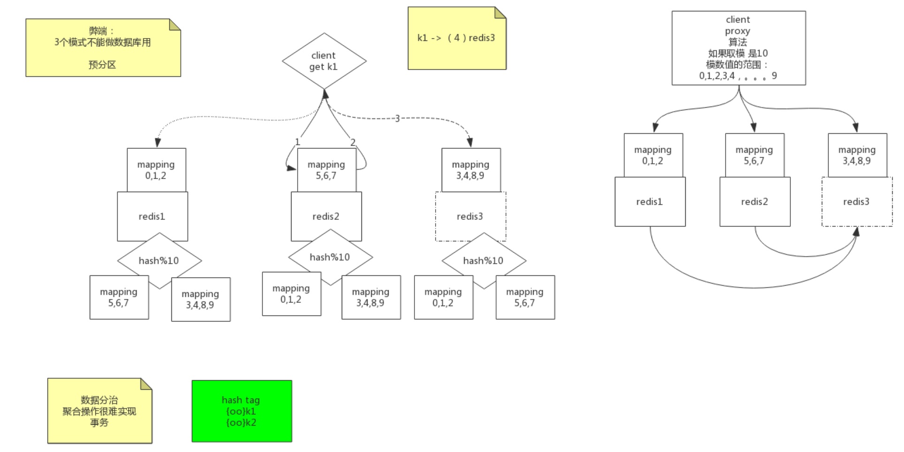
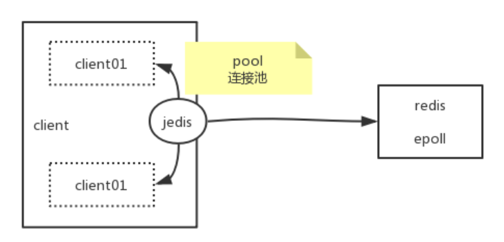
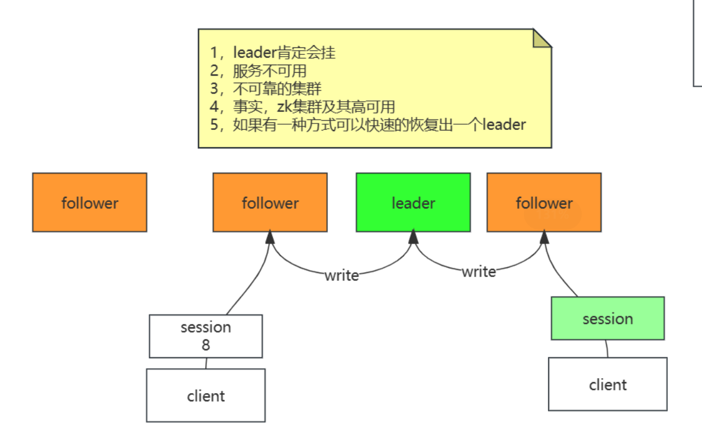
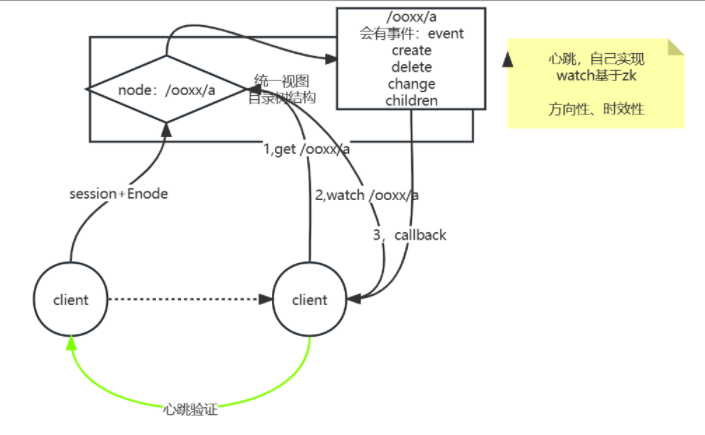

# 高并发、负载均衡

## 网络协议原理

资产-->营销--->高的并发量

假设现在实现了高并发（黑盒）。每次访问有一个日志，通过日志得到用户的ip、uri、用户从何而来。有**用户从何而来**的信息我们可以知道各个渠道带来的流量。进而在有了消费记录之后我们可以知道从哪里来的流量购买的多，也就是可以得到每个渠道的转化率、购买力。

转服务行业 --- service

最终还是落到讲技术

网络。4层(TCP/IP 协议)？7层（OSI参考模型）？

分层的好处，方便去维护，每一层只需要保证对外的接口不变即可。


TCP/IP 可以认为是OSI理论的具体实现。会话和表示被缩到了应用层。


- 第一步建立连接
- 第二步才是传送数据(http协议：规范标准。写错了不行)

```
[root@iZuf60yyfby12gcwrfeb09Z ~]# cd /proc/$$/fd  进入系统进程目录 $$为解释程序的进程id  fd为文件描述符
[root@iZuf60yyfby12gcwrfeb09Z fd]# ll
total 0
lrwx------ 1 root root 64 Nov  6 15:55 0 -> /dev/pts/0		输入
lrwx------ 1 root root 64 Nov  6 15:55 1 -> /dev/pts/0		输出
lrwx------ 1 root root 64 Nov  6 15:55 2 -> /dev/pts/0		报错
lrwx------ 1 root root 64 Nov  6 15:56 255 -> /dev/pts/0
[root@iZuf60yyfby12gcwrfeb09Z fd]# exec 8<> /dev/tcp/www.baidu.com/80		创建一个文件8，有输入输出两个方向   
[root@iZuf60yyfby12gcwrfeb09Z fd]# ll
total 0
lrwx------ 1 root root 64 Nov  6 15:55 0 -> /dev/pts/0
lrwx------ 1 root root 64 Nov  6 15:55 1 -> /dev/pts/0
lrwx------ 1 root root 64 Nov  6 15:55 2 -> /dev/pts/0
lrwx------ 1 root root 64 Nov  6 15:56 255 -> /dev/pts/0
lrwx------ 1 root root 64 Nov  6 15:58 8 -> socket:[122723]		得到一个socket，和百度建立起了通信

-e选项：把\n变成换行符	echo：打印		>& 8：把东西重定向到8	&代表这个不是文件	'...'：请求头最小写法
[root@iZuf60yyfby12gcwrfeb09Z fd]# echo -e 'GET / HTTP/1.0\n'  >& 8
标准输入0来自文件描述8
[root@iZuf60yyfby12gcwrfeb09Z fd]# cat 0<& 8
	。。。连接时间太长，这里没反应
^C
[root@iZuf60yyfby12gcwrfeb09Z fd]# ll
total 0
lrwx------ 1 root root 64 Nov  6 15:55 0 -> /dev/pts/0
lrwx------ 1 root root 64 Nov  6 15:55 1 -> /dev/pts/0
lrwx------ 1 root root 64 Nov  6 15:55 2 -> /dev/pts/0
lrwx------ 1 root root 64 Nov  6 15:56 255 -> /dev/pts/0
lrwx------ 1 root root 64 Nov  6 15:58 8 -> socket:[122723]

关闭socket
[root@iZuf60yyfby12gcwrfeb09Z fd]# exec 8<& -
[root@iZuf60yyfby12gcwrfeb09Z fd]# ll
total 0
lrwx------ 1 root root 64 Nov  6 15:55 0 -> /dev/pts/0
lrwx------ 1 root root 64 Nov  6 15:55 1 -> /dev/pts/0
lrwx------ 1 root root 64 Nov  6 15:55 2 -> /dev/pts/0
lrwx------ 1 root root 64 Nov  6 15:56 255 -> /dev/pts/0
重新开启，重新来一遍
[root@iZuf60yyfby12gcwrfeb09Z fd]# exec 8<> /dev/tcp/www.baidu.com/80
[root@iZuf60yyfby12gcwrfeb09Z fd]# echo -e 'GET / HTTP/1.0\n'  >& 8
[root@iZuf60yyfby12gcwrfeb09Z fd]# cat 0<& 8
成功拿到
HTTP/1.0 200 OK
Accept-Ranges: bytes
Cache-Control: no-cache
Content-Length: 9508
Content-Type: text/html
Date: Sun, 06 Nov 2022 08:02:40 GMT
P3p: CP=" OTI DSP COR IVA OUR IND COM "
P3p: CP=" OTI DSP COR IVA OUR IND COM "
Pragma: no-cache
Server: BWS/1.1
Set-Cookie: BAIDUID=FBC60CA0C9F3A24AC98DC6C3291EA8DF:FG=1; expires=Thu, 31-Dec-37 23:55:55 GMT; max-age=2147483647; path=/; dom
Set-Cookie: BIDUPSID=FBC60CA0C9F3A24AC98DC6C3291EA8DF; expires=Thu, 31-Dec-37 23:55:55 GMT; max-age=2147483647; path=/; domain=
Set-Cookie: PSTM=1667721760; expires=Thu, 31-Dec-37 23:55:55 GMT; max-age=2147483647; path=/; domain=.baidu.com
Set-Cookie: BAIDUID=FBC60CA0C9F3A24AA5255C6FA852DA13:FG=1; max-age=31536000; expires=Mon, 06-Nov-23 08:02:40 GMT; domain=.baiduversion=1; comment=bd
Traceid: 166772176006356864106433202826370069803
Vary: Accept-Encoding
X-Frame-Options: sameorigin
X-Ua-Compatible: IE=Edge,chrome=1

```

三次握手>数据传输>四次分手，称为一个最小粒度，不可被分割。

TCP/IP基于下一跳的传输方式。目标IP先和Genmask按位与运算要和Destination匹配，走匹配的Geteway。可以发现无论你要到哪里，目标ip和下面的第三行Genmask按位与运算一定可以得到Destination是0.0.0.0。所以192.168.8.2就是默认网关。但是我们如何把数据给到下一条呢？就需要链路层了--mac地址。mac地址对应的是具体的一个网卡设备。数据包最外层是mac地址，再往里是IP地址，是目标主机的地址，再往里就是端口号。在源主机和目标主机之间的结点传输过程中，只有mac地址会改变。

结论：tcp/ip协议是基于下一跳的机制：ip是端点间、mac地址是结点间的。


## LVS的DR,TUN,NAT模型推导

计算机1和计算机2要通信，简单组网直接靠交换机就连起来了。要想上网的话需要买一个路由器，路由器自带交换功能，可以认为路由器集成了交换机的功能。再来另一个网络，计算机3和计算机4也通过交换机连起来。计算机1~2看成一间教室，计算机3~4看成另外一间教室。

路由器有两个网卡，一个网卡归属于一个网络。如果计算机1要和计算机4通信。一开始计算机1的apr-a这个表是空的，那么里面的条目是如何出现的？这时候需要用到arp协议。此时计算机1把数据包的事情停掉，因为现在它还没有mac地址。这个时候计算机1会先去单独发一个数据包，这个数据包基于arp协议。那么这个时候我们还是需要ip地址和mac地址，mac地址是什么呢？目标mac地址是特殊的mac地址--全F。目标ip是192.168.1.1。现在把这个包发出去，交换机看到全F，这个包会被广播。只有目标地址和包的目标地址匹配的时候结点才会响应这个包。这个时候路由器发现来的包的协议是apc，此时它需要做一件事：把自己的mac地址包发回去。发回去的数据包的mac地址就是计算机1的mac地址，目标ip地址也是计算机1的ip地址。然后路由器也把这个数据包发给了交换机。交换机有一个学习能力，要学习交换机端口到mac地址的映射。计算机1发数据包来的时候，进了交换机的某一个端口，此时交换机收集到了计算机1的mac地址。之后路由器发回数据包的时候目标的mac地址也是计算机1的mac地址。计算机1的mac地址在之前就已经被交换机学习过了。这个时候交换机就知道要从之前的那个端口转发出去。数据包到了计算机1之后，这个时候计算机1就学习到了一条ip到mac地址的映射记录。这样一来计算机1既知道下一条是192.168.1.1又知道它的mac地址。


说了这么多的网络，最后要回到我们的主题---负载均衡。如果你有一台tomcat，现在有很多的请求都来请求你这个tomcat。一台主机hold不住的话我们有一种解决思路就是多来几个tomcat服务器。这是粗粒度的负载均衡。但是这个时候你对外的ip地址分给这几个tomcat服务器中的谁都不合适。

所以我们中间加一层来接收所有的流量，并且均衡的转发到我们几台tomat主机上。

tomcat也好、nginx也好，都是应用层的。所以决定了他们的速度不会很快。那么如果我们中间的那一层东西如果层次可以降低一下，只做数据包级别的转发，这样少走了几层网络通信协议，会比tomcat和nginx快。这和反向代理不一样，反向代理需要建立握手，但是这里没有握手。

如果要解决高并发、实现负载均衡的话，就通信这个层次，我们找到了一种解决方案。中间的负载均衡不要和客户端握手。只是可以偷偷的看一眼端口号。


所以这种负载均衡器很快。 是数据包转发级别的，不会和客户端握手。由于是数据包级别的，所以后端的服务器必须长得一模一样，因为这个负载均衡器不会去管你的数据包的内容，他不知道客户端发了什么uri，要去哪里访问。所以服务器不能不一样--必须是镜像的。但是nginx是这样做到后面的服务器不一样的，因为nginx是应用层的，它可以知道客户端发的uri。这是这两种负载均衡吃策略的不同。可以知道nginx的并发是有上限的，然而四层的负载均衡的并发量会比nginx大很多。

所以一般来说最前端都是LVS来hold住流量，然后再准备一层nginx来hold住握手，收到所有的请求之后nginx再转到后面的tomcat。

如果把server想成百度，百度对外不可能有两个地址，所以要通过之间的一个虚拟IP来访问百度。进入到我们四层的负载均衡服务器之后，要从后面的分发（Dispatcher）IP---出去，发到真实的IP。

无论你有没有加服务交互服务器对于客户端来说都是透明的。


客户端只知道百度外面给的一个虚拟ip，然后去访问了我们的负载均衡服务器，接着负载均衡服务器如果原封不动的把数据包发给tomcat的话，数据包是会被丢弃的，因为客户端发送的数据包的目标地址是VIP而不是RIP。有一种解决方案是用NAT。

接下来要补充NAT的知识点，NAT一般出现在路由器上。假设家中有两台设备，ip地址分别为192.168.1.8以及192.168.1.6。路由器里面还包含了交换机，上面有几个网口就可以接几个设备。运营商发的那个6.6.6.6的ip地址是公网地址，192.168.1.1是内网地址。

如果这个时候内网的两个设备的同一个端口都要对百度发起请求，把源ip换成公网ip，源端口保持不变，那么这个时候会出现转发出去的请求是一样的，这样百度发回来响应的时候响应也是一样的，没有办法区分要发给1.8还是1.6。所以这里路由器就需要有一张表把请求的原地址的端口也换一下，然后记录下来，具体是那个内网ip的哪个客户端对应着。

S-NAT：源NAT,修改的是源地址


那么看下图，由于tomcat那里需要的请求是RIP，所以负载均衡服务器在转发的时候可以修改目标地址，将VIP换成RIP，这个转化目标的IP叫做DNAT-目标地址转换协议。这样包就发到了tomcat服务器上。最后tomcat服务器需要给客户端返回。也就是RIP需要返回给CIP，但是如果RIP直接给CIP，CIP是不会认的，因为CIP只记得发了一个CIP->VIP，不知道还有CIP->RIP。那么这个时候就还需要一次源地址的变换。源地址就只有我们的负载均衡服务器知道，所以tomcat服务器就需要再把这个返回的数据包丢给负载均衡服务器，然后负载均衡服务器修改了源地址之后在发回给CIP，CIP就会认了。

DNAT有一个弊端，一来一回的数据载量是不一样的。一般来说请求的数据包大小和响应的数据包大小都是不一样的，上行和下行的速度不一样。因为我们来回都需要经过负载均衡服务器，所以负载均衡服务器的带宽成为了系统的瓶颈。进行地址的转化需要消耗算力。


那么我们如果解决掉这个下行的瓶颈？有这个瓶颈的原因是我们的响应需要经过负载均衡服务器导致的。我们有没有办法让响应直接发回给客户端？这个时候我们就不能使用NAT模式了，因为使用了NAT就意味我们需要回溯。无论你后面做了什么变化，客户端都不知道，它仍然发送的是CIP->VIP。所以回去的包也只能是VIP->CIP。因为现在不靠负载均衡服务器来转化成VIP了，此时服务器要想返回源地址正确的包，服务器本身就要有VIP这个本地的ip地址。

这在实际生产中是合理的，企业对外暴露一个VIP，然后企业内部的服务器当然也可以知道这个VIP，那么服务器就可以把这个VIP藏在自己的内部但是并不对外暴露这个VIP。所以，如果有一种技术可以做到隐藏VIP，只有服务器自己知道这个VIP，全网除了自己没有人知道自己有一个VIP地址，这样客户端CIP->VIP就还是只会到我们的负载均衡服务器而不会来到tomcat服务器。由于现在tomcat中有了VIP，所以现在即使负载均衡服务器没有进行目标地址的转换，我们的tomcat也可以接受数据包了。

但是现在注意一个问题，我们现在只解决了从tomcat服务器到客户端的问题，但是没有解决负载均衡服务器到tomcat服务器的问题。tomcat服务器依然只接受目标地址是RIP的。数据包是CIP->VIP，由于tomcat服务器是内部有VIP地址，所以首要的任务就是进入到tomcat服务器中。我们可以在负载均衡服务器对数据链路层做手脚，直接把目标的MAC地址改成RIP的目标地址即可。但是由于mac地址不能跨网络，所以我们的tomcat服务器和负载均衡服务器一定要同一个局域网。

这种模式叫做直接路由模式。Direct Route

VIP如何隐藏？其实就是对ARP协议做手术，别人发ARP请求过来，我就是不说，也不通告，这样周围的设备都不知道我有VIP。但是我自己是知道自己有一个VIP的。


DR模型的优点是速度快，缺点是物理位置被约束了

DNAT模型的优点是物理位置不会被约束，但是它速度慢

所以下面我们引出第三种模型：隧道模型。它取了上面两种模型的优点做了折中

看下图，我们终于用上了之前没有用的DIP，我们使用DIP->RIP背着CIP->VIP的包。这样可以看成一个隧道，把CIP->VIP的包送到了目标RIP。隧道可以解决物理位置限制问题。


了解了上面的三种模型，回到最开始，负载均衡到底有什么用？

```
LVS 是 Linux Virtual Server 的简写，即 Linux 虚拟服务器，是一个虚拟的服务器集群系统
```

负载均衡是把前面的并发给分治了，前面一堆的请求先走我的LVS，LVS均衡的转发给后面的几个服务器。

在我们的机器中有一个物理网卡和虚拟网卡。物理网卡是暴露给外面的，虚拟网卡只有内部知道，外部是不可见的。所以我们要配DR的时候，需要在real server 那里配置虚拟网卡，虚拟网卡里面配置VIP，这样内核就知道了有这个VIP，但是外界是不知道有这个VIP的。这样就做到了对内可见，对外隐藏。

要做到对外隐藏当然别人来访问你这里的VIP的时候，物理网卡不能告诉它。所以需要配置arp_ignore；当然还不能将自己告诉给别人，所以需要修改通告的级别 arp_annouce。

arp_ignore

​	0：你打电话给我，问我家人的电话，我不告诉你

​	1：你打电话给我，问我的电话，我可以告诉你

arp_annouce

​	0：这台主机上面的任何网卡的任何地址我都说出去。网卡--人、IP--电话。家里人的所有电话都说出去

​	1：只把我自己这块网卡的所有地址说出去。把我自己的电话都说出去

​	2：假设我的网卡配了两个IP地址，连了两个网咯。我只会向1网咯通报我只有1的地址，向2网络通报我只有2的地址。这样一来网络1不知道网络2，网络2也不知道网络1。只把我自己的某一个电话说出去。


所以我们需要修改内核的响应级别以及通告级别。以及需要把VIP配置在内部的虚拟网卡LOOP上。

调度算法就是LVS要把数据具体发给哪个服务器。直接看动态调度算法。lc： 谁的用的最少就用谁。那么负载均衡服务器怎么知道和谁连接了几次呢？把负载均衡服务器想象成具有偷窥的能力，什么是偷窥？就是只看不动手。看完客户端发来数据包之后它不动手，就只拿小本本记录一下。负载均衡服务器知道三次握手的第一次的包，但是由于第二次握手的包不一定会走负载均衡服务器（根据模型的不同会有差异）。但是无所谓，负载均衡服务器如果发现了三次握手的第三个包，那么就会给这个服务器的连接次数+1。同理，四次分手负载均衡服务器也是可以知道的。


LVS在LINUX内核模块的名称叫做ipvs，一般来说LINUX的发行版都自带，不需要自己去装，除非发行版故意剔除这个模块。但是我们有这个模块还不够，我们还需要一个和内核交互的接口ipvsadm，有了这个小程序之后对它下发指令，它会把你的指令翻译成底层调用内核，我们需要的参数就是传给这个小程序的。


-A的命令是入的命令，也就是外面的请求到什么ip什么端口才会被匹配


-a的命令出的命令，也就是前面被匹配的请求应该到哪个服务器去。


虚拟机给我们提供了一个虚拟网络，192.168.150.2。然后提供了虚拟主机，上面的虚拟网卡连接到了我们的虚拟网络上。

计算机上还有一块网卡，vmnet-8：192.168.150.1。然后还有一个windows的一个后台服务VMware-NAT,这个服务是192.168.150.2这个ip地址。上面的所有的虚拟主机的数据包都是发给这个后台程序的。然后再把数据包发到以太网本地连接，也就是windows自己的物理网卡。vmnet-8也是vmware虚拟出来的，为了windows也有一个网卡可以进入和虚拟机通信。


配置noded01暴露的接口。


node02和node03在配置接口之前要先去调整arp协议。


我们现在只改了一个接口，为了以后所有的接口都生效，现在我们去到all接口


继续修改


协议改完了之后才去动隐藏VIP的配置。注意这里不要加上/24。这是为了避免发生死循环，发不出去。


总结如下步骤：

```
LVS：

node01:
	ifconfig  eth0:8 192.168.150.100/24
node02~node03:
	1)修改内核：
		echo 1  >  /proc/sys/net/ipv4/conf/eth0/arp_ignore 
		echo 1  >  /proc/sys/net/ipv4/conf/all/arp_ignore 
		echo 2 > /proc/sys/net/ipv4/conf/eth0/arp_announce 
		echo 2 > /proc/sys/net/ipv4/conf/all/arp_announce 
	2）设置隐藏的vip：
		ifconfig  lo:3  192.168.150.100  netmask 255.255.255.255
		
RS中的服务：
node02~node03:
	yum install httpd -y
	service httpd start
	vi   /var/www/html/index.html
		from 192.168.150.1x

LVS服务配置
node01:
		yum install ipvsadm 
	ipvsadm -A  -t  192.168.150.100:80  -s rr
	ipvsadm -a  -t 192.168.150.100:80  -r  192.168.150.12 -g -w 1
	ipvsadm -a  -t 192.168.150.100:80  -r  192.168.150.13 -g -w 1
	ipvsadm -ln

验证：
	浏览器访问  192.168.150.100   看到负载  疯狂F5
	node01：
		netstat -natp   结论看不到socket连接
	node02~node03:
		netstat -natp   结论看到很多的socket连接
	node01:
		ipvsadm -lnc    查看偷窥记录本
		TCP 00:57  FIN_WAIT    192.168.150.1:51587 192.168.150.100:80 192.168.150.12:80
		FIN_WAIT： 连接过，偷窥了所有的包
		SYN_RECV： 基本上lvs都记录了，证明lvs没事，一定是后边网络层出问题
```


## 基于keepalived的LVS高可用搭建

回顾：基于nginx的反向代理是7层的，但是LVS是四层的。nginx有负载均衡的能力，但是它是七层的。


 

再来聊高可用。来看下图。我们可以发现整个公司的流量的入口是负载均衡服务器，由于是单点的，如果挂掉了，那么也代表着整个公司的业务下线了。除了负载均衡服务器会挂，后面的real server也可能会挂，但是负载均衡服务器还是会响挂掉的服务器进行负载，这样会导致有一部分的请求就连不通了。所以会造成一部分人的业务不正常。下面的主要任务就是解决这两个问题。


单点故障的一个解决方法就是一变多，但是这里我们对外只能提供一个vip，所以我们就准备一台主要的机器，以及一台备用的机器---主备。那么如果是主主的话，由于对外只能提供一个vip，所以我们只能再次往前面追加一层，例如DNS。用的比较多的是主备。

其它的皇子怎么知道皇帝挂了？有两个方向：第一种，皇子们每隔一会就去皇帝身边看一眼皇帝挂了没，也就是备机去轮训的问主机挂了没。如果有三五台备机每隔一段时间就去问主机挂没挂，主机响应这些备机。那么主机既要接收客户端发来的请求包也要接收备机发来的心跳包。这样对主机或多或少会有些压力。第二种，皇帝每天上朝，只要皇子看到皇帝今天上朝了，就说明皇帝还活着。所以在网络中是由主机周期性的向外发送一个广播包，发给了所有的的备机，如果收到了就认为主还活着。但是由于网络是有不确定性的，只有发现皇帝三天没有上朝了，皇子才会揭竿而起，也就是说会有重试机制。

效率性：如果主挂了，那么多的备机选谁上呢？我们可以给定一个权重值，这样备机中选谁上这件事就变成了一个推让制，而不是一个争抢制，这样会更有效率。

主备是只有主在干活，只有主挂了的时候备机才会顶上。主从是有主有从，主和从都会有事情做，所以在主从中的这个主也会出现单点问题，所以对这个主也进行一下主备。

截止目前我们解决了LVS会挂的问题。还要解决RS挂了的问题。RS挂了怎么确定？举一个具体的例子，百度挂了你怎么知道？ping肯定是不行的，因为ping只是到了网络层。所以要贯穿到应用层我们才能知道百度挂没挂，所以我们需要用http协议实际访问一下。

按照上面说的，我们要主机告诉自己还活着，这是一个新功能，所以我们可以直接修改ipvs内核模块的源码。修改内核代码是一个方法。另一种方法是使用第三方实现。第三方就是用人去监视，但是人不靠谱，企业追求的是自动化，把人解耦出去---用程序。如果有一个程序可以代替人，可以监控服务的状态，可以向外发送它还活着。如果服务器可以在外偷听主机是否还活着，而这个程序还可以向后去检查RS的健康，发现RS有问题的时候就把条目剔除，如果好了就再加回来。这个程序就叫做keepalived，解决单点故障，实现高可用。

主的服务器上装keepalived，备机上也要装。keepalived在监控自己各自服务的状态，主向外说自己还活着，备机监听主还活着。

人还需要配置vip，添加ipvs，这些操作是我们手工去做的。我们可以把这些操作写到一个配置文件中，keepalived一启动就替你把这件事做了，这样就连你操作失误的概率都被规避了。所以keepalived是有配置文件的。除了这些事情，keepalived还需要对后端服务做健康检查。

keepalived是一个应用程序，是第三方的！

keepalived不止可以用于LVS,如果nginx作为负载均衡服务器来用的话，为了解决单点故障问题，同理可以使用keepalived。只要是1变多，有多台的时候都可以做这些事情。


上次留了node4没有用。由于我们要解决单点故障，所以我们使用node4来作为backup。看到node4下面配的ip是虚线，只有主机挂了的时候才换成实线。由应用层的keepalived来做健康的监测。


步骤如下：node2和node3还是和之前一样配置，但是node1要还原变成裸机，由keepalived帮我们配置即可。

进入到配置文件之后：

​	global_defs是全局配置

​	vrrp_instance VI_l是虚拟路由冗余协议的一个实例。里面有state MASTER，意思是说这台机器就是主机，如果MASTER变成了BACKUP那么就变成了备机了。interface eth0，在企业中可能有多快网卡，组了多个网络，每个不同的网络流动的数据类型是不一样的。将网络划分为不同的物理网络之后，数据不会影响到信号传输的时效，其中的一个网络坏了，另外一个还是可用的。这里interface eth0指定了后面走的都是eth0这块网卡。virtual_router_id是虚拟路由id，有两台keepalived的话需要在这里做区分。priority，权重值。下面还有权限认证。virtual_ipaddress也就是我们说的VIP，书写格式，例子`192.168.150.100/24 dev eth0 label  eth0:3`。主机写完之后从机基本不用变，只需把MASTE变成BACKUP。把权重变小即可。

​	virtual_server是虚拟服务，对应lvs中的vs。在real_server外面的相当于就是A，在real_server里面的就是-a。peisitance_timeout是为了防止用户在短时间内请求，已经有服务器对它有记录了，这个时候LVS就按照记忆，直接发回给之前的那个服务器，而不是直接去负载均衡。这里的HTTP GET 就是我们用来检查挂没挂的方式。

```
keepalived实验：
主机： node01~node04

node01:
	ipvsadm -C
	ifconfig eth0:8 down

----------------------------
node01,node04:
	yum install keepalived ipvsadm -y
	配置：
		cd  /etc/keepalived/
		cp keepalived.conf keepalived.conf.bak
		vi keepalived.conf
			node01:
			vrrp：虚拟路由冗余协议！
				vrrp_instance VI_1 {
					state MASTER         //  node04  BACKUP
					interface eth0
					virtual_router_id 51
					priority 100		 //	 node04	 50
					advert_int 1
					authentication {
						auth_type PASS
						auth_pass 1111
					}
					virtual_ipaddress {
						192.168.150.100/24 dev eth0 label  eth0:3
					}
				}
			virtual_server 192.168.150.100 80 {
				delay_loop 6
				lb_algo rr
				lb_kind DR
				nat_mask 255.255.255.0
				persistence_timeout 0
				protocol TCP

				real_server 192.168.150.12 80 {
					weight 1
					HTTP_GET {
						url {
						  path /
						  status_code 200
						}
						connect_timeout 3
						nb_get_retry 3
						delay_before_retry 3
					}   
				}       
				real_server 192.168.150.13 80 {
					weight 1
					HTTP_GET {
						url {
						  path /
						  status_code 200
						}
						connect_timeout 3
						nb_get_retry 3
						delay_before_retry 3
					}
				}
			scp  ./keepalived.conf  root@node04:`pwd`
```

两台机器都配置完成之后，把服务跑起来。


备机的vip没有配置，但是后面的内核以及对应的-a-A的配置都已经配置好了，因为它只是对外不提供服务，但是还需要对后端进行健康的检查，来做到在第一时间可以顶上主机提供服务。如果主挂了，备机会顶上。如果主好了，那么主会抢回去。只是这里的主会抢回去，会不会抢回去取决于不同的技术。


如果keepalived异常退出来，例如kill -9 ，那么会导致它配置的网卡以及RS都没收回。此时由于keepalived已经死了，那么就不会向备机说它还活着，那么就会导致备机就顶上了。那么此时互联网上两台主机都配置了vip。那么此时客户端发送的数据包会出现混乱，也就是它发出去的数据包会负载给不同的服务器。那么我们之前为了解决单点问题引入了keepalived，但是keepalived可以看到，它自己本身也不是可靠的。我们不能陷入无限循环的陷阱，不能再来引入一个守护进程的守护进程。我们可以把keepalived做成一个高可用的集群，这样就可靠了。

# Redis

## 介绍

常识：

1. 磁盘比内存在寻址上，慢了十万倍。
2. IO buffer：一个扇区装512字节，如果磁盘的容量越大，那么所需要的索引就越多。一般来说操作系统一次都读出4k

如果数据存在文件里,如果在linux里面，有grep以及awk这样的命令。也可以使用java写一个基于io流读取查找的程序。随着文件的变大，速度肯定会慢下来，因为硬盘的IO成为了瓶颈。但是如果你把这个数据文件分成1个1个的4k，那么我们就可以对这些4k进行编号。这些4k刚好符合磁盘的一次IO。进行了编号之后就可以建立索引，B+树，就可以进行提速。

数据库建表的时候要给出模式，这样一来一行中有几列，每一列占几个字节都定死了。也就是你往数据库里面填入一条记录，就算这个记录只有一个字段，也会占用一整行。其它没有用到的列就先空着。这样就是行级存储。行级存储的好处就是以后在增删改的时候就不需要移动，直接在对应的位置填入即可。

磁盘的速度慢，那么我们要速度快就要减少磁盘的IO。当数据库的表很大的时候，性能肯定会下降。但是当只有一个或者少量查询的时候，查询速度变化不大。但是当并发量大的时候，受到硬盘带宽的限制，速度就会变慢。

前面是基于磁盘的数据库，下面SAP有一个HANA数据库，这是一个内存关系型数据库。要知道数据在磁盘和内存的体积是不一样的。但是内存级别的数据库太贵了，买不起。我们能不能折中？搞一个缓存数据库。redis就是一个内存级的缓存数据库。

`https://db-engines.com/en/` 所有数据库引擎的信息都可以在这里获取

`redis.io` redis的官网


下面说的很多数据类型指的是value的类型。为什么memcache同样也是一个k-v类型的数据库，为什么被redis取代了，因为它的value没有类型的概念。但是即使它没有数据类型的概念，只要我能存String类型，我就可以用Json来存放对应的数据类型。所以redis到底优在哪里？如果客户端想通过一个缓存系统（k-v）取回value中的某一个元素。此时从json中取回一个元素，和**从list中取回一个元素**的成本就不一样了。如果是json，那么客户端就需要得到这一整个json，并且对这个json进行解码。这样一来浪费了很多的带宽。


其实redis的类型不是最重要的，重要的是它为每种类型提供了方法，这样就可以对value使用方法，从而取到这个value中的某一个元素。这样就节约了很多的带宽，客户端也不需要解析了。

计算向数据移动：使用memcache的时候我们的计算是发生在client端的；使用redis的时候计算发生在服务端，也就是redis。可以发现计算向数据移动了。


## 安装

1. 上`redis.io`官网。下滑，找到`Download Stack`。找到`download x.x.x`，右键复制获取下载链接，点击复制链接

   

   


```
#没安装过wget就先安装一下
yum install wget
#进入到安装目录，使用wget获取刚刚得到的链接资源
wget https://github.com/redis/redis/archive/7.0.7.tar.gz
#是源码安装，所以很小。进入到安装目录
cd redis-7.0.7/
#源码安装，第一件事看readme.md。告诉你要先make。如果中途失败了，要先make disclean。如果没有安装gcc要装一下
yum install gcc
make
#执行成功之后去到src目录下就有一些可执行程序了。我们可以手动执行redis server。但是这样人工干预太low了。我们在#readme中看到了在utils目录下有一个脚本，install_server.sh。但是我们还是按照readme的流程来走
make install PREFIX=/opt/wcx/redis7
cd/opt/wcx/redis7/bin/
#完成上个步骤之后，几个可执行的文件就跑出莱了，不再和以前的源码混在一起。我们还是可以直接./redis-server。但是我们#希望可以直接把reids弄成一个系统的服务。在这之前我们需要先将/opt/wcx/redis7/bin添加到PATH中，然后就可以执行#install_server.sh这个脚本了
进入到刚刚的utils目录
./install_server.sh

```

在一个机器上可以配置多个实例。每个实例用端口号区分。配置文件、日志文件、数据文件夹都是用端口号进行区分。


步骤如下


---

### 安装为服务


在/etc/systemd/system下面创建redis.service，内容如下。

- Type为forking不然会出问题
- /etc/redis/6379/redis.conf 这里的配置文件需要自己创建一下，然后conf里面需要把daemon配置为yes[128行]

```
[Unit]
Description=redis7
After=network.target

[Service]
ExecStart=/usr/local/redis/redis7/bin/redis-server /etc/redis/6379/redis.conf
ExecStop=/usr/local/redis/redis7/bin/redis-server --port 6379 stop
ExecReload=/usr/local/redis/redis7/bin/redis-server --port 6379 reload
Type=forking

[Install]
WantedBy=multi-user.target
```

```
systemctl daemon-reload
systemctl start redis
```


## 什么是epoll

小插曲：

下面这图看不清，拆成两个图来看


计算机有内核，内核接住很多的连接，所有的连接先到达内核。一个连接有一个文件描述符，进程可以用read来读文件描述符。socket在这个时期是阻塞的，socket产生的文件描述符，如果数据包没到，read命令就不能返回，也就阻塞着。抛出一个线程，读网卡的连接，有数据就处理，没数据就阻塞。抛出多个线程的话，由于只有一个cpu在一个时间片只能处理一个线程，cpu并不能及时处理到达的数据，所以有很多的资源浪费，这是早期的BIO时期，因为socket是阻塞的，所以叫做BIO。

B：blocking

上面那种方式，计算机硬件很难被利用起来。所以接下来内核发生了变化。

先安装所有的帮助页，man可以看命令的帮助文档，例如可以看ls的，ls的文档是1类文档。2类的文档是系统调用，例如read。read方法要传一个文件描述符fd (即file descriptor)。java是用obget来代表一个输入输出流对象，在linux系统里面不是面向对象的，它是一切皆文件，所以都是用文件来代表输入输出流。fd其实就是一个数值01234。,0是标准输入，1是标准输出，2是错误输出。

- BIO时期的socket调用是阻塞的


任何进程在操作系统里面都会有它自己的io对应的文件描述符。可以看到下面的01234文件描述符，可能还会有更多。


再去socket的说明文档里面看看。学java的时候我们可以用socket来开启连接。domain：域名。protocol：协议。type是什么？调用socket的时候会返回一个文件描述符。往下找到SOCK_NONBLOCK---这是非阻塞的意思。也就是fd描述符可以是nonblock，那么这样我们就可以只用一个进程，循环的去调socket看看有没有数据，由于非阻塞了，那么就可以去看下一个socket有没有数据。这样就是非阻塞的IO。同步是遍历和取出数据都是它自己来完成。这个时期是同步非阻塞时期NIO（nonblock IO）。但是此时如果有1000个fd，代表用户进程轮询调用1000次系统调用，成本很大。那么能不能减少系统调用的次数？由于此时我们的轮询发生在用户空间，要解决这个问题我们要求轮询发生在内核，也就要求内核自己去向前发展。

- NIO时期socket调用就可以不用阻塞了


把在用户空间轮询的事情扔给内核来做。内核里增加了一个系统调用select，这个时候用户空间，也就是进程就调用select。再去看看select的说明文档。ndfs：有多少个文件描述符。readfds：一个指针指向文件描述符的一个结构，这个是读得到方向的。还有写的方向的：writefds。还有一个报错：exceptfds。还有一个轮询时间timeout。


可以看到，select会帮助我们去查看一堆的fd，看看有哪个已经ready了。这样一来，进程拿着这些ready的fd就可以直接去read，就不会浪费时间在查看哪个fd已经准备好了，内核已经帮我们做了。内核发展使得用户空间的复杂度变低了。这样减少了内核态和用户态之间的切换。但是我们依然是同步的。现在这个技术是多路复用的NIO。

- 从用户进程一个一个循环的的去调用socket检查fd有没有数据了，变成有了一个新的系统调用select帮你一次性去检查有哪些fd有新数据了。省去了大量循环的系统调用的时间
- java内存中，堆是共享的，但是线程栈是独立的，线程的大小假如是1M。线程多了cpu需要调度，浪费资源；并且占用了很多内存。所以一个连接抛出一个线程的BIO方式肯定不好。所以才会有NIO，我最低只有一个线程或者几个线程就能做这件事情。所以这时候每一个线程可以hold住1000个连接，但是每一个连接要调用一次系统调用read，这个成本还是比较高。所以我们要把系统调用数减下去，使用一个系统调用select就可以帮我们检查这1000个连接，然后给你返回几个，你再去调用read、write去读写数据，这样系统调用的次数就减下来了。这个时候还是需要你自己解决数据的读入和写出的事情，read、write还是用户空间去调用的，这个时候叫做同步非阻塞。但是这样存在一个问题，每次调用到传1000个fd，然后你给我遍历一下，然后返回可以用的，我再去遍历可以用的，这样在传递数据的时候成本高。然后就引出了epoll的概念，epoll其实有3个调用。用户空间中可以create，在调用create可以返回一个epfd（epoll的文件描述符fd），未来用户空间有一个连接进来了就把连接写给epfd，epoll会准备一个共享空间，里面维护一个红黑树。1000个连接以前是全部传给select，现在就是通过epoll先注册进红黑树，红黑树的增删改的操作是内核来完成的，查询两边都可以查。当你把连接注册写进了红黑树，用户空间有一个系统调用wait和ctl调到epoll上。ctl是可以往里面增或者删socket的文件描述符。调用wait等待一个事件，谁的数据到了，就把它放到那个链表中去。然后调用wait，就可以从阻塞变成不阻塞取那个链表，把实际到达的文件描述符给你，然后由于用户空间是共享的，你自己单独去调用read去读数据。所以epoll也叫作nio，不叫aio。

```
select()  and  pselect()  allow  a program to monitor multiple file descriptors, waiting until one or more of the file descriptors become "ready" for some class of I/O operation (e.g., input possible).
```

但是现在我们还是得自己去调用read，还是有点麻烦。这时候我们引出了epoll。我们的进程是在用户空间的，里面放着的1000个fd的那些二进制数据。调用内核的时候需要传参，传过去就得有拷贝，传输的时候拷贝越少速度就越快。mmap可以解决这个问题，mmap可以做一个映射，进程依然把数据放在某一个地方，但是它可以把这个地方通过mmap做一个映射，让内核也可以到这个地方去读取数据，这样就可以减少拷贝，做到一个共享空间，这个空间里面放了一些数据结构来存放fd。进程通过epoll，多了一个fd就往红黑树里面放，然后进行系统调用就不需要拷贝，内核把ready的放到链表里，进程从链表中取出直接读取即可。

0拷贝是什么意思？还是在内核上做改进，多了一个系统调用sendfile。我们要把一个在系统里的file.txt从网卡发出去，一般的做法就是先read出来到进程里面，然后在write出去，需要有一个拷贝的过程。如果直接调用sendfile的话就可以不需要这个拷贝的过程，直接读出来到缓冲区里面然后直接发出去。

可以看到sendfile和mmap是不一样的。sendfile如果加上mmap可以组件一个高效的技术kafka。网卡的数据来，来的数据走kafaka，kafka是基于jvm的一个进程，然后走mmap，然后挂在到你的文件，由于是共享空间，kafka往里面写了东西，内核也是看得到了，这样就可以减少拷贝。从用户空间到内核空间减少了拷贝的过程。现在消费者要来拿数据，就是走的零拷贝了，sendfile的输入来自于文件，输出来自于消费者。


---

## redis为什么快

假设有一个机器是linux操作系统，上面有多个redis。由于redis是单进程单实例的，当并发到来的时候，如何变得很快？操作系统linux是有内核的概念的。客户端的所有连接是先到达内核的，会有很多的socket，redis和linux内核之间走的是epoll这样一种非阻塞的多路复用的技术，epoll是系统提供的系统调用。

redis为什么快，redis是单进程，所以用了epoll，客户端来的数据用epoll放到了共享区。所有的数据到来是有顺序的，因为redis是单进程，这里顺序的意思是到来的数据会挨个挨个的处理。所以要处理事务的话就要再往前面的业务端去控制。要保证事务的话，对于同一个key的增删改查要让一个线程一个连接去发出来，而不是负载到多个。和kafka类似。

nginx要满足多少颗cpu启动多少个worker进程。一个worker就可以把数据压到cpu的1,2,3级缓存，有多少个cpu就有多少个nginx进程，每个woker进程使用的是多路复用epoll。只有windows才有aio，linux没有aio。


redis会有很多客户端的连接进来，对于对于系统来说就是socket连接很多。redis是一个进程，可以调用epoll来遍历寻找这里面的socket中有哪个数据发来了。处理用户对数据的操作是redis里面的一个线程完成的。但是它可能有别的线程在做别的事情，这个事情可能和你的数据没有关系。所以一般来说就说redis是单进程单线程来处理用户的请求。这样的单进程单线程来处理用户的请求有一种好处就是会有顺序性，这里是顺序是指每连接内的命令顺序，也就说如果是两个连接都对同一个key进行了操作，那么谁先谁后就不确定了。但是如果一个连接自己是单线程控制好了命令的顺序，那么redis就可以保证命令是正常执行完毕的。你在做负载的时候，或者在做业务流的时候，要尽量把相同的东西打到一个结点上去，和kafka一样，为了保证一个资源的顺序，虽然顺序可能有时间差，在一个分区里放对于一个key的所有操作，他们到达的先后顺序是可以保证的。 

- select和epoll的区别：用户空间调用select，你要给它1000个文件描述符。如果是epool的话你需要调用一次wait，等就行了。

  select在每次循环的时候都要压进1000个文件描述符，然后你再告诉我这1000个有多少个能读的，我再去读。

  epool就是来一个连接就压一个，也就是1000个文件描述符只需要压1000次即可，然后调用wait，当有数据来的时候，能读的就进入到队列中，wait就不阻塞了，开始read这些可以读的。select如果1000个文件描述符会重复压入。

  netty用的就是epool的方式

- 这么多客户端往redis发东西的时候，这里只有一个线程，在处理的时候就可能会有排队等待的问题。但是因为内存寻址的时间是纳秒，socket对应的是网卡，寻址时间是毫秒，中间相差了10万倍。除非有10w个连接在同一个时刻到达，这时候可能会造成秒级的响应。因为内存的寻址时间是纳秒级别的，就在内存中移动，也没有磁盘io发生，redis就单一个线程，epool还是用户空间和内核共享内存的，等于某个文件描述符有了之后我就调用epool，直接去读进文件描述符。手里还知道你下一个文件描述符是谁，因为共享内存，直接去把下一个文件描述符读进来。这样一看所有通信的距离是很少的，

- 如果是走的linux中的redis客户端，那么可以达到15万级别。如果走的是网卡，那么就只有六七万的级别。

- linux操作系统中可以有多个redis实例，一个redis实例中会有0~n多个相互隔离的库，一个库下存的是键值对。key其实是一个对象，除了key自身的名字之外，还有type类型，以及encoding。type类型可以提前规避某些错误的操作，例如对string类型做list类型的操作，快速返回你这个命令执行错了，不需要真的去执行操作。encoding也是类似，只不过是对于同类型做某些操作可以免去异常的检查，实现加速。例如string类型的encoding有int和embstr，如果这个key之前的encoding就是int类型，那么你拿它做加法，redis就不会去检查能不能加，速度就会很快。如果你拿的key的encoding是embstr的话，你拿它做加法，redis就会去做一次检查。


## 类型

下面来看redis的使用。

1. 在redis中默认是16个库（0~15），这个类似于MySQL中可以自己建立数据库，每个数据库的表是独立的。-n这个选项就是用来选数据库的。通过-n 加上库的序号就可以直接连接进去相应的库。如果已经进去了，要切换库，那么就使用`select 8`来切换到8号库，默认不加-n就是走的0号库。
2. -h和-p可以用来选择主机和端口号。

```
[root@aliyun 18:38:33 bin]# redis-cli -h
redis-cli 3.2.12

Usage: redis-cli [OPTIONS] [cmd [arg [arg ...]]]
  -h <hostname>      Server hostname (default: 127.0.0.1).
  -p <port>          Server port (default: 6379).
  ......
```

进入到客户端之后，利用help来看看怎么使用。告诉你help后面加上`@group`或者是`command`。也可以直接help然后按下tab键，他就会给你提示。并且tab键也有补全的功能。

```
[root@aliyun 18:38:36 bin]# redis-cli 
127.0.0.1:6379> help
redis-cli 3.2.12
To get help about Redis commands type:
      "help @<group>" to get a list of commands in <group>
      "help <command>" for help on <command>
      "help <tab>" to get a list of possible help topics
      "quit" to exit

To set redis-cli perferences:
      ":set hints" enable online hints
      ":set nohints" disable online hints
Set your preferences in ~/.redisclirc
```

generic代表通用组。全局的配置

```
127.0.0.1:6379> help @generic
```

见名知意，看解释。

1. DEL key [key ...]

   删除一个key

2. EXISTS key [key ...]

   判断key是否存在

3. EXPIRE key seconds

   给出key的存活时间。和内存优化有关

4. KEYS pattern

   pattern是一个描述，看看符合这个描述的key有哪些。

5. MOVE key db

   将一个key移动到另一个数据库

6. OBJECT subcommand [arguments [arguments ...]]

   查询自身的obj定义

7. PERSIST key

   将你定义为要过期的key设置为持久的

8. TYPE key

   输出某个key的类型

```
127.0.0.1:6379> help @generic 

  DEL key [key ...]
  summary: Delete a key
  since: 1.0.0
 
 ......
```

FLUSHDB：清空当前的数据库

```
127.0.0.1:6379> keys *
1) "backup4"
2) "backup3"
3) "backup2"
4) "backup1"
127.0.0.1:6379> FLUSHDB
OK
127.0.0.1:6379> keys *
(empty list or set)
```

上面是通用组。我们知道redis还有五种基本的类型`string/list/hash/set/sorted set`。

### String

```
[root@aliyun 15:38:24 ~]# redis-cli
127.0.0.1:6379> help @string

  APPEND key value
  summary: Append a value to a key
  since: 2.0.0
  ......
```

库分好了之后，下面是key，key有一个指针指向value，value有五种类型。

string就是其中一种类型，string你要把它想成是byte，string类型还有关于字符串的操作，还有基于数值和位图的操作。

- linux操作系统中可以有多个redis实例，一个redis实例会有多个库（0,1,2,3...），一个库下面存的都是键值对。key其实是一个对象，除了key自身的名字之外还有它的type类型以及encoding，type用来快速判断一个key是否具备某种操作，从而可以快速的判断一个命令是不是错了，不需要拿数计算报异常。


value类型丰富，string类型就至少可以面对三种场景。下图分开看


#### 字符串


- key没有类型的区分，只有value才有

有哪些操作：

```
127.0.0.1:6379> set k1 hello
OK
127.0.0.1:6379> get k1
"hello"
```

NX:只能新建，不存在的时候才设置。使用场景：分布式锁，一堆人拿着一个redis来做一个参考，他们都想删一个文件。一堆人拿着多个连接对一个单线程的redis发起`set k1 ooxx nx`谁成功了谁就拿到锁，剩下的人都返回失败。

XX:只能更新，也就是只有当那个key存在的时候才能操作成功。

```
127.0.0.1:6379> help set

  SET key value [EX seconds] [PX milliseconds] [NX|XX]
  summary: Set the string value of a key
  since: 1.0.0
  group: string
```

```
127.0.0.1:6379> set k1 wcx NX
(nil)
127.0.0.1:6379> set k2 wcx XX
(nil)
```

上面是单条的get、set，还有多笔的`mset`,`mget`

```
127.0.0.1:6379> mset k3 a k4 b
OK
127.0.0.1:6379> get k3
"a"
127.0.0.1:6379> get k4
"b"
127.0.0.1:6379> mget k3 k4
1) "a"
2) "b"
```

还有很多，自己可以去`help @String`。下面演示几个

APPEND

```
127.0.0.1:6379> get k1
"hello"
127.0.0.1:6379> append k1 " world"
(integer) 11
127.0.0.1:6379> get k1
"hello world"
```

GETRANGE

```
127.0.0.1:6379> get k1
"hello world"
127.0.0.1:6379> getrange k1 1 4
"ello"
```

- 正反向索引

  如果你有几个字符'h' 'e' 'l' ，正向和反向就想象成首尾相连的一个圆环即可。

  

  ```
  127.0.0.1:6379> GETRANGE k1 6 -1
  "world"
  127.0.0.1:6379> GETRANGE k1 0 -1
  "hello world"
  
  ```


SETRANGE

长了就全部覆盖，短了就覆盖部分

```
127.0.0.1:6379>  SETRANGE k1 6 WCX
(integer) 11
127.0.0.1:6379> GET k1
"hello WCXld"
127.0.0.1:6379>  SETRANGE k1 6 WCXyyy
(integer) 12
127.0.0.1:6379> GET k1
"hello WCXyyy"
```

STRLEN

```
127.0.0.1:6379> STRLEN k1
(integer) 12
```

对redis的基本使用有一个认知了。我们可以用用type来看某个key对应的value的类型是什么。每种value类型都会有相应的自己的方法，方法是和类型绑定的，如果你的客户端发出了一个非string类型的方法操作k1的话，redis不会真的发生发过来的那个方法，它只需要找到你那个类型，进行检查，不匹配就不能发生操作。


```
127.0.0.1:6379> type k1
string
```

所以key里面会有一个属性type，type描述的是value的类型。


我们知道set命令是string类型的，所以通过set设置的key对应的value都是string类型的，即使你通过set设置了数值。

```
127.0.0.1:6379> FLUSHDB
OK
127.0.0.1:6379> HELP SET

  SET key value [EX seconds] [PX milliseconds] [NX|XX]
  summary: Set the string value of a key
  since: 1.0.0
  group: string

127.0.0.1:6379> set k1 99
OK
127.0.0.1:6379> type k1
string
127.0.0.1:6379> set k2 wcx
OK
127.0.0.1:6379> type k2
string
```

KEY是一个obj，里面有表示它对应的value类型的字段type，以及encoding。

```
127.0.0.1:6379> help OBJECT

  OBJECT subcommand [arguments [arguments ...]]
  summary: Inspect the internals of Redis objects
  since: 2.2.3
  group: generic
```

发现，即使value类型都是string，但是string类型中encoding还分了str以及int。所以string类型还有数值的类型

```
127.0.0.1:6379> OBJECT encoding k1
"int"
127.0.0.1:6379> OBJECT encoding k2
"embstr"
```

K1的类型是string，但是encoding是数值类型，所以可以对它进行增加。

```
127.0.0.1:6379> INCR k1
(integer) 100
127.0.0.1:6379> get k1
"100"
```

所以面向字符串类型，除了一系列字符串的操作指令，还有一系列数值的操作指令。当然前面的针对字符串的操作还是可以用的。

```
127.0.0.1:6379> GETRANGE k1 0 1
"10"
```


#### 数值类型

- 计算向数据移动。凡是那些看似不是特别重要的数据、不需要特别精准的数据都可以用。不同的场景要进行不同的技术选型。`www.db-engines.com`
- 面向数值计算的场景：避免高并发下对关系型数据库的事务操作。哪些不需要特别精准的数据，可以交给redis来做。一个值在关系型数据库的表里面在并发的情况下肯定会触发事务。但是这个值如果挪到redis里面，因为redis本身就是单进程单线程，所有的请求，增删改查，计算发生在内存地址空间上面，它会比关系型数据库快很多。


加法

```
127.0.0.1:6379> INCR k1 
(integer) 101
127.0.0.1:6379> INCRBY k1 100
(integer) 201
```

减法

```
127.0.0.1:6379> DECR k1
(integer) 200
127.0.0.1:6379> DECRBY k1 100
(integer) 100
```

加浮点数

```
127.0.0.1:6379> INCRBYFLOAT k1 0.5
"100.5"
127.0.0.1:6379> INCRBYFLOAT k1 -0.5
"100"
```

可以发现不同的操作会让value类型是string的KEY的encoding发生变化。

```
127.0.0.1:6379> set k2 99
OK
127.0.0.1:6379> OBJECT encoding k2
"int"
127.0.0.1:6379> APPEND k2 9
(integer) 3
127.0.0.1:6379> OBJECT encoding k2
"raw"
127.0.0.1:6379> INCR k2
(integer) 1000
127.0.0.1:6379> OBJECT encoding k2
"int"
127.0.0.1:6379> INCRBYFLOAT k2 0.5
"1000.5"
127.0.0.1:6379> OBJECT encoding k2
"embstr"
```

下面引出**二进制安全**问题。

在redis进程与外界交互的时候，让别人通过socket访问它的时候，redis只拿出了字节流，并没有拿字符流。因为如果redis只存字节，没有按照按照某个编码进行转换的时候，也就是只要未来双方客户端有统一的编码解码数据就不会被破坏。

如果reidis自身除了value的类型type之外，要动encoding，因为不同客户端对类型的理解是不一样的。就像在多语言开发的时候我们更倾向于使用json、xml这种文本表示数据的方式来交互，而不是使用序列化，序列化需要增加编码器和解码器。如果编码器和解码器不一样，就可能发生类似溢出的错误。

redis作为一个中间件，为了安全，它只取字节流。所以就算redis知道“999”的encoding类型是int，它也不会按照int固定几个字节来编码。redis就是严格的把999分成三个字符三个字节，一个字节一个字节的编码。

increase和decrease的计算redis就把这些字节流从内存中取出，先转化成数值，转化成数值之后会先更新KEY中的encoding编码为int，代表这个key以后都是int类型了，下次如果要计算就可以直接拿出来往上加，就不需要担心报错的问题，也就是省去了判错的过程。

- redis中的encoding编码并没有影响数据的存储，数据是按照字节流存储的。

为什么下面的“中”字占了三个字节呢？原因是我们现在的xshell也就是客户端和redis的连接，字符编码是UTF-8，在UTF-8中，“中”字就是用三个字节来编码的。又因为redis是按照字节流来接收的，所以会出现这种情况。

可以尝试去把xshell的编码换成GBK，这样的话“中”字的编码就只占了2个字节。

```
127.0.0.1:6379> set k3 a
OK
127.0.0.1:6379> STRLEN k3
(integer) 1
127.0.0.1:6379> APPEND k3 中
(integer) 4
127.0.0.1:6379> STRLEN k3
(integer) 4
127.0.0.1:6379> get k3
"a\xe4\xb8\xad"
```

redis启动如果不带`-- raw` ，那么了它只显示ASCII码，之外的全部都按照十六进制来表示。

如果带了这个选项，那么redis会触发编码集格式化。但是即便你在`--raw`下，k3的长度还是不会变的。

```
127.0.0.1:6379> exit
[root@aliyun 15:52:07 ~]# redis-cli --raw
127.0.0.1:6379> get k3
a中
```

所以在使用redis的时候，一定要在用户端先沟通好数据的编码和解码。


GETSET命令返回的是旧值。这命令节约了成本，因为如果先get再set相当于在网络上发了两个包，两次的io请求。

```
127.0.0.1:6379> help GETSET

  GETSET key value
  summary: Set the string value of a key and return its old value
  since: 1.0.0
  group: string

127.0.0.1:6379> getset k1 wcxyyy
"hello"
```

MSETNX：设置多个值，只有设置的key不存在的时候才能设置成功。设置的多个key只要有一个失败了，其它全部失败。例如下面的k3其实是没有的，但是还是失败了。

- MSETNX是原子性的操作

```
127.0.0.1:6379> FLUSHALL
OK
127.0.0.1:6379> MSETNX k1 a k2 b
(integer) 1
127.0.0.1:6379> MGET k1 k2
1) "a"
2) "b"
127.0.0.1:6379> MSETNX k3 c k2 d
(integer) 0
127.0.0.1:6379> MGET k1 k2 k3
1) "a"
2) "b"
3) (nil)
```


#### 位图


还有很多关于bit的操作

字节offset和二进制位的offset看下图


这里的offset指的就是二进制位的offset。二进制中的value就是0或者1

```
127.0.0.1:6379> help SETBIT

  SETBIT key offset value
  summary: Sets or clears the bit at offset in the string value stored at key
  since: 2.2.0
  group: string
```

这里相当于把0000 0000 设置成了0100 0000。后者在ascii码中就是@。并且长度就是一个字节

```
127.0.0.1:6379> SETBIT k1 1 1
(integer) 0
127.0.0.1:6379> get k1
"@"
127.0.0.1:6379> STRLEN k1
(integer) 1
```

`man ascii `  查看

```
       Oct   Dec   Hex   Char                        Oct   Dec   Hex   Char
       ────────────────────────────────────────────────────────────────────────
       000   0     00    NUL '\0'                    100   64    40    @
       001   1     01    SOH (start of heading)      101   65    41    A
       002   2     02    STX (start of text)         102   66    42    B
       003   3     03    ETX (end of text)           103   67    43    C
       004   4     04    EOT (end of transmission)   104   68    44    D
       005   5     05    ENQ (enquiry)               105   69    45    E
       ......
```

下面例子充分说明了redis是基于字节流的。字符集是ASCII。

```
127.0.0.1:6379> SETBIT k1 1 1
(integer) 0
127.0.0.1:6379> SETBIT k1 7 1 
(integer) 0
127.0.0.1:6379> SETBIT k1 9 1
(integer) 0
127.0.0.1:6379> GET k1
"A@"
```

ASCII码第一个字符是0，后面可以变化。一旦发现不是0开头，而是1开头，那么就有可能会出现乱码，因为它会按照客户端的编码集尝试着去把不是0开头的按照当前客户端的编码集进行编码。


这里的start和end是字节的索引。

```
127.0.0.1:6379> help BITPOS

  BITPOS key bit [start] [end]
  summary: Find first bit set or clear in a string
  since: 2.8.7
  group: string
```

0~0字节上没有1,0~1字节上有。要注意，它返回是查出来的在二进制位中的位置，0,1,2....,8,...16中的位置，而不是在一个字节中排第几个。

```
127.0.0.1:6379> SETBIT k3 9 1
(integer) 0
127.0.0.1:6379> BITPOS k3 1 0 0
(integer) -1
127.0.0.1:6379> BITPOS k3 1 0 1
(integer) 9
127.0.0.1:6379> BITPOS k3 1 1 1
(integer) 9
```

BITCOUNT中的start 和end说的也是字节的起始和结束。做的是在给定的字节范围内给出位1的统计。

```
127.0.0.1:6379> HELP BITCOUNT

  BITCOUNT key [start end]
  summary: Count set bits in a string
  since: 2.6.0
  group: string
```

```
	//K4: 0001 0010  0100 0100
127.0.0.1:6379> BITCOUNT k4 0 0
(integer) 2
127.0.0.1:6379> BITCOUNT k4 0 1
(integer) 4
```

operation：位操作，与或非

destkey:存放操作的结果

```
127.0.0.1:6379> HELP BITOP

  BITOP operation destkey key [key ...]
  summary: Perform bitwise operations between strings
  since: 2.6.0
  group: string
```

A和B的与得到的是@，或得到的是C


```
127.0.0.1:6379> FLUSHALL
OK
127.0.0.1:6379> SETBIT k1 1 1
(integer) 0
127.0.0.1:6379> SETBIT k1 7 1
(integer) 0
127.0.0.1:6379> SETBIT k2 1 1
(integer) 0
127.0.0.1:6379> SETBIT k2 6 1
(integer) 0
127.0.0.1:6379> mget k1 k2
1) "A"
2) "B"
127.0.0.1:6379> BITOP and k3 k1 k2
(integer) 1
127.0.0.1:6379> BITOP or k4 k1 k2
(integer) 1
127.0.0.1:6379> mget k3 k4
1) "@"
2) "C"
```

位图的场景：如果公司有用户系统，需求是统计用户的登录天数。且窗口随机。例如在电商的网站中，在9.1~9.14的时间中a用户登录了几次。我们可以在MySQL中创建一张用户登录表，用户的每一次登录都产生一行记录，然后这个记录里面就有记录用户是在哪天登录的。这样存储的时候需要存储用户的id，因为MySQL是关系型数据库。表与表直接有一个关联关系，有主键与外键。单单是id就可能占了几个字节了。也就是一行记录，id占4个字节，日期占4个字节，一个用户的一次登录需要8个字节。当用户量很大的时候，查询的成本太高。如果一个用户一年登录200天，就需要8*200=1600个字节。

我们用redis的位图来优化，我们用一个字节来表示一周。要统计一个用户在某一个范围登录的天数，我们只需要用bitcount操作即可。不仅节省了空间，而且节省了时间。因为二进制位的计算在CPU中的计算是很快的。如果我们用关系型数据库，我们需要读磁盘，产生磁盘io，还需要做读回来的数据的编码解码，然后还需要参与一些计算，这些计算也不是二进制位的计算。

第二个场景：618送礼物，登录就送。我们需要准备多少礼物？目标就是统计出活跃用户，减少成本。需求依然是随意给出一个时间窗口，我们都能算出活跃用户有多少。利用redis，我们以日期为key，每个人占一位，登录了就占1。要统计人数就只需要把这几天的key按位or一下，然后统计一下结果的1有多少个即可。


### List

- 一提到list，想到了链表。单向链表，双向链表，有环的和无环的。有环的链表比较少，一般都是无环的双向链表。
- key中如果有指向链表头的指针head以及指向链表尾的tail的属性的话，这样可以快速访问list中的第一个元素和最后一个元素。

这些命令中，首字母如果带有L和R，有一部分是左右的意思。还有一部分是按类型作为首字母，例如L就是List的意思。

```
127.0.0.1:6379> help @list

  BLPOP key [key ...] timeout
  summary: Remove and get the first element in a list, or block until one is available
  since: 2.0.0
  ......
```

LPUSH，顾名思义，就是从左边开始放的，应该是d>c>b>a

RPUSH，a>b>c>d

```
127.0.0.1:6379> LPUSH k1 a b c d
(integer) 4
127.0.0.1:6379> RPUSH k2 a b c d
(integer) 4
```

LPOP，从左边弹出一个。

RPOP，从右边弹出一个

```
127.0.0.1:6379> LPOP k1
"d"
127.0.0.1:6379> LPOP k2
"a"
127.0.0.1:6379> RPOP k1
"a"
127.0.0.1:6379> RPOP k2
"d"
```

- 得出一个结论，从左边进，左边弹，描述的是一个栈。从左边进右边弹描述的是一个队列。

- 发现了redis中功能这么丰富以后，未来在程序中可以不用jdk中的api了，直接使用redis进行操作。

LRANGE:这里的L就不是左边的意思了，而是List的意思。运用之前的正负索引的知识，我们可以打印List中所有的元素。

```
127.0.0.1:6379> LRANGE k1 0 -1
1) "c"
2) "b"
```


LINDEX以及LSET分别是取值和设置修改。

下面的这些操作又和数组很像！

```
127.0.0.1:6379> FLUSHALL
OK
127.0.0.1:6379> LPUSH k1 a b c d
(integer) 4
127.0.0.1:6379> LRANGE k1 0 -1
1) "d"
2) "c"
3) "b"
4) "a"
127.0.0.1:6379> LINDEX k1 2
"b"
127.0.0.1:6379> LSET k1 2 wcx
OK
127.0.0.1:6379> LRANGE k1 0 -1
1) "d"
2) "c"
3) "wcx"
4) "a"
```

LREM，这个命令是移出你指定个数的元素，redis的list是不去重的。指定的个数如果是2，那么就移出前两个，如果是-2那么就移出后两个

LINSERT，这个命令是在指定的元素的前后插入一个元素。这里不是指定一个下标然后插入。而是指定一个元素值，然后在这个元素值的前后进行插入。如果list中有不止一个这个值，那么就在第一个这个值的前后进行插入。

- 当然，这两个命令中的L都是List的意思。

```
127.0.0.1:6379> LPUSH k3 a b c a d f a d a
(integer) 9
127.0.0.1:6379> LRANGE k3 0 -1
1) "a"
2) "d"
3) "a"
4) "f"
5) "d"
6) "a"
7) "c"
8) "b"
9) "a"
127.0.0.1:6379> LREM k3 2 a
(integer) 2
127.0.0.1:6379> LRANGE k3 0 -1
1) "d"
2) "f"
3) "d"
4) "a"
5) "c"
6) "b"
7) "a"
127.0.0.1:6379> LINSERT k3 before d a
(integer) 8
127.0.0.1:6379> LINSERT k3 after d a
(integer) 9
127.0.0.1:6379> LRANGE k3 0 -1
1) "a"
2) "d"
3) "a"
4) "f"
5) "d"
6) "a"
7) "c"
8) "b"
9) "a"
127.0.0.1:6379> LREM k3 -2 a
(integer) 2
127.0.0.1:6379> LRANGE k3 0 -1
1) "a"
2) "d"
3) "a"
4) "f"
5) "d"
6) "c"
7) "b"
```

这里的L也是list的意思

```
127.0.0.1:6379> LLEN k3
(integer) 7
```

去`HELP @LIST`看看，会发现还有很多B开头的命令

BLPOP，最后会加一个timeout，如果写0那么就会一直等待

```
CLIENT 1
127.0.0.1:6379> BLPOP k1 0
1) "k1"
2) "c"
(12.48s)
```

客户端1在BLPOP的时候，redis中还没有k1这个键。只有当客户端2的命令生效以后，客户端1的命令才会生效

```
CLIENT 2
127.0.0.1:6379> LPUSH k1 a b c
(integer) 3
```

所以综上，redis中的list类型还可以充当阻塞单播队列。

LTRIM，这个命令对index两端以外的元素进行移除

```
127.0.0.1:6379> LPUSH k2 a b c d e f
(integer) 6
127.0.0.1:6379> LTRIM k2 1 -2
OK
127.0.0.1:6379> LRANGE k2 0 -1
1) "e"
2) "d"
3) "c"
4) "b"
```

### Hash

哈希就是java中的map，是键值对的形式。因为redis本身就是k-v的形式，这里的hash相当于在redis的k-v中的v再放一个键值对。

如果面向一个用户，他有姓名，年龄，地址。每一个人都有这三个维度，让你使用redis存取的话，你怎么去设计。

第一种方案如下。这样的话我们需要向redis通信两次，因为第一次要通过keys命令得到相关的keys，然后再一次向redis发起通信，获取值。这时候我们就想，如果value可以是一个键值对就好了，这时候就引入了hash的概念了

```
127.0.0.1:6379> set jones::name jones
OK
127.0.0.1:6379> set jones::age 18
OK
127.0.0.1:6379> mget jones::name jones::age
1) "jones"
2) "18"
127.0.0.1:6379> KEYS jones*
1) "jones::age"
2) "jones::name"
```

可以发现，命令的命名上和String类型的命令的命名很像。只不过在前面加了H--hash。

```
127.0.0.1:6379> HELP @HASH

  HDEL key field [field ...]
  summary: Delete one or more hash fields
  since: 2.0.0

  HEXISTS key field
  summary: Determine if a hash field exists
  since: 2.0.0
  ......
```

命令和string很像，只不过前面加了H。

有了HGETALL，就可以做成一个json了。

```
127.0.0.1:6379> HSET jones name jones
(integer) 1
127.0.0.1:6379> HMSET jones age 18 address BeiJing
OK
127.0.0.1:6379> HGET jones name
"jones"
127.0.0.1:6379> HMGET jones age address
1) "18"
2) "BeiJing"
127.0.0.1:6379> HKEYS jones
1) "name"
2) "age"
3) "address"
127.0.0.1:6379> HVALS jones 
1) "jones"
2) "18"
3) "BeiJing"
127.0.0.1:6379> HGETALL jones
1) "name"
2) "jones"
3) "age"
4) "18"
5) "address"
6) "BeiJing"
```

还支持数值计算，就像String类型也支持数值计算一样。

```
127.0.0.1:6379> HINCRBYFLOAT jones age 0.5
"18.5"
127.0.0.1:6379> HGET jones age
"18.5"
```

注意：这里要减，就加上一个负数即可。并且，只能用浮点，因为之前的数已经是浮点的类型了，你不能用整型的方法。

```
127.0.0.1:6379> HINCRBYFLOAT jones age -1
"17.5"
127.0.0.1:6379> HINCRBY jones age -1
(error) ERR hash value is not an integer
```

数值计算的应用场景：redis是内存的数据库，所有对值的操作速度都很快，当你有了商品的详情页，客户端打开了一个页面，关于商品会有很多很多的信息，这时候客户端要请求这么多的数据的话，一笔请求，请求一个接口的时候，每个接口是都要访问一次数据库，还是说我给出`HGETALL jones`就可以拿到所有的k-v，然后给客户端返回，页面一刷新就出来了。这是第一种，数据整合，调用次数会变少。

第二个，数据都会变化，微博中有关于我这个人的关注，点赞。然后商品的详情页中有这个商品被浏览的次数，被收藏的次数，被加入购物车的次数。数据既要查询，有时候也要发生计算。Hash还能只能数值计算，还有一次取出很多数据的操作`HGETALL`。我们拿redis就可以解决这个问题了。

技术选型的时候，你可以选择document类型的，也可以选择k-v的。hash其实就是一种简单的document。只不过redis的values是hash，hash里面存的键值对`age 18`就死了，不能再分叉了。


### Set

list中的元素是可以重复的，并且是有序的，这里的有序指的是存入的和弹出的顺序，并不是排序。

set是一种去重的集合，并且也不排序，也不维护插入和弹出的顺序。它的最重要的功能就是去重。

平时在客户端尽量不要调用`SMEMBERS`这样的命令，因为会占用很多redis所在主机的网卡的吞吐量。这样的话这台主机上其它的redis请求可能就会变慢了。所以不光要知道redis中有什么功能，还要知道什么会影响性能。

```
127.0.0.1:6379> HELP @SET

  SADD key member [member ...]
  summary: Add one or more members to a set
  since: 1.0.0

  SCARD key
  summary: Get the number of members in a set
  since: 1.0.0
  ......
```

可以看到`A`不会重复添加。

```
127.0.0.1:6379> SADD k1 a b c d a
(integer) 4
127.0.0.1:6379> SMEMBERS k1
1) "d"
2) "b"
3) "a"
4) "c"
127.0.0.1:6379> SREM k1 c d 
(integer) 2
127.0.0.1:6379> SMEMBERS k1
1) "a"
2) "b"
```

还有求交集的功能。`SINTER`和`SINTERSTORE`的区别是一个会直接将结果打出来，一个是将结果存在另一个key中。`SINTERSTORE`这个命令好在可以省下io，否则客户端需要先拿到这些数据，然后再add成一个新的set。

```
127.0.0.1:6379> SADD k2 b c d
(integer) 3
127.0.0.1:6379> SINTER k1 k2
1) "b"
127.0.0.1:6379> SINTERSTORE k3 k1 k2
(integer) 1
127.0.0.1:6379> SMEMBERS k3
1) "b"
```

除了有交集以外，还可以求并集

```
127.0.0.1:6379> SUNION k1 k2
1) "d"
2) "b"
3) "a"
4) "c"
127.0.0.1:6379> SUNIONSTORE k4 k1 k2
(integer) 4
127.0.0.1:6379> SMEMBERS k4
1) "d"
2) "b"
3) "a"
4) "c"
```

还有差集。方向要自己控制！

```
127.0.0.1:6379> SDIFF k1 k2
1) "a"
127.0.0.1:6379> SDIFF k2 k1
1) "d"
2) "c"
127.0.0.1:6379> SDIFFSTORE k5 k1 k2
(integer) 1
```

所以set的集合操作用的是很多的。

set里面还有一个命令可以产生随机事件。

这里的count也有正负的概念。正的就是不重复，不一定会满足你给出的数量。负的一定会满足你给出的数量，但是可能会有重复。

有什么应用？抽奖。如果我有十个奖品，但是我的用户可能小于10或者大于10。而且用户中奖要分为重复和不重复。

除了抽奖，还可以解决家庭争斗。

```
127.0.0.1:6379> help SRANDMEMBER 

  SRANDMEMBER key [count]
  summary: Get one or multiple random members from a set
  since: 1.0.0
  group: set
```

假设一个场景，微博中你有很多的粉丝，你准备了三件礼物。这时候你把粉丝放到set里面，现在问题来到了是抽+3还是-3的概念了。如果是+3，那么就一定会返回去重的，这样就不会出现重复中奖的问题。但是如果是-3，就可能出现重复中奖的问题。

假设现在银行部门中的人要抽奖，抽购物卡，但是购物卡有很多面额，并且卡的数量也很多。但是部门的人相对就没这么多了。也就是中奖的人少，但是礼物很多。这里面还有规则：卡很多，有大有小，要设置一个抽奖的程序，尽量让每个人都多抽几张，均衡一下。加上了这个需求的话用redis就很难实现公平公正的效果了，这时候必然要手写一个程序，附加上各种的规则。

不谈这种暗箱规则，就按照redis，人小于礼物数的时候一个怎么抽？那么就用那个负数就行了

为什么可以解决家庭斗争问题？可以抽出一个名字来hhh

公司年会，抽奖，奖品少于去的人。每个人进门拿一个号。我们希望每次抽出一个人，然后这个人抽到以后就没他的事了。如果用前面的`SRANDMEMBER`，就没办法完成这件事情。因为这个命令不会对set进行增删改。所以还有另外一个命令`SPOP`，这个命令可以从set中取出一个元素，然后set中就再也没有这个元素了。


### Sorted Set

顾名思义，就是在set的基础上多了个排序。这里是序指的是排序。

想要将它们三个排序。可以有很多的维度，按字典序，含糖量等等。

sorted set在使用的时候有几个维度，首先是一个set，必须有元素。且这个set还是sorted，所以它还需要有一个维度，分值维度，如果不给出分值，那么谁也不知道他们应该怎么去排序。如果分值都为1，那么按照的是名称的字典序排。

除了分值维度，还有正负的索引。

所以sorted set的操作也就有三种，针对元素的、分值的、索引的。


可以看到，很多命令都是z开头的，因为s开头被set占用了，所以就拿了个z作为开头。还会有一些命令带有rev，代表的是逆序去取。

```
127.0.0.1:6379> help @sorted_set

  ZADD key [NX|XX] [CH] [INCR] score member [score member ...]
  summary: Add one or more members to a sorted set, or update its score if it already exists
  since: 1.2.0

  ZCARD key
  summary: Get the number of members in a sorted set
  since: 1.2.0
  ......
```

这里的`ZRANGE`是按照索引去取的。

```
127.0.0.1:6379> ZADD k1 6 apple 4 banana 8 tomato 1 potato
(integer) 4
127.0.0.1:6379> ZRANGE k1 0 -1
1) "potato"
2) "banana"
3) "apple"
4) "tomato"
127.0.0.1:6379> ZRANGE k1 0 -1 withscores
1) "potato"
2) "1"
3) "banana"
4) "4"
5) "apple"
6) "6"
7) "tomato"
8) "8"
```

还可以按照分值去取。

```
127.0.0.1:6379> ZRANGEBYSCORE k1 2 7
1) "banana"
2) "apple"
```

取出前两名和后两名。可以只用`ZRANGE`，也可以用rev。

但是要注意`ZRANGE k1 -2 -1`取出来的第一个是倒数第二名。但是`ZREVRANGE k1 0 1`取出来的第一个是倒数第一名。也就是说zrange出来的元素还是从小到大排的，但是rev出来的就是从大到小排序了。

```
127.0.0.1:6379> ZRANGE k1 0 1
1) "potato"
2) "banana"
127.0.0.1:6379> ZRANGE k1 -2 -1
1) "apple"
2) "tomato"
127.0.0.1:6379> ZREVRANGE k1 0 1
1) "tomato"
2) "apple"
```

这里的排名rank，是下标

```
127.0.0.1:6379> ZRANK k1 apple
(integer) 2
127.0.0.1:6379> ZSCORE k1 apple
"6"
```

还支持数值计算。会实时更新排名。

场景：热歌排名。歌曲可以是播放次数。一开始所有的歌曲的数值都是0。每当有一个人播放了一次歌曲，就把歌曲对应的数值+1。然后我们要取出top10，这个top10肯定是从大到小的，所以需要rev。

```
127.0.0.1:6379> ZINCRBY k1 3.5 potato
"4.5"
127.0.0.1:6379> ZRANGE k1 0 -1 withscores
1) "banana"
2) "4"
3) "potato"
4) "4.5"
5) "apple"
6) "6"
7) "tomato"
8) "8"
```

既然是一个set，那么肯定也有集合操作，并集，交集。但是就面临一个问题，加入两个集合都有apple，那么要把apple合起来，他们的分值如何处理。是加起来？取最大值？取最小值？权重如何？权重默认都是1。分值处理默认是sum。

计算的时候就是对应的分值乘以权重，然后再做相应的操作。

```
127.0.0.1:6379> help ZUNIONSTORE

  ZUNIONSTORE destination numkeys key [key ...] [WEIGHTS weight] [AGGREGATE SUM|MIN|MAX]
  summary: Add multiple sorted sets and store the resulting sorted set in a new key
  since: 2.0.0
  group: sorted_set
```

可以观察得知，默认的权重是1，并且对分值的处理是sum

```
127.0.0.1:6379> ZADD exam1 80 tim 60 tom 30 james
(integer) 3
127.0.0.1:6379> ZADD exam2 100 tim 90 tom 40 alex
(integer) 3
127.0.0.1:6379> ZUNIONSTORE res1 2 exam1 exam2 
(integer) 4
127.0.0.1:6379> ZRANGE res1 0 -1 withscores
1) "james"
2) "30"
3) "alex"
4) "40"
5) "tom"
6) "150"
7) "tim"
8) "180"
```

观察可知，分值乘以对应的权重，然后再进行相应操作。

```
127.0.0.1:6379> ZUNIONSTORE res2 2 exam1 exam2 weights 1 0.5
(integer) 4
127.0.0.1:6379> ZRANGE res2 0 -1 withscores
1) "alex"
2) "20"
3) "james"
4) "30"
5) "tom"
6) "105"
7) "tim"
8) "130"
```

还可以修改对分值的处理方式。可以发现在比min的时候，是先乘了权重了才去进行取小的。

```
127.0.0.1:6379> ZUNIONSTORE res3 2 exam1 exam2 weights 1 0.5 aggregate min
(integer) 4
127.0.0.1:6379> ZRANGE res3 0 -1 withscores
1) "alex"
2) "20"
3) "james"
4) "30"
5) "tom"
6) "45"
7) "tim"
8) "50"
```

那么查询和排序的成本多大？排序是怎么实现的？

底层的数据结构是跳表！具体的去看算法笔记。

## redis进阶使用

除了redis的value有文章之外，它的key也有一些文章，可以做一些事情。


打开redis.cn这个网站。之前讲的知识和未来讲的知识以及它的配置文件都没有超出这个网站。之前进那那些个value的所有的五大类型的使用完全可以看上面的命令，里面还有例子可以学习。

### 管道

其实按着官方的网站，点进去就直接可以学了。例如管道，就是将一系类的命令一次性的喂给redis。

利用linux中nc这个命令，先安装这个命令`yum -y install nc`。然后连接到redis客户端，利用nc命令连了一个socket通信。所以这时候你如果没有ready客户端的话，你只要能和redis建立一个socket连接，然后给它怼字符串，它最终也是可以执行的。

```
[root@aliyun 18:17:12 etc]# nc localhost 6379
keys *
*1
$3
wcx
set k2 www
+OK
```

这个知识点知道以后才能说管道这件事情。刚刚我们的指令是一次一次发的，

-e代表打开了反斜杠的转义。

```
[root@aliyun 18:26:16 etc]# echo "a\nb\n"
a\nb\n
[root@aliyun 18:26:29 etc]# echo -e "a\nb\n"
a
b

```

利用这个echo命令，通过一个管道，利用nc命令和redis建立连接。然后一次性执行我们的命令。管道作用就是让我们通信的成本变低了。

```
[root@aliyun 18:29:30 etc]# echo -e "flushall \n set k1 1 \n set k2 2 \n set k3 3" | nc localhost 6379
+OK
+OK
+OK
+OK
```

然后还有另外一个知识点，就是一般我们会有对redis无论做缓存还是数据库，它都有冷启动的概念。也就是redis进程起来的时候是空的，但是有时候我们期望它起来之后，先预加载一些数据。

### 发布订阅

还有redis发布订阅的功能。回忆一下曾经我们讲list，讲list那个value的类型的时候说过它有它有一套命令是b开头的。`BLPOP/BRPOP`,就是可以实现阻塞的单播队列。1个list可以有10个客户端去B的，也是就阻塞的。但是这个list如果出现了一个元素之后，是先到先服务的，第一个阻塞那个人拿到这个元素走开了，剩下的那些人还是阻塞的。

现在要说的是发布订阅。场景：看直播，直播页有一个窗口是直播画面，另一窗口是聊天窗口，可以刷礼物之类的。然后其实所有观看这个主播的人收到的信息是不是一样的?如果想实现这样一个聊天室，快速的实时的，一个人发出的消息所有人可以看到。其实就完全可以使用它那套发布订阅这种这种功能。

```
127.0.0.1:6379> help @pubsub

  PSUBSCRIBE pattern [pattern ...]
  summary: Listen for messages published to channels matching the given patterns
  since: 2.0.0

  PUBLISH channel message
  summary: Post a message to a channel
  since: 2.0.0

  PUBSUB subcommand [argument [argument ...]]
  summary: Inspect the state of the Pub/Sub subsystem
  since: 2.8.0

  PUNSUBSCRIBE [pattern [pattern ...]]
  summary: Stop listening for messages posted to channels matching the given patterns
  since: 2.0.0

  SUBSCRIBE channel [channel ...]
  summary: Listen for messages published to the given channels
  since: 2.0.0

  UNSUBSCRIBE [channel [channel ...]]
  summary: Stop listening for messages posted to the given channels
  since: 2.0.0
```

现在我向cx这个通道推送了一些消息，但是这个通道的另一端现在还没有人。这个时候我们重启了一个客户端2，然后订阅了这个频道。我们发现是看不到abc这个内容的，因为在发送abc这个内容的时候客户端2还没有订阅。订阅了之后客户端1发送的消息客户端2才看得到。

```
CLIENT1
127.0.0.1:6379> PUBLISH cx abc
(integer) 0
```

```
CLIENT2
127.0.0.1:6379> SUBSCRIBE cx
Reading messages... (press Ctrl-C to quit)
1) "subscribe"
2) "cx"
3) (integer) 1
```

```
CLIENT1
127.0.0.1:6379> PUBLISH cx bbbbbb
(integer) 2
```

```
CLIENT2
1) "message"
2) "cx"
3) "bbbbbb"
```

所以如果你设计一个APP或设计一个网页的时候，那么直接就是有一个人进来之后，那么他就为他一直去监听这个消息，然后给他页面刷新就可以了。这个过程它是监听之后别人发的消息才能收到。

我们在使用微信或者qq的时候，除了我们进入到聊天室能看到新的这些消息，我能不能拿到之前的消息？作为一个系统架构，一个聊天室里面的消息，把这些的所有的数据从最新的到过往所有的，放到什么地方去存呢？放到关系型数据库还是放到redis里？都放到关系型数据库那么数据的全量可以保证，但是多人查的时候微信要支撑那么多群，查询以及翻页的这个这个这等等一系列系列事情成本就比较高。

但是现在学了reids了，首先可以做这么一件事，作为客户端的你有几个时态，第一个就是实时性的。你需要实时性的来获得大家，现在每时每刻的聊什么。另外一个就是还有一个需求就是看一些历史的。 然后再看历史性的消息的时候，其实还有这么一个概念，我们一般人都会去或多或少看历史。 但是这个历史分为什么呀? 你是看两三天的还是看?一两周的？还是两三个月的? 

基本上你会发现用户基本是这么一个流程，第一步他肯定是实时接收到大家所有的聊天记录， 然后他也会往上翻下滑一拉伸， 然后弹出一些历史。 然后呢， 基本人都基本停留在三天之内的，就是再往前他肯定不翻了， 但是还有一小部分人可能要查一些更老的一些聊天儿的内容的时候，他可能要再继续翻， 再继续翻，这时候可能触发更老的数据了。 那么这个时候数据全量一定是在数据库里。 但是用户所有的请求， 所有的数据的到达， 如果都是从数据库来完成的话，那么用户这么大群体这么多聊天的群。 所以这时候对数据库的压力是特别大的。

所以一般我们会选择拿redis做缓存。这是redis作为缓存的本意。 多数缓存在大部分场景是要解决数据库的读的请求，才能把热数据拿过来，有一些也会解决些写的请求，但是一旦触发写的时候，后边给你讲双写的复杂性。 所以一般会把那些数据完整性不是特别强的，直接拿redis作为数据库来存，那些实时在写的数据，比如详情页中的浏览数， 购买数，收藏数等等。其实少个几个数据稍微不一致也无所谓，能接受对于企业来说。 所以概念和维度是不一样的， 千万不要因为你非得要让它达到一个什么水平而去逆了一个技术的特征，因为red is它要求的就是快。 

那么接下来就是如何设计red is拿着你学完的知识。 覆覆盖到这三个范围。 首先实时的可以用redis当中的什么东西来实现?实时性聊天的东西，有人发的，别人啪就收到了。可以用刚刚刚讲完的发布订阅。 实时性的来自于这种发布和订阅，就可以解决了。 那么， 请问三天之内的，三天之内的数据和更老的历史的数据这两个，更老的一定是来自于数据库因为 到这个环节的时候，请求量已经变得很低了。 那么请问三天之内的数据要怎么做?  哪个value的类型可以解决这个问题?
你拿到三天的历史的数据的时候，这些消息是不是按照他当时发那个时间有序排好? 注意你是拿数据，你最终是要给用户在窗口里边儿刷出聊天记录，啥时候谁谁说了什么话。 

用sorted set。就是你用一个redis如何驾驭你公司的一客户端和你整个项目交接的这三种行为。你用redis加数据库可以做这件事情，那么回亿一下，sorted set当中里面会有remove的操作。

```
  ZREMRANGEBYRANK key start stop
  summary: Remove all members in a sorted set within the given indexes
  since: 2.0.0

  ZREMRANGEBYSCORE key min max
  summary: Remove all members in a sorted set within the given scores
  since: 1.2.0
```

一个是根据排名给出一个范围删除。它有正向的就有反向的，但是其实如果保存最近三天的话，其实就是把日期更大的，移除。日期最小的，比如一号，二号，三号，四号，五号，那么五四三的三天的数据是要留存在redis里。 然后二号一号这样的数据是要从red is清除掉。那么你应该留下的是大的，剔除的是小天数，所以用正向就可以了。因为red is它内存里边是由小到大排列的? 那么如果使用sorted set的时候，你这边要怎么放? 是不是要把时间作为你记录的分值? 把你用户发的消息直接作为元素。放进sorted set的时候是不是就已经排好序了?  其实你只需要在sorted set当中，维护一个小天窗，
你要么就是留多条记录，要么就是按照一个时间score去删除更早的。不管怎么样，你会留个窗口在内存当中。那么这是发布订阅以及它的一个使用场景。


这里边刚说是取数据，有一个客户端会去取这三类。但是客户端它还会往这个系统当中带来数据，数据肯定是往这个发布订阅上去怼。然后在未来， 别人怎么知道你曾经发了啥? 在这个时候你的客户端控制一个事情，分别向消息订阅频道发送消息、往sorted set 放消息，往kafka放消息让kafka慢慢往数据库放数据。因为所有人聊天对内存访问速度很快的，但是这么大的并发写到数据库的时候，一定会把它压趴。就是你可以都单调的去完成这些事情。 但是这时候有人有人会想了， 如果单调的话，我包给他发了，结果包挂了，后面的命令还没执行呢，结果人家看到消息了， 但是看不到过去的消息。

有人说我可以用两个redis进程，就是再把一个redis拆分一个redis的进程在一台服务器， 只负责发布订阅。然后呢，再用一个redis进程，也去订阅这个通道，然后这边人发送了，这边就可以订阅走这些信息，放到这边排序。然后呢? 你还可以再从另外的个客户端从这个发布订阅中订阅出来的消息再转给kafka，再转给我们的数据库。 这是另外一种方案。


redis其实他所有命令特别简单，但是无非就是简单的东西在企业当中架构里边去使用它驾驭它?redis自身就是就是内存级的了。 无非就是别人对他的连接数的这么一个控制。 有多个socket连接这个其实成本并不是很大。 因为它并不需要密集的CPU计算。它并不是一个计算框架，它是一个内存存储层，数据到了，然后直接向订阅的socket把消息广播出去就可以了。除了这种方案，还有没有其他的方案?

### 事务

我希望是这几个单调的操作是不可分割的事情。---事务。所以redis当中也会提出了一个关于事务的概念。 redis的事务不像mysql的事务那么完整。 永远记住一句核心的话。 就是它是速度快， 是它的特征，你才会选用使用redis。一旦你把它的特征抹杀掉了，你选用了什么其他东西，让它速度变慢了，那么你还不如不用redis。所以说作者在开发red is相应的一些功能的时候，他也是按照这个思路去做的。所以他的事务追求速度，其实他并没有一个所谓真正的事务， 可以有一个回滚。 

```
127.0.0.1:6379> help @transactions

  DISCARD -
  summary: Discard all commands issued after MULTI
  since: 2.0.0

  EXEC -
  summary: Execute all commands issued after MULTI
  since: 1.2.0

  MULTI -
  summary: Mark the start of a transaction block
  since: 1.2.0

  UNWATCH -
  summary: Forget about all watched keys
  since: 2.2.0

  WATCH key [key ...]
  summary: Watch the given keys to determine execution of the MULTI/EXEC block
  since: 2.2.0
```


开启事务之后， 你就可以一股脑的将你想绑定在一起的，先有顺序的指令一股脑的发送给red is， 但是它并不会真的去执行。你当发出了一个esc的时候，这个时候red is在服务端一股脑按照顺序将你所有的命令执行起来。 如果有出现错误的话， 它会回滚。 

我们red is是单进程的。如果有多个客户端，一个客户端的事务不会阻碍别的客户端。假设有两个客户端，首先他们第一个要发出的就是开启事物。因为ready单进程的，其实它这边就约等于是排着队去执行。整个时间线是这样的， 先是由一发送了开启事物的标记。二也发起了一个， 那么二的事务会排在它后边儿。
从标记开始， 所有关于这一个客户端标记之后发来的东西是放在一起的一个缓冲区的。 那么， 如果标记后边儿没有出现exc的时候，别人优先出现了exc那么是别人先执行。谁的exc先到达就先执行谁的事务。

除了有开启事物执行事务， 然后相应的还有取消， 除了取消之外，还有另外一个就是watch， watch可以实现一个乐观锁。也就是说我后续的这个事务想执行的时候，我要删除这个key， 或者我要get这个key。可以先在你事物之前加一个监控。后续事务ese执行的时候， 如发现key被更改了那么后续的这些指令是不执行的，直接就将事物给撤销了。我要怎么处理你客户端自己捕获这件事情，客户端去修复这个问题造成的后果，


- error

  ```
  127.0.0.1:6379> FLUSHALL
  (error) MISCONF Redis is configured to save RDB snapshots, but is currently not able to persist on disk. Commands that may modify the data set are disabled. Please check Redis logs for details about the error.
  127.0.0.1:6379> CONFIG SET stop-writes-on-bgsave-error no
  OK
  127.0.0.1:6379> FLUSHALL
  OK
  ```

下面是client2先发起的exec，所以是client2发起的命令先执行。

```
CLIENT1
127.0.0.1:6379> MULTI
OK
127.0.0.1:6379> set k1 abc
QUEUED
127.0.0.1:6379> get k1
QUEUED
127.0.0.1:6379> EXEC
1) OK
2) "abc"
```

```
client2
127.0.0.1:6379> MULTI
OK
127.0.0.1:6379> del k1
QUEUED
127.0.0.1:6379> EXEC
1) (integer) 0
127.0.0.1:6379>
```

依然是client2先执行，但是这里client1加了个watch，由于client2这里对k1进行了修改，所以client1这里的事务被撤销了

```
CLIENT1
127.0.0.1:6379> watch k1
OK
127.0.0.1:6379> MULTI
OK
127.0.0.1:6379> get k1
QUEUED
127.0.0.1:6379> EXEC
(nil)

```

```
127.0.0.1:6379> MULTI
OK
127.0.0.1:6379> set k1 xxxx
QUEUED
127.0.0.1:6379> EXEC
1) OK
```


### 布隆过滤器

到下面的网站去看redis的模块，布隆过滤器。点进去到github，然后去编译源码。在启动reids服务器的时候把它加进去。

```
https://redis.io/resources/modules/
```


```
wget https://github.com/RedisBloom/RedisBloom/archive/refs/heads/master.zip
yum -y install unzip
unzip master.zip
```

进入到主目录下的dep，然后wget下面的压缩包。填充readies目录。

https://github.com/RedisLabsModules/readies/archive/59712b120ed6d8b39fde438d3860ca8e7262e6c1.zip

然后发现make的版本太旧

```
make -v
wget http://ftp.gnu.org/pub/gnu/make/make-4.3.tar.gz
tar -zxvf make-4.3.tar.gz
cd make-4.3
./configure
make install
which make
/usr/local/bin/make -v
cd /usr/bin
mv make make3.8
ln -s /usr/local/bin/make ./make
make -v
[root@iZuf6fjdhecwn46n83l0hqZ bin]# make -v
GNU Make 4.3
Built for x86_64-pc-linux-gnu
Copyright (C) 1988-2022 Free Software Foundation, Inc.
License GPLv3+: GNU GPL version 3 or later <https://gnu.org/licenses/gpl.html>
This is free software: you are free to change and redistribute it.
There is NO WARRANTY, to the extent permitted by law.
```

高版本没有安装成功，一直显示：

```
[root@aliyun 11:09:14 RedisBloom-2.4.2]# make
Building /root/tmp/boloom/RedisBloom-2.4.2/bin/linux-x64-release/t-digest-c/src/libtdigest_static.a ...
make[1]: *** No rule to make target '/root/tmp/boloom/RedisBloom-2.4.2/deps/t-digest-c/CMakeLists.txt', needed by '/root/tmp/boloom/RedisBloom-2.4.2/bin/linux-x64-release/t-digest-c/Makefile'.  Stop.
make: *** [Makefile:238: /root/tmp/boloom/RedisBloom-2.4.2/bin/linux-x64-release/t-digest-c/src/libtdigest_static.a] Error 2
```

最后安装了2.2.18版本，不需要手动导入readies，直接make即可

```
redis-server --loadmodule /root/tmp/boloom/RedisBloom-2.2.18/redisbloom.so &
```

启动客户端，BF.[TAB]会发现新的命令出现了！

布隆过滤器可以解决一个问题叫做缓存穿透。 什么叫缓存穿透? 比如说像马士兵现在四门儿课程是JAVA后端JAVA架构师JAVA大数据，然后还有一个AI人工智能是四门课程。 但是有可能我们在搭建官网的时候让用户去搜课程。 用户有可能他就想了一些其他的课程，比如说绘画等等其他的词汇。 如果他搜的是我们有的东西，那么访问的时候应该访问到我内存里边，把这个结果给他返回，就不要访问数据库了。 但这时候有可能用户这些参数是我缓存里没有的，但其实我数据库里也没有， 如果让那些个我本来就没有的数据直接穿透到达了我数据库的话，等于数据库要做很多没用的东西。 

再惨一点啊， 比如说黑客攻击你，就搜一些你这个网站里边没有的东西。 比如你可以对着淘宝搜一些他根本不卖的东西。那么这时候缓存里边没有，那么就会把所有的这个请求压到数据库身上，数据库白白的去建立连接请求， 然后处理搜索。 所以这时候怎么能规避这件事情呢? 布隆过滤器就是解决这个问题的。

它是这么一个思路。首先你有啥?你网站里有什么数据，把你有的数据如果都拿出来放在一个集合里，用户搜一个东西，过来的时候拿着他搜的东西和你已有的做一个比对，查找一下。 没找到，那么是不是就不用去数据库了?找到的话， 是不是可以直接返回了，或者再去数据库。

但是这个时候你肯定会条件反射，就淘宝来说，它能搜的东西那么多，那些数据放关系数据库都分库分表、分而治之。那么放到内存里肯定是更放不下。 那么什么叫布隆过滤器， 它就要解决这个问题，如何用小的空间去解决大量数据匹配的一个过程。那么他怎么去做呢?其实很简单，bitmap还有印象吧，二进制位图。思考一件事情。 如果我的网站有十万种商品，每种商品的名称四个字节就是40万个byte这么大的一个空间。但是每一个商品如果用几个二进制位代表它的话，那么整体的体积会变得很小。 

你这个网站如果有一个元素， 这个商品的元素会经历k个函数，函数叫做哈希函数或映射函数。而且是k个不同的映射函数。拿元素参与k个hash函数的计算，算出k个位置，把这k个位置全部涂成1。还有另外一个元素也参与了一个计算，然后这时候可能是会有碰撞的，但是只要算出的k个位置都是1，那么就认为这个元素是你有的。但是这有误判的概率。不可能100%阻挡，但是阻挡的概率很高。


如果你是架构师，只考虑架构的这个思想，如果redis是个独立的东西。 原生的不带布隆这个模块，其实布隆算法你可以在网上搜到各种的现成的库，直接进入他的bitmap等等你都可以做。无非就是要么是胖客户端，**客户端实现布隆算法以及自己承载bit map**，然后red is只做缓存。把所有流量在客户端这都已经过滤掉了。
或者再简单一点儿， 我可能**客户端只有算法，把bitmap后置到redis里边来**。或者是**客户端连算法都不用去实现，直接是redis集成**。有这么三种情况。

这就取决于你需要的性能和成本了。 还是那句话， 如果所有东西都压在red is，且它是一个memory内存级的，所有算法等等先压在这儿，red is其实它对CPU的损耗并不大。 这样的话，可以让你的客户端更轻量一些。也更符合微服务的架构，这个架构概念就是所有东西都迁出去， 自己没有状态，只放业务为代码，更符合未来的设计理念。 


由于有疏漏的概率，所以当客户端请求穿透了，但是却不存在，这时候要取redis做一个记录，记录一下。下次客户端去布隆之前先去记录看一下，如果标记过了，就不走布隆了。如果数据库添加了元素，一定要完成对布隆的添加。


## 作为数据库和缓存的区别

做数据库还是做缓存，这是两个不同的事情。在做架构的时候怎么去设计，是不一样的。尤其关注缓存。

可以先得出一个结论：缓存数据其实不重要。 这个不重要其实是要加个双引号，并不是100%不重要。本来其实必须要先有数据库里边放数据。 你加一个缓存数据，缓存不是全量数据。而且缓存应该随着访问变化。 你加缓存的目的，不是为了秀技术，是解决企业当中架构的问题的，你要缓存就是减轻后端的访问压力。 缓存里应该放的更多的是前面请求什么东西，尽量把那种东西放里边儿， 所以这个东西叫做热数据。它作为缓存的时候就必然会带来一个要求， red is里的数据，怎么能随着业务变化只保留热数据，因为内存大小是有限的，也就是瓶颈。 虽然速度它会解决IO的瓶颈，但是它自己的大小是一个瓶颈。 


引出几个知识点。第一个知识点，key的有效期。 有效期是由业务逻辑来推动的。比如说我数据库里边有一些数据， 以天为单位变化。 今天十二点一过，就把我昨天的历史交易额写到数据库里了。未来一天这个数据或者未来十年这个数据因为这描述的是某一天的，这个数据是不会发生变化的。有效期过了再往后这个数据不应该再出现内存里， 因为没人去访问它了。 这是由业务逻辑推导key的有效期。这有效期可以是一天可以是30秒，可以是60秒，可以是几分钟， 可以几小时。

还有一种情况是由什么呀? 是由业务运转来产生的。因为内存是有限的。 随着访问的变化应该淘汰掉冷数据。就有些数据。访问了他一次，放到内存里了，但是发现未来可能三个小时十个小时就再不访问它了，我们要把它清掉。

在redis当中有这么几个概念。 第一。 内存多大？有没有限制呢? 到redis的配置文件中找到`# maxmemory <bytes>`,这个配置项可以配置内存有多大。还有内存快慢的处理策略。到`[REDIS lru-cache -- Redis中国用户组（CRUG）](http://redis.cn/topics/lru-cache.html)`网站去看。

如果redis作为缓存，那么第一种`noeviction`肯定是不能用的。但是如果是作为数据库肯定是使用第一种，因为作为数据库数据是不能丢的。作为缓存的话是到下面去选。random太随意了。ttl时间成本太高。所以在allkeys-lru和volatile-lru之间选择。如果你做了过期，那么就选volatile-lru。没有就选择allkeys-lru。

这里是淘汰的机制，交给系统去做的。

```
以下的策略是可用的:
noeviction:返回错误当内存限制达到并且客户端尝试执行会让更多内存被使用的命令（大部分的写入指令，但DEL和几个例外）
allkeys-lru: 尝试回收最少使用的键（LRU），使得新添加的数据有空间存放。
volatile-lru: 尝试回收最少使用的键（LRU），但仅限于在过期集合的键,使得新添加的数据有空间存放。
allkeys-random: 回收随机的键使得新添加的数据有空间存放。
volatile-random: 回收随机的键使得新添加的数据有空间存放，但仅限于在过期集合的键。
volatile-ttl: 回收在过期集合的键，并且优先回收存活时间（TTL）较短的键,使得新添加的数据有空间存放。
```

key有效期这件事是逻辑给定的。

我们发现，set命令后面可以加多少秒之后过期。

```
127.0.0.1:6379> help set

  SET key value [NX|XX] [GET] [EX seconds|PX milliseconds|EXAT unix-time-seconds|PXAT unix-time-milliseconds|KEEPTTL]
  summary: Set the string value of a key
  since: 1.0.0
  group: string
```

`ttl`查看还有多少秒过期。

```
127.0.0.1:6379> set k1 a ex 20
OK
127.0.0.1:6379> 29655:M 14 Mar 2023 16:01:57.944 * 1 changes in 3600 seconds. Saving...
                                                                                       29655:M 14 Mar 2023 16:01:57.944 * Background saving started by pid 1828
              1828:C 14 Mar 2023 16:01:57.948 * DB saved on disk
                                                                1828:C 14 Mar 2023 16:01:57.948 * Fork CoW for RDB: current 0 MB, peak 0 MB, average 0 MB
        29655:M 14 Mar 2023 16:01:58.045 * Background saving terminated with success
127.0.0.1:6379> 
127.0.0.1:6379> ttl k1
(integer) 13
127.0.0.1:6379> ttl k1
(integer) 10
```

时长在访问get之后不会重新计时！但是如果发生了写(例如set)会剔除过期时间。还有`EXPIRE`，定时过期

```
127.0.0.1:6379> set k1 aaa
OK
127.0.0.1:6379> ttl k1
(integer) -1
127.0.0.1:6379> EXPIRE k1 20
(integer) 1
127.0.0.1:6379> ttl k1
(integer) 17
127.0.0.1:6379> get k1
"aaa"
127.0.0.1:6379> ttl k1
(integer) 9
127.0.0.1:6379> set k1 bbb
OK
127.0.0.1:6379> ttl k1
(integer) -1
```

过期原理：使用两种方式

Redis keys过期有两种方式：被动和主动方式。

被动：当一些客户端尝试访问它时，key会被发现并主动的过期。也就是有一些key就算已经过期了，但是一直没人去访问它，redis暂时还是不会将它删除的，这时候其实一直占着空间。只有当访问它的时候才会发现已经过期了，然后将它删除

主动：主动就代表轮询，这时候会阻塞客户端。下面是更好的解决方案。

```
具体就是Redis每秒10次做的事情：
    测试随机的20个keys进行相关过期检测。
    删除所有已经过期的keys。
    如果有多于25%的keys过期，重复步奏1.
这是一个平凡的概率算法，基本上的假设是，我们的样本是这个密钥控件，并且我们不断重复过期检测，直到过期的keys的百分百低于25%,这意味着，在任何给定的时刻，最多会清除1/4的过期keys。
```


## 缓存常见问题

如果我们针对缓存这个维度来说的话，redis还有memory cache等等其它的。缓存这个领域中常见的问题都有哪些，比如比如击穿、血崩、穿透、一致性。还有双写等等这样的一些问题。那么面试的时候应该怎么去回答。

如果reids和mysql都做数据库，只不过redis作为第一层，这样mysql就不能用强一致性！


## redis的持久化

只要是存储层。存储技术当中都有两个东西，一个是快照或者叫做它的副本，一个叫做它的日志。mysql本身数据就是存在磁盘里的呀，他不会丢啊。这时候其实如果你进入运维的话，MySQL那边也会做一件事情，每天把你硬盘这块硬盘里的数据要给它拷出来，要么放到别的硬盘里，要么出主机放到别的主机里保证异地的一个可靠性存储。而且数据快照整体一份一份的按时间拉链的话，假设一号的数据是正确的，二号里边发现发生了一个致命性的逻辑错误，那么，这时候数据可以拿着一号那个完整的数据做一个回滚。

redis的数据存在内存，可以从内存这个位置把这个数据移动到磁盘上，一个小时挪一份出来。那么这个时候就其实在磁盘当中有了这个数据的一个副本，一个快照。然后你还可以把磁盘里面的数据再挪出主机，挪到别的主机里去，那么你这个还有redis进程的服务器被炸成灰了，也可以拿着曾经做过那个快照那个副本，再恢复出一个那一个时点的一个数据。

除了快照之外，还有一个所谓的日志。日志是一种什么？就是用户在发生增删改的时候，就是对服务发生增删改的操作、写操作的时候，每一个操作都会向一个文件当中去记录。最终如果这个日志文件比较完整，你的数据文件上面这个副本全都没有了，那么最终只要把日志里边的命令一条条执行。执行完所有命令之后，内存或者你的库、你的服务当中就会出现曾经的那些数据，也可以做一个恢复。

在redis当中，它有两个名词，一个是rdb，rdb描述的就是快照副本。另外一个是aof，aof说的就是日志的。

### rdb

rdb就是redis db。首先要知道第一个特点。快照副本这类数据的持久化可靠性保障是**时点性**的。也就是说，如果我内存当中有一个redis进程，有两个g的数据，然后每一个小时落成一个文件，拍个快照。比如八点的时候落了一个文件，但是这几个g要走到磁盘当中，不可能八点瞬间就落成磁盘。它会延续一个几十秒。那么比如八点开始，比如8点10分结束，从内存把这些数据读写到磁盘写完了。那么磁盘当中的文件里边的数据。是八点时候那个状态的，还是8点10分时候那个数据的状态，还是说它记录的八点到8点10分的变化的一个状态，这三种是哪种？

如果让你写段代码，你的代码其实就是做这个快照把内存里边儿往后还有很多数据要写到磁盘上去。第一种非常好实现的就是**阻塞**。就是如果代码要做拍快照了，那么整个这个进程就不对外提供服务了。当他不对外提供服务的时候，你的这个这个redis进程代码就是一股脑的把内存里所有的键值对一个一个写到你磁盘当中的文件去。那么写最终最终写到磁盘这个文件，如果从八点开始延续到八点半，半个小时内没有发生任何数据的变化。其实即便时间到了八点半，里边的每一笔记录还是八点时候那个样子，所以这个文件隶属于八点。

但是这个里头一个非常致命的问题叫阻塞，那么阻塞代表什么意思？就是**服务不可用**，在企业当中服务不可用是一件非常头疼的事情，肯定不能使用这种方式。


如果让它不阻塞，还得对外提供着服务，就是非阻塞。继续对外提供服务同时然后还能再满足将数据落地拍一个快照。当我这个redis进程假设既对外提供服务，然后自己还要现在写。对外提供服务的意思就是在往文件上写的时候你还能修改我的数据。然后数据内存数据比较多，肯定不可能一毫秒全写完，要持续写个几秒或几十秒这么一个时间范围。那么假设还是从八点写到八点半，那么这时候请问这个文件到底是八点的状态还是八点半的状态？

8.00的时候数据是`a=3 b=4`，在这时候开始落数据，假设在8.01的时候把a=3落成磁盘，但是在8.03的时候a被改成8了，因为a已经记过了，以后再也不会再记a了，所以你恢复的时候一定只能是8.00的数据，因为如果恢复的是8.03以后的数据，恢复出来a就是错误的。但是恢复8.00的数据能行吗？如果在8.29的时候b被改成6了，然后8.30的时候才把b落下磁盘，那么此时磁盘存的就是b的8.29分的时候的数据。所以要恢复8.00的数据，b是紊乱的。所以说无论恢复成哪个时间点的数据，这种落磁盘的方法都会产生时间紊乱！


因为最终我们企业当中肯定期望的是非阻塞的，还得把数据落地持久化。怎么做才能实现？这个时候就要介入一些操作系统的一个知识和一个常识，我先给大家补一个别的知识点。首先讲一个Linux系统当中的一个知识。在linux当中，有一个管道的概念。管道就是衔接前边那个输出作为后边那个输入。这个竖线`|`就是一个管道，它会把前面的输出作为后面的输入。

还有另外一个知识点：管道会触发创建子进程。遇到管道之后，其实管道左边先启动了一个bash，右边启动bash先出了两个进程，那两个进程跟我当前执行bash的这个进程不是一个进程，你总得会有仨进程。

```
ls /etc | less
```


BASHPID和$其实是一样的。但是到管道这里就不一样了。原因是$$的优先级比较高，在执行管道命令之前先把$$换成了24050才执行的命令去开辟新的进程。但是如果是普通变量的名字的优先级是低于管道的，到了子进程才替换了这个变量。

```
[root@aliyun 12:47:06 ~]# echo $$
24050
[root@aliyun 13:43:58 ~]# echo $$ | cat
24050
[root@aliyun 13:45:09 ~]# echo $BASHPID 
24050
[root@aliyun 13:44:05 ~]# echo $BASHPID | cat
1114
```

子进程会继承父进程的环境变量但是不会继承父进程的自定义变量。用这个知识点解决前面redis的问题。数据可以在两个父子进程之间共享，但是它是导出而非共享，就是另一方修改，另外一方好像看不到它可以达到这样的一个效果。如果父进程是redis。那么它的内存数据比如十个g，如果想做到前边我们说的非阻塞的情况下还要落出一个完整的数据文件的话。是不是我当前的父进程可以在八点的时候创建出一个子进程，这个时候它的数据拷贝过去一个副本，父进程继续接受响应去修改这边的数据，子进程把那个数据是不是存成文件。父子俩分头行动，互不干扰。

观察复杂度。会有几个问题，第一就是速度，第二就是空间大小。如果父进程10个g，那么子进程也要10个g，那么你内存是不是20个g？是不是还有空余的十个g？第二个知识点，那么如果前面仅仅有十个g。再等内存里面再开辟十个g的数据，再复制10个g。这个速度应该是相偏向于慢。

所以这个时候其实在开发一个系统的时候，琢磨出这么一种玩法，有一个系统调用fork，其实计算机玩的就是指针的一个引用，它可以达到的一个效果是创建速度特别快而且对空间要求不是特别的多。


计算机里边会有内存，这个内存是物理内存，你就想成是一个线性的一个地址空间的字节数组。我们会有程序。程序默认啊，是认为整个内存都是自己用的，所以它会有一个虚拟地址，这个red is它其实会有一个虚拟地址空间，需要做一个虚拟地址到真实物理地址的映射。fork相当于子进程的虚拟地址和父进程的虚拟地址都指向同一个物理地址。刚才是不是任意一方修改，另外一方是不是看不到修改。所以那么其实这个时候有一个知识点叫做`copy on wright`，这句话叫做写实复制。子进程并不发生复制，只有在父进程的一方想修改数据的时候才会定向的去复制数据。好处就是创建进程变快了，不可能子进程或者是父进程把所有数据都改一遍。


那么当这个知识点听明白之后，大家去解决rdb的问题。redis的做法是有了这些数据之后然后其实是要创建出一个子进程，是利用fork的方式创建的。左边会发生修改，但是你的修改每一笔修改会触发内核级的一个显式复制。写数据的时候是由子进程去写，这个数据又因为所有的增删改是发生在父进程，所以子进程的数据就看不到变化。即便他用了十个小时，把这些东西写到磁盘，只要创建是八点创建的子进程，那么最终的数据也是八点的时点数据。

- redis刚好是子进程不会改数据，子进程的作用就是落数据的

fork是系统调用，copy on wright是内核机制。


那么这些理论明白了之后，那么redis是一个要落一个时点数据，注意它有这么几种实现方式。第一个，命令的方式，人为手工触发的命令有两个命令，一个是save一个是bgsave。你在他的命令行当中，可以使用save触发前台阻塞。然后bgsave就是后端异步的非阻塞方式去落它，创建子进程，他还支持在配置文件当中，然后编写一个bgsave的规则。配置中用的是save标识，但是它触发的是bgsave，这就是它的语义上面有点不严谨了。

save这么弱鸡，什么时候用save呢？正常运行的时候，它不关机，不做任何停服的时候，肯定使用都是bgsave，因为不能影响它对外提供服务。用save的时候是非常明确的时候，比如关机维护。

到redis的配置文件中看一下，发现rdb是默认开启的，然后会有一个存的位置。在配置文件的180行。

redis的一个弊端就是它不支持拉链。永远只有一个dump文件。所以这时候需要人运维去定制定时策略。比如每天把最后一个rdb考出去，考到别的机子，加上一个时间拉链。

还有一个弊端，丢失数据因为它不是实时在记录数据的变化，然后它是时点与时点之间，窗口数据容易丢失。比如说八点做了一次，假设九点。刚要再落一个rdb。挂机了，那么就丢了一个小时的数据。就这类的，做全量数据备份的永远是有这个问题，无论你使用的是哪个技术，里边的哪个环节。

它不光有弊端，它有一个相对的一个小优点，其实这种rdb，这种镜像、快照，它就类似于我们的序加工的序列化。就想成类似JAVA中的序列化，序列化其实就是把内存里面的字节数组最快的序列方式直接搬到磁盘当中去。所以这时候恢复的时候也直接恢复啊，所以它恢复的速度相对快。


这个弊端，容易丢数据，所以才会向下发展出另外一个东西aof。

### aof


aof : append only file，也就是只会向文件追加。追加的东西就是服务器发生的写操作。这个写操作记录到文件中，首先它的第一个好处就是，由于每一个写的到达都会写到文件，所以第一个好处就是丢失数据会相对少。第二个常识就是，redis当中rdb和aof两个功能你可以都开，但是如果开启了aof，只会用aof恢复。因为aof恢复的相对的数据完整，完整性好一些。

aof做恢复的时候，先是用rdb，然后再往后一条一条的新增命令往上执行，这样速度会比较快。


redis运行了10年，并且开启了aof。十年肯定一直在发生着增删改的操作，aof可不可以很大？比如说10t。因为是append only，它一直在追加。如果这十年一直有人在创建删除创建删除同一个key，十年之后apf可能很大，但是记录可能很少。请问恢复的时候，拿着10t的文件恢复会不会溢出。只要是线性执行文件肯定不会溢出。但是恢复时间肯定和10年程一个线性关系，也就是这个aof越久你恢复时间越长。


所以弊端就是aof的体量会无限变大，带来的问题就是恢复很慢。设计一个方案，让日志或者是aof足够小。这个足够小，是在不丢失数据的情况下。在hdfs中用它的fs image+edits.log。就是把日志里边记录的东西写到一个镜像文件里，那么日志会被被清空。日志这个镜像就会往前增加，时间从八点变成九点了。日志呢，就会从九点开始记增量的。所以hdfs做到的就是让日志只记录增量，会有一个合并的过程。

redis用了另外一个方式去做。redis4.0之前，方式是重写，重写就是抵消和整合命令，最终也是一个纯指令的日志文件。那么恢复的时候，成本还是很高的，在4.0以后，在重写的时候，先将老的数据rdb到aof文件中，然后增量以指令的方式append到aof文件中。aof是一个混合体，利用了rdb的块，利用了日志的全量。


回源点，redis是内存数据库，在你增删改发生的时候，写操作会触发io，这里有三个级别可以调整。在配置文件的573行。可以看到aof其实是默认关闭的。要理解`appendfsync no`还得补充一点，在你操作系统在JAVA编程的时候，如果打开一个文件向你写东西，当你写输出流写完之后，在你close之前要做一件什么事情？flush！所有对磁盘对硬件的IO的操作是必须要调内核的，在内核里边，然后你的文件可能是文件描述符，比如fd8，java想去写这个文件描述符8，然后在内核当中会给它开一个buffer。内核会给这个fd8开出一个buffer，然后JAVA想去这个文件包里写东西，写的buffer满了之后内核会向磁盘去刷新。no就是不调用flush，问题就是可能会丢失一个buffer大小的数据。always是，你增了一个就调用fd8写进去，然后立马flush，所以always一定是数据最可靠的，还有一个就是每秒级别，也就是每秒钟调用一次flush。

`no-appendfsync-on-rewrite no`意思是如果redis抛出一个子进程，子进程可能在做rdb，那么这时候父进程就不会flush来争抢磁盘。


实验

`dump.rdb`在`/var/lib/redis`这个位置

```
[root@aliyun 18:12:15 6379]# cd /var/lib/redis/
[root@aliyun 18:12:44 redis]# ls
appendonlydir  backup.db  dump.rdb  root
[root@aliyun 18:12:44 redis]# cd appendonlydir/
[root@aliyun 18:13:27 appendonlydir]# ls
appendonly.aof.1.base.rdb  appendonly.aof.1.incr.aof  appendonly.aof.manifest
[root@aliyun 18:14:43 appendonlydir]# cat appendonly.aof.1.incr.aof 
[root@aliyun 18:14:48 appendonlydir]#
```

在客户端2

```
[root@aliyun 18:15:24 ~]# redis-cli 
127.0.0.1:6379> set k1 abc
OK
```

客户端1。

星号后面这个数字代表下面有几个元素组成，比如*2代表由SELECT和0组成。$n放在前面，代表着后面有几个字符，例如SELECT就是六个字符。发现一个规律我们中间空了几个空格对应就会有空格加1个项。例如select 0 就是两项，所有就是 *2。再例如`set k1 abc`，就是三项，所以是 *3。一项由一个$n和一串字符组成。

```
[root@aliyun 18:14:48 appendonlydir]# cat appendonly.aof.1.incr.aof 
*2
$6
SELECT
$1
0
*3
$3
set
$2
k1
$3
abc
```

client2。

```
127.0.0.1:6379> bgsave
Background saving started
```

client1。发现前缀有一个redis。说明是一个混合的

```
[root@aliyun 18:25:43 appendonlydir]# cd ..
[root@aliyun 18:26:25 redis]# more dump.rdb 
REDIS0010	redis-ver7.0.7
redis-bits󿿀򳨭e
used-memx5
```

client2。产生一些过时的命令。

```
127.0.0.1:6379> set k1 b
OK
127.0.0.1:6379> set k1 c
OK
127.0.0.1:6379> set k1 b
OK
127.0.0.1:6379> set k1 c
OK
```

client1。此时aof文件比较大。165字节

```
[root@aliyun 18:32:13 appendonlydir]# ll
total 12
-rw-r--r-- 1 root root  88 Mar 15 16:40 appendonly.aof.1.base.rdb
-rw-r--r-- 1 root root 165 Mar 15 18:30 appendonly.aof.1.incr.aof
-rw-r--r-- 1 root root  88 Mar 15 16:40 appendonly.aof.manifest
```

CLIENT2

```
127.0.0.1:6379> BGREWRITEAOF
Background append only file rewriting started
```

CLIENT1。可以发现增加的那些命令的文件直接清空了。转而代之的是base增大。base里面其实就是rdb，全量就是base+incr，并且版本由1变为2。这是新版本的

- 如果是老版本，那么就不会有base，aof就只有一个文件，然后每次更新都只是很笨去抵消一些命令。

```
[root@aliyun 18:32:18 appendonlydir]# ll
total 8
-rw-r--r-- 1 root root 99 Mar 15 18:33 appendonly.aof.2.base.rdb
-rw-r--r-- 1 root root  0 Mar 15 18:33 appendonly.aof.2.incr.aof
-rw-r--r-- 1 root root 88 Mar 15 18:33 appendonly.aof.manifest
```

其实能不能找到历史，就是看你发生误操作之后有没有发生`BGREWRITEAOF`。

## redis集群

### 主从复制原理

之前讲的red is可以达到一个什么效果呢？其实我们只讲了一个单机单进程的。那么一谈到单机单实例，那么一般你能够想到的，它会有什么问题？第一，就是你们说的单点故障。第二，数据如果特别特别多，一个redis hold得住、存得下吗？第三，它是单机的，然后带着连接数的压力，无论来自于IO的压力，还是来自于CPU能力进行操作的压力。这是三个独立的问题，它会有独立解决方案。三个问题，如果都想解决的话，它要整合方案。

介绍AKF。如果你把这个东西记住的话，很多的题在回答的时候一问到单机的就往这上去引就可以了。它描述的是xyz三个轴对你的技术的一种拆解和划分。如果redis是一台的时候，它基于本地会有一个可靠性。就是可以基于本磁盘的一个数据可靠，但是如果基于本磁盘，整个物理机还会挂，那么这个可靠性，这个单点故障的问题怎么解决呢？可以让它沿着x轴，做redis实例的副本。或者是这个不是red is，是数据库的话，就做你数据库的副本。

客户端可以只访问这个独立redis，一个瘫痪以后再去连后面的。沿x轴把一个变成多个，那这样的话可以容易解决一台挂掉这种单独故障的问题。随着发展的话，人们发现了，你这个几台机子都支起来了，这个钱别浪费啊。我们的客户端是不是可以把增删改往后面几台去写，读取的操作是不是可以压到后面备用机上去，这就是读解分离。

它似乎能够解决单点的故障的问题，但是能解决容量有限的问题和压力的问题吗？主备这种集群的话，储存方式就是一般基于x轴的话，它是全量镜像。也就是前面的redis一直给后面备机的同步数据，随便把一个拿出来，就代表你公司所有基于该内存的数据。所以吧，它是不能解决容量有限的问题的。压力这块儿的话，主备一般就是主可以提供读写，然后这个备机或其他节点只能提供读取，写是一般不会让它发生的。因为除了有主备这种模型，还有主主模型就是多主多活，但是这样的话，成本更高了，因为这个数据一致性的问题更严重。所以一般来说这个压力这块儿解决不是100%解决，是解决了读取这个方向，三个都可以读，但是它就在第一个点上可以发生读写的操作。

那么基于x轴解决了一部分问题，没有全部解决，那么随着时间的发展还可以怎么办？除了x轴，应该还有一个轴是y轴。容量有限的话，这个怎么办？因为就4g内存，你公司有十个g的数据要用来存那么一台存不住，一般在外边这个方案就是可以对你公司这个要存的数据按照功能业务来划分不同的。比如这个存的是关于公司订单的，这个存的是用户信息的啊，这个是存的所有的这个页面元素的。那么这样每个里边的数据和其他数据不是一类，分开了，客户端就根据自己要的数据去对应的地方取。

像微服务拆分原则，AKF是微服务拆分的四个原则当中的第一项。AKF不仅只限定于微服务，数据库，tomcat，redis，很多东西都可以拿它来拆。也就是说y轴是按照业务或者是逻辑，一般是业务功能，由一个实例变成多个实例。如果是MySQL的话就等于是分库了。不是说x必须发生，你可以只发生y或者只发生x也可以两个一起发生。一起发生也就是说在y轴的基础上，分了业务，如果一个业务垮了，其它业务还能用，但是这个跨的业务就真的跨了，如果这时候为业务，也就是为y轴上的redis再进行一个水平方向的扩展的话，那么一个业务的机器挂了，那个业务也还没挂。

如果随着业务的发展，这个场景，这个数据越来越大，那么还能不能再拆，再给它来个z轴？z轴可以起到什么用，你刚才按业务已经划分了表单的，用户信息的，然后还有还有一些其他的数据，但比如用户信息的数据量又变大了。你这个只能存四个g的数据，但是你用户信息可能又八个g的数据，他一个人是不是存不了。曾经用户从零到一个亿所有的数据以前放在一个redis里面，那么现在我可不可以按比如零到1000放一个redis库，1001到一到2000放一个redis库？于这一个业务，给它分成两个red is，然后但是你一定要加一个规则，然后数据能够出现在固定的库里。实你按这个这个思路发展的话，这个东西你可以说它是在微服务那边用的，微服务的确按这个拆分的。所以z轴的话是按照是是按照优先级逻辑再拆分。


这三个问题你来看，它的xyz就是综合在解决这三个问题。什么事情都是有两面的，你如果想解决一个问题，必然引来一些新的问题。x轴举例，比如说你有一个red is，我期望给他两个备。那么如果我的客户端。对我的这个第一个red is造成了一个写，这个数据是怎么保证备机有呢？所以有一个一致性的问题。

通过AKF实现的是一变多。但是一变多会引入新的问题，第一个问题，企业当中数据最关注的就是数据一致性的问题。因为数据如果都不一致了，要么就是业务上有风险了，账单那边出现问题了，这个账对不上了，要么就是公司就可以倒闭了。


第一个方案，当你的客户端对主进行写，主不返回，主把写的事情他自己发生成功之后，然后他通知后边的自己的备机redis也把这个事情写一下。然后主在这阻塞等待，等待两备机写成功之后给他返回，然后他再给我们客户端返回。也就是所有的结点都阻塞直到数据全部一致，那么这种方式一定就是强一致性。这是企业一直想要达到的一种结果，但是又根本达不到。强一致性会有问题，假设这种情况，这个客户端给主打过去了，主写成功了，给那两个备机打。然后备机这边可能进程异常退出了或慢了或执行有问题，或者他们之间的网有问题，通信有问题了，或者延迟了，或者丢包了。可能第一个备机很快就写完了，但是第二备机搞了十分钟才返回，那么也就代表了客户端要等十分钟。但是一般在所有通信当中都会有超时的概念，其实如果我给你写，你三五秒钟写不成功的话，我可能认为你这失败了。那么一直就认为整个写大家都失败，都回撤，然后最终客户端会认为写失败了。写失败其实换换位思考另外一个维度就是你这个服务不可用。因为我让你记点什么东西，但是你没给我记成功。所以这时候强一致性极容易破坏可用性。

那么这时候你要自己反问自己。你为什么要把一个单变成多个？你要解决什么问题？因为你要解决单点故障问题，它会不可用。你本来的目的就是要解决可用性的问题。因为你开始的时候单点，它挂掉就不可用了，整个业务下线了，你要解决这个可用性的问题的时候，你想我可以一变多变成几个，但是你会发现一变多之后你会破坏另外一个东西，就是破坏它的一致性，如果你再想要强一致性的话，这个可用性就被破坏了。


你只能把强一致性降级。要么你容忍数据丢失一部分。现在换成客户端，让主做一件事情，只要写成功了，立刻返回OK，那么面向客户端这块儿的话，感觉一直可用。然后再去要求两个备机同步数据，但是不会因为备机一直在那阻塞着。等于说是异步去同步数据。但是这样如果主机挂了，备机也不能同步上数据，那么数据就丢失了。之前的强一致性是通过同步的方式。这是第一个解决方案


还有另外一种方式，我可以在中间加一个东西，kafka，那么它需要一个什么能力，这个能力就是它自己得可靠。它可靠，它不可能是单机的，一定是集群的。然后它的反应响应速度还足够快。而且数据还能持久化等等的。假设我们实现了这么一个技术。首先客户端还是先发送请求到主，然后主把请求先写入kafka，因为kafka足够快写入的话就给主返回成功，然后主就给客户端返回数据。如果主挂了，因为kafka足够可靠，只要最终备机redis从kafka中取回主机要叫他们写的东西，那么备机的数据就和主机一致了，达到了一个最终一致性。主机redis和kafka是同步阻塞的，但是因为kafka快，所以不影响。这个环节跟red is没有关系，因为red is并没有使用这种方式，你先跟着我把语义上的事情了解了。

还有一个问题，如果客户端去访问备机了，因为主机挂了，但是备机还没有消化kafka里面的东西，这时候拿出来的数据还是不一致的。


主备：如果你用三台redis规划出一个主备。你的客户端只会去访问主，不会去访问备用机，这两个备机就是为了主机挂掉之后，让他能够接替这个主，让你的客户端能够继续往下拿到数据。备机是不会参与业务的。

主从：主从的意思其实就是更倾向于我这个客户端除了可以访问主，也可以访问其他的。

再来说一变多还有哪些问题，当我有多台redis可以做主从复制的方案了。redis中主备和主从的方式都可以使用，但是一般使用主从复制的方案。“复制”强调的是，主机有的从机也有，也就是两种都可以访问。发现，无论是主从还是主备，里面都有一个东西叫做主，一般在主的身上就是全量的增删改查的操作，也就是读写。要么是备机不发生操作，要么是备机只发生读的操作。这样主自己又成了一个单点了！

所以一般最终我们要对主做一个高可用。这个高可用的目的，最终是要把一个备机变成一个主机切换它。一般是对主去做HA（高可用），不会对从再去做HA了。这里的高可用的意思不是说这个主单个这个redis不会挂，而是说在这个主挂了之后，会有一个新的主出现，对外的表露是不会出现问题的。

问题来自于主会挂，你里面的备挂了还是从挂了其实影响不大，所以归根结底还是因为你划分了一个主从复制的一个集群，里边儿还有一个主，这个主关掉之后，这个主从复制集群又不可用了。所以这时候你可以第一通过人为的方式，我们手工的把其它的制成主，然后让另外一个redis追随他，然后让你的客户端去访问他，人工可以做这件事情。但是人不靠谱，所以更倾向于使用一些程序或者技术来实现自动的故障转移。你要把监控、切换主机、切换跟随等等一系列事情交给一个程序来做，但是只要是程序也会发生单点故障问题。所以说监控程序本身也是一个一变多的集群。


看似好像又回到问题的起点了，但是其实是有一些特征不一样的。

使用多台监控程序监控一个主，如果这个redis挂了，他们肯定通过网络去监控它，然后他挂的话，那么这时候有可能其中有一个人知道挂了。或者两个人知道挂了，或者全部知道他挂了，有各种可能因为有可能是你这根网线不通了，或者你这块可能出现阻塞、延时了。那么这时候如果在这种场景下应该怎么思考这个问题？其实如果三个监控一个，就好比反转过来。数据和状态就这么一个意思---一种是三个监控去redis拿数据，另一种是从redis给了监控程序它的状态。

如果你想使用的是我监控程序三者都必须给出它挂掉的事情。显然，这种是最精确的，其实是强一致性。但是有没有可能其中一个网络延迟了，他不可能给出这个操作，这个通信有可能失败。不能使用强一致性，因为会破坏可用性，监控集群怎么能不可用呢？那么我们退一步，一部分的监控程序给出就行了。那么一部分是几个呢？

我们来推导，如果三个监控里有一个人说他挂了，那么就把他立刻踢掉，会有一个什么现象。有一个说他挂了，但是另外两个其实和他连接还正常，主其实也活着，所有的客户端都还在连着主都没问题，那么他说的挂是因为什么？是因为可能这个监控程序自己的连接有问题了。所以一个人肯定是做不了决策的，你的势力范围不够，全国不是一两个人推举你你就能当主席的。

这个监控服务对外可能会暴露一个分区的问题，你在这个地方拿到的监控数据是这样，在另外一边拿到的监控数据是另一个样子。你服务当中从外面网络访问的时候可以拿到两个不同的版本，就网络分区了。脑裂了！所以说很多时候东西要过半，因为不过半容易脑裂。不是说出现脑裂就一定不好，它有一个东西叫做分区容忍性。网络分区就是这个几个服务，这几个服务是三台机器，我通过网络去访问他们的时候，不同的客户他拿到了不同的结果。然后整个的一个服务出现了两种答案，通过网络访问的时候就出现网络分区了。所以网络分区我们第一感官就不好，因为它是让外界感觉到数据不一致了。但是这个分分区它要容忍性，你能不能容忍它？也就是说，它不一定是坏事。因为即便他们的数据是不一致的，从外界可以拿到不同的结果，但是他们一定会从这拿出的结果当中找到一个自己可用的。因为只需要一其中一批当中一个可用就可以了，这种场景下就没必要去做这种强一致性和最终一致性。就像在微服务中，euraka肯定是也是一个集群，但是微服务不要求后面所有的服务要到euraka集群中的全部去注册，所以这些euraka服务可能是注册了不同数目的服务的，但是我客户端在用的时候不关心这个，我只关心你这个euraka里面有我要的服务就行了，你里面就算注册了我要的服务几十台也和我没关系，我反正拿了一个服务就走了。

所以说强一致性不行，所以我们退一步，让一部分来决定就行，但是又会产生分区的问题。不过分区的问题我们有时候是可以容忍的。之前一个人不行，我们看看两个人行不行，两个人结成了势力范围，另一个人不说话了，不算数了。那么这时候这两个人觉得他挂就挂，觉得他不挂就不挂，就再也不会再两就是模棱两可的状态了。

n/2+1

奇数台才是最靠谱的，因为偶数里面数量大，和相同体量的奇数比，更容易挂。


到中文官网去看redis的主从复制实现。redis采纳的是第二种，也就是弱一致性，是异步的方式，也就是说可能会有数据丢失。因为redis要的就是什么呀，快、高性能，它就是内存数据库，它就是为了玩命的给外界提供最快的速度，所以它就一定要减少技术的整合。为如果相当于快这个性能抹杀掉的话，那它还你还不如直接用MySQL。

```
CAP原则又称CAP定理，指的是在一个分布式系统中， Consistency（一致性）、 Availability（可用性）、Partition tolerance（分区容错性），三者不可得兼。
一致性（C）：在分布式系统中的所有数据备份，在同一时刻是否同样的值。（等同于所有节点访问同一份最新的数据副本）
可用性（A）：保证每个请求不管成功或者失败都有响应。
分区容忍性（P）：系统中任意信息的丢失或失败不会影响系统的继续运作。
```

```
对于Redis来说，如果是单机的话，是CP，而如果要使用slave（主仆模式）的话就变为了AP。
```

### 主从复制实验

实验做一下配置。将后台运行和日志关掉，这样我们前面看到的会清晰一些。aof也关掉。

```
 84 port 6379
 128 daemonize no
 150 pidfile /var/run/redis_6379.pid
 163 #logfile /var/log/redis/6379/redis.log
 247 dir /var/lib/redis/6379
 589 appendonly no
```

改完之后发现报错：

```
[root@aliyun 19:08:17 6381]# redis-server /etc/redis/6379/redis.conf 

*** FATAL CONFIG FILE ERROR (Redis 7.0.7) ***
Reading the configuration file, at line 247
>>> 'dir /var/lib/redis/6379'
No such file or directory
```

去对应目录操作一下

```
[root@aliyun 19:09:23 6381]# cd /var/lib
[root@aliyun 19:09:56 redis]# \rm -r *
[root@aliyun 19:10:08 redis]# mkdir 6379 6380 6381
```

然后启动就成功了。因为我刚刚删掉了之前的`/var/log/redis`下面的持久化文件，所以现在redis里面什么也没有。

```
[root@aliyun 19:14:15 redis]# redis-cli -p 6379
127.0.0.1:6379> keys *
(empty array)
```

现在如法炮制，跑三个redis分别在6379/6380/6381。6379作为主机，6380和6381作为从机。怎么去实现？第一种方式通过命令的方式。6379不动，只需要让6380和6381去追随它即可。在5.0以前的版本是`SLAVEOF`,之后的版本是`REPLICAOF`。

我们来操作6380追随6379。

```
127.0.0.1:6380> SLAVEOF localhost 6379
OK
```

可以看到6379开的redis服务打印了一些信息，看到了6380请求同步，然后开启了bgsave，然后存到了磁盘中。最后同步成功。

```
[6379]
24557:M 16 Mar 2023 19:28:20.876 * Replica 127.0.0.1:6380 asks for synchronization
24557:M 16 Mar 2023 19:28:20.876 * Partial resynchronization not accepted: Replication ID mismatch (Replica asked for 'b162c122b714f196832f6c24a8eca8323d78b99e', my replication IDs are 'c8d4c13e25f4071430dc6aae475d918063b8e6ce' and '0000000000000000000000000000000000000000')
24557:M 16 Mar 2023 19:28:20.876 * Starting BGSAVE for SYNC with target: disk
24557:M 16 Mar 2023 19:28:20.876 * Background saving started by pid 25435
25435:C 16 Mar 2023 19:28:20.880 * DB saved on disk
25435:C 16 Mar 2023 19:28:20.880 * Fork CoW for RDB: current 0 MB, peak 0 MB, average 0 MB
24557:M 16 Mar 2023 19:28:20.920 * Background saving terminated with success
24557:M 16 Mar 2023 19:28:20.920 * Synchronization with replica 127.0.0.1:6380 succeeded
```

然后看6380这里的日志。说的是向6379进行连接，开始同步，从主机接收到了171字节的数据。然后开始清空自己本库的数据，接着载入主机的数据，然后就同步成功！

```
[6380]
25066:S 16 Mar 2023 19:28:20.874 * Before turning into a replica, using my own master parameters to synthesize a cached master: I may be able to synchronize with the new master with just a partial transfer.
25066:S 16 Mar 2023 19:28:20.874 * Connecting to MASTER localhost:6379
25066:S 16 Mar 2023 19:28:20.875 * MASTER <-> REPLICA sync started
。。。。。。
25066:S 16 Mar 2023 19:28:20.920 * MASTER <-> REPLICA sync: receiving 171 bytes from master to disk
25066:S 16 Mar 2023 19:28:20.920 * Discarding previously cached master state.
25066:S 16 Mar 2023 19:28:20.920 * MASTER <-> REPLICA sync: Flushing old data
25066:S 16 Mar 2023 19:28:20.920 * MASTER <-> REPLICA sync: Loading DB in memory
25066:S 16 Mar 2023 19:28:20.923 * Loading RDB produced by version 7.0.7
25066:S 16 Mar 2023 19:28:20.923 * RDB age 0 seconds
25066:S 16 Mar 2023 19:28:20.923 * RDB memory usage when created 1.02 Mb
25066:S 16 Mar 2023 19:28:20.923 * Done loading RDB, keys loaded: 0, keys expired: 0.
25066:S 16 Mar 2023 19:28:20.923 * MASTER <-> REPLICA sync: Finished with success
```

然后开始写数据

```
127.0.0.1:6379> set k1 1
OK
```

发现在6379和6380的日志。发现6380在6379发生了写之后就把数据同步过来了

```
[6379]
24557:M 16 Mar 2023 19:43:51.220 * Background saving started by pid 26195
26195:C 16 Mar 2023 19:43:51.224 * DB saved on disk
26195:C 16 Mar 2023 19:43:51.224 * Fork CoW for RDB: current 0 MB, peak 0 MB, average 0 MB
24557:M 16 Mar 2023 19:43:51.321 * Background saving terminated with success
```

```
[6380]
25066:S 16 Mar 2023 19:43:51.214 * 1 changes in 900 seconds. Saving...
25066:S 16 Mar 2023 19:43:51.215 * Background saving started by pid 26194
26194:C 16 Mar 2023 19:43:51.218 * DB saved on disk
26194:C 16 Mar 2023 19:43:51.218 * Fork CoW for RDB: current 0 MB, peak 0 MB, average 0 MB
25066:S 16 Mar 2023 19:43:51.315 * Background saving terminated with success
```

```
127.0.0.1:6380> get k1
"1"
```

刚刚在配置文件中看到301行`301 slave-read-only yes`。也就是从机只能读，不能写

```
127.0.0.1:6380> set k2 2
(error) READONLY You can't write against a read only replica.
```

现在如果6381挂了。然后在6379就看到了下面一行信息

```
[6379]
24557:M 16 Mar 2023 19:52:42.337 # Connection with replica 127.0.0.1:6381 lost.
```

接着主在6381挂掉之后又新增加了一些数据

```
127.0.0.1:6379> set k2 2
OK
127.0.0.1:6379> set k3 3
OK
```

```
127.0.0.1:6380> MGET k2 k3
1) "2"
2) "3
```

然后自己把6381再启动回来，让他继续追随6379，但是注意，要直接在目录上新增上追随，而不是进去了用cli追随。这时候你会发现，启动了之后并没有flush了，而是自己加了一个增量上去。

```
[6381]
redis-server /etc/redis/6381/redis.conf --replicaof localhost 6379
```

```
[6381]
27014:S 16 Mar 2023 20:00:35.100 * Loading RDB produced by version 7.0.7
27014:S 16 Mar 2023 20:00:35.100 * RDB age 473 seconds
27014:S 16 Mar 2023 20:00:35.100 * RDB memory usage when created 0.96 Mb
27014:S 16 Mar 2023 20:00:35.100 * Done loading RDB, keys loaded: 1, keys expired: 0.
27014:S 16 Mar 2023 20:00:35.100 * DB loaded from disk: 0.000 seconds
27014:S 16 Mar 2023 20:00:35.100 * Before turning into a replica, using my own master parameters to synthesize a cached master: I may be able to synchronize with the new master with just a partial transfer.
27014:S 16 Mar 2023 20:00:35.100 * Ready to accept connections
27014:S 16 Mar 2023 20:00:35.100 * Connecting to MASTER localhost:6379
27014:S 16 Mar 2023 20:00:35.100 * MASTER <-> REPLICA sync started
27014:S 16 Mar 2023 20:00:35.100 * Non blocking connect for SYNC fired the event.
27014:S 16 Mar 2023 20:00:35.100 * Master replied to PING, replication can continue...
27014:S 16 Mar 2023 20:00:35.101 * Trying a partial resynchronization (request c8d4c13e25f4071430dc6aae475d918063b8e6ce:2110).
27014:S 16 Mar 2023 20:00:35.101 * Successful partial resynchronization with master.
27014:S 16 Mar 2023 20:00:35.101 * MASTER <-> REPLICA sync: Master accepted a Partial Resynchronization.
```

```
127.0.0.1:6381> MGET k2 k3
1) "2"
2) "3"
```

如果启动的时候把aof打开

```
[root@aliyun 20:06:38 ~]# redis-server /etc/redis/6381/redis.conf --replicaof localhost 6379 --appendonly yes
```

这时候发现，又开始刷数据库了，flush。因为如果你开启了a of，它其实是不碰rdb的，它只会从aof去读取，虽然a of当中现在是混合模式，上半段可以是rdb，下半段可能是增量的，可以记录增量的日志，但是rdb和aof还是有本质区别的。rdb当中，它可以记录我曾经追随谁，然后我追随那个ID号多少，但是aof当中是不会记那笔数据的。

```
[6381]
27330:S 16 Mar 2023 20:06:39.979 * Reading RDB base file on AOF loading...
27330:S 16 Mar 2023 20:06:39.979 * Loading RDB produced by version 7.0.7
27330:S 16 Mar 2023 20:06:39.979 * RDB age 6 seconds
27330:S 16 Mar 2023 20:06:39.979 * RDB memory usage when created 0.84 Mb
27330:S 16 Mar 2023 20:06:39.979 * RDB is base AOF
27330:S 16 Mar 2023 20:06:39.979 * Done loading RDB, keys loaded: 3, keys expired: 0.
27330:S 16 Mar 2023 20:06:39.979 * DB loaded from base file appendonly.aof.2.base.rdb: 0.000 seconds
27330:S 16 Mar 2023 20:06:39.979 * DB loaded from append only file: 0.000 seconds
27330:S 16 Mar 2023 20:06:39.979 * Opening AOF incr file appendonly.aof.2.incr.aof on server start
27330:S 16 Mar 2023 20:06:39.979 * Ready to accept connections
27330:S 16 Mar 2023 20:06:39.979 * Connecting to MASTER localhost:6379
27330:S 16 Mar 2023 20:06:39.980 * MASTER <-> REPLICA sync started
27330:S 16 Mar 2023 20:06:39.980 * Non blocking connect for SYNC fired the event.
27330:S 16 Mar 2023 20:06:39.980 * Master replied to PING, replication can continue...
27330:S 16 Mar 2023 20:06:39.980 * Partial resynchronization not possible (no cached master)
27330:S 16 Mar 2023 20:06:39.981 * Full resync from master: c8d4c13e25f4071430dc6aae475d918063b8e6ce:3327
27330:S 16 Mar 2023 20:06:40.060 * MASTER <-> REPLICA sync: receiving 195 bytes from master to disk
27330:S 16 Mar 2023 20:06:40.060 * MASTER <-> REPLICA sync: Flushing old data
27330:S 16 Mar 2023 20:06:40.060 * MASTER <-> REPLICA sync: Loading DB in memory
27330:S 16 Mar 2023 20:06:40.062 * Loading RDB produced by version 7.0.7
27330:S 16 Mar 2023 20:06:40.062 * RDB age 1 seconds
27330:S 16 Mar 2023 20:06:40.062 * RDB memory usage when created 1.04 Mb
27330:S 16 Mar 2023 20:06:40.062 * Done loading RDB, keys loaded: 3, keys expired: 0.
27330:S 16 Mar 2023 20:06:40.063 * MASTER <-> REPLICA sync: Finished with success
27330:S 16 Mar 2023 20:06:40.063 * Creating AOF incr file temp-appendonly.aof.incr on background rewrite
27330:S 16 Mar 2023 20:06:40.063 * Background append only file rewriting started by pid 27338
27338:C 16 Mar 2023 20:06:40.065 * Successfully created the temporary AOF base file temp-rewriteaof-bg-27338.aof
27338:C 16 Mar 2023 20:06:40.066 * Fork CoW for AOF rewrite: current 0 MB, peak 0 MB, average 0 MB
27330:S 16 Mar 2023 20:06:40.080 * Background AOF rewrite terminated with success
27330:S 16 Mar 2023 20:06:40.080 * Successfully renamed the temporary AOF base file temp-rewriteaof-bg-27338.aof into appendonly.aof.3.base.rdb
27330:S 16 Mar 2023 20:06:40.080 * Successfully renamed the temporary AOF incr file temp-appendonly.aof.incr into appendonly.aof.3.incr.aof
27330:S 16 Mar 2023 20:06:40.083 * Removing the history file appendonly.aof.2.incr.aof in the background
27330:S 16 Mar 2023 20:06:40.083 * Removing the history file appendonly.aof.2.base.rdb in the background
27330:S 16 Mar 2023 20:06:40.085 * Background AOF rewrite finished successfully
```

下面是rdb的dump文件，里面可以看到里面我之前追随了谁，是有一个id的。


但是在aof的文件中是看不到这个id的。总之开启了aof，就要做一个全量的同步了。


看了从挂了之后会怎么样，现在来看看主挂了会怎么样。只要是有从连到主身上了，那么主其实是知道有谁连他了。

最笨的方式肯定是人工同步。让6380变成主，然后6381去追随它

```
127.0.0.1:6380> REPLICAOF no one
OK
```

```
127.0.0.1:6381> REPLICAOF localhost 6380
OK
```

看配置

`285 slave-serve-stale-data yes`的意思也就是如果你的一个redis刚启动，然后它上面也追随了某一个主，那个主可能手里有四个g的数据。那四个g的数据，如果想给到我们这个备机的话，那么它要传输一会儿，那么在传输这个时间窗口里，你这个备机要不要把你老的数据对外暴露？要不要支持查询，就是由这个是否为yes来决定的。

`slave-read-only yes`,备机只支持查询。

然后你要明白，其实如果用一张图来画的话，就是我的red is刚才那种方式，是它要先给我们的磁盘落一个东西，叫做rdb。这个rdb是先放到磁盘里边去。走完之后这个rdb还要经过一个网络的IO，然后给到另外一个从redis。这样的话，其实取决于磁盘这块的IO的性能。

`332 repl-diskless-sync no`，这个配置项可以决定落不落磁盘，默认是落磁盘的。如果磁盘很慢，网络很快的话，那么可以改这个配置项，直接走网络。

`390 # repl-backlog-size 1mb`。从机一开始连接主的时候它肯定是先通过主发送的rdb得到一个全量的数据，然后在主的内部还有维护一个消息队列。如果他在短时间内，比如他挂掉了又活了。回来之后呢，然后他可能还想和别人同步。那么，这个数据肯定老数据了，它有能要人家最新的数据，你可以让它重新落一遍，重新覆盖一遍，但是这样可能传几个g的数据。但是如果拿着这个rdb里边儿的信息，你给能给出一个offset，给出一个偏量，然后传队列里面的东西就行了。所以关键就是根据自己的数据量，调整一个合适的队列大小。


### sentinel

主动复制讲这么多，然后下面的。那切入我们这个主从复制的这个高可用，这个哨兵。后还是通过官方这种文档去学，下边一定会有高可用点开。Sentinel 其实它是一个进程，也可以是server里边自带的代码。它可以是单点的，也可以是多点的，其实这个刚才给你讲这个监控的时候，监控说的就是哨兵Sentinel 。

```
Redis 的 Sentinel 系统用于管理多个 Redis 服务器（instance）， 该系统执行以下三个任务：

监控（Monitoring）： Sentinel 会不断地检查你的主服务器和从服务器是否运作正常。
提醒（Notification）： 当被监控的某个 Redis 服务器出现问题时， Sentinel 可以通过 API 向管理员或者其他应用程序发送通知。
自动故障迁移（Automatic failover）： 当一个主服务器不能正常工作时， Sentinel 会开始一次自动故障迁移操作， 它会将失效主服务器的其中一个从服务器升级为新的主服务器， 并让失效主服务器的其他从服务器改为复制新的主服务器； 当客户端试图连接失效的主服务器时， 集群也会向客户端返回新主服务器的地址， 使得集群可以使用新主服务器代替失效服务器。
```

启动：

```
redis-server /path/to/sentinel.conf --sentinel
```

启动的时候需要一个配置项。运行一个 Sentinel 所需的最少配置如下

第一行的数字2，这个数字就是他们投票那个范围权重值。这个逻辑名称mymaster是什么意思？因为你一套哨兵可以监控多套主从集群。

```
【port xxxx   将来哨兵程序的端口】
sentinel monitor mymaster 127.0.0.1 6379 2
sentinel down-after-milliseconds mymaster 60000
sentinel failover-timeout mymaster 180000
sentinel parallel-syncs mymaster 1

sentinel monitor resque 192.168.1.3 6380 4
sentinel down-after-milliseconds resque 10000
sentinel failover-timeout resque 180000
sentinel parallel-syncs resque 5
```

这时候把刚刚挂掉的6379重新跑起来，然后让6380和6381重新追随它。

接着创建sentinel的配置文件。

```
[root@aliyun 21:25:33 appendonlydir]# cd /etc/redis/
[root@aliyun 21:25:55 redis]# mkdir sentinel
[root@aliyun 21:26:03 redis]# cd sentinel/
[root@aliyun 21:26:06 sentinel]# vim 26379
[root@aliyun 21:26:56 sentinel]# cp 26379 26380
[root@aliyun 21:27:04 sentinel]# cp 26379 26381
[root@aliyun 21:27:06 sentinel]# vim 26380
[root@aliyun 21:27:30 sentinel]# vim 26381
```

启动。redis-server其实是包括了sentinel的代码的。

```
[root@aliyun 21:27:44 sentinel]# redis-server /etc/redis/sentinel/26379 --sentinel
```

我们在配置的时候只写了主，但是它这里是知道有从的。因为主它自己清楚有几个从连接到了自己。

```
【26379】
31462:X 16 Mar 2023 21:30:07.237 # WARNING: The TCP backlog setting of 511 cannot be enforced because /proc/sys/net/core/somaxconn is set to the lower value of 128.
31462:X 16 Mar 2023 21:30:07.241 * Sentinel new configuration saved on disk
31462:X 16 Mar 2023 21:30:07.241 # Sentinel ID is c27d7a5ab127697a0c7f140d01ce81c3826ccc06
31462:X 16 Mar 2023 21:30:07.241 # +monitor master mymaster 127.0.0.1 6379 quorum 2
31462:X 16 Mar 2023 21:30:07.241 * +slave slave 127.0.0.1:6380 127.0.0.1 6380 @ mymaster 127.0.0.1 6379
31462:X 16 Mar 2023 21:30:07.244 * Sentinel new configuration saved on disk
31462:X 16 Mar 2023 21:30:07.244 * +slave slave 127.0.0.1:6381 127.0.0.1 6381 @ mymaster 127.0.0.1 6379
31462:X 16 Mar 2023 21:30:07.247 * Sentinel new configuration saved on disk
```

再启动一个哨兵。这时候我们发现最下面多一个行哨兵出来。那么这个26380哨兵怎么知道这个26379哨兵的，而且大家回顾我给你讲这个理论的时候，我说了，监控里边是不是他们要两两组合成势力（因为我们配置了2）才可以决定要不要做这件事情。

```
【26380】
31595:X 16 Mar 2023 21:32:23.631 * Sentinel new configuration saved on disk
31595:X 16 Mar 2023 21:32:23.631 # Sentinel ID is cdd2e389e95abe9a7d8a5932f2e768b788de1050
31595:X 16 Mar 2023 21:32:23.631 # +monitor master mymaster 127.0.0.1 6379 quorum 2
31595:X 16 Mar 2023 21:32:23.632 * +slave slave 127.0.0.1:6380 127.0.0.1 6380 @ mymaster 127.0.0.1 6379
31595:X 16 Mar 2023 21:32:23.635 * Sentinel new configuration saved on disk
31595:X 16 Mar 2023 21:32:23.635 * +slave slave 127.0.0.1:6381 127.0.0.1 6381 @ mymaster 127.0.0.1 6379
31595:X 16 Mar 2023 21:32:23.637 * Sentinel new configuration saved on disk
31595:X 16 Mar 2023 21:32:25.624 * +sentinel sentinel c27d7a5ab127697a0c7f140d01ce81c3826ccc06 127.0.0.1 26379 @ mymaster 127.0.0.1 6379
31595:X 16 Mar 2023 21:32:25.627 * Sentinel new configuration saved on disk
```

现在把第三个sentinel也启动起来。发现下面加了两个哨兵了。所以现在是三个哨兵。

```
[26381]
31769:X 16 Mar 2023 21:35:31.224 # WARNING: The TCP backlog setting of 511 cannot be enforced because /proc/sys/net/core/somaxconn is set to the lower value of 128.
31769:X 16 Mar 2023 21:35:31.227 * Sentinel new configuration saved on disk
31769:X 16 Mar 2023 21:35:31.227 # Sentinel ID is 5c81baa7887ecae8f49a0d8b0db705d3046c4ac2
31769:X 16 Mar 2023 21:35:31.227 # +monitor master mymaster 127.0.0.1 6379 quorum 2
31769:X 16 Mar 2023 21:35:31.228 * +slave slave 127.0.0.1:6381 127.0.0.1 6381 @ mymaster 127.0.0.1 6379
31769:X 16 Mar 2023 21:35:31.231 * Sentinel new configuration saved on disk
31769:X 16 Mar 2023 21:35:31.231 * +slave slave 127.0.0.1:6380 127.0.0.1 6380 @ mymaster 127.0.0.1 6379
31769:X 16 Mar 2023 21:35:31.233 * Sentinel new configuration saved on disk
31769:X 16 Mar 2023 21:35:32.955 * +sentinel sentinel cdd2e389e95abe9a7d8a5932f2e768b788de1050 127.0.0.1 26380 @ mymaster 127.0.0.1 6379
31769:X 16 Mar 2023 21:35:32.957 * Sentinel new configuration saved on disk
31769:X 16 Mar 2023 21:35:33.156 * +sentinel sentinel c27d7a5ab127697a0c7f140d01ce81c3826ccc06 127.0.0.1 26379 @ mymaster 127.0.0.1 6379
31769:X 16 Mar 2023 21:35:33.158 * Sentinel new configuration saved on disk
```

然后现在我们把主给挂掉。你会发现两个从机叫了一会之后哨兵才帮你做了故障转移。因为哨兵的监控要有一段延迟的，因为在真实的网络中可能会出现延迟的，所以它会设置一段的时间。等这段时间到了，那三个哨兵开始做一个投票，选出一个leader来做故障转移的事情，所以你会发现三个哨兵打印的日志有长有短。

`failover-state-send-slaveof-noone slave 127.0.0.1:6380`发现给6380发送了`slaveof no one`，然后6380变成了新的主。

```
[26381]
31769:X 16 Mar 2023 21:38:19.026 # +sdown master mymaster 127.0.0.1 6379
31769:X 16 Mar 2023 21:38:19.117 # +odown master mymaster 127.0.0.1 6379 #quorum 2/2
31769:X 16 Mar 2023 21:38:19.117 # +new-epoch 1
31769:X 16 Mar 2023 21:38:19.117 # +try-failover master mymaster 127.0.0.1 6379
31769:X 16 Mar 2023 21:38:19.120 * Sentinel new configuration saved on disk
31769:X 16 Mar 2023 21:38:19.120 # +vote-for-leader 5c81baa7887ecae8f49a0d8b0db705d3046c4ac2 1
31769:X 16 Mar 2023 21:38:19.126 # cdd2e389e95abe9a7d8a5932f2e768b788de1050 voted for 5c81baa7887ecae8f49a0d8b0db705d3046c4ac2 1
31769:X 16 Mar 2023 21:38:19.126 # c27d7a5ab127697a0c7f140d01ce81c3826ccc06 voted for 5c81baa7887ecae8f49a0d8b0db705d3046c4ac2 1
31769:X 16 Mar 2023 21:38:19.173 # +elected-leader master mymaster 127.0.0.1 6379
31769:X 16 Mar 2023 21:38:19.173 # +failover-state-select-slave master mymaster 127.0.0.1 6379
31769:X 16 Mar 2023 21:38:19.239 # +selected-slave slave 127.0.0.1:6380 127.0.0.1 6380 @ mymaster 127.0.0.1 6379
31769:X 16 Mar 2023 21:38:19.239 * +failover-state-send-slaveof-noone slave 127.0.0.1:6380 127.0.0.1 6380 @ mymaster 127.0.0.1 6379
31769:X 16 Mar 2023 21:38:19.329 * +failover-state-wait-promotion slave 127.0.0.1:6380 127.0.0.1 6380 @ mymaster 127.0.0.1 6379
31769:X 16 Mar 2023 21:38:19.796 * Sentinel new configuration saved on disk
31769:X 16 Mar 2023 21:38:19.796 # +promoted-slave slave 127.0.0.1:6380 127.0.0.1 6380 @ mymaster 127.0.0.1 6379
31769:X 16 Mar 2023 21:38:19.796 # +failover-state-reconf-slaves master mymaster 127.0.0.1 6379
31769:X 16 Mar 2023 21:38:19.855 * +slave-reconf-sent slave 127.0.0.1:6381 127.0.0.1 6381 @ mymaster 127.0.0.1 6379
31769:X 16 Mar 2023 21:38:20.212 # -odown master mymaster 127.0.0.1 6379
31769:X 16 Mar 2023 21:38:20.834 * +slave-reconf-inprog slave 127.0.0.1:6381 127.0.0.1 6381 @ mymaster 127.0.0.1 6379
31769:X 16 Mar 2023 21:38:20.834 * +slave-reconf-done slave 127.0.0.1:6381 127.0.0.1 6381 @ mymaster 127.0.0.1 6379
31769:X 16 Mar 2023 21:38:20.934 # +failover-end master mymaster 127.0.0.1 6379
31769:X 16 Mar 2023 21:38:20.934 # +switch-master mymaster 127.0.0.1 6379 127.0.0.1 6380
31769:X 16 Mar 2023 21:38:20.934 * +slave slave 127.0.0.1:6381 127.0.0.1 6381 @ mymaster 127.0.0.1 6380
31769:X 16 Mar 2023 21:38:20.934 * +slave slave 127.0.0.1:6379 127.0.0.1 6379 @ mymaster 127.0.0.1 6380
31769:X 16 Mar 2023 21:38:20.937 * Sentinel new configuration saved on disk
31769:X 16 Mar 2023 21:38:51.009 # +sdown slave 127.0.0.1:6379 127.0.0.1 6379 @ mymaster 127.0.0.1 6380
```

这时候你去看一个哨兵的配置文件，会发现哨兵会修改自己的配置文件。

一个哨兵可以知道追随主的其它从。但是这一个哨兵是怎么知道其他哨兵的？它是用了一个red is自带的一个功能，就是发布订阅。比如现在这个新的主是6380，我们的哨兵就要监控6380。那么，他先去访问6380，然后拿到两个从分别是谁。假设如果刚启动的话，同时他用这个存活的主身上开启发布订阅。然后既然他们哨兵之间要在一个这个发布订阅里边去做这些事情，那么我们就可以做一个订阅方去看看他们在聊什么事儿。

如下，你会发现几个哨兵在聊天。这样哨兵当然就可以发现其它哨兵了！

```
127.0.0.1:6380> PSUBSCRIBE *
Reading messages... (press Ctrl-C to quit)
1) "psubscribe"
2) "*"
3) (integer) 1
1) "pmessage"
2) "*"
3) "__sentinel__:hello"
4) "127.0.0.1,26379,c27d7a5ab127697a0c7f140d01ce81c3826ccc06,1,mymaster,127.0.0.1,6380,1"
1) "pmessage"
2) "*"
3) "__sentinel__:hello"
4) "127.0.0.1,26380,cdd2e389e95abe9a7d8a5932f2e768b788de1050,1,mymaster,127.0.0.1,6380,1"
1) "pmessage"
2) "*"
3) "__sentinel__:hello"
4) "127.0.0.1,26381,5c81baa7887ecae8f49a0d8b0db705d3046c4ac2,1,mymaster,127.0.0.1,6380,1"
1) "pmessage"
2) "*"
3) "__sentinel__:hello"
4) "127.0.0.1,26379,c27d7a5ab127697a0c7f140d01ce81c3826ccc06,1,mymaster,127.0.0.1,6380,1"
1) "pmessage"
2) "*"
3) "__sentinel__:hello"
4) "127.0.0.1,26380,cdd2e389e95abe9a7d8a5932f2e768b788de1050,1,mymaster,127.0.0.1,6380,1"
1) "pmessage"
2) "*"
3) "__sentinel__:hello"
4) "127.0.0.1,26381,5c81baa7887ecae8f49a0d8b0db705d3046c4ac2,1,mymaster,127.0.0.1,6380,1"
1) "pmessage"

```

sentinel默认的配置文件在`/usr/local/redis/src/redis-7.0.7/sentinel.conf`。和redis的配置文件很像。


今天讲的只是集群中的一种，但还没有解决一个问题，就是现在只解决了这个单点故障的问题。然后呢，压力上你可以这个访问上可以分开一下，但是这种方式并没有解决容量，就是沿x轴这个方向是没有解决容量这个问题的。你要么在客户端实现不同业务访问不同的redsi实例。但是这个业务里面数据都特别多的时候，怎么办？那么肯定是在使用集群的分片这种数据的方式。下次说这个模式

### 容量问题

上面给我们讲了一个AKF，然后它作为xyz三个方向，然后上面讲的是这种主从复制。然后以及它的ha调用的方式。但是这种主从复制应该是AKF的x轴方向。也就是将这个东西全量的复制多个副本。然后如果主从复制开启了之后，你可以从不访问，只访问主，从就当做备用的。你也可以把它变成一个在从上可以发起读取，就是读写分离。

讲这个知识点之前是因为单节点有三个问题啊---单点故障的问题，容量有限的问题，压力过大的问题。但是现在我们推导出这个主从复制它好像是没有解决容量的问题的。所以这时候你还要看y轴和z轴那两个方向。那么容量问题怎么去解决呢？有那么八九种方案可以解决，容量这个问题。其实这里讲的是redis，但是不要当成只讲redis，讲的是一套一套的方案和理论，在分布式情况下。


一个redis它的内存总是有限的，而且即便你一台服务器180g内存，你也不可能让你一个redis手里使用180g内存。因为它做持久化等等，这个时间成本消耗很大，所以当我们会控制一个示例，它尽量的就吃几g内存就可以了。这样的话，它所有的环节，所有的动作都很都很轻盈。

第一类方法就是可以在客户端下手。如果是客户端的话，首先在y轴上，我可以利用我的redis变成多个实例。按业务去划分，这边存的是商品的，这边存的购物车的。你从一台变成多台redis，redis自己是不知道的。是你的客户端当中要融入一部分逻辑代码。这个逻辑一般就是倾向于业务拆分。然后让你的客户端根据不同的业务访问不同的redis。


但是第一类方法在数据量就是很大的时候，拆不了了。那么这时候再怎么拆就要用下面一种方案了，有三种。

不是按照业务逻辑拆分了。你可以按照一些算法拆分，比如说哈希，然后加上取模。这时候我的客户端这数据不能拆，那么我就放到多个节点里边去。那么我可以让每一笔数据，每一个key通过一个算法然后取模，模几取决你后面控制了多少redis实例。从这个时候就进入了sharding分片的时代了，把所有的数据片合在一起再试一整套数据。但是这时候还是客户端去处理。但是它有一个弊端，哈希取模算法有一个天生的弊端就是模数值是固定的。这个弊端会影响分布式下的扩展性。这种方法的官方名叫做modula


还有一种方法就是随机。比如说我客户端里边一个数据，我随机的向几个redis中去扔。在情况下你扔进去的你都不知哪去了，未来如果想取回那些数据的话，你自个儿都很难找到。但是为什么还有这种模型，还有这种场景？在什么环境使用随机呢？假设现在两台redis都有ooxx这个key，并且是list类型，左边这个客户端的时候，一会儿往上面这个redis扔，它一般动用的是lpush。数据如果十笔的话，上面的redis里推了五个，这边推了五个，具体怎么推的是随机的。虽然我取不出来了，但是右边的另外的那个客户端，他只要连上这两个redis，他只需要对着这个ooxx的list做一件事情，一直rpop。这是销售队列用的最多的一个场景。亿级并发上来之后。那么多消息，让他后边去消费，中间呢还得解偶一下，因为你不可能每一个人都点击，都让你处理了，可能速度比较慢。那么这时候可以在redis去做一个缓冲。那么缓冲的时候一台redis的内存可能受限，那么就多用几台。ooxx我们可以管它叫topic，每个redis里面叫做一个partition。kafka就是这样的一个定义。只不过kafka是基于磁盘的，然后数据可以重消费，然后redis只不过是基于内存的，速度很快，仅此而已。


第三种就是一致性哈希。哈希算法其实是映射算法。也就是无论你给我什么东西，我用这个算法都可以映射成一个固定长度的数字。一致性哈希和第一种方法的hash不一样，一致性哈希不取模。我们的key和redis实例（node）都是要参与哈希计算。抽象成一个环形，hash环。

首先每一个存数据的结点都给一个编号，这个编号怎么给看你，你可以给ip+端口，也可以就随意的一个id值，然后参与到hash函数中，会映射到环上的一个点。这个环上只有设备是物理的，也就是真实的。数据，也就是key来了之后也做一个hash映射。然后你事先是知道那几个物理机在环上的位置的，你可以用类似treeMap这样的结构存，然后找到离数据映射出来的点最近的物理机，然后放进去。

但是这样一来新增结点的时候会导致之前一部分区间的数据会找新节点不找老结点了，导致数据缺失。这样就可能会导致数据库的击穿。有一个比较笨的解决方案就是顺着找最近的两个数据库，都找不到才去mysql。数据有丢失的可能，所以说只有在做缓存的时候才用，做数据库的时候最好不用。

还存在一个问题，就是如果两个物理机就在环上占两个物理点，那么数据分布可能会不均匀。解决方案就是让两个物理机分别算出多一些的物理点，这样就可以在概率上分摊这个事情了。


上面第二类的解决方案(2-1/2-2/2-3)会有连接成本很高的问题。nginx，代理服务器自己不干事儿，自己不存东西，自己不参与计算，自己不产生页面。它只是把连接hold住了，它叫接入层。接入之后把你的请求带理到后端去，后端是真正干活的，反向代理之后还可以作为负载均衡。


这样我们就只要关注代理层。如果并发量还是很大，nginx一台hold不住。你就把nginx也搞一个集群。再怕的话前面再搞一个lvs。lvs挂了后面全部完蛋，所以lvs可以搞一个主备，用keepalived做主备的切换，以及监控后面代理服务器的健康状态。

但是还是那句话，不要因为技术而技术。red is作者强调过red is他连多线程都没有去触碰。red is连多线程，这种方案它都没有去触碰，它就是单进程单实例，所以它其实更期望企业当中就是什么呀。就是拿redis单个去使用，不要引入太多的技术。费劲了。

上面的第一步这种客户端自个儿实现逻辑，然后自个儿去连接后面的redis。然后这时候如果把这代价，如果把他们的逻辑拿出来。放到这个代理层，那么代表客户端里边就不会有上面这三种功能模块（例如哈希）了，这三个逻辑会从客户端迁移到代理层，所以代理层当中会有三种实现。那么也就是间接代表你的客户端变得简单轻盈了，不需要染指很多的逻辑代码。

你不要说这个代理层就是非得一个代理商，它其实里边儿是有这些逻辑算法的。这个东西其实叫无状态。因为它里边它身上并不需要数据库，并不需要记录每一客人到底怎么怎么着。其实它是不管存数据，所以这时候其实只有达到无状态的代理，像nginx这些代理他们是无状态的，满足之后你才可以把它一变多。所以这有了这个无状态之后，才能向下发展，发展到下面这个模型，也就是多台的代理服务器。

这么多图，其实模式都是三种，区别在于三种模式放在客户端还是代理。基于这三个模式，它们的缺点是一致的。那么最基本的一个缺点就是他们好像只能拿来做缓存，不能再数据库用。

`GITHUB twemproxy`

代理：twemproxy、pridixy、codis


三个模式里最好的一致性哈希，增删节点的时候会造成数据的周期时间段内丢失不可用，只能作为缓存用，那么这个问题怎么去解决？另外一种思路可以解决这个问题，叫做预分区。在公司结点增加之前我就先mod 10，然后利用一个映射mapping，让第一台机器领到0,1,2,3,4；第二台领到5,6,7,8,9。在第三台来的时候，让它从第一台和第二台中取，然后做一个数据的转移。刚才我们说的一致性哈希迁移程度很高，你要对那一个被影响的点重新做遍哈希，我先把它所有的key取出来之后全算一遍，然后属于我这个区间的放到我这里边，然后从里边还得删掉，我的新节点才能加进去。现在只要我mod了一个比较大的值，那么你的节点可以有两台，三台，四台一直加到50台或者100台。那这样的话，只要每个里边增加一个功能，加上槽位的概念，这样要转移数据的时候就转移对应的槽位。

那么这个迁移的过程当中是不是会有一些问题？我迁移的时候，这个key还能不能修改？我可以先给你全量的数据，然后再把增量日志给你，到未来的某一刻把数据追平。追平一刹那，那么就修改未来请求，直接到新节点，就不到老结点了。这张图（右边）好像看上去应该是一种代理关系。要么是客户端里边发生这件事情，要么是加一个代理层来实现这个。

redis集群做的比他更好，他连代理都不需要。假设现在有三个实例，然后你只需要有一个客户端，代理层他也给你省了。这里面没有主，大家一视同仁。只不过大家分领了整个公司数据的n分之一。每个人分了n分之一就三分之一。那么客户端取的时候，客户端想连谁连谁。只不过这时候哈希然后取模的事情是发生在redis上的，redis还是按照右图那样会有自己对应的领到的一些数，对应自己的槽位。redis接收到客户端的请求之后计算hash然后取模，和自己身上有的槽位做一个比对，确定数据是不是在自己身上。如果我没有，那么在咱们在别人那儿呢。还要有一个东西就是所有人的映射关系。如果这个red is不知道别人有啥，是不是他也不知道应该让客户端去哪去取，对不对？所以每一个客户端里边儿都会有一个相同的算法，都会有所有人的映射关系，分片的映射关系。

在这个集群里边，每个实例都可以当家做主，因为大家有一个相同的算法，大家都知道，除了自己之外，别人都持有什么、都有哪些映射关系。然后现在的key到了中间那台，加入算出来是在9号槽位，那么这台redis就自己自己没有，然后叫客户端重定向到3号redis里面，到3号redis之后就可以很自然的算出在自己的9号槽位，对应的取出来给客户端返回即可。这个就是所谓的redis的cluster模式，它是一种无主模型。这个集群里边儿在业务层面上没有所谓的master，没有主，大家都是master。



无论是上面讲的代理分治还是cluster分治，都会有一些问题。分治的时候必然会有一个问题：聚合操作很难实现。比如说我一个操作需要几个key，但这几个key没有在一个节点上，也就是说事物也很难实现了。比如说想对两个set做一个交集也很难实现，一个set在动一个set在西，那么这时候作者可以给你实现，但是作者没有没有给你实现，它直接屏蔽掉了，为什么？因为这里面会有一个数据移动的过程作者很细腻，他一般都会让你计算向数据移动，而他不去移动数据。而且它的最大的本质就是快，所以的作者一直在做一个取舍，就是把那些影响性能的东西都抹掉了。就是redis技术自己不去实现这个东西。但是不要紧，作者想了另外一个方式，这个锅redis不背，但是由人来背。

这个锅叫做hash tag。数据一旦被分开就很难的被整合使用，换言之，数据不被分开，就一定能够发生事务。比如，你要的key都在这一个节点，那么我对这一个点的几个key做事务应该就不会报错。hash tag就是让你要让在一起的key拿着一样的字符串去取模，这样就能保证落在同一个结点上。

一般来说我们使用redis作为缓存比较多，不会使用做数据库。所以这里我们使用twemproxy做实验。

参考github网站。`https://github.com/twitter/twemproxy`

```
mkdir /usr/local/redis/src/twemproxy
yum update -y nss
git clone https://github.com/twitter/twemproxy.git
yum install automake libtool -y
autoreconf -fvi   这一步可能会版本低了，如果低就就去阿里的镜像https://developer.aliyun.com/mirror/，epel点击帮助，然后到yum配置目录里面wget下来里面的仓库配置文件。然后yum cleam all，然后yum search，接着根据提示出来的版本号进行安装。
./configure
make
cd src
```

然后发现安装目录下还有scripts目录，进去，`nutcracker.init`发现有这么一个程序，把它复制到`/etc/init.d/twemproxy`，然后vim打开看看内容。打开之后发现`12 OPTIONS="-d -c /etc/nutcracker/nutcracker.yml"`,说明在`/etc/nutcracker/nutcracker.yml`位置需要一个配置文件，我们到src目录下找到这个文件，然后复制过去。

```
cp nutcracker.init /etc/init.d/twemproxy
cd /etc/init.d/
chmod +x  twemproxy
mkdir utcracker
cd /usr/local/redis/src/twemproxy/conf/
cp * /etc/nutcracker/
去添加一下环境变量或者直接把可执行文件复制到系统的bin目录下面
cp /usr/local/redis/src/twemproxy/src/nutcracker /usr/bin/

```

接下来改配置文件。改之前先备份。然后对着github的Configuration模块看配置。监听端口、客户端连接数、使用哪个哈希算法、分布式数据的时候使用的是哪种模型、redis：布尔值，如果为就是默认它默认值是false就是代理memcached ，如果你后边的实例是redis的话，这是一定要给它配成一个true。

```
[root@aliyun 19:23:42 /]# cd /etc/nutcracker
[root@aliyun 19:23:57 nutcracker]# cp nutcracker.yml nutcracker.yml.back
```

`127.0.0.1:6379:1`,冒号后面那个是权重。接着手工去启动两个redis。

```
  1 alpha:
  2   listen: 127.0.0.1:22121
  3   hash: fnv1a_64
  4   distribution: ketama
  5   auto_eject_hosts: true
  6   redis: true
  7   server_retry_timeout: 2000
  8   server_failure_limit: 1
  9   servers:
 10    - 127.0.0.1:6379:1
 11    - 127.0.0.1:6380:1
```

清理所有在跑的redis进程

```
ps -ef | grep redis | awk '{print $2}' | xargs -n 1 kill
```

连接到22121，看上面的配置文件，这个代理监听的端口。

```
[root@aliyun 19:41:30 6380]# redis-server /etc/redis/6379/redis.conf 
[root@aliyun 19:42:59 6380]# redis-server /etc/redis/6380/redis.conf 
[root@aliyun 19:43:10 6380]# service twemproxy start
Reloading systemd:                                         [  OK  ]
Starting twemproxy (via systemctl):                        [  OK  ]
[root@aliyun 19:44:09 6380]# redis-cli -p 22121
```

里面有好几个命令都是不能用的，例如`KEYS WATCH MULTI`，因为数据都分治了，你在代理层使用这些命令是不支持的。

客户端在使用的时候其实只知道一个22121这个端口，不知道后面有几个redis实例。

```
127.0.0.1:22121> set 1 1
OK
127.0.0.1:22121> set 2 2
OK
127.0.0.1:22121> set k1 1
OK
127.0.0.1:22121> set k2 2
OK
```

```
127.0.0.1:6379> keys *
1) "2"
2) "1"
```

```
127.0.0.1:6380> keys *
1) "k2"
2) "k1"
```

看另外一个代理，predixy。`https://github.com/joyieldInc/predixy`。需要c11编译器，需要更新cmake版本，不然可能版本不够。可以找编译完的，如下。


```
wget https://github.com/joyieldInc/predixy/releases/download/1.0.5/predixy-1.0.5-bin-amd64-linux.tar.gz
tar -zxvf predixy-1.0.5-bin-amd64-linux.tar.gz
```

进去到conf目录，去看里面的配置文件。发现有一个group的配置。一个group就是一套主从，你那个主是什么名字，group就是什么名字。然后它会帮你把数据打散到两套主从里面。

```
 【vim predixy.conf】
 84 Include sentinel.conf
 85 #Include try.conf
```

未来我有一套哨兵监控两套主从复制的方案，分别是ooxx个xxoo。

```
 【vim sentinel.conf】
 53 SentinelServerPool {
 54     Databases 16
 55     Hash crc16
 56     HashTag "{}"
 57     Distribution modula
 58     MasterReadPriority 60
 59     StaticSlaveReadPriority 50
 60     DynamicSlaveReadPriority 50
 61     RefreshInterval 1
 62     ServerTimeout 1
 63     ServerFailureLimit 10
 64     ServerRetryTimeout 1
 65     KeepAlive 120
 66     Sentinels {
 67         + 127.0.0.1:26379
 68         + 127.0.0.1:26380
 69         + 127.0.0.1:26381
 70     }
 71     Group xxoo {
 72     }
 73     Group ooxx {
 74     }
 75 }
```

接着去改哨兵的配置文件。监控两套主从。主分别跑在36379和46379

```
  【vim /etc/redis/sentinel/36379】
  1 port 26379
  2 sentinel monitor xxoo 127.0.0.1 36379 2
  3 sentinel monitor ooxx 127.0.0.1 46379 2
```

```
[root@aliyun 20:46:24 sentinel]# cp 26379 26380
[root@aliyun 20:46:32 sentinel]# cp 26379 26381
[root@aliyun 20:46:36 sentinel]# vim 26380
[root@aliyun 20:46:47 sentinel]# vim 26381
进去修改端口号
```

然后启动三个sentinel。以及两套redis主从。

```
 redis-server /etc/redis/sentinel/26379 --sentinel
 redis-server /etc/redis/sentinel/26380 --sentinel
 redis-server /etc/redis/sentinel/26381 --sentinel
[root@aliyun 21:42:35 ~]# redis-server --port 46379 &
[root@aliyun 21:42:35 ~]# redis-server --port 46380 --replicaof 127.0.0.1 46379 &
[root@aliyun 21:42:35 ~]# redis-server --port 36379 &
[root@aliyun 21:42:35 ~]# redis-server --port 36380 --replicaof 127.0.0.1 36379 &
```


```
cd /usr/local/redis/src/predixy-1.0.5/bin
./predixy ../conf/predixy.conf
```

启动。端口是7617

```
[root@aliyun 21:47:24 bin]# ./predixy ../conf/predixy.conf 
2023-03-19 21:48:02.991894 N Proxy.cpp:112 predixy listen in 0.0.0.0:7617
2023-03-19 21:48:02.992011 N Proxy.cpp:143 predixy running with Name:PredixyExample Workers:1
2023-03-19 21:48:02.992136 N Handler.cpp:454 h 0 create connection pool for server 127.0.0.1:26379
2023-03-19 21:48:02.992161 N ConnectConnectionPool.cpp:42 h 0 create server connection 127.0.0.1:26379 5
2023-03-19 21:48:02.992255 N Handler.cpp:454 h 0 create connection pool for server 127.0.0.1:26381
2023-03-19 21:48:02.992266 N ConnectConnectionPool.cpp:42 h 0 create server connection 127.0.0.1:26381 6
2023-03-19 21:48:02.992302 N Handler.cpp:454 h 0 create connection pool for server 127.0.0.1:26380
2023-03-19 21:48:02.992311 N ConnectConnectionPool.cpp:42 h 0 create server connection 127.0.0.1:26380 7
2023-03-19 21:48:02.992751 N StandaloneServerPool.cpp:422 sentinel server pool group ooxx create master server 127.0.0.1:46379 
2023-03-19 21:48:02.992921 N StandaloneServerPool.cpp:422 sentinel server pool group xxoo create master server 127.0.0.1:36379 
2023-03-19 21:48:02.992942 N StandaloneServerPool.cpp:472 sentinel server pool group xxoo create slave server 127.0.0.1:36380 
2023-03-19 21:48:02.992952 N StandaloneServerPool.cpp:472 sentinel server pool group ooxx create slave server 127.0.0.1:46380
```

对于客户端来说并不知道你后面接了多少的redis。

```
[root@aliyun 21:49:49 ~]# redis-cli -p 7617
127.0.0.1:7617> set k1 1
OK
127.0.0.1:7617> get k1
"1"
127.0.0.1:7617> set k2 2
OK
127.0.0.1:7617> set k3 3
OK
127.0.0.1:7617> set k4 4
OK
127.0.0.1:7617>
```

发现被分到不同的机器上了。

```
127.0.0.1:36379> keys *
1) "k3"
2) "k1"
```

```
127.0.0.1:46379> keys *
1) "k4"
2) "k2"
```

如下这样我们可以保证key是打到同一个redis机器里面。但是依然不能使用watch。

```
127.0.0.1:7617> set {oo}k1 1
OK
127.0.0.1:7617> set {oo}k2 2\
OK
127.0.0.1:7617> set {oo}k3 3
OK
127.0.0.1:7617> set {oo}k4 4
OK
127.0.0.1:7617> WATCH {oo} k1
(error) ERR forbid transaction in current server pool
```

```
127.0.0.1:46379> keys *
1) "{oo}k2"
2) "{oo}k1"
3) "k2"
4) "{oo}k3"
5) "k4"
6) "{oo}k4"
```

这时候我们改一下配置。注释掉其中一个group。这样以后代理只会往一个group放了，即便你哨兵监视了很多套主从。

```
 【sentinel.conf】
 73     #Group ooxx {
 74     #}
```

重新启动

```
[root@aliyun 22:22:12 bin]# ./predixy ../conf/predixy.conf 
```

这时候只发现了36379个36380

```
2023-03-19 22:22:16.807608 N Proxy.cpp:112 predixy listen in 0.0.0.0:7617
2023-03-19 22:22:16.807825 N Proxy.cpp:143 predixy running with Name:PredixyExample Workers:1
2023-03-19 22:22:16.808011 N Handler.cpp:454 h 0 create connection pool for server 127.0.0.1:26381
2023-03-19 22:22:16.808057 N ConnectConnectionPool.cpp:42 h 0 create server connection 127.0.0.1:26381 5
2023-03-19 22:22:16.808138 N Handler.cpp:454 h 0 create connection pool for server 127.0.0.1:26380
2023-03-19 22:22:16.808151 N ConnectConnectionPool.cpp:42 h 0 create server connection 127.0.0.1:26380 6
2023-03-19 22:22:16.808366 N StandaloneServerPool.cpp:422 sentinel server pool group xxoo create master server 127.0.0.1:36379 
2023-03-19 22:22:16.808404 N StandaloneServerPool.cpp:472 sentinel server pool group xxoo create slave server 127.0.0.1:36380 
2023-03-19 22:22:17.809653 N Handler.cpp:454 h 0 create connection pool for server 127.0.0.1:26379
2023-03-19 22:22:17.809691 N ConnectConnectionPool.cpp:42 h 0 create server connection 127.0.0.1:26379 7
```

这时候你去watch就可以了。因为后面只有一台机器了。

```
not connected> WATCH {oo}k1
OK
```

现在去把36379停掉，哨兵一会会把36380选出来。但是前面代理这里客户端是感觉不到的


还有最后一套就是redis自己的集群。去到redis的安装目录。你现在肯定期望的是自己可以组建一套redis无主模型的多节点的一个cluster，且每台主机每个实例得认领一些槽位，那么这就牵扯到启动几台。每台分别认领什么槽位呢？然后这时候如果其中的一个挂了，那么是不是那那些数据丢失了呢？那么，redis自身是不是有哨兵，可以在那三个组里边儿，是不是可以给他们挂一个从。

第一，redis几个跑起来。第二，他们分槽位。第三，高可用，搞一个从。

进到安装目录，然后里面有一个`create-cluster`脚本。

```
/usr/local/redis/src/redis-7.0.7/utils/create-cluster
vim create-cluster
```

NODES就是你总共有几个实例，下面REPLICAS=1说明你有三套主从。每个主有一个从。其它不用改

```
 10 NODES=6
 11 REPLICAS=1
```

跑起来

```
[root@aliyun 22:39:13 create-cluster]# ./create-cluster start
Starting 30001
Starting 30002
Starting 30003
Starting 30004
Starting 30005
Starting 30006
```

分赃,分槽位。

```
[root@aliyun 22:39:19 create-cluster]# ./create-cluster create
>>> Performing hash slots allocation on 6 nodes...
Master[0] -> Slots 0 - 5460
Master[1] -> Slots 5461 - 10922
Master[2] -> Slots 10923 - 16383
Adding replica 127.0.0.1:30005 to 127.0.0.1:30001
Adding replica 127.0.0.1:30006 to 127.0.0.1:30002
Adding replica 127.0.0.1:30004 to 127.0.0.1:30003
```

发现用普通的cli去连，会报错，告诉你k1这个key算出来槽位的结果不应该在这个redis。叫你应该去30003。普通客户端的启动是以这样的报错的方式来提示你的

```
[root@aliyun 22:42:30 ~]# redis-cli -p 30001
127.0.0.1:30001> set k1 1
(error) MOVED 12706 127.0.0.1:30003
```

但是如果加上-c，就可以了。这就是所谓的路由的集群模式，就是让你跳进去，它给你指导你应该你去哪儿的方向。

```
[root@aliyun 22:44:23 ~]# redis-cli -c -p 30001
127.0.0.1:30001> set k1 1
-> Redirected to slot [12706] located at 127.0.0.1:30003
OK
```

但是这个时候你要使用事务的话，在你的一顿命令之后，你可能会在多台机器中跳来跳去。这样你事务在最终执行的时候可能和你开启事务不是同一台redis，这样就会报错了。解决方案就是在key前面加上表示`{XX}K1`。

清理一下

```
[root@aliyun 22:49:53 create-cluster]# ./create-cluster stop
Stopping 30001
Stopping 30002
Stopping 30003
Stopping 30004
Stopping 30005
Stopping 30006
[root@aliyun 22:49:59 create-cluster]# ./create-cluster clean
Cleaning *.log
Cleaning appendonlydir-*
Cleaning dump-*.rdb
Cleaning nodes-*.conf
```

还是启动，但是不让它帮你分赃。我自己进到redis-cli中分赃

```
[root@aliyun 22:50:02 create-cluster]# ./create-cluster start
Starting 30001
Starting 30002
Starting 30003
Starting 30004
Starting 30005
Starting 30006
```

手工启动。和刚刚的描述一样。手工启动的时候记得加上配置项，

下面是一个最少选项的集群的配置文件:

```
port 7000
cluster-enabled yes
cluster-config-file nodes.conf
cluster-node-timeout 5000
appendonly yes
```

```
[root@aliyun 22:50:44 create-cluster]# redis-cli  --cluster create 127.0.0.1:30001 127.0.0.1:30002 127.0.0.1:30003 127.0.0.1:30004 127.0.0.1:30005 127.0.0.1:30006 --cluster-replicas 1
>>> Performing hash slots allocation on 6 nodes...
Master[0] -> Slots 0 - 5460
Master[1] -> Slots 5461 - 10922
Master[2] -> Slots 10923 - 16383
Adding replica 127.0.0.1:30005 to 127.0.0.1:30001
Adding replica 127.0.0.1:30006 to 127.0.0.1:30002
Adding replica 127.0.0.1:30004 to 127.0.0.1:30003
```

我们说了集群里边儿未来是不是加结点，数据迁移对不对？也有命令。`redis-cli --cluster help`。

把第一台挪2000槽位到第二台。

```
[root@aliyun 22:55:56 create-cluster]# redis-cli --cluster reshard 127.0.0.1:30001
>>> Performing Cluster Check (using node 127.0.0.1:30001)
M: 79a170df5f89892222810e08b34065f49a564dfe 127.0.0.1:30001
   slots:[0-5460] (5461 slots) master
   1 additional replica(s)
S: 5ba89434b183fcf8bc349dee3a71c4a5fe0d0b12 127.0.0.1:30005
   slots: (0 slots) slave
   replicates 97bc225e5fef96750d71cb01ac35e587b2b3b0f5
M: 97bc225e5fef96750d71cb01ac35e587b2b3b0f5 127.0.0.1:30003
   slots:[10923-16383] (5461 slots) master
   1 additional replica(s)
M: ad18003c32643616c7096351dea119b2274ef274 127.0.0.1:30002
   slots:[5461-10922] (5462 slots) master
   1 additional replica(s)
S: 685f584ef996c30a4edce04ad24831b003ae7fc2 127.0.0.1:30006
   slots: (0 slots) slave
   replicates 79a170df5f89892222810e08b34065f49a564dfe
S: bd989b8c5445666f6d931ec34843339d1491bae7 127.0.0.1:30004
   slots: (0 slots) slave
   replicates ad18003c32643616c7096351dea119b2274ef274
[OK] All nodes agree about slots configuration.
>>> Check for open slots...
>>> Check slots coverage...
[OK] All 16384 slots covered.
How many slots do you want to move (from 1 to 16384)? 2000
What is the receiving node ID? ad18003c32643616c7096351dea119b2274ef274
Please enter all the source node IDs.
  Type 'all' to use all the nodes as source nodes for the hash slots.
  Type 'done' once you entered all the source nodes IDs.
Source node #1: 79a170df5f89892222810e08b34065f49a564dfe
Source node #2: done
```

发现槽位真的移动了！info

```
[root@aliyun 23:01:59 create-cluster]# redis-cli --cluster info 127.0.0.1:30001
127.0.0.1:30001 (79a170df...) -> 0 keys | 3461 slots | 1 slaves.
127.0.0.1:30003 (97bc225e...) -> 0 keys | 5461 slots | 1 slaves.
127.0.0.1:30002 (ad18003c...) -> 0 keys | 7462 slots | 1 slaves.
[OK] 0 keys in 3 masters.
0.00 keys per slot on average
```

还有check

```
[root@aliyun 23:02:12 create-cluster]# redis-cli --cluster check
[ERR] Wrong number of arguments for specified --cluster sub command
[root@aliyun 23:02:49 create-cluster]# redis-cli --cluster check 127.0.0.1:30001
127.0.0.1:30001 (79a170df...) -> 0 keys | 3461 slots | 1 slaves.
127.0.0.1:30003 (97bc225e...) -> 0 keys | 5461 slots | 1 slaves.
127.0.0.1:30002 (ad18003c...) -> 0 keys | 7462 slots | 1 slaves.
[OK] 0 keys in 3 masters.
0.00 keys per slot on average.
>>> Performing Cluster Check (using node 127.0.0.1:30001)
M: 79a170df5f89892222810e08b34065f49a564dfe 127.0.0.1:30001
   slots:[2000-5460] (3461 slots) master
   1 additional replica(s)
S: 5ba89434b183fcf8bc349dee3a71c4a5fe0d0b12 127.0.0.1:30005
   slots: (0 slots) slave
   replicates 97bc225e5fef96750d71cb01ac35e587b2b3b0f5
M: 97bc225e5fef96750d71cb01ac35e587b2b3b0f5 127.0.0.1:30003
   slots:[10923-16383] (5461 slots) master
   1 additional replica(s)
M: ad18003c32643616c7096351dea119b2274ef274 127.0.0.1:30002
   slots:[0-1999],[5461-10922] (7462 slots) master
   1 additional replica(s)
S: 685f584ef996c30a4edce04ad24831b003ae7fc2 127.0.0.1:30006
   slots: (0 slots) slave
   replicates 79a170df5f89892222810e08b34065f49a564dfe
S: bd989b8c5445666f6d931ec34843339d1491bae7 127.0.0.1:30004
   slots: (0 slots) slave
   replicates ad18003c32643616c7096351dea119b2274ef274
[OK] All nodes agree about slots configuration.
>>> Check for open slots...
>>> Check slots coverage...
[OK] All 16384 slots covered.
```


## redis面试常问

今天讲API，但是今天API讲的是只讲初中级的API。因为这个应该有一部分人对React这种编程模型还不太不太熟，所以往后放一放。这些知识刚讲完之后，然后接上zookeeper把它做分布协调它自己集群那里边东西再加进去的话，刚好是一个完整的分布式的理论。

先讲的就是面试中常问的，先把这几个问题解决了，什么是击穿，什么是穿透，什么是雪崩。然后还有一个相对热点的词汇就是面试的时候或多会儿问一下这个分布式锁是啥。后边会给你们讲API，spring给我们提供了这个low和high这两个级别的API的使用方式。

先来说击穿。有人有没有人认为击穿和穿透是一回事？或者有人认为，击穿和血崩是一回事。就是词汇上啊，分不太清楚。如果你有客户端，且客户端很多的情况下，然后他们必然会去尝试访问我们的redis。在什么场景下还会有这些词汇，不止不是拿redis做数据库用的，一般我们拿redis出来是做缓存用的，它里边只存一部分热数据，常用的数据。那么也就代表着其实在你的后边儿有的后边还有一个db，比如你的数据库mysql。然后你客户端其实如果站在web这个层面来说，这个客户端其实就是你的某一个service。然后你这个服务是你整个网站当中的某一个服务。再往前延伸的话，还有很多的其他的服务，这些服务可能会相互调用组成了一个微服务的群体。微服务群体这块儿再往前。是你的nginx，或者LVS这个接入层。然后真正的客户端说的是用户，是来自于互联网的一些用户。

整个其实可以把整个网站或者整个项目啊，用户这边是造成所有的行为的这一端，然后它整个所有流量压过来之后，然后如果这一端的流量比较大，所以才会有所谓的高并发，压过来之后，其实一层一层的要把这些个流量毙掉。可能前面是十万个并发，但是这十万个里面可能因为前面的技术最终压到数据库的可能变成几百或者几千。这才是一个架构师横看一个项目的时候，该做的一件事情。讲完redis、zookeeper之后，后面我们的老师会给咱们讲亿级流量下的多级缓存。在nginx这块儿如何有效的规避流量，把十万里边那些个水分，那三四万的水分全都拦截掉，然后进到你服务这个群体里边儿的可能就变成三四万了。三四万里边儿如果对着数据库，也就对着数据这块儿有请求的话，然后用redis再规避掉三万左右，然后其实到达数据库这块的请求就变得更少了，所以你的数据库就能hold住这些请求。这时候其实最常规的就是redis做缓存的时候。

这个听了之后，然后分几个场景。第一个先说击穿。redis做缓存的时候说了，必然会有两件事情，第一个要么key有过期时间，这个key没有人访问的时候，一会儿它变成冷数据了，它时间到了，把它消毁掉。第二就是开启我们的LRU或者LFU。自动的把一些相对冷的数据先清掉，把那位置空出来，给那些热的数据。那么就是因为有了这两个点，一是我们会让key在某一个时间点就让它过期了。二是你会清掉了一些key，根据它相对别人比比较劣势的时候（LRU/LFU）。

但是有可能刚过期或刚清了之后，清掉之前没人访问它，但是它刚没，突然来了一大批流量过来了，就正好要请求他，那么这时候他已经没有了，所以这时候你的客户端请求到他的时候，你的客户端一定会掉头去请求数据库。所以这个时候对于一个key的请求，redis它没有了，然后等于其实从redis它身上打了一个窟窿穿过去了，这就是击穿了。这个数据可能曾经有，然后只不过现在是必须要请求数据库了。就是因为key的过期或者被清理掉了，然后造成了你的大量的并发去访问你的数据库。首先你要承认一点是前面必然先发生的一件事情就是高并发。如果其实这个key过期了，也没有发生高并发，就还两三个人请求的话，那无所谓，也就两三个请求压到你数据库身上了。就是我们要讨论这个击穿就一定是前面一定发生了高并发，且key还过期了，然后这时候几千几万个流量可能压过去了，那么这个问题怎么去解决？

布隆是解决穿透的，并不是解决击穿的。延长时间、改进算法都不是关键。一定要盯这两个字，它叫做缓存用。缓存的时候key就会过期，无论你延长多久，它都会过期的。或者是它没过期但是LRU和LFU这种淘汰策略把它淘汰掉了，反正不管怎么样，你的KEY会有消失的一刹那。而且就这么巧的一个高并发产生了，大家都访问它，结果它没有，然后大家所有的请求都调头去访问数据库了。所以这时候其实并不是很多key过期了，有可能你万个key就这一个key过期了，结果这并发就这刚好，请求这个key，结果redis没有，一下子穿过去了。

其实你要明白整个解题思路，就是并发有了。最终的目的，你可以逆推，并发有了之后就是阻止并发去到数据库。但是redis里又没有key，怎么能阻止他呢？怎么来阻止那么多并发请求到呢？这时候来想，如果这边有一万个并发他们都去访问redis的时候，然后把一个知识点加上，reidis是单进程单实例。所有的并发请求redis的时候都是排着队进来的，那么肯定会有第一个人先发现了他这个key没有，没有找到。然后他本来应该去掉头去请求后面的数据库，然后后边的人也发现没有，都去请求数据库。那么这时候可以做一件事情，当时一万个人排队进来了，大家排着队呢，第一个人发现没有之后回到客户端了，后边这些人是不是还在这排队在测试有没有那个key对不对？先出了这个人，他做一件事情，排在这些人的后边，等那些人都报错说没有key全出来之后，那么你又变成第一个了。然后他做一件事情，在redis中有一个`SETNX`，只有不存在的时候才可以设置。让你曾经的那个一万个里边第一个先发现的，它回来之后，立刻去创建一个key，这个key就约等于是一把**锁**。

也就是所有的客户端请求只要发现key不存在，然后他们再对着redis发一个请求，就是大家都要去抢这把锁，那么一定会只有一个人抢到这把锁，就是那个第一个失败的人。第一步请求没有。到第二步是setnx去设置锁，设置锁之后，只有他第二步设置锁成功的一个哥们，他才可以去访问数据库。设置锁的人只有一个会成功，失败的人只要随机等，随机等待几秒钟，然后再去尝试去取key即可。

第一步都是取key。第二步，只要他失败之后，大家都去setnx。3-1,步就是成功setnx的，然后去数据库取数据，取出来更新redis。3-2步，是setnx失败的，睡眠一会儿，睡眠之后再从第一步开始，如果睡完之后setnx成功的那个人已经到数据库取成功了，然后更新redis，那么我睡醒之后就可以直接拿到数据然后返回了。否则就继续睡。

你再想他有什么问题没有？所以这时候你会发现，其实还是符合整个架构，咱们这个思路就是尽量的在某个环节就阻碍所有大量请求到达数据库。宁可让你们在这随机睡一会，这个请求在这阻塞一会。睡多久合适根据你的整体的压测。真正的问题是什么问题？一提到锁都会啥问题？死锁。如果第一个人挂了，他锁上了，他去忙事儿了，结果他挂了。结果这个锁在这搁着，然后也没人去把这个key请求回来再补上去，果其他那几几万人一直在这睡觉。redis哪个功能可以解决这个问题？这个锁变不变成死锁，变成一把活锁？加上前面的知识，可以设置锁的过期时间。还有没有问题？没挂，但是锁超时了，就是他还在请求着这边数据库的数据，然后他设置锁一秒钟啪一下到期了，然后又一哥们儿又抢到锁了，过来开始开始操作，因为你这个逻辑是写在后端的，也设置了过期时间，第一个都拥塞了，第二个肯定还得拥塞。它有一个解决方案。但是这时候其实你会发现，因为要解决一个问题而引入更多的问题，你可以使用多线程，一个线程按照之前的方式去取，另外一个线程监控那个取数据的线程，要过期了就把锁延迟一下。但是这时候其实会让你的客户端的代码逻辑复杂度提高。技术讨论到这儿可以了，其实你项目当中如果真真这么去做了，也蛮OK了。


还有一个穿透。依然是前面有很多的业务和服务调用你的redis。依然是拿redis做缓存。穿透的时候是用户请求你这个服务系统根本不存在的数据。这些请求你缓存里肯定没有了，到时候数据库做一些空的查询的话，其实也是在消耗它的性能。解决方案就是布隆过滤器。一种方式，如果你客户端包含了所有的布隆过滤器的算法，以及它缓存一些数据的话，那么也就代表着连redis这块儿的压力都没有。如果你客户端包含逻辑的话，就一定会过滤掉一部分请求到达不了这个redis。然后还有一种方式，客户端只包含算法，然后你的布隆过滤器的那个bitmap是在redis。这样的话叫做数据已经从你所有客户端迁出来，迁到迁到一个缓存里去了。这样的话，你的所有服务是无状态的。你的服务里只有算法，就跟上节课给你讲的一个代理模式一样。还有一个方式，redis直接集成布隆过滤器的模块，直接集成了一个一个的布隆的命令，那么这样的话，你客户端是瘦的，根本里边儿连算法、连数据都没有，所有东西都压在你的一个redis。

布隆过滤器有一个问题是只能增加不能删除，如果数据库有大量的删除修改的话，那么这可能会是一个问题，我可能需要别的过滤器。例如布谷鸟等等。要么就是如果这删了，就做一个空key，你一查，空的key你就可能返回了，如果不是空的才去后面的布隆。总之，你要既能使用过滤器阻止流量到达后面的数据库做一个空查询，你也得支持这块数据的变化。


除了穿透之外还有一个雪崩。还是上面的一个架构图，依然请求做缓存的redis。有点像击穿，击穿是因为一个key，然后加上一个高并发穿过去了，压力很大，我们得规避这个问题。但其实那个场景好像不是特别的容易发生。但是雪崩，如果你设计不好的话，反而倒容易发生这个雪崩的事情。它俩长得比较像，产生雪崩是大量的key同时失效。比如一些数据缓存它的有效期就是就是一天，结果到第二天的晚上零点的时候，这一批k已经过期了，等着加载新的一批参数进来。这时候其实会间接造成大量的访问到了我们的数据库。

怎么解决？均匀分布过期时间--随机过期时间。你既然选择了用随机过期时间这个事儿了，你都提到时间了，其实这时候你要先想一个问题，雪崩是这些key必须到零点就必须得消失，然后必须得压上一堆新的雪，必须得到零点换血，零点零一换血，你拿老的数据的话都属于脏读。很多企业，它可能就是有今天12点之前所有人贷款的系数，这个系数过了12点，因为前沿的历史数据可能发生变化。分两种情况，一种是这一堆key到那点就得过期，它就必须得造成雪崩。要么就是无所谓，可以和实践性无关，只要跟时时间没有关系的时候，那这个雪崩的话，可能就是你时间没调好，你可以你就直接可以直接可以使用随机过期时间这个事儿。但是如果是零点必须过期的话，最好就不要用它。

那么如何去解决？到12点了，必须所有k都下来。大家去请求的时候，我为了整个架构项目的数据一致性，就算对那么这时候开始让大家排队，让大家随意随意等待，第一个人偷偷的先把那个过了12点的数据更回来。也就是零点数据必须消失的这种情况最好是强依赖击穿的解决方案。换言之，其实如果你整个框架都知道有一些事情12点的时候数据已经变的话，你可以在前置在你业务层这这块儿加判断，也就是零点延时。你业务层只要到了夜里12点了，让业务者随机睡个几秒。就是还是那意思，最好不要把流量放过来。那么其实你还可以更轻盈的解决方案，就是在你业务层当中零点延时一下。


再来看看分布式锁。怎么用redis做分布式锁。用setnx有弊端，可能会挂了。那么加上过期时间，但是可能会导致一个循环的失败。这时候再加一个线程来守护。思路在这儿了，代码儿你可以去选，可以使用redission。其实用redis做分布式锁不常见，因为如果非得用它的话，那么根本就不需要再开发一个zookeeper，zookeeper做分布式锁其实是最容易的，涉及到分布式锁的时候去使用zookeeper。其实这有一个概念，就是已经是锁了，其实对效这个效率要求不是特别特别特别特别的大。它要求这个准确度和一致性是最最这个最强的，虽然zookeeper肯定没有red is快，但是它一定会做到可靠性和一致性。


## redis开发

现在比较火的，java语言的客户端，jedis、lettuce、redisson。直接去他们的github看readme即可。都是有我们的spring来做一个集成。用maven来导包。使用还是很简单的。


jedis是线程不安全的。也就是客户端的请求并发到来的时候，我这里只有jedis对象，这个对象被两个客户端线程使用可能会产生一些问题。解决的方案就是准备一个jedis的连接池。



导包的方式自己对着github的README即可。

现在来看看`spring data redis`。`https://spring.io/projects/spring-data-redis`,到spring的官网看看。

开发一些平台其实更多的业务代码是发生在这个外部框架这块儿，必须要看spring。先把spring data这里看完之后，到了spring boot之后它帮你做了一个减法。会让你获得对象变得更容易了。

到spring data的官方文档。里面集成了Lettuce和Jedis，默认是使用Lettuce。

```
10.2. Redis Requirements
Spring Redis requires Redis 2.6 or above and Spring Data Redis integrates with Lettuce and Jedis, two popular open-source Java libraries for Redis.
```

最简单的一种配置

```
@Configuration
class AppConfig {

  @Bean
  public LettuceConnectionFactory redisConnectionFactory() {

    return new LettuceConnectionFactory(new RedisStandaloneConfiguration("server", 6379));
  }
}
```

也有之前说的主从分开的

```
@Configuration
class WriteToMasterReadFromReplicaConfiguration {

  @Bean
  public LettuceConnectionFactory redisConnectionFactory() {

    LettuceClientConfiguration clientConfig = LettuceClientConfiguration.builder()
      .readFrom(REPLICA_PREFERRED)
      .build();

    RedisStandaloneConfiguration serverConfig = new RedisStandaloneConfiguration("server", 6379);

    return new LettuceConnectionFactory(serverConfig, clientConfig);
  }
}
```

还有哨兵的相关的配置。

第一步，先连接上redis。第二步，选择高阶或者低阶的api使用。第三种我的数据经过什么样的加工编解码放进去---序列化。

spring boot有了之后，连接很简单。直接在配置文件里面把redis主机和ip和端口号输入进去，它就能帮我们连接了。然后通过AutoWired自动注入我们需要的redisTmplate，就可以使用了。

要注意redis服务端启动的时候有一个配置`protected mode yes`，这是禁止远端访问的。

我们可以在cli里面输入这样的一行`CONFIG SET protected-mode no`,这样远端就可以连接了。当然也可以你自己去配置文件里面修改完之后启动。

然后运行了之后你会发现在redis里面存的东西是乱码的。redis是二进制安全的，存的字节数组。所以我们从spring boot连接到redis，存数据的时候就要关心我的数据是怎么变成字节数组的。这是因为刚刚用的是`RedisTemplate`，这个类使用的是高级的序列化。如果你使用的是`StringRedisTemplate`，那么存进去就不是乱码的。RedisTemplate使用的是默认的序列化，会乱码。StringRedisTemplate就是基于ASCII的，就不会乱码。这里两个都是高级的API

下面看看低级的API。`RedisConnection conn = redisTemplate. getConnectionFactory().getConnection();`，我们可以通过这条语句得到一个连接。然后用它去打点，你会发现都是熟悉的命令。你会发现低级的api要你自己把字符串转成字节数组发进去。但是你会发现放进去redis里面不会有乱码的问题。

用`StringRedisTemplate`也可以进行Hash的一个设置。但是需要你一个一个放里面放，很麻烦。我希望我拿到一个对象，然后把对象扔进去。


我希望直接把下面这样的对象直接放进去。


很显然，就是直接放一个Map进去。但是中间的过程应该是怎么样的？我需要正确的放进去，然后别人可以正确的取出来，因为别人可能不是用的Java。看官网。有一个`Jackson2HashMapper`。我们需要把对象编程json然后存到redis里面。所以我们需要引一个json的包。


然后就有一个ObjectMapper了。就可以进行new了。


这样就把对象放进去了。


但是你到redis里面你会发现，key是乱码的，和之前我们发现的问题一样。然后使用StringRedisTemplate又报错，因为我们的Person类型中的Integer不能转化成String。这都是不同序列化造成的。那么如果我们能自己自定义序列化是不是就能解决这个问题了。在StringRedisTemplate打点，可以看到一个设置序列化器的方法。Jackson2HashMapper给了我们一个序列化器。


我们可以自己写一个配置类，然后使用我们自己的那个，就不需要每次都取出系统给的然后再设置了。


使用redis实现一个聊天室。


# Zookeeper

## 介绍

回顾：redis是单进程单线程的、是基于内存的，所以速度快，zookeeper也是基于内存的。主从复制里面的主是单点，所以引出了高可用，用哨兵来完成高可用。然后主和从的数据同步是一个异步的，数据有丢失的可能。在讲击穿和穿透的时候需要分布式锁来完成一个分布式协调，这是比较困难的。但是zookeeper就是用来做分布式协调的，解决之前我们遇到的难题。


还是到官网`https://zookeeper.apache.org/`。zookeeper给了一些简单的源语，我们可以基于这些源语构建复杂的程序。zookeeper的数据模型类似于文件系统的树状结构。zookeeper其实也可以当做一个集群来使用，集群要么就是主从复制集群，要么就是无主集群。在数据上要么是主从，两个之间是复制拷贝的关系，要么就是分片的。站在集群的模型上有主从和无主。如果站在一堆机器存数据的角度，要么是复制集群，要么是分片集群。而zookeeper就是复制集群。

zookeeper从表面上看应该是主从集群，主从集群里面加上了复制，所有的结点数据长得一样。和redis类似，写只能在主，读可以在从。类比redis，既然是主从，那么主就是单点，那么就涉及到HA。在zookeeper里面，主就是leader、从就是follower。可以看到下图，客户端其实是想连谁就连谁，但是写操作是需要转移到主来做的。既然zookeeper自己就是一个高可用的，那么它就要自己解决主的单点问题，实现高可用。怎么做到呢？其实zookeeper是可以快速的自我修复的。



那么如果主挂了，集群就会进入一个无主的状态。所以zookeeper有两种状态，分别是上图的可用状态和下图的不可用状态。区别就是leader是不是挂了。因为zookeeper主打的就是一个高可用，所以从下图的状态恢复到上图的状态应该要很快。根据官网描述，选择新leader的时间不超200ms。并且性能在读取主导的工作负载中特别快。zookeeper虽然可以存数据，但是每一个结点存的数据量最大就1m，因为zookeeper的初衷是速度快，得到一个速度快的高可用。那么就意味着数据量不能很大。所以一定不要把zookeeper当做数据库来用，因为zk要达到一个很快的速度，一定是读主导的，如果你把它当做数据库要大量的写，那么性能会很低。


zk的数据结构是一个目录树，存数据是存在结点上的。结点分为持久结点、临时结点。每一个客户端连接到zk的时候会产生一个session来代表这个客户端，和tomcat联系起来，也就是一个会话，描述的是你这个连接的客户是谁。既然session是会话，就会有创建和消亡，所以临时结点说的其实就是session。有了会话之后，zk就可以实现事件通知。之前的redis将击穿的解决方案的时候，需要抢锁。为了 去mysql的那个人挂了不影响，需要给锁加过期时间，甚至还需要一个多线程去解决这个问题。那么在zk的时候，这把锁和session的这个临时结点是绑定了，如果这个锁的人挂了，那么这个临时结点连着这个session就消失，这样一来连过期时间都不需要设置。在这两类结点中还支持序列化，序列结点，这不是一个独立的结点类型，它是依托于持久结点或者临时结点的。


官网zk保证了一些事情，顺序一致性 来自客户端的更新将按发送顺序处理。这得益于zk的主从中的主是单点的，所以这些写的请求到达主就可以顺序的进行处理。以及保证了原子性，也就是客户端发来的请求，要么集群中所有的zk都更新成功，要么都更新失败。根据前面的知识，zk肯定不会采用强一致性，因为强一致性会破坏可用性，它采用的是最终一致性，过半即可。

```
可用性（Availability）：
可用性指的是系统在任何时候都能够提供服务，即系统处于可工作状态的时间比例。一个高度可用的系统几乎是持续运行和可访问的，能够及时响应用户请求。可用性通常以百分比来表示，如 "99.99% 可用"。
可用性关注的是系统是否能够正常运行，是否可以处理用户的请求，以及系统是否能够在出现故障时迅速恢复。

可靠性（Reliability）：
可靠性指的是系统的稳定性和一致性，即系统能够在规定的时间内按照预期的方式工作。一个可靠的系统能够防止故障和错误，并保持其功能的正确性。
可靠性关注的是系统是否能够持续地提供正确的结果，无论是在正常情况下还是在故障情况下。

一致性（Consistency）：
一致性指的是分布式系统中的数据副本之间保持同步，即不同节点上的数据保持一致。在一个一致性系统中，用户在任何节点上进行的更改都会反映在其他节点上。
一致性关注的是分布式系统的数据同步性，以防止数据不一致和错误。
```


## 安装

#### jkd1.8安装

https://www.oracle.com/java/technologies/downloads/


下载链接：https://www.oracle.com/java/technologies/downloads/#license-lightbox

使用wget下载并且解压缩

```
wget  https://www.oracle.com/java/technologies/downloads/#license-lightbox
vim /root/.bash_profile
```

```bash
# .bash_profile

# Get the aliases and functions
if [ -f ~/.bashrc ]; then
        . ~/.bashrc
fi

# User specific environment and startup programs

PATH=$PATH:$HOME/bin

export PATH

JAVA8_HOME=/usr/local/jdk/jdk1.8.0_351
JAVA_HOME=$JAVA8_HOME
PATH=$PATH:$JAVA_HOME/bin
CLASSPATH=$JAVA_HOME/lib
export JAVA8_HOME JAVA_HOME PATH CLASSPATH
```

```
source /root/.bash_profile
```

下面是另外两种方法，一种是使用“ ”手动转义换行符和$符 。一种是使用' '直接在里面输入换行符和$符，因为在' '里面不会转义\n和$X 。如果你要在xshell里面输入enter然后不代表发送，你要打下\之后再enter。

```
echo -e "JAVA8_HOME=/usr/local/jdk/jdk1.8.0_351\nJAVA_HOME=\$JAVA8_HOME\nPATH=\$PATH:\$JAVA_HOME/bin\nCLASSPATH=\$JAVA_HOME/lib\nexport JAVA8_HOME JAVA_HOME CLASSPATH" 1>> /root/.bash_profile ; source /root/.bash_profile
```

```
echo -e 'JAVA8_HOME=/usr/local/jdk/jdk1.8.0_351 
JAVA_HOME=$JAVA8_HOME 
PATH=$PATH:$JAVA_HOME/bin 
CLASSPATH=$JAVA_HOME/lib 
export JAVA8_HOME JAVA_HOME CLASSPATH ' 1>> /root/.bash_profile ; source /root/.bash_profile
```


添加动态链接库

```
sudo find /lib -name ld-linux.so.2
sudo yum install glibc.i686
```

```
java
.....
```


#### zk安装

```
https://zookeeper.apache.org/
```

下载安装。第一个是二进制的帮你编译好的，第二个是源代码没有编译的。


进入到安装目录，进入到配置目录，`zoo_sample.cfg`是一个配置模板，拷贝一下。zk默认的配置是`zoo.cfg`。

- 使用`wget + 下载地址`

```
[root@aliyun 16:14:05 conf]# ls
configuration.xsl  log4j.properties  zoo_sample.cfg
[root@aliyun 16:15:43 conf]# cp zoo_sample.cfg zoo.cfg
```

配置环境变量：

```
echo -e 'ZOOKEEPER_HOME=/usr/local/zk/apache-zookeeper-3.5.5-bin
PATH=$PATH:$ZOOKEEPER_HOME/bin 
export ZOOKEEPER_HOME' 1>> /root/.bash_profile ; source /root/.bash_profile
```


看看配置文件。注意最后一项，之前讲了，zk有两个状态，一个可用，一个不可用，那么不可用了就需要投票选出一个leader。以及在写主的时候，需要和从进行同步，也是有一个过半通过的概念。之前redis讲哨兵的时候，过半这个数是我们通过配置文件写进去的，一个哨兵是通过消息订阅通道来发现其它哨兵的，他们之间就可以建立通信了。但是在zk里面，要在下面配置文件中新开一行，写一些配置，zk没有redis的发布订阅一说，所以需要人为的把zk集群有谁都写进来。你写的这些配置，他们的行数/2+1就是过半数。

靠人去规划这个zk的集群。里面写的是什么意思？首先四个结点没问题，2888和3888是什么意思？是他们如果leader挂掉或者在第一次启动没有leader的时候，大家都慌着的时候，通过3888这个这个接口，它们建立连接。进了连接之后，他们在3888端口号的这个socket里边儿去通信，去投票，选出一个leader。选完leader之后，leader会起一个2888的端口，然后其他的节点去连那个leader的2888的端口进行socket连接。但是前面为什么还有server.1和server.2这样的一些数字？zk里面选leader是靠谦让的，让号码最大的那个当leader。但是不一定是4，因为只要过半就行。所以可能是123参与，那么这样就是3作为leader。

- node01~04 如果是多台服务器，可以变为ip地址。

```bash
  tickTime=2000  维持心跳的一个时间
  initLimit=10   最多等待一个结点tickTime*initLimit的时间，超时就认为你挂了
  syncLimit=5    syncLimit*tickTime如果超过就认为同步数据出现了问题
  dataDir=/var/zookeeper  改一下zk存放数据的目录
  clientPort=2181  客户端连接的端口号
  #maxClientCnxns=60  最大客户端连接数
  #autopurge.purgeInterval=1 
  server.1=ip地址1:2888:3888
  server.2=ip地址2:2888:3888
  server.3=ip地址3:2888:3888
  server.4=ip地址4:2888:3888
  quorumListenOnAllIPs=true
```

创建刚刚配置文件里面的目录`dataDir=/var/zookeeper`，然后里面创建一个文件叫做myid，里面填1。这个1的意思就是刚刚我们在配置文件里面写的那些数字` server.1`。在别的机器就要改变数字做对应

```
[root@aliyun 16:39:50 conf]# mkdir /var/zookeeper
[root@aliyun 16:39:54 conf]# touch  /var/zookeeper/myid ; echo 1 > /var/zookeeper/myid
[root@aliyun 16:41:04 conf]# cat /var/zookeeper/myid
```

```
zkServer.sh start 或者 zkServer.sh start-foreground
zkCli.sh -server 119.13.76.94
```


配置一下环境变量

集群以后可以搜官网

来看cli。看看命令

```
[zk: localhost:2181(CONNECTED) 0] help
ZooKeeper -server host:port cmd args
	addauth scheme auth
	close 
	config [-c] [-w] [-s]
	connect host:port
	create [-s] [-e] [-c] [-t ttl] path [data] [acl]
	delete [-v version] path
	deleteall path
	delquota [-n|-b] path
	get [-s] [-w] path
	getAcl [-s] path
	history 
	listquota path
	ls [-s] [-w] [-R] path
	ls2 path [watch]
	printwatches on|off
	quit 
	reconfig [-s] [-v version] [[-file path] | [-members serverID=host:port1:port2;port3[,...]*]] | [-add serverId=host:port1:port2;port3[,...]]* [-remove serverId[,...]*]
	redo cmdno
	removewatches path [-c|-d|-a] [-l]
	rmr path
	set [-s] [-v version] path data
	setAcl [-s] [-v version] [-R] path acl
	setquota -n|-b val path
	stat [-w] path
	sync path
```

ZK也是二进制安全的。里面放的数据最大只能放1M。所以在使用zk的时候，项目里面使用什么编码器、解码器要约定俗成的。

```
[zk: localhost:2181(CONNECTED) 1] create /xxoo ""
Created /xxoo
[zk: localhost:2181(CONNECTED) 2] ls /
[xxoo, zookeeper]
[zk: localhost:2181(CONNECTED) 3] get /xxoo

[zk: localhost:2181(CONNECTED) 4] create /xxoo/ooxx ""
Created /xxoo/ooxx
[zk: localhost:2181(CONNECTED) 5] get /xxoo

[zk: localhost:2181(CONNECTED) 6] ls /xxoo
[ooxx]
```

-s之后有详细的信息。zk是顺序执行，这个顺序就体现在`cZxid`上。所有的尤其增删改这种写操作给到ZK集群里的任何角色的时候，他们都递交给leader。leader因为是单机，所以单机维护一个单调递增的计数器很容易。c的意思就是创建。m就是修改。p意思是当前结点下创建的最后一个结点的id号。

再下面就是版本号，不重要。ephemeralOwner比较重要，ephemeral是临时，这个值是0，也就是现在这个结点没有归属者，也就是说它是持久的结点。你退出再进来还是看得到。一个客户端连接进来zk的时候会有一个自己的sessionid。如果这时候这个连接进来的客户端创建了一个临时结点，`create -e`，那么创建的这个结点的`ephemeralOwner`的值其实就是这个客户端的sessionid。但是只要我这个客户端一退出，它对应的那些临时结点就会回收。

```
[zk: localhost:2181(CONNECTED) 7] create /wcx "123"
Created /wcx
[zk: localhost:2181(CONNECTED) 8] get /wcx
123
[zk: localhost:2181(CONNECTED) 9] get -s /wcx
123
cZxid = 0x4
ctime = Tue Mar 21 19:36:50 CST 2023
mZxid = 0x4
mtime = Tue Mar 21 19:36:50 CST 2023
pZxid = 0x4
cversion = 0
dataVersion = 0
aclVersion = 0
ephemeralOwner = 0x0
dataLength = 3
numChildren = 0
```

用api的时候有这么一个功能，就是你客户端连接了一个zk，然后把它给的sessionid存到本地了，但是你连的那个zk挂了。由于是一个zk集群，客户端可以去连别人去。这个时候这个客户端在之前那个zk名义下的临时结点会不会丢失？其实是不会丢失的，zk集群不仅会统一视图，还会统一sessionid。统一sessionid的时候其实zk会偷偷占用事务id的`pZxid`，可以自己去验证。

如果有很多的客户端都往zk里面的同一个目录下写，那么就会产生覆盖的问题。那么只要`create -s`即可，它会帮你分配一个不会重复的结点的名称，例如你要创建www，它会给你一个www000001。leader内部会维护这现在后面的数字到哪了，zk自己内部会做区分。就算你现在把000001删了，之后创建也是从0000002开始。

zk用途之一是可以进行统一的配置管理，配置就是根据1M的数据来管理的。还可以进行分组管理，通过父子结点这个概念来管理。统一命名考的是序列。还有一个是分布式同步，靠临时结点来实现。

进阶用途，分布式同步，一个场景就是分布式锁。如果现在再让你去设计分布式锁，就是设置一个临时点，我在 这个临时结点就在，我挂了 这个临时结点也就没了。如果这个锁，依托一个父结点，且具备-s，那么也就是说这个父节点的下面可以有多把锁。比如你可以准备一个父结点，下边儿创建很多这种临时节点，且是带序列的，然后大家就有1~n号锁，然后这个时候后边的锁盯住前边的锁，这样其实是一种带队列模式的或者带事务模式的锁模型。

这么多高级的功能是需要谁去实现的？需要客户端代码实现。不同的人拿着zk玩，可以玩儿出不同的东西来。

还可以支撑另外一个场景，就拿着锁，你还可以做件啥事儿？HA选主。zk是源语的，就那么几个命令，但是千万不要拿zk当数据库用。


1结点在3888端口被人连了，被另外三台连了。然后自己不是leader，还自己开了一个端口去连了4结点 leader的2888。2、3 、4结点会连1结点的3888端口。


来看2结点，第二台的3888端口被3和4连了。然后自己去连了1zk的3888端口。自己还去连接了4号主机也就是leader的2888端口。


第三台去连接了1zk和2zk的3888端口，然后自己被4zk连了3888端口。自己还去连了4zk的2888。


看4号的。4zk会开启2888和3888.但是自己的3888没有被人连接。只不过自己的要开启随机的端口号去连接1~3结点的3888端口。自己的2888会被别人连。


3888是选主投票用的。2888是正常leader接收请求用的。然后这时候其实如果你看这张图的话，你其实可以把它想成它们之间是具备了可以传递消息这样的一个联网方式。任意两个点之间都建立过连接，可以通信。

每个结点的3888端口两两连接。主的2888会被所有从连接。


## 原理知识

通过上面介绍知道zk有两个时态，一个是有主的，一个是无主的。从官网的压测发现它从无主切换到无主的速度是很快的，200ms可以搞定。今天要搞明白为什么它这么快。zk的数据模型是目录树结构，结点里面可以存少量数据。然后知道了集群里面的机器是两两连接，是可以相互通信的。它如何从这个不可用的模式快速选出一个leader？其实依赖的就是这张通信的拓扑图。

了解一下paxos协议和ZAB协议---选主、数据同步。了解watch以及API的开发。最后了解一下callback，回调，现在比较火的模型reactive，响应式编程，好处就是可以更加充分的压榨操作系统、硬件的性能，充分的发挥操作系统的内核。


要聊这么多东西，中间围绕的就是zk是干啥用的。它是一个分布式协调服务。定位是可拓展性，可以拓展自己，可以一台也可以30台，以及还有顺序性、可靠性、快速。

```
可靠性（Reliability）：可靠性指的是系统能够在正常操作中保持一致的行为，不会因为硬件故障、软件错误、异常情况等而导致系统的不可用或数据的损失。可靠性包括持久性（数据持久存储）、数据完整性（数据不会丢失或被破坏）、错误恢复（系统能够从故障中恢复）等方面。

可用性（Availability）：可用性指的是系统在有限时间内能够响应用户请求，并返回合理的结果。一个高可用性的系统应该在任何时候都能够提供服务，而不会因为硬件故障、软件错误或其他原因而停止响应。提高可用性通常会涉及冗余、负载均衡、故障恢复等措施。

一致性（Consistency）：一致性指的是所有节点在同一时间看到的数据是相同的。在一致性要求高的系统中，无论向任何节点发起读操作，都能读取到最新的写操作结果。确保数据的一致性需要考虑分布式事务、同步机制等。

分区容忍性（Partition Tolerance）：分区容忍性指的是在面对网络分区（节点之间的通信中断）时，系统仍然能够继续运行。无论网络如何分隔，系统应该保持一部分节点的正常运行，以保证整体系统的可用性和一致性。

在 CAP 原理中，指出了在一个分布式系统中，一致性、可用性和分区容忍性三个特性不可能同时满足，最多只能同时满足其中的两个。这是因为在面对网络分区的情况下，为了保持可用性，可能会牺牲一致性，或者为了保持一致性，可能会牺牲可用性。不同的分布式系统在设计时需要根据业务需求权衡这些特性，选择适合的设计策略。

可靠性和一致性在分布式系统中通常是相互关联的。一致性是指所有节点在同一时间看到的数据是相同的，而可靠性是指系统在正常操作中保持一致的行为，不会因为故障、错误等原因导致数据不一致或丢失。

在分布式系统中，保持数据的一致性是实现可靠性的基础之一。如果数据在系统的不同节点上不一致，那么系统的可靠性就会受到威胁。例如，如果某个节点在写入数据后出现了故障，而其他节点没有正确同步该数据，那么系统可能会出现数据的不一致性。

为了保证可靠性，通常需要实现数据的持久性（数据不会丢失）、错误恢复（从故障中恢复）等功能。这些功能往往需要确保数据的一致性，以避免数据的损失或不一致。因此，在分布式系统中，可靠性和一致性通常是紧密相关的，需要共同考虑和实现。

可靠性和可用性关系： 在某些情况下，提高可靠性可能会影响系统的可用性。例如，为了保证数据的一致性和持久性，系统可能需要在写操作时等待所有节点都确认接收数据，这可能导致写操作的延迟，降低了可用性。但在另一些情况下，提高可靠性可以通过冗余和故障恢复来增强系统的可用性。

可靠性和分区容忍性关系： 可靠性和分区容忍性之间的关系也取决于具体的设计。在一些系统中，为了保持数据的一致性和持久性，可能会采取额外的同步机制，这可能会影响系统在网络分区情况下的运行。然而，在一些系统中，冗余和备份节点的使用可以提高系统的可用性和分区容忍性。
```

### 拓展性

来看可拓展性，看官网。`https://zookeeper.apache.org/doc/r3.8.1/zookeeperObservers.html`。observer是什么意思？架构里边儿其实主要盯的是角色，现在所有的架构都是分布式，分布式其实就是分布了很多的不同类型的角色。角色与角色之间它们是有通信、有联系，且他们自己是有自己的职能的。现在我们知道zk集群里面的角色有leader、follower。然后leader和follower之间是需要通信的，是一种主从的架构，主只能一个，从可以有很多。除了leader和follower，还有一个角色是observer。

聊拓展性，除了架构和角色这两点，还有一个特点是读写分离。增删改查都可以触发给leader，查询可以压在follower和observer上，为什么查询可以负载的角色还分为两类--observer和follower呢？因为除了拓展性之外，还有一个很重要的特征就是快速。主还活着的时候，它响应快。以及从失败到恢复可用，也是很快的。它从没有leader到有leader的过程当中，一定是经过了一个投票选举的过程，选出一个leader。想一个简单的事情。三个人选一个领导和三亿人选一个领导，哪个更快？一定是三个比较快。所以说能选举的角色数量一定要比较少才行，也就是说只有follower才能选举leader，observer比follower还low点，只能查询。zk集群投票选leader的速度取决于follower的数量。observer是为了放大查询的能力，看官网知道，zk期望你把它作为一个查询的机器，而非一个写频繁的数据库。

如何把observer用起来。回忆zoo.cgf配置文件，在配置文件最后有`server.1=node01:2888:3888`这样的配置，如果在后面再加上`observer`那么这台zk就变成了一个observer。如果你的机器很多，其实更多的结点是要带上observer的。因为你设置五台的follower来投票其实已经不少了，因为5台的话需要3个人投票就行，你不可能说这5台备机还刚好就挂了超过两台。


### 可靠性

再往下就聊可靠性。有一句话很好的包括了zk的特征：攘其外必先安其内。zk是主从的集群，主是可能挂的，它的可靠性来自于它的快速恢复。一个国家必须要有一个leader，一个国家也是主从的关系，leader挂了要快速的选出一个leader来。只有 有了leader和follower角色，才能提供一个安定的环境，才能对外提供服务。剩下的就是快速的问题。攘其外就是leader可用的实时，安其内就是leader挂了，选leader的过程。

可靠性除了需要对外能提供服务，还需要数据的可靠、可用、一致性。能对外提供服务的时候其实说的是攘其外。它能够提供数据的可用、可靠和一致性。说到一致性，对于这种做分布式协调服务的。其实我们更应该说的是这个强一致性和弱一致性这两大类内容。那么其实它更应该是更相越接近强一致性越好，但是强一致性，由于CAP原理，一定会破坏可用性。所以它应该是接近于弱一致性，实现一个最终的一致性就行，那么zk是如何实现最终一致性的？

在最终一致性的时候，如果如果我的集群当中有五台有三台过半儿通过了，这最终这两台它要不要对外提供服务？在最终一致性这个过程当中，其实它的节点可能都活着，只不过好像出现了脑裂。出现脑裂之后，那些没有组建过半数儿的结点最终是要杀掉自己服务的。

下边儿要去学理论来支撑这些东西，来看一个协议。分布式条件下维护这个数据，维护可用性等等，成本很高，如何去实现？

搜索的艺术，如果你曾经在豆瓣看到一个不错的文章，可以按照下面的方式搜索，搜出来的都是豆瓣的。

```
paxos site:douban.com
```

这个网站blog解释不错

```
https://www.douban.com/note/208430424/?_i=9897259qF9rT5P
```

没有拜占庭将军问题：就是说中间通信的环节我是完全信任的。

zk集群就是一个小岛-Island。议员的数量是确定的，zk在配置文件中写的server.1的那些配置就决定了议员的数量是确定的。提议的编号在zk中就是zpxid，也就是事务id，也就是所有的客户端对着zk，因为zk它是一个主从的，那么所有的写操作、更改操作都都给了那个leader。leader一个人自个儿说了算，所以会有一个递增的不可后退的一个事务id。一半通过就行，如果是全部通过的话那么就是强一致性，会破坏可用性。每个议员只会同意大于当前编号儿的提议，因为它是个分布式，你其中的一堆节点当中，某一个节点，它指不定什么时候可能受到了网络的延迟，晚收到了一些消息。但是它一定要维护住 我接受别人这个信一定不是一个老版本的。例如我都处理到19年的事情了，你现在跟我说18年有什么什么事，这时候我是不鸟你的。议员参考的当前编号是在自己的本子上记录的，这里边儿会涉及到两级的提交以及日志，像我们的数据库里边儿，如果你写操作或者开启事务的话，会有一个日志。整个议会不能保证所有议员记事本儿上的编号儿总是相同的，这跟上边儿呼应，因为它是过半通过，可能还有人没来得及同步。

议会开始运作，开始要有增删改的操作发生了。一开始所有议员的本子上编号都是0，也就是事务id是0。一开始的议员拿到编号为1的提议，发现比自己本子上的大，把这个1号提议发送给了其它议员，其它议员收到1号提议发现也比自己本子上的编号大，就和最开始那个议员表示它同意，然后在自己本上记录当前编号到1了。如果最开始的议员收到了一半的回复，那么就通过，1号提议正式生效，最开始的议员发消息告诉所有人1号提议生效，其它议员就把一号提议改为正式的记录，下次有人来问就可以回答了。其实这个流程分为两个阶段，第一步，是写日志记录当前到提议几了，接着就是接收过半的回复，在第一阶段的时候根本没有把事定下来。只有当我收到过半回复的时候，就有信心把这个提议生效了。所以在第一阶段的时候，把自己的这个要做的事情先发出去，记到日志里，保证了数据这个操作的可靠性的支撑。第二步，由于有了第一步的过半，才会把这个提议生效，通知别人这个提议生效，推动这个提议以后在别人那也可以查到。总之：过半通过，两阶段提交。

上面是正常的现象，下面是一个冲突现象。s1和s2同时发起提议，那么s1和s2只有一个提议会被先通过。s1如果通过了，那么s2的提议会因为编号不对被退回，然后s2会被s1通知到说现在提议已经到1号了，然后s2把之前发的那个提议改成2号提议，然后继续发出去征求同意。

```
先说Paxos，它是一个基于消息传递的一致性算法，Leslie Lamport在1990年提出，近几年被广泛应用于分布式计算中，Google的Chubby，Apache的Zookeeper都是基于它的理论来实现的，Paxos还被认为是到目前为止唯一的分布式一致性算法，其它的算法都是Paxos的改进或简化。有个问题要提一下，Paxos有一个前提：没有拜占庭将军问题。就是说Paxos只有在一个可信的计算环境中才能成立，这个环境是不会被入侵所破坏的。

Paxos描述了这样一个场景，有一个叫做Paxos的小岛(Island)上面住了一批居民，岛上面所有的事情由一些特殊的人决定，他们叫做议员(Senator)。议员的总数(Senator Count)是确定的，不能更改。岛上每次环境事务的变更都需要通过一个提议(Proposal)，每个提议都有一个编号(PID)，这个编号是一直增长的，不能倒退。每个提议都需要超过半数((Senator Count)/2 +1)的议员同意才能生效。每个议员只会同意大于当前编号的提议，包括已生效的和未生效的。如果议员收到小于等于当前编号的提议，他会拒绝，并告知对方：你的提议已经有人提过了。这里的当前编号是每个议员在自己记事本上面记录的编号，他不断更新这个编号。整个议会不能保证所有议员记事本上的编号总是相同的。现在议会有一个目标：保证所有的议员对于提议都能达成一致的看法。

好，现在议会开始运作，所有议员一开始记事本上面记录的编号都是0。有一个议员发了一个提议：将电费设定为1元/度。他首先看了一下记事本，嗯，当前提议编号是0，那么我的这个提议的编号就是1，于是他给所有议员发消息：1号提议，设定电费1元/度。其他议员收到消息以后查了一下记事本，哦，当前提议编号是0，这个提议可接受，于是他记录下这个提议并回复：我接受你的1号提议，同时他在记事本上记录：当前提议编号为1。发起提议的议员收到了超过半数的回复，立即给所有人发通知：1号提议生效！收到的议员会修改他的记事本，将1好提议由记录改成正式的法令，当有人问他电费为多少时，他会查看法令并告诉对方：1元/度。

现在看冲突的解决：假设总共有三个议员S1-S3，S1和S2同时发起了一个提议:1号提议，设定电费。S1想设为1元/度, S2想设为2元/度。结果S3先收到了S1的提议，于是他做了和前面同样的操作。紧接着他又收到了S2的提议，结果他一查记事本，咦，这个提议的编号小于等于我的当前编号1，于是他拒绝了这个提议：对不起，这个提议先前提过了。于是S2的提议被拒绝，S1正式发布了提议: 1号提议生效。S2向S1或者S3打听并更新了1号法令的内容，然后他可以选择继续发起2号提议。
```

小岛就是zk集群。议员就是zk server。提议就是增删改操作。提议编号就是事务id。但是zk中有一点不一样，就是zk集群里面是有一个leader的，增删改的操作都是交给leader来做的。如果不这么做可能会有活锁，例如s1~s3同时都发起了提议，然后由于编号都不符合，然后都失败了，然后再继续发起提议，这样就永远无法过半。解决方案就是多加一个leader的角色，只有它才能发出提议。如果别的议员有提议，那也只能禀报leader，然后由leader发出，这也和之前的理论挂钩了，也就是如果增删改操作发到了从，从会把增删改操作的请求转发给主。所以现在有一个很重要的内容就是zk的leader是怎么选举的。

```
小岛(Island)——ZK Server Cluster

议员(Senator)——ZK Server

提议(Proposal)——ZNode Change(Create/Delete/SetData…)

提议编号(PID)——Zxid(ZooKeeper Transaction Id)

正式法令——所有ZNode及其数据

貌似关键的概念都能一一对应上，但是等一下，Paxos岛上的议员应该是人人平等的吧，而ZK Server好像有一个Leader的概念。没错，其实Leader的概念也应该属于Paxos范畴的。如果议员人人平等，在某种情况下会由于提议的冲突而产生一个“活锁”（所谓活锁我的理解是大家都没有死，都在动，但是一直解决不了冲突问题）。Paxos的作者Lamport在他的文章”The Part-Time Parliament“中阐述了这个问题并给出了解决方案——在所有议员中设立一个总统，只有总统有权发出提议，如果议员有自己的提议，必须发给总统并由总统来提出。好，我们又多了一个角色：总统。

总统——ZK Server Leader
```

情况1：很简单就是一个查询的操作，随便一个议员都可以查，然后告诉它，但是由于是过半通过，这个议员的笔记本可能记的不是最新的，它需要和leader同步一下数据

情况2：发起了增删改操作，议员没有权利发起提议，他把这个提议告诉了leader，叫leader去发起，leader发起了提议，如果收到了过半的回应，那么就向全体的议员发起通知，说增删改操作已经发生了。这个时候那些没有被通知到的议员就可能会消息不同步了。

```
情况一：

屁民甲(Client)到某个议员(ZK Server)那里询问(Get)某条法令的情况(ZNode的数据)，议员毫不犹豫的拿出他的记事本(local storage)，查阅法令并告诉他结果，同时声明：我的数据不一定是最新的。你想要最新的数据？没问题，等着，等我找总统Sync一下再告诉你。

情况二：

屁民乙(Client)到某个议员(ZK Server)那里要求政府归还欠他的一万元钱，议员让他在办公室等着，自己将问题反映给了总统，总统询问所有议员的意见，多数议员表示欠屁民的钱一定要还，于是总统发表声明，从国库中拿出一万元还债，国库总资产由100万变成99万。屁民乙拿到钱回去了(Client函数返回)。

情况三：

总统突然挂了，议员接二连三的发现联系不上总统，于是各自发表声明，推选新的总统，总统大选期间政府停业，拒绝屁民的请求
```

zookeeper是有顺序的。十个人发起十个事务，这事务是排队由zk的leader去处理。leader肯定先处理第一个事务，手里集群里边儿有几个follower，他一定要征求他们的意见。如果没有达到过半儿通过的话，那么其实这时候应该是出现了一个问题，就是这个集群存活的节点数可能不够一半了，那么这时候其实集群应该进入了某种状态。这个状态其实是不可用了，就约等于是leader挂了，因为leader它已经没有一个过半儿的一个势力范围，它啥事儿都做不了。因为leader如果得不到过半的票的话，说明当前这个zk集群可能存活的结点说不过半了，那么如果这个时候leader挂了，就没有足够的票数能够选出新的leader，因为就算剩下的结点全部投票也不能达到票数要求。

在下图中，有一个问题“过程中，结点是否能对外提供服务”。只要是主从里面的结点，如果它没有和leader连接--2888，这时候这个结点就算是不可用的结点了，它会把自己的服务停掉，因为你是要能够提供最终一致性的，你的客户端可能要求你先和leader同步完数据再发数据发给我，但是你现在连leader都选不上，连最终一致性都提供不了，这肯定是不能接受的。

如果你只想了解分布式的相关的算法，看上面的文章就行了，这个文章更多描述的是paxos这个算法，zk的重要的事情，例如怎么选出leader它没有跟你解释。zookeeper它在这个分布情况下对这个paxos做了一个更简单的一个实现，它有自己的zab协议，更容易实现数据在可用状态下的一个同步。ZAB的全称：Zookeeper Atomic Broadcast（Zookeeper 原子广播协议）

```
弱一致性、强一致性和最终一致性是分布式系统中不同的一致性模型，它们描述了在不同情况下数据在各个节点之间如何保持一致。以下是它们的区别：

弱一致性（Weak Consistency）：
弱一致性是一种较为灵活的一致性模型，它允许在不同节点之间的数据状态出现一段时间的不一致。在某些情况下，可以容忍数据的短暂不一致，只要最终达到一致即可。弱一致性通常在网络分区、故障恢复等情况下更容易实现，但在一些场景下可能会导致用户看到过时的数据。异步复制和部分异步模式可以实现弱一致性。

强一致性（Strong Consistency）：
强一致性要求系统中的所有节点在任何时候都能够看到相同的数据状态。即使在分布式环境下，写操作需要等待所有节点都确认接收并应用写入操作，确保数据的实时一致性。强一致性提供了最高级别的数据一致性，但可能会导致写操作的延迟。例如，分布式事务和同步复制模式可以实现强一致性。

最终一致性（Eventual Consistency）：
最终一致性是介于弱一致性和强一致性之间的一致性模型。它允许在一段时间内出现数据的不一致，但最终会在所有节点上达到一致状态。在没有网络分区的情况下，系统会保持数据一致。最终一致性强调的是在长期运行中，系统会趋于一致。一些分布式系统使用异步复制、基于版本的方法等来实现最终一致性。

总的来说，不同的一致性模型在实际应用中根据业务需求和性能要求进行选择。弱一致性提供了灵活性和性能，强一致性提供了数据一致性的最高保障，而最终一致性在实际场景中提供了一种折衷方案。选择适合的一致性模型需要根据系统的特点和业务需求来权衡。
```


原子广播协议是啥？看下图。ZAB作用在可用的状态，也就是有leader的状态。举个例子，假如说假设你有一个leader、有两个follower正好组建一个奇数台的一个集群、还有一个客户端。看完paxos之后看ZAB就很好理解，因为ZAB协议是paxos协议的一个精简版。第一步客户端对着某一个follower发起了一个写操作，比如说create创建一个节点（ooxx）。第二步把写操作create转发给我们的leader。转发给leader之后，第三步。leader它是主，它是单点的，所以很容易实现单步递增，所以它创建了一个事务id，假如是8号。现在已经把写操作转发给leader了。然后看ZAB协议，定义为原子广播协议。原子和广播是什么意思？原子就是要么成功要么失败，也就是你这个操作在我的集群里面要么成功要么失败。广播，广播不代表全部都能听到，尤其像udp走的广播协议，是不可能保证每个人都知道的。还需要了解一个东西--队列，先进先出、顺序性！

现在来看怎么实现复杂分布的情况下如何实现数据一致。接着上面的步骤，在创建了一个新的事务id之后，第四步，leader会向两个follower发起写日志的事，也就是关于创建这个事，都写到他们日志里面。zk的数据在内存，磁盘是保存日志的。所以第五步其实是向磁盘中写日志，而不是在内存中立刻创建一个结点。在这一过程当中，它使用了一个队列的概念。在分布式情况下，因为任何一点通信都有可能成功，有可能延迟，有可能失败等等。然后其实它引入了队列的概念，就是就是在leader当中，它维护了一个发送队列。为每一个人，每一个连接，维护了一个队列。然后用这个队列分别向两个follower发送两个log的请求（4-1）。然后由其中一个follower回复了一个ok（4-1），然后另外一个follower由于网络原因迟迟没回复ok。但是由于leader自己也是ok状态的，所以现在集群中有两个ok了，过半了。接着leader就会通过队列发送write请求（4-2）给follower，所以另外一个失败的follower没有返回4-1的ok，但是leader也会向它发起write这个事。所以只要最终那个失败的follower能把队列里面的消息都消化完，那么最终的数据就是一致的。然后最后一步就是leader向follower返回一个over-ok，然后follower也向客户端返回over-ok，整个事情就完了。这个队列是给每一个 从 都维护一个的。

所以广播的意思强调的是过半。如果这时候有另外一个客户端请求是滞后的那个follower，请求的是读操作，其实zk会给你提供一个可选的操作，也就是同步，如果你要同步了，会出发基于回调的一种方式，不会阻塞。paxos读起来麻烦但是zk它的ZAB其实对这件事情做了一个简化。也就是它是主从模型，主从里，主是单点，单点处理顺序性的事情，维护队列、维护所有事务的这种两阶段提交、维护这个过半儿通过的事儿，就相当于容易一点儿。

走两阶段，为什么可以保证最终一致性，因为leader为每一个follower提供了一个队列，它一定会先log进去，然后再write。只有当leader收到过半的follower已经log ok的时候才会去通知所有的follower去write。

只要zk集群存的结点不过半，这一整个集群就不可用，因为连主都选不出来。

```
在 ZAB 协议中，来了一个写操作时，Leader 首先会将关于写操作的日志广播给所有的 Follower 节点。这个过程称为 "Proposal"。

具体流程如下：

Leader 提案（Proposal）：

当 Leader 接收到一个写操作时，它会将这个写操作添加到自己的事务日志中，同时生成一个提案（Proposal）。
Leader 将这个提案广播给所有的 Follower 节点。
Follower 接收提案：

每个 Follower 节点收到提案后，会将提案记录到自己的临时存储中，但不会立即应用这个写操作。
Follower 确认提案：

当过半数的 Follower 节点都确认接收了提案并记录在自己的日志中，Leader 认为这个提案被提交了。
Leader 提交提案：

一旦过半数的 Follower 节点确认了提案，Leader 就可以将这个提案标记为 "已提交"。
Leader 将已提交的提案应用到自己的状态机中，从而将写操作真正地应用到数据中。
Follower 执行写操作：

一旦 Follower 节点发现某个提案被标记为 "已提交"，它就会将相应的写操作应用到自己的状态机中，实现数据的更新。
通过这种方式，ZAB 协议保证了写操作的原子性和一致性。只有在过半数的 Follower 节点都确认接收并记录了提案后，Leader 才会将提案标记为已提交，并将写操作应用到状态机中，确保了数据的一致性。这也是分布式系统中实现一致性的一种方法。
```

下图讲的就是zk集群两态中的一态，也就是zk集群是可用的--leader还没挂


如果leader挂掉了，那么一帮follower就变成looking状态了，需要用到之前画的通信拓扑图。场景1,第一次启动集群。场景2，重启集群或者leader挂了后。第一次启动的时候，整个集群是没有数据，没有版本，没有历史状态。但是如果集群重启的话，那么曾经它一定会产生过一些数据。或者leader挂掉了，肯定leader活着的时候也写过一些数据。所以这时候其实在这种场景下，再加上最终一致性，那么它里边儿节点当中肯定有的数据多，有的数据少。这个会有两种场景，这是第一点要知道的。

第二个点，你要知道的是，在集群当中，所有角色会有一些维度的数据，比如它们自己每个节点自己会有一个myid。然后还有一个就是zxid，也就是事务ID，也就是他们自己存取的数据到哪个版本了。比如他们三个都是八号儿版本，它是七号儿版本，那么另外三个就是过半的，那个单独的数据就晚到它那。

那么这时候其实你自己如果站在人的角度，leader挂掉之后，如果让你选出一个新的leader，新的leader该具备什么条件？第一点，首先是数据最全的，也就是经验最丰富的。这块可以用zxid来体现，zxid越高，数据越全。如果好多人都经验比较丰富，这集群就从来没有过半儿通过，大家每个结点的通信都很麻溜儿，所有的数据都一样，那么这时候论资排辈，谁的年龄最大。所以其实它有一个先后的一个判定顺序的，第一个是要先看事务id，然后再去看myid。这个两点你很容易想明白，但是它其实还有个前置，如果一忘的话，你会进入一个怪圈儿，就是因为技术而技术。一定要明白它曾经所有的这个数据，永远来自于过半儿通过。别人只要说它有一个zxid了，这个zxid是不不允许被怀疑的，因为这个zxid一定是被过半儿通过的。只要你集群还没有死掉过半，也就是集群还活着，那么就有一大票的人拿着最大的事务id。

看一个场景，比如第一台的myid是1  zxid是0。这是启动时候的场景。四台机子，myid分别是1~4，事务id都是0。四台机器过半是三台。只有三台机子两两可以通信的时候，他们才可以选出一个leader。他们选择leader的依据首先是按照事务id。假设启动的顺序是1,2,4机器，由于1，2，4的事务id一样，那么最终就是通过myid选出辈分最大的那个4来作为leader。

第二种场景，很关键，也就是leader挂了之后怎么办。假设node4是曾经的leader，然后leader挂了，也就是可能会发生有follower对应的队列信息请求还没消化完就挂了，那么那个没有消化的follower一定是事务id有滞后的，也就是数据是老的。假设3号的事务id是7，其它结点的都是8。如果此时4号挂了，那么4号和其它三个结点的连接也就没有了，连接就断开了。其实它们都是都是有心跳的，一秒钟一次心跳---tick的那个参数。最好的场景是不是他们三个人都发现leader挂了，然后他们开始投票。也有可能就是其中两个人心跳还没到，另外一个人心跳到了，也就是三个人只有一个人发现leader挂了，那么发现的那个人就开始投票，只有一个人投票。那么，如何才能快速的选出一个leader？如果大家都同时知道leader挂了，那么投票，很容易就选出来leader了。但是有可能只有一个人知道leader挂了，而且还是事务id最低的那个哥们node3发现了，那么就很烦了。这时候怎么办？node3会拿着他的这两个数值，通过两个socket，这连接分别把这个数据发送给对方node1和node2，这就叫做投票，node3会在自己内存里面给自己+1了，给自己投了一票。他投出这一票之后，然后对方node1和node2在收到票的时候，收票者会拿着自己的票和对方的票进行比较，一比较的话，事务id低的直接淘汰了，如果收票者node1和node2否定对方node3的话，要给对方node3纠正回去，所以他node1和node2会把他自己的票发回去给node3，而此时node1和node2在自己内存里面也给自己的发的票投了一票，并且这张票除了给node3，也要广播给node1。这个时候在node3的内存里面会记录上，node02加了一票，node03也加了一票。node1接收到node2的票了之后和自己一比，发现node2更好，然后，会再广播，把投node2的票广播给node2和node3。

在上面一整个过程中，其实无论是从谁开始投票。这票如果被别人认为不合理了，就会被别人修改之后广播。最后所有人都会出现给node2投了三张票，最终所有人匹配一下，如果已经过半了，那么匹配的那个人就开启2888端口，然后其它的结点就去和这个开了2888的建立连接。这一过程当中是一种泛洪的快速操作，这是为什么它可以200毫秒选出一个leader。然后node3不是数据比较老吗，最终node2把它的日志发给node3，node3执行一下数据就同步了。

如何三两句就能和面试官聊明白？

1. 第一步，你必须要先描述3888是选举端口，他们剩下的必然会两两通信。而任何一个人只要投票，你一定会投给其他活着的人。
2. 第二步，只要任何人投票，因为会发给所有人，所以一定会触发未来的某个准leader发起投票。
3. 推选制：先比较zxid，然后比较myid。根据这个准则把好的票投出去。

其实绝大部分时候事务id都是一样的，大部分时候都是靠myid。


你要用这个技术，你必须要理解这个技术，你连技术本质都不理解，你上去说咱就用。那么别人肯定会怼你，你凭什么选zk？咱用red is不行吗？这时候你再思考它这套机制跟red is，那肯定它比red is强很多了，因为它内部自个儿这个可靠性这块儿做的red is是比不上的，但是red is速度一定会比它快。

### watch

后边儿还有一个watch。这是什么概念？如果zoo没有watch这个概念，没有call back的话，那么zk其实早完蛋了。你越听越听，其实发现redis和zk有很多地方是很相似的，那么为什么有了redis还有zoo？watch是一种监控监听。

我虽然给你讲的很细，内部都给你剖析了，而且他们在同一时间点上他们的数据状态可能不一样。但是这时候你要明白，其实zookeeper它尽量的可以做到统一视图。什么叫统一视图，也就是你所有人访问zk的任何节点，你可以加上同步，然后最终取的数据是一样的，就是你访问任何节点都可以取到相同的数据。

在前面说的目录树模型的基础下，它又加了一个watch。假设根目录下有一个结点ooxx。要注意zk是分布式协调服务，zk不是对外提供一个服务，它是协调几个客户端之间的服务。如果我有一个客户端，在ooxx下创建一个a，用这个a来代表这个客户端自己，另外一个客户端可以通过统一视图的zk，它最终也能得到这个数据模型里边儿这个a。如果左边这个客户端挂掉了。那么这个时候，右边这边客户端可能就是依赖它挂掉这个事件，它可能要停止服务，或者不和别人通信了。其实，这俩客户端之间是有点儿关系的，不是跟zk有啥事，是这两个客户端自己有点事。zk的分布式协调服务，它是协调别人的，并不是提供服务的。它只对外提供协调，比如协调左边客户端使用右边客户端的服务。所以右边的客户端可以约定俗成的在zk里面找到a，a里面记录的数据就是ip。

这时候儿会伴随着，如果说左边挂掉的话，那么相应的我就不能再访问a了。两个服务曾经开发的时候可能都规避了分布式协调这件事情，就是都没有融入自己代码，自己去监听别人有没有挂这件事。这时候右边的如果能够通过zk知道左边的客户端挂掉了就完美了，所以才会有一个功能叫做watch。

右边客户端第一次可能是get a里面的数据，然后watch一下ooxx这个目录有没有变化。可以观察ooxx目录，也可以直接观察a。不管怎么样，它会观察。如果zk没有watch，客户端可以自己写一个线程，让右边去左边做一个心跳验证。这里要注意方向性，心跳就是从客户端那边自己实现，watch就通过zk。心跳和watch的差异就是方向性和实效性。方向性，做心跳验证就是右边客户端一直单方向的去问左边的客户端你是不是活着，方向和实效都是这个方向。如果zk接管了这件事情，可以带来另外一个方向，左边客户端连接了zk之后，会有一个session，session加上临时结点，如果这个临时结点是a的话，如果a挂了，那么意味着session没了。如果这个session有效期你定为毫秒级，那么说明毫秒钟之后a就消失了。a结点消失会产生事件event，目录树结构上能产生event类型有create、delete、change、children。也就是说结点的变化是会产生事件的。产生的事件是关于结点a的，如果曾经你客户端观察了a结点，如果产生了关于a结点的事件，这个事件会主动的回调watch的那个方法，也就是call back。基于watch的这种实效性更强，因为你挂了，session设置了几毫秒，几毫秒过了，zk马上回调。但是如果是心跳检查，就可能会有延迟，比如我刚刚才问你挂没挂，我一走你就挂了，一下次检查又是三秒后。

- 也就是说如果没有zk的watch功能，客户端就需要自己去做心跳验证，这样延迟比较大。如果zk有watch，那么就是zk发起回调，这个延迟是很低的。



### API

idea创建一个maven项目。到`https://mvnrepository.com`，maven仓库中搜索zookeeper。下面有很多版本，你的zk集群，也就是server用的是什么版本，客户端就要用什么版本。


导入，可以把源码也下载一下，方便学习。zk是有session概念的，其实你要明白一件事情，它的watch也好，临时节点也好，都是跟那个session绑定起来。所以这时候其实没有线程池的概念，因为你开了很多线程，过来zk，但是每个线程都是拿到一个独立的session，临时结点也是独立的，这时候就会出现问题。


怎么用？直接new一个zookeeper即可。注意传参，第一个是string，第二个是int--超时时间，第三个是一个watch。


第一个string就是zk集群里面的每台机器。客户端会帮你做一次负载，你连接了谁是不固定的，任何人都可以查也可以写，写的话都是转给leader。第二个参数就是session的超时时间，ms为单位，当你的客户端挂了的时候，会等待一个超时时间zk才会把临时结点删掉。还有一个参数就watch，watch就是一个回调。


在zk中watch分为两类。第一类就是你new Zookeeper的时候传入的watch，这个watch是session级别的，和path、node没有关系。你zk集群里面所有结点的变化，这边是收不到事件的。你可以new一个watch对象，传到里面。然后你要实现里面的回调方法，调回调方法的时候会给你传一个事件。可以看到even里面有几个方法。getType返回具体是哪个事件调了你。


回调是基于事件的。所以你就根据它的状态，来做相应的操作。点击下面的create missing switch branches会帮你自动建立模板。


可以匹配的状态有这么多。主要是看SyncConnected，连接成功，


同理，还可以swich 一个type。


继续回车，帮你补全。


回调写完了之后，我们的zookeeper对象就new出来了。问你可以调用getState获取状态，这里的state和上面event里面的state不一样。


实现两个，看看等等connecting和connected哪个会打印出来


跑一下代码，你会发现输出是ing。这时候有一个知识点，它给你new的时候，它快速给你返回了一个对象zk，但是其实它在后边儿是异步的去连接的，也就是和zk还没有连接好，在connecting中，还没有进入状态。


那么怎么解决这种异步的连接问题呢？你要准备这个异步的去构造这个连接的时候，我们在这儿准备一个东西。CountDownLatch，它是线程安全的。


下面这个是回调方法，只有在连接成功之后才会countDown，也就是-1，这样下面就不会阻塞了。


我只有在zk回调了，也就是zk已经进入状态以后回调我了，我们才执行下面的代码，这样一来打印的就不是ing了，而是ed。


我们还可以创建结点。有两种创建方式。一个是同步阻塞的，一个是异步执行的，异步的就要传一个回调。createMode--持久的还是临时的。callback是上面的那种才要传的，可以启用reactive的编程模型。acl是权限控制

发现上面的异步的是void，没有返回类型。下面那个就是返回你创建的结点的名称。


传参，zk是二进制安全的，要getBytes。然后权限控制，用Ids里面的几种，选最上面那种。最后一个参数，直接CreateMode打点，取出里面的类型。


创建以下的结点去验证一下。返回的这个path是有用的，因为如果你创建是带序列的，那么就会有0000x，你就需要知道才行。你会发现你在创建结点的时候没有传入watch。


再补充一个watch的知识点，watch类型的注册只会发生在读的发生，例如get、exist等等。create这种写方法是没有watch的，因为你都写了，肯定会产生事件，你还watch干啥呢？

在get的时候也分为两大类，四种方法。

看第四个，返回的是一个字节数组，你自己去解码里面是什么东西。中间可以放一个关于path上的一个watch。我们的path分为两种数据，一个是它那个data ，1M那个数据。一个是它那个源数据，就是zxid，version那些的数据。源数据通过Stat放进去，如果你传了一个Stat进去，那么它给你的就会给里面的源数据。

你可以根据path，来一个不同的watch，来看第三个。boolean为false的时候，意思就是我只是要取数据，不关心未来有没有什么事件。如果写成true的话，那么这个时候一般就是会发生在我们在写watch回调的时候，事件产生了，调的那个回调了，调完之后再写一个true，重新注册watch，因为watch是一次性的。

第二种和第一种就是带call back的这种异步的方式。


用一下第四个方法，取数。这里的watch和上面new zk的时候是不一样的，这个watch监控的是ooxx这个path下的数据。

在下面一行多一行修改数据的代码，看看回调的效果。再看如果我修改了两次，下面那个回调还会触发吗？因为对于path的watch是一次性的，所以第二次set没有触发回调。


那么如果我们要重复注册，需要在第四个方法的回调里面加上第三个方法。watch是true代表我调default watch，也就是new zk的时候传进去的那个watch。


看输出，第二次set的时候调用的是new zk传入的那个watch。


如果我还要原来那个，那么就在回调里面，再次调用第四个方法，watch传入this，也就是自己。


zookeeper的配置文件夹里面会有一个log4j的配置文件，把它复制到我们的项目中。这样后面启动的时候，会打印日志。


这样我们就可以验证，我们上面new的zk是一个session级别的。假设我们现在连接的是node3，然后它打印了回调，如果我们node3挂了，那么客户端就会去连接其它的node，这时候zk的回调会重新执行一遍，但是要注意，连接到其它的node，sessionid是不会变的。

再来看我是用第一种和第二种的那种回调的方法，是异步的。那么需要实现下面的回调方法。rc是返回的状态码。path，是哪个路径的。stat，源数据。data，数据。以及一个context，ctx，这是一个object，你可以传一个上下文，你可以传任何一个对象进去，可以传一个字符串。


reactive模型，回调这种概念，它其实要求的就是，曾经你是规划者，你规划了代码的执行顺序，就第一步干啥，第二步干啥，第三步干啥？但是你这个顺序会产生阻塞，会线程进入等待状态。CPU因为线上的等待而在那儿浪费空转。然后reactive模型，这种回调的方式，异步的方式有什么好处？你是方法内容的缔造者，而不是逻辑执行顺序缔造者。逻辑执行顺序是由框架来决定的，你只要把方法实现了塞到这儿，哎，未来有事件发生的时候调我就可以。所以这时候整个计算机里边儿的所有逻辑是，什么事情发生了立刻处理什么事情。尽量减少等待阻塞和空转。

```
代码：
https://github.com/msbbigdata
```


## 案例

分布式是有很多机器起到不同的物理位置，分布式协调是协调这些机器如何运作。例如我们可以做一个配置中心，让所有的机器都去这里拿配置，zk用它的一个很重要的原因就是它有回调机制，如果你使用redis或者是mysql你得几秒钟去看看。那么zk最大的一个优势就是，别人动了zk了，只要你watch它了，它的修改就一定回调你的方法，一回调你，你等于是第一时间就知道那个东西被修改了。除了配置，还有一个分布式锁。

### 分布式配置

```
代码在zookeeper资料中
```

首先是如果我有一台服务器、或者更多的服务器，然后他们在启动的时候需要一些配置，以及他们在运行的时候有一些配置被变更了，他们要第一时间获知。那么这个时候成本一定要降到最低，所以这时候我们才会用zk。我们要把所有的配置数据用data存到我们zk里边儿去，然后我们所有的客户端只需要去watch它。客户端可以通过get取回配置内容。然后同时如果你在watch，watch保存数据那个节点的话，那么一旦外界对这个数据进行了修改，比如说set，产生了修改之后，这个修改会造成这个watch的回调。


首先要得到和zk和连接，那么需要写一个工具类。

对于连接地址，我们可以加一个父目录，这样就是在你指定的那个父目录下工作

以前是这么写`private static String address = "47.103.40.79:2181,xxxxx:2181";`

只需再后面直接加一个斜线`private static String address = "47.103.40.79:2181,xxxxx:2181/testConf";`

现在new zk的时候的那个watch，我们单独新建一个类，`DefaultWatch`,后面传进去的时候就用我们创建的这个

```java
package com.msb.zookeeper.config;

import org.apache.zookeeper.WatchedEvent;
import org.apache.zookeeper.Watcher;

import java.util.concurrent.CountDownLatch;

public class DefaultWatch  implements Watcher {

    CountDownLatch cc ;

    public void setCc(CountDownLatch cc) {
        this.cc = cc;
    }

    public void process(WatchedEvent event) {

        System.out.println(event.toString());

        switch (event.getState()) {
            case Unknown:
                break;
            case Disconnected:
                break;
            case NoSyncConnected:
                break;
            case SyncConnected:
                cc.countDown();
                break;
            case AuthFailed:
                break;
            case ConnectedReadOnly:
                break;
            case SaslAuthenticated:
                break;
            case Expired:
                break;
        }
    }
}
```

这里需要一个`CountDownLatch`,因为当你new zk拿到这个对象只有，其实是去做一个异步的连接的，也就是说你拿到了zk时候，客户端去用的时候可能还没有连接成功。所以需要把这个`CountDownLatch`传给上面那个watch，只有在连接成功之后才会` cc.countDown();`，这边才会被唤醒，最后给我们`return zk`。

```java
public class ZKUtils {

    private  static ZooKeeper zk;

    private static String address = "47.103.40.79:2181/testConf";

    private static DefaultWatch watch = new DefaultWatch();

    private static CountDownLatch init  =  new CountDownLatch(1);
    public static ZooKeeper  getZK(){

        try {
            zk = new ZooKeeper(address,1000,watch);
            watch.setCc(init);
            init.await();

        } catch (Exception e) {
            e.printStackTrace();
        }

        return zk;
    }
}
```

接下来写测试了。在运行测试代码时肯定用before获取连接，测试结束后需要after关掉连接。连接了之后如何去获取目录呢？最直接就是getData。但是如果那个目录存在呢？所以这时候一般我们倾向于使用exist，然后exist的时候它有两大类，四种实验方式，一种是阻塞形式的就可以返回。一种是异步的，那么今天我们统一都用异步的方式来写。

```JAVA
public class TestConfig {
    ZooKeeper zk;
    @Before
    public void conn (){
        zk  = ZKUtils.getZK();
    }
    @After
    public void close (){
        try {
            zk.close();
        } catch (InterruptedException e) {
            e.printStackTrace();
        }
    }
    @Test
    public void getConf(){

        WatchCallBack watchCallBack = new WatchCallBack();
        watchCallBack.setZk(zk);
        MyConf myConf = new MyConf();
        watchCallBack.setConf(myConf);

        watchCallBack.aWait();
        //1，节点不存在
        //2，节点存在

        while(true){

            if(myConf.getConf().equals("")){
                System.out.println("conf diu le ......");
                watchCallBack.aWait();
            }else{
                System.out.println(myConf.getConf());

            }

            try {
                Thread.sleep(200);
            } catch (InterruptedException e) {
                e.printStackTrace();
            }
        }

    }
}
```

你会发现，我们用exist，然后一直一层层的匿名的传参，一直在new，其实很晕很累，getData的时候又需要去传一个watch了。我们可以完全规规划出一个工具类，这个类能够满足，里边儿的watch以及所有回调方法call back在里边儿准备好，那么等于我这段里边儿连匿名这块儿全部都可以精简掉。

```JAVA
@Test
    public void getConf(){
        zk.exists("/AppConf", new Watcher() {
            @Override
            public void process(WatchedEvent watchedEvent) {

            }
        }, new AsyncCallback.StatCallback() {
            @Override
            public void processResult(int i, String s, Object o, Stat stat) {
                if (stat!=null){
                    zk.getData()
                }
            }
        },"aaa");
    }
```

我们自己写一个类，首先我们要去检测别人，需要实现Watcher，以及我们的exist是一个状态的call back，所以需要实现StatCallback。以及我们使用getData获取数据的时候也需要一个回调，所以实现DataCallback。这样以后需要watch、StatCallback、DataCallback的地方都可以使用WatchCallBack这个类。

因为exist返回之后，会调用我们的回调，这个时候我们希望去getdata，所以WatchCallBack里面需要有zk的引用，因为回调需要zk。getdata里面需要的watch和回调直接用this即可。


```JAVA
public class WatchCallBack  implements Watcher ,AsyncCallback.StatCallback, AsyncCallback.DataCallback {

    ZooKeeper zk ;
    MyConf conf ;
    CountDownLatch cc = new CountDownLatch(1);

    public MyConf getConf() {
        return conf;
    }

    public void setConf(MyConf conf) {
        this.conf = conf;
    }

    public ZooKeeper getZk() {
        return zk;
    }

    public void setZk(ZooKeeper zk) {
        this.zk = zk;
    }


    public void aWait(){
        zk.exists("/AppConf",this,this ,"ABC");
        try {
            cc.await();
        } catch (InterruptedException e) {
            e.printStackTrace();
        }
    }

    public void processResult(int rc, String path, Object ctx, byte[] data, Stat stat) {

        if(data != null ){
            String s = new String(data);
            conf.setConf(s);
            cc.countDown();
        }


    }

    public void processResult(int rc, String path, Object ctx, Stat stat) {
        if(stat != null){
            zk.getData("/AppConf",this,this,"sdfs");
        }

    }

    public void process(WatchedEvent event) {

        switch (event.getType()) {
            case None:
                break;
            case NodeCreated:
                zk.getData("/AppConf",this,this,"sdfs");

                break;
            case NodeDeleted:
                //容忍性
                conf.setConf("");
                cc = new CountDownLatch(1);
                break;
            case NodeDataChanged:
                zk.getData("/AppConf",this,this,"sdfs");

                break;
            case NodeChildrenChanged:
                break;
        }

    }
}
```

但是现在有问题了，我们的工作线程是getConf，回调之后，回调里面getdata的数据怎么回到我的工作线程？现在需要写一个Myconf的类，这个类才是你要关心的。因为现在我只写了一个string类型来接一个字符串，得到一个配置。但是真正在企业当中，你不可能只放一个字符串。你可能是一个复杂的json或者一个xml，或者等等，把它变成一个二进制，放到那个node那个节点里边儿去，所以你把它取出来之后应该怎么展开？它是有多少个属性？这块儿是不确定的。所以配置的内容才是你业务最关心的，至于zk怎么用，那其实它只是一个工具。

```JAVA
//这个class使你未来最关心的地方？
public class MyConf {

    private  String conf ;

    public String getConf() {
        return conf;
    }

    public void setConf(String conf) {
        this.conf = conf;
    }
}
```

所以一旦processResult方法，被回调的时候，也就是数据被修改了，我们需要把data里面的数据展开，放到我们的MyConf里面，当然watchCallback里面也需要一个成员变量Myconf。然后在你的工作线程里面把MyConf传到watchCallback里面，这样回调之后数据也就回到工作线程了。

```JAVA
    public void processResult(int rc, String path, Object ctx, byte[] data, Stat stat) {
        if(data != null ){
            String s = new String(data);
            conf.setConf(s);
            cc.countDown();
        }
    }
```

然后现在呢其实我们不应该把`zk.exists("/AppConf",this,this ,"ABC");`放到TestConfig里面，因为其实这个exist是一个异步的，执行完了之后就往下继续运行其它代码了--例如处理Myconf。但是由于异步的，你现在去处理Myconf，人家都还没有返回给你呢，也就是还没有回调呢。我们都已经做了封装，弄了一个WatchCallBack，那么我就把exist这件事情也挪到里面去。在里面创建一个aWait方法。

然后把exist需要的watch和回调换成自己。但是只有这样的话方法还是一下子就执行结束了。我们需要在WatchCallBack里面加一个CountDownLatch，然后exist完了之后就直接`cc.await();`去阻塞，等别人把它减下来。在哪里把它减下来呢，我们肯定希望数据取到了，放到Myconf里面以后才去减，所以看上面processResult方法，在setConf之后去减的。

```JAVA
	public void aWait(){
        zk.exists("/AppConf",this,this ,"ABC");
        try {
            cc.await();
        } catch (InterruptedException e) {
            e.printStackTrace();
        }
    }
```

目前我们完成是回调的事情，我们还假设了数据是存在的。但是未来有人可能会改数据，这个时候会触发watch，所以我们还得完成对event事件的编写，也就是下面这个方法。我们关注`NodeDataChanged`，也就是结点数据变更了怎么办？数据变更了当然要重新取数据，去getdata。然后getdata里面还是有watch和回调，get成功之后就会去更新Myconf，为工作线程利用。

那么，除了有节点数据变化了，还有什么场景？节点如果被别人删了呢，你要不要做处理？我先在这儿先不实现。首先如果能够出现节点被删除的事件，其实在这个事件之前已经满足了一个前置条件，这个节点已经存在过，我已经取过数据了。

这时候就是一个容忍性。你就想如果你一个程序启动的时候取到了一个配置，自个儿玩儿命的跑，然后那个节点丢失了，那有可能是别人把它删了，或者是误删除，但是你曾经已经取过配置了。如果你容忍这种现象的话，比如eureka等等的，那就不需要实现这个事件，如果你绝对要求数据一致性，就是别人删掉了之后，我就能动了，那么你可以在这儿实现代码

我们曾经在exist方法需要的回调方法里面，判断了stat是不是为空，不为空才往下去getData，getData完了走getData的回调，把cc减了。但是现在你await这里cc.await阻塞了，如果后面stat真的为空的话，那么就不会走getData，不会走getData也就不会把cc减了，那么aWait就会一直阻塞着。但是你在exist的时候传了一个watch，如果后面这个结点被创建了，那么也可以把cc减掉。

也就是说在下面的`NodeCreated`中，如果结点被创建了，也会去调getdata，getdata里面会去把cc减掉，工作进程也就不会一直阻塞了。

```JAVA
public void process(WatchedEvent event) {

        switch (event.getType()) {
            case None:
                break;
            case NodeCreated:
                zk.getData("/AppConf",this,this,"sdfs");

                break;
            case NodeDeleted:
                //容忍性
                conf.setConf("");
                cc = new CountDownLatch(1);
                break;
            case NodeDataChanged:
                zk.getData("/AppConf",this,this,"sdfs");

                break;
            case NodeChildrenChanged:
                break;
        }

    }
```

所以现在再来看我们的工作流程。前面不用说，就是创建watchCallBack然后往里面给zk和Myconf。然后`watchCallBack.aWait();`,到这个方法的时候有几种可能性，因为这个方法里面调了一个exist，然后发现了结点不存在，调用exist里面传的回调processResult，但是这个回调方法只有在stat != null的时候才会去getdata。如果这时候结点不存在，那么就不会去processResult里面getdata，也就不会在getdata之后回调processResult，也不会不会在processResult里面把cc减掉，那么工作进程就在await那阻塞了。但是在exist的时候也把一个watch注册到那个结点了，未来在这个结点有数据了之后，就会调用watch的回调process，然后在process里面就可以getdata了，getdata之后调了回调，cc就减掉了，工作进程就继续往下运行。如果结点存在的话，掉了exist的那个回调processResult，processResult就直接调getdata了，最终cc也是减掉，然后也是回到了工作进程。


```JAVA
public void getConf(){

        WatchCallBack watchCallBack = new WatchCallBack();
        watchCallBack.setZk(zk);
        MyConf myConf = new MyConf();
        watchCallBack.setConf(myConf);

        watchCallBack.aWait();
        //1，节点不存在
        //2，节点存在

        while(true){

            if(myConf.getConf().equals("")){
                System.out.println("conf diu le ......");
                watchCallBack.aWait();
            }else{
                System.out.println(myConf.getConf());

            }

            try {
                Thread.sleep(200);
            } catch (InterruptedException e) {
                e.printStackTrace();
            }
        }

    }
```

你前面指定了要在testConf下面作为工作目录，所以你需要去zk里面人工创建这个结点，要塞点数据，不然getdata也会阻塞

```JAVA
    private static String address = "47.103.40.79:2181/testConf";
```

然后去运行代码，然后在运行过程中修改。发现都是可以得到响应的。

然后现在再来看一下容忍性的问题。如果结点被删除了怎么办？我们第一件事情可以把配置清空。有很多写法，先来看一个最简单的。删除事件发生，我们第一件事情是期望将这个配置里边儿的信息清空。然后你是要工具类的逻辑和你的业务类的逻辑是要相关联的。

所以在工作代码中就需要判断一下。`myConf.getConf().equals("")`，如果被清空了，就需要阻塞一下，因为程序不能执行了，阻塞就是` watchCallBack.aWait();`,aWait的语义就是去看看数据存不存在，取到了数据之后才能往下走。但是await里面的cc已经被减过了，所以进去了之后不会阻塞，会直接跳过去。所以在watch的删除情况的底下，需要把cc重新赋值一下。也就是既把conf清空了，还把cc赋值成了1。

```JAVA
			case NodeDeleted:
                //容忍性
                conf.setConf("");
                cc = new CountDownLatch(1);
                break;
```

上面的processResult做的事情是getdata，但是如果你换成getChildren，那么你可以把这个节点里边儿的所有别人注册的子节点那个数据拿出来，然后你就可以完成接下来的rpc通信的这种负载均衡的事情了。其实这张图，你说是配置中心就是配置中心，你说的是发现端它就是发现端，别人的修改动作，一定会最快的速度传递给他。rpc先扔一边儿，因为你的注册发现和rpc远程调用是两码事儿，你得先发现有谁？拿它IP地址拿端口号，你才能去动态代理，然后才能和别人建立连接，然后给人发消息。


### 分布式锁

分布式锁的实现极其的恶心，其实你要自己实现分布式锁的话，太难太难太难了。自个儿还得懂多线程嘛，这这也懂那也懂的。我们来简单聊一下分布式锁的概念。

在分布式当中是肯定提的是分布式。最低的成本是两个结点，不同的物理物理结点，它们各自有各自的一个线程。这两台里面，要么你执行要么我执行，咱俩不能同时执行，因为咱们两个人可能同时要访问某一个资源。两个人不能同时干一件事儿的时候，他们需要去获得一把锁。他们两个不是拿的jvm的锁，锁的事儿一定要放到外边儿去。有很多地方可以做，你比如数据库、red is、文件系统，只要你俩人能同时访问就可以了。目前来说最方便的是什么？是使用zk。zk是高可用，视图是统一的，你连哪个结点都可以。

然后有人用redis，首先其实需要的是redis它那个快速的特征。但是快速的话，它是单点，还得别开启那个内存持久化，别开启日志，一开启日志的话，它其实又染指IO了，速度又慢下来了，所以这时候其实很疼，你用redis，但是它是单点，一会儿它挂了，你这锁有可能被重复获得，两个人又重复去忙了。所以redis就不要去想了，咱就直接聊基于这种稳定的可靠的性能还比较可以的zk，在它身上实现锁应该怎么去实现。

这节课我依然是用react编程模型在你手写这个锁的过程。

第一步是要争抢锁。那么我们使用zk的时候，必须要保证唯一性，能获得锁只有一个人。

获得锁的人会遇到下边儿的一些问题。

第二，如果获得锁的这个人没有完成任务就挂了，那么这个锁就可能变成死锁，这是不能接收的，所以我们可以用zk的临时结点来解决这个问题，临时结点是和客户端的session关联的，你客户端断开连接，锁自动的就消失了。

第三，其它人怎么知道获得锁的这个人成功了，成功之后肯定要释放锁。这两种情况锁都是会消失，无非是正常消失和session到期了被zk删掉了。

第四，锁如果被释放了，别人怎么知道？

- 那么可以写一个死循环，每隔一秒钟去看一下在不在，指不定哪一秒一看不在了，自个儿去抢锁，然后开始执行。就是主动轮询、心跳，这种方式之前说过，弊端就是有延迟，实时性不够强。第二个弊端就是压力大，如果有1000台机器去轮询你看看你锁释放了没，压力也很大。
- 还可以使用watch的方式。watch的时候又分为两种。这种方式可以解决延迟的问题。但是弊端就是会回调1000个，让1000个又重新开始新一轮的抢锁，压力还是很大。
- 那么，这事儿怎么还能解决？公平锁、队列锁等等概念出现了。我们可以用序列结点+watch的方式。也就是说，同时有1000个人想获得锁，那么他们去一个父目录下创建一个临时的、加sequence的结点。那么第一台可能是零零一，第二台零零二，第三台零零三。接下来问题就是watch谁？如果你watch父节点，那么以后如果获得锁的那个人释放了，那么一定会在父节点下产生一个children事件，children事件是发给所有人的，所以没有解决压力大的弊端。所以每个sequence的人都是watch前一个。所以其实它如果是watch前一个人，排成队就跟一个链表儿一样，后边儿指向前面一个，那么这个时候其实只有第一个人才能获得锁。如果中间的人挂了，那么这个挂了之后会产生事件，只有后边儿那人才能收到这个事件，它重新再排一下，再获得它挂了的前面那个人，在衔接上不就可以了吗。一旦最小的释放了锁，成本是什么？成本是zk只给第二个发事件，回调。这样一来可以达到整个儿所有分布情况下，大家所有在使用网络CPU通信的时候，资源消耗是最小的。

来看代码：锁的话肯定不是一个人，所以下面抛出十个线程来模拟。每个线程都是先去抢锁，抢到锁了才去干活，所以并不是所有的线程都在干活。干完活之后还要释放锁。只有第一个人把锁释放了，其它的人才能去抢锁去干活，所以他们干活的顺序是线性的。那个run方法是你需要完成的，里面写的就是业务逻辑，如果你能写几个类把业务封装一下，然后提供给别人，那么就很省事。

所以假设你写了一个类，里面有几个方法。一个是抢锁，一个是释放锁。

```JAVA
public class TestLock {
    ZooKeeper zk ;

    @Before
    public void conn (){
        zk  = ZKUtils.getZK();
    }

    @After
    public void close (){
        try {
            zk.close();
        } catch (InterruptedException e) {
            e.printStackTrace();
        }
    }

    @Test
    public void lock(){

        for (int i = 0; i < 10; i++) {
            new Thread(){
                @Override
                public void run() {
                    WatchCallBack watchCallBack = new WatchCallBack();
                    watchCallBack.setZk(zk);
                    String threadName = Thread.currentThread().getName();
                    watchCallBack.setThreadName(threadName);
                    //每一个线程：
                    //抢锁
                    watchCallBack.tryLock();
                    //干活
                    System.out.println(threadName+" working...");
//                    try {
//                        Thread.sleep(1000);
//                    } catch (InterruptedException e) {
//                        e.printStackTrace();
//                    }
                    //释放锁
                    watchCallBack.unLock();


                }
            }.start();
        }
        while(true){

        }
    }
}
```

所以我们先去那么一个类还是`WatchCallBack`。在上面run方法中，每个线程需要new 10个WatchCallBack出来，因为他们是独立跑的。然后为了方便演示，传了一个ThreadName进去。所以WatchCallBack里面也需要一个ThreadName属性。然后还是需要一个计数器。

tryLock中，所有人都会去创建结点，但是只有第一个会脱离await。所以ceate在回调的时候要判断一下自己是不是当前根目录下最小的那个结点，只要是最小的cc就能减。所以需要去getchildren。processResult方法中，如果name不为空说明create成功，就去getchildren，watch的地方要放false，因为我们不需要去监控根目录，因为这样成本太大了。create在回调的时候，processResult方法参数有一个name，这个name我们需要抓住的，因为我们要排序看看是不是最小的，所以WatchCallBack类里面还需要一个pathName的属性。十个线程都去创建结点，都能得到结点的名称，然后都去调用了getchildren，都会触发回调，也就是会进入`processResult(int rc, String path, Object ctx, List<String> children, Stat stat)`这个方法，一旦进到这个方法，这就等于十个线程他们都拿到了自己创建节点成功之后看到的那个目录下的所有节点。所以肯定可以看到自己前面的所有结点，后面的结点不用管。从zk拿回来的list是乱序的，所以我们需要排序，排序完之后我们就能拿到list中的下标为0的元素，看看自己是不是第一个，是的话就把cc减了，不是的话就盯着前面那个人，所以总共两件事。

细节，得到的pathname前面是有斜线的，但是list里面的child是没有斜线的，所以需要把pathname前面的斜线截取掉。如果自己不是第一个，那么exist，去看看自己前面哪个结点在不在。` zk.exists("/"+children.get(i-1),this,this,"sdf");`，注意前面要补上斜线。这个时候watch是需要设置的，因为现在你不是监控整个父亲了，而是去监控作为儿子的你前面的那个结点，所以这里需要watch。然后还是需要一个回调的，因为exist不一定会成功，因为可能前面的结点已经消失了，所以需要一个回调来处理这种情况，回调里面看判断一下那个结点存不存在---方法略了，但是具体思路就是去重新的getchildren，然后重新去看看前面那个人存不存在，去监控它。那么现在假设前面的结点是存在的，也就是exist调通了，watch已经监控了前面的结点了。现在就需要对watch里面的回调进行编写了，因为你关心前面那个结点如果消失了需要去和前面的建立联系。要注意，如果一个结点删除了，只有它后面的那个人会去重新getchildren。

```JAVA
public class WatchCallBack   implements Watcher, AsyncCallback.StringCallback ,AsyncCallback.Children2Callback ,AsyncCallback.StatCallback {

    ZooKeeper zk ;
    String threadName;
    CountDownLatch cc = new CountDownLatch(1);
    String pathName;

    public String getPathName() {
        return pathName;
    }

    public void setPathName(String pathName) {
        this.pathName = pathName;
    }

    public String getThreadName() {
        return threadName;
    }

    public void setThreadName(String threadName) {
        this.threadName = threadName;
    }

    public ZooKeeper getZk() {
        return zk;
    }

    public void setZk(ZooKeeper zk) {
        this.zk = zk;
    }

    public void tryLock(){
        try {
            System.out.println(threadName + "  create....");
//            if(zk.getData("/"))
            zk.create("/lock",threadName.getBytes(), ZooDefs.Ids.OPEN_ACL_UNSAFE, CreateMode.EPHEMERAL_SEQUENTIAL,this,"abc");
            cc.await();
        } catch (InterruptedException e) {
            e.printStackTrace();
        }
    }

    public void unLock(){
        try {
            zk.delete(pathName,-1);
            System.out.println(threadName + " over work....");
        } catch (InterruptedException e) {
            e.printStackTrace();
        } catch (KeeperException e) {
            e.printStackTrace();
        }
    }


    @Override
    public void process(WatchedEvent event) {
        //如果第一个哥们，那个锁释放了，其实只有第二个收到了回调事件！！
        //如果，不是第一个哥们，某一个，挂了，也能造成他后边的收到这个通知，从而让他后边那个跟去watch挂掉这个哥们前边的。。。
        switch (event.getType()) {
            case None:
                break;
            case NodeCreated:
                break;
            case NodeDeleted:
                zk.getChildren("/",false,this ,"sdf");
                break;
            case NodeDataChanged:
                break;
            case NodeChildrenChanged:
                break;
        }
    }

    @Override
    public void processResult(int rc, String path, Object ctx, String name) {
        if(name != null ){
            System.out.println(threadName  +"  create node : " +  name );
            pathName =  name ;
            zk.getChildren("/",false,this ,"sdf");
        }

    }

    //getChildren  call back
    @Override
    public void processResult(int rc, String path, Object ctx, List<String> children, Stat stat) {

        //一定能看到自己前边的。。

//        System.out.println(threadName+"look locks.....");
//        for (String child : children) {
//            System.out.println(child);
//        }

        Collections.sort(children);
        int i = children.indexOf(pathName.substring(1));


        //是不是第一个
        if(i == 0){
            //yes
            System.out.println(threadName +" i am first....");
            try {
                zk.setData("/",threadName.getBytes(),-1);
                cc.countDown();

            } catch (KeeperException e) {
                e.printStackTrace();
            } catch (InterruptedException e) {
                e.printStackTrace();
            }
        }else{
            //no
            zk.exists("/"+children.get(i-1),this,this,"sdf");
        }

    }

    @Override
    public void processResult(int rc, String path, Object ctx, Stat stat) {
        //偷懒
    }
```

然后别忘了去写释放锁。-1是忽略版本的判断。

```JAVA
public void unLock(){
        try {
            zk.delete(pathName,-1);
            System.out.println(threadName + " over work....");
        } catch (InterruptedException e) {
            e.printStackTrace();
        } catch (KeeperException e) {
            e.printStackTrace();
        }
    }
```

然后去zk里面创建一个父节点，可以开始运行了

发现运行是成功的，但是如果把干活的时间给忽略的，也就是线程不睡了，会发现后面的线程信息不打印了。那么这时候其实是因为第一个线程太快，直接把锁释放了，然后它后面的线程就发现它不存在了。我们又偷懒没写exist的回调，所以就卡住了。exist的回调只需要你重新get一下children即可。

```java
    @Override
    public void processResult(int rc, String path, Object ctx, Stat stat) {
        //偷懒
        if (stat==null){
            zk.getChildren("/",false,this ,"sdf");
        }
    }
```

还有另外一个知识点，重入锁。


